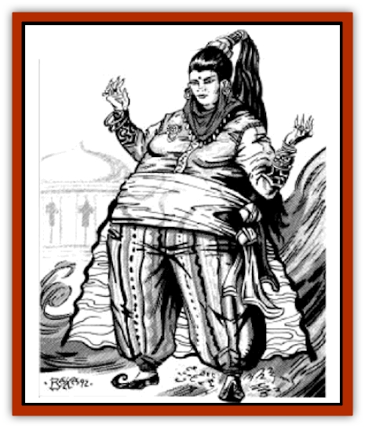

# Genie - Noble Marid

| Statistic | **Genie, Noble Marid** |
| --- | --- |
| **Activity Cycle:** | Day |
| **Alignment:** | Chaotic |
| **Armor Class:** | -2 |
| **Climate/Terrain:** | Elemental water, seas |
| **Damage/Attack:** | 8-32/8-32 |
| **Diet:** | Omnivore |
| **Frequency:** | Very rare |
| **Hit Dice:** | 16 |
| **Intelligence:** | Genius to Supra-genius (17-20) |
| **Magic Resistance:** | 50% |
| **Morale:** | Fanatic (18) |
| **Movement:** | 12, Fl 21 (B), Sw 30 |
| **No. Appearing:** | 1 |
| **No. of Attacks:** | 2 |
| **Organization:** | Padishate |
| **Size:** | H (22' tall) |
| **Special Attacks:** | See below |
| **Special Defenses:** | See below |
| **THAC0:** | 5 |
| **Treasure:** | T,U |
| **XP Value:** | 17,000 |

Noble [[Genie|marids]] are masters of the oceans. With currents as their muscles and pearls as their teeth, they are the handsomest and most powerful race of [[Genie|geniekind]].

Both huge and hugely powerful, noble marids can assume three forms: gaseous, liquid, and solid. In their watery form noble marid are a rushing current; in their gaseous form they resemble a fog. In their solid, humanoid form they are gigantic, gleefully towering over everyone around them. Their skin shimmers like pink pearls, though occasionally a noble marid will have the luster of either a white or black pearl. Their wispy hair is usually blue-black or dark grey. Noble marids typically stand 22 feet tall and weigh over 8,000 pounds.

Noble marids are always clad in the finest clothes they can afford, but both male and female noble marids enjoy displaying their powerful physiques to intimidate smaller and lesser creatures. Male noble marids prefer to be bare-chested and wear elaborate pantaloons and turbans, while females prefer slit skirts and clever tunics that show only flashes of their pearly skin. Their garments are cut from huge swatches of bright cloth and decorated with as many attention-grabbing jewels and ornaments as they can find. Subtlety is not their strong suit.

**Combat:** Noble marids' spell-like abilities function at the 30th level of spell use. Their magic allows them to use any of the following spell-like powers four times per day: *detect evil/good*, *detect invisibility*, *detect magic*, *invisibility*, assume liquid form, polymorph self, and *purify water*. Twelve times per day they can assume gaseous form, *lower water*, *part water*, create a *wall of fog*, or bestow *water breathing* on others for up to one full week. They can cast *airy water*, *control weather*, *cone of cold*, and *solid fog* once per day. Once per month a noble marid can cast *maelstrom*. Noble marids can always cast *water blast*, which they can direct in a powerful jet up to 300 yards long, blinding the individual struck for 1d6 rounds (saving throw versus spell applies) and causing 2d6 points of damage. Marids also have the innate ability to *water walk*.

A noble marid can freely carry 4,000 pounds in weight. Double this weight causes tiring in three turns. (For every 400 pounds under 8,000, add one turn to the marid's carrying ability.) A tired marid must rest for six turns. Since marids travel often and widely, they only rarely become attached to enough heavy objects that they cannot carry all they have with them.

Marids are very strong swimmers. They can breathe water and are at home at any depth. They have infravision to 120'. They are unaffected by extremes of water temperature - they are equally comfortable alongside icebergs or in scalding water.

Noble marids are not harmed by water-based spells. Cold-based spells inflict either half or no damage. Fire inflicts +2 points per die of damage, with saving throws at a -2 penalty. Steam does not harm them.

**Habitat/Society:** Although all marids lay some claim to nobility or even royalty, the truly noble marids are those that serve the padisha and scheme to succeed to the rulership of the empire upon her death. Thus noble marids entirely ignore their lesser cousins unless they in some way affect their standing at court or in the succession. All marids agree that their loose empire is ruled by the padisha, but there have often been several "true heirs" to the padisha's throne simultaneously through the eons. The court of the Great Padisha of the Marids is called the Citadel of Ten Thousand Pearls, and it is an elaborate and graceful circular reef in warm waters on the Elemental Plane of Water, full of bright corals, corroded copper doorways, [[Clam_Giant|giant clams]], bubbling air fountains, curtains and carpets of kelp, and schools of every sort of [[Fish|fish]]. Some of these fish are guardians and others are servants, but all are entirely loyal to the marids. The citadel contains from 2-200 noble marids at any time.

Although most of the Citadel of Ten Thousand Pearls is accessible by swimming through passages and doorways made for the huge marids, there are also many narrow crevices accessible only to small fish or marid in their watery form. These passages connect all the larger areas as well as hollow regions of the citadel not otherwise accessible.

Shafts of sunlight pour into and out of the citadel at apparently random places, but no area is without light unless the padisha wishes it. Some of the deepest interior portions are said to contain the hoarded treasures of the deep, given to the Padisha of the Marids as tribute: gold, shells, corals, the scales of great sea-monsters, and ten thousand pearls of great price. These pearls are of all colors, principally pink, white, grey, and black, and most are said to be fist-sized and lumpy rather than smaller and more perfectly formed.

The Citadel of Ten Thousand Pearls is a resting place for many marid nobles, a place to meet and exchange information before traveling on. Hunts and jousts are often held there, and individual valor is prized. At other times (during unfashionable seasons known only to court "insiders"), the citadel is as abandoned as a ruin.

The traveling household of a noble marid consists of 1-4 noble marids and is always accompanied by 1-8 common marids, who comprise various cousins, vassals, lovers, courtesans, followers, and kinfolk. In many cases (40%), they have also befriended 2-9 (1d8+1) servant creatures from the Elemental Plane of Water. They may have [[Dragon_Turtle|dragon turtle]] mounts, a squadron of [[Elemental_Fire_Water|water elemental]] or [[Triton|triton]] bodyguards, [[Morkoth|morkoth]] advisers, or [[Whale|killer whales]] as hunting animals. The fickle and wide-ranging tastes of the noble marids make the exact nature of their nonmarid companions unpredictable.

Marids are champion tale-tellers, though most of their tales emphasize their own prowess and belittle others. When conversing with a noble marid, one must attempt to keep the converiation going without continual digression for one tale might or another, while not offending the noble marid. (Marids consider it a capital offense for a lesser being to offend a marid.) Flattery sometimes convinces them to undertake some course action, but more often than not they stray off their intended course to seek some other adventure that promises greater glory. Bards often win their favor by restructuring all their songs and tales around the glory of the marid. This requires both a quick mind and a strong stomach, however, as the noble marids enjoy waves of praise rather than faint endorsements.

Marids occasionally go on punitive expeditions against the other genies, just to remind them of their power. When they organize a war party, it is usually led by a single noble marid accompanied by 5-50 common marids and 2-20 creatures from the Elemental Plane of Water.

**Ecology:** Noble marids have the least impact on other races of any of the noble genies; their attitude to the rest of the world is that all other creatures are inconsequential beings. The marids' own concerns take up so much of their time that they have little effort to waste on what they see as the trivialities and irrelevancies of others. In most cases, this includes common marids as well, which is why almost every marid must declare himself a noble in order to get the attention of the true noble marids. Their absorbtion in their own affairs is a blessing for others, given the dangerous level of power of the marid nobles. When they do want something, noble marids stop at nothing to get it - entire fleets may disappear from the oceans, storms rage, and rivers dry up or overflow.

Mages consider marids more trouble to conjure than they are worth, and the great power of the noble marids and their even greater fickleness makes this doubly true. A conjured and bound noble marid who is released will put aside all other tasks to gain quick vengeance against the mage who stole his freedom.

**Great Padisha of the Marids**

  The Great Padisha of the Marids has hundreds of titles, many of which are copied from her followers or adopted by them. She is the Keeper of the Empire, the Pearl of the Sea, the Mother of Foam, the Maharaja of the Oceans, Emir of All Currents, Mistress of Rivers, Grand Raj of the Monsoon, General of the Whales, Pasha of Corals, Savior of Fish, Marshall of Nets, and Patron of Waterspouts.

Her courtiers typically include 1-20 noble marids, 5-500 common marids, and 10-100 visiting creatures of elemental water ranging from tritons to [[Hippocampus|hippocampi]] to [[Sea_Horse_Giant|giant seahorses]]. The Great Padisha has all the abilities of a noble marid, and she has access to all spells of the province of the sea once per day. She is immune to all spells involving water, ice, steam, and electricity. She is subject to a continual *detect lie* spell, which doesn't seem to stop her from enjoying outrageous flattery. She simply recognizes it for what it is and doesn't allow it to influence her actions as a ruler. The Great Padisha has 30 Hit Dice and maximum hit points.

The current Great Padisha's appearance is subject to dispute. At times she has ebony skin the color of black pearl, a rounded face, and long tresses of coral red which she has bound about her head like a turban and set with black opals. At other times her skin is lustrous pearly white, with hair dark as barnacles, and lips like conch shells. She prefers slashed robes of gold, silver, or blue which reveal either richer cloth or dark skin beneath.

The court meets in the depths of the Citadel of Ten Thousand Pearls. The Pasha prefers to dazzle visitors with an initial display of her command of the seas, including things like unbalancing tides, schools of colorful fish swimming in dazzling patterns, or a display of bizarre luminescent creatures from the darkest recesses of the ocean's trenches.

The padisha's whim completely determines the type of audience her supplicants receive. Some are richly rewarded for merely reciting her titles and honorifics; others are cast forth from the citadel and told never to return. Those she takes more seriously (generally noble marid, commoners who can boast well, and the occasional egotistical or flattering sha'ir) are given her undivided attention and probed and questioned on every statement they make. Unusual gifts are always appreciated, though she feels no sense of obligation to grant favors in exchange for treasures freely given. Gifts need not be material ones; beggars capable of spinning rich tales and richer compliments have won her favor, as have ancient mystics who have little wealth but great understanding.

The Padisha has kept her position because of her political acumen and skill at maneuvering in the politics of honor, her competitive generosity, and her knack at making the haughty marids feel like members of the same tribe rather than bitter rivals.

Although the Great Padisha has a love of display for its own sake, she rarely joins processions beyond the confines of the Citadel of Ten Thousand Pearls because of the political dangers and costs of leaving her nobles to scheme. The migrations of the whales and salmon and the blooming of the red tides are state occasions, however, requiring the presence of both the Padisha and her nobles. At these times she relocates her entire court, thus preventing any coup while she is away and preoccupied.

When the Great Padisha appears on the Prime Material Plane she always arrives as a localized monsoon, driving ships ashore, drenching the countryside with flooding rains, flattening palms, and whipping up enormous waves. Once she has arrived she generally travels with whales, sea monsters, and entire tribes of intelligent sea creatures such as [[Merman|mermaids]] and [[Sahuagin|sahuagin]].

---
## Discovery & Documentation

**Source Publication:** MC13 Al-Qadim Appendix (1992)
**Campaign Setting:** Al-Qadim (Forgotten Realms)
**Author(s):** C. Terry Phillips

### Other Creatures Found in This Source Book
   * [[Ammut|Ammut]]
   * [[Ashira|Ashira]]
   * [[Asuras|Asuras]]
   * [[Black_Cloud_of_Vengeance|Black Cloud of Vengeance]]
   * [[Buraq|Buraq]]
   * [[Camel|Camel]]
   * [[Camel_of_the_Pearl|Camel of the Pearl]]
   * [[Centaur_Desert|Centaur, Desert]]
   * [[Copper_Automaton|Copper Automaton]]
   * [[Debbi|Debbi]]
   * [[Elephant_Bird|Elephant Bird]]
   * [[Gen|Gen]]
   * [[Genie_Noble_Dao|Genie, Noble Dao]]
   * [[Genie_Noble_Djinni|Genie, Noble Djinni]]
   * [[Genie_Noble_Efreeti|Genie, Noble Efreeti]]
   * [[Genie_Tasked_Architect_Builder|Genie, Tasked, Architect/Builder]]
   * [[Genie_Tasked_Artist|Genie, Tasked, Artist]]
   * [[Genie_Tasked_Guardian|Genie, Tasked, Guardian]]
   * [[Genie_Tasked_Herdsman|Genie, Tasked, Herdsman]]
   * [[Genie_Tasked_Slayer|Genie, Tasked, Slayer]]
   * [[Genie_Tasked_Warmonger|Genie, Tasked, Warmonger]]
   * [[Genie_Tasked_Winemaker|Genie, Tasked, Winemaker]]
   * [[Ghost_Mount|Ghost Mount]]
   * [[Ghul|Ghul]]
   * [[Giant_Desert|Giant, Desert]]
   * [[Giant_Jungle|Giant, Jungle]]
   * [[Giant_Reef|Giant, Reef]]
   * [[Giant_Zakhara_General_Information|Giant (Zakhara), General Information]]
   * [[Hama|Hama]]
   * [[Heway|Heway]]
   * [[Living_Idol|Living Idol]]
   * [[Lycanthrope_Werehyena|Lycanthrope, Werehyena]]
   * [[Lycanthrope_Werelion|Lycanthrope, Werelion]]
   * [[Markeen|Markeen]]
   * [[Maskhi|Maskhi]]
   * [[Mason_Wasp_Giant|Mason Wasp, Giant]]
   * [[Nasnas|Nasnas]]
   * [[Pahari|Pahari]]
   * [[Rom|Rom]]
   * [[Sabu_Lord|Sabu Lord]]
   * [[Sakina|Sakina]]
   * [[Serpent_Lord|Serpent Lord]]
   * [[Serpent_Winged|Serpent, Winged]]
   * [[Silat|Silat]]
   * [[Simurgh|Simurgh]]
   * [[Stone_Maiden|Stone Maiden]]
   * [[Vishap|Vishap]]
   * [[Zaratan|Zaratan]]
   * [[Zin|Zin]]
