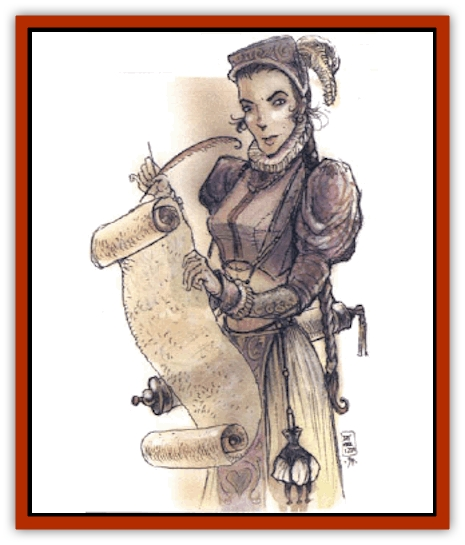

# Genie - Tasked - Administrator

| Statistic | **Genie, Tasked, Administrator** |
| --- | --- |
| **Activity Cycle:** | Any |
| **Alignment:** | Any lawful |
| **Armor Class:** | 6 |
| **Climate/Terrain:** | Dependent upon task |
| **Damage/Attack:** | 2d8 |
| **Diet:** | Omnivore |
| **Frequency:** | Very rare |
| **Hit Dice:** | 6 |
| **Intelligence:** | Genius (17-18) |
| **Magic Resistance:** | Nil |
| **Morale:** | Average (8-10) |
| **Movement:** | 9, Sw 15 or Fl 15(A) |
| **No. Appearing:** | 1 or 1d4+1 |
| **No. of Attacks:** | 1 |
| **Organization:** | Solitary of family |
| **Size:** | M (7' tall) |
| **Special Attacks:** | See below |
| **Special Defenses:** | See below |
| **THAC0:** | 15 |
| **Treasure:** | E,G |
| **XP Value:** | 2,000 |

[[Genie_Tasked_General_Information|Tasked administrator genies]] serve in bureaucracies, both for other genies and for humans, acting as advisors, negotiators, and all-around bureaucrats, and they often act for their masters in day-to-day decision making.

Administrators are tall, noble, and pleasing to the eye. They prefer to dress in flowing silks that highlight their fine musculature, but they wear appropriate clothing for their duties. Their skin color is dark tan with a slight bluish cast.

These genies retain limited telepathy and can communicate with creatures of at least low intelligence. They can either fly or swim, depending on whether they were once [[Genie|djinn]] or [[Genie|marids]]. Administrators seldom use their special movement for transportation, preferring to save it for times of emergency.

**Combat:** An administrator genie can cast *friends*, *tongues*, and *ESP*, each three times per day. It can use *suggestion* once per day, and it has a permanent *unseen servant*. Spellcasting is performed as a 10th-level wizard.

Though administrators prefer not to enter combat themselves, they are adept at handling logistics, determining where supplies come from and how to get them where they're needed. If forced into melee, a tasked administrator is sure to have the one normal or magical item that will help the most, provided that item is one owned by the genie or may be found normally in its place of residence.

**Habitat/Society:** Administrator genies are very proud of their work, considering bureaucracy an honorable profession with many benefits. They serve in many capacities, from clerk to city manager, but they are almost always ambitious and try to rise to positions of power. They prefer behind-the-scenes power however, and try to stay out of the public eye.

A tasked administrator is often part of a family of like genies who sometimes serve together in especially large bureaucracies. Those administrator genies who work alone can always call on their other family members for favors, and there seems to be an extensive under-the-table trade between them. Rumors state that there are only two families of tasked administrators, one formerly djinn, the other formerly marids.

Since they seem to know many other tasked administrators (and constantly refer to their cousin or brother or uncle who can help in a given situation), the rumor may be true. There seems to be a rivalry between the djinni and marid families.

Since most tasked administrators consider their duties a normal job, they expect to be well paid, and they make efforts to gather riches to pass on to their family. When they reach a level at which they feel they can retire, they often try to pass their job on to offspring, or at least other family members.

Administrators are quite skilled at their duties. As with any job, however, there is a period of training, and young tasked administrators may be inefficient or appear habitually frazzled. If given a chance, though, they almost always settle into a routine. Those who remain inefficient act as assistants to other tasked administrators or are assigned by the family to rulers who have somehow offended the family.

If tasked administrator genies are bound into servitude, they often become surly and obstinate. Though they follow their orders, they are slow to process paperwork, rude to outsiders and lackadaisical in giving orders to lesser bureaucrats.

When a tasked administrator has attained an important position, it often demands fine quarters. Former djinn prefer open, airy quarters, while former marids like many fountains and pools. Administrators will also try to incorporate these elements into their place of work.

**Ecology:** Administrator genies can be great hindrances or great helps to any bureaucracy. If treated well by the local ruler, they can make the bureaucracy a shining example of efficiency. If not, they can turn a city into a shamble of errors and problems.

---
## Discovery & Documentation

**Source Publication:** Monstrous Compendium, 1994 Annual, Volume 1 (1995)
**Campaign Setting:** Advanced Dungeons & Dragons 2nd Edition
**Author(s):** David Wise

### Other Creatures Found in This Source Book
   * [[Abyss_Ant|Abyss Ant]]
   * [[Achaierai|Achaierai]]
   * [[Afanc|Afanc]]
   * [[Al-Jahar|Al-Jahar]]
   * [[Baelnorn|Baelnorn]]
   * [[Baneguard|Baneguard]]
   * [[Banelar|Banelar]]
   * [[Bird_Talking|Bird, Talking]]
   * [[Blazing_Bones|Blazing Bones]]
   * [[Campestri|Campestri]]
   * [[Caniquine|Caniquine]]
   * [[Cat_Winged|Cat, Winged]]
   * [[Crypt_Servant|Crypt Servant]]
   * [[Death's_Head_Tree|Death's Head Tree]]
   * [[Dog_Saluqi|Dog, Saluqi]]
   * [[Dragon_Electrum|Dragon, Electrum]]
   * [[Dragon_Fang|Dragon, Fang]]
   * [[Dragon_Linnorm_Corpse_Tearer|Dragon, Linnorm, Corpse Tearer]]
   * [[Dragon_Linnorm_Dread|Dragon, Linnorm, Dread]]
   * [[Dragon_Linnorm_Flame|Dragon, Linnorm, Flame]]
   * [[Dragon_Linnorm_Forest|Dragon, Linnorm, Forest]]
   * [[Dragon_Linnorm_Frost|Dragon, Linnorm, Frost]]
   * [[Dragon_Linnorm_Gray|Dragon, Linnorm, Gray]]
   * [[Dragon_Linnorm_Land|Dragon, Linnorm, Land]]
   * [[Dragon_Linnorm_Midgard|Dragon, Linnorm, Midgard]]
   * [[Dragon_Linnorm_Rain|Dragon, Linnorm, Rain]]
   * [[Dragon_Linnorm_Sea|Dragon, Linnorm, Sea]]
   * [[Dragon_Neutral_Jacinth|Dragon, Neutral, Jacinth]]
   * [[Dragon_Neutral_Jade|Dragon, Neutral, Jade]]
   * [[Dragon_Neutral_Pearl|Dragon, Neutral, Pearl]]
   * [[Dread|Dread]]
   * [[Dragon-kin|Dragon-kin]]
   * [[Elemental_Earth_Kin_Chrysmal|Elemental, Earth Kin, Chrysmal]]
   * [[Elemental_Earth_Kin_Earth_Weird|Elemental, Earth Kin, Earth Weird]]
   * [[Elemental_Fire_Kin_Azer|Elemental, Fire Kin, Azer]]
   * [[Elemental_Sandman|Elemental, Sandman]]
   * [[Elemental_Wind_Walker|Elemental, Wind Walker]]
   * [[Elemental_Vermin|Elemental Vermin]]
   * [[Feystag|Feystag]]
   * [[Flame_Skull|Flame Skull]]
   * [[Foulwing|Foulwing]]
   * [[Gambado|Gambado]]
   * [[Garbug|Garbug]]
   * [[Genie_Tasked_Deceiver|Genie, Tasked, Deceiver]]
   * [[Genie_Tasked_Harim_Servant|Genie, Tasked, Harim Servant]]
   * [[Genie_Tasked_Messenger|Genie, Tasked, Messenger]]
   * [[Genie_Tasked_Miner|Genie, Tasked, Miner]]
   * [[Genie_Tasked_Oathbinder|Genie, Tasked, Oathbinder]]
   * [[Gibbering_Mouther|Gibbering Mouther]]
   * [[Gnasher|Gnasher]]
   * [[Gnasher_Winged|Gnasher, Winged]]
   * [[Golem_Brain|Golem, Brain]]
   * [[Golem_Hammer|Golem, Hammer]]
   * [[Golem_Metagolem|Golem, Metagolem]]
   * [[Golem_Spiderstone|Golem, Spiderstone]]
   * [[Gorynych|Gorynych]]
   * [[Greelox|Greelox]]
   * [[Helmed_Horror|Helmed Horror]]
   * [[Jarbo|Jarbo]]
   * [[Laraken|Laraken]]
   * [[Lich_Psionic|Lich, Psionic]]
   * [[Living_Steel|Living Steel]]
   * [[Lock_Lurker|Lock Lurker]]
   * [[Loxo|Loxo]]
   * [[Lycanthrope_Loup_de_Noir|Lycanthrope, Loup de Noir]]
   * [[Lycanthrope_Werebadger|Lycanthrope, Werebadger]]
   * [[Lycanthrope_Werejaguar|Lycanthrope, Werejaguar]]
   * [[Lythlyx|Lythlyx]]
   * [[Magebane|Magebane]]
   * [[Marrashi|Marrashi]]
   * [[Metalmaster|Metalmaster]]
   * [[Mimic_House_Hunter|Mimic, House Hunter]]
   * [[Naga_Bone|Naga, Bone]]
   * [[Nautilus_Giant|Nautilus, Giant]]
   * [[Nightshade_Toril|Nightshade (Toril)]]
   * [[Nishruu|Nishruu]]
   * [[Noran|Noran]]
   * [[Opinicus|Opinicus]]
   * [[Ormyrr|Ormyrr]]
   * [[Parasite|Parasite]]
   * [[Pasari-Niml|Pasari-Niml]]
   * [[Plant_Vampire_Moss|Plant, Vampire Moss]]
   * [[Pteraman|Pteraman]]
   * [[Rautym|Rautym]]
   * [[Shadeling|Shadeling]]
   * [[Skum|Skum]]
   * [[Snake_Giant_Cobra|Snake, Giant Cobra]]
   * [[Snake_Stone|Snake, Stone]]
   * [[Spectral_Wizard|Spectral Wizard]]
   * [[Spell_Weaver|Spell Weaver]]
   * [[Spider_Brain|Spider, Brain]]
   * [[Suwyze|Suwyze]]
   * [[Tatalla|Tatalla]]
   * [[Tick_Heart|Tick, Heart]]
   * [[Tree_Dark|Tree, Dark]]
   * [[Tree_Singing|Tree, Singing]]
   * [[Tressym|Tressym]]
   * [[Troll_Snow|Troll, Snow]]
   * [[Tuyewera|Tuyewera]]
   * [[Ulitharid|Ulitharid]]
   * [[Undead_Dwarf|Undead Dwarf]]
   * [[Undead_Lake_Monster|Undead Lake Monster]]
   * [[Whipsting|Whipsting]]
   * [[Windghost|Windghost]]
   * [[Wolf_Dread|Wolf, Dread]]
   * [[Wolf_Stone|Wolf, Stone]]
   * [[Wolf_Vampiric|Wolf, Vampiric]]
   * [[Wraith_Shimmering|Wraith, Shimmering]]
   * [[Xantravar|Xantravar]]
   * [[Xaver|Xaver]]
