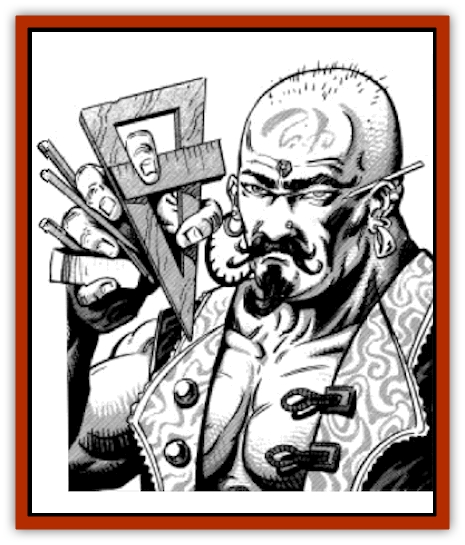

# Genie - Tasked - Architect - Builder

| Statistic | **Genie, Tasked, Architect/Builder** |
| --- | --- |
| **Activity Cycle:** | Day |
| **Alignment:** | Neutral |
| **Armor Class:** | 4 |
| **Climate/Terrain:** | Any |
| **Damage/Attack:** | 4-24 |
| **Diet:** | Omnivore |
| **Frequency:** | Very rare |
| **Hit Dice:** | 9 |
| **Intelligence:** | Genius (17) |
| **Magic Resistance:** | Nil |
| **Morale:** | Average (8-10) |
| **Movement:** | 15 |
| **No. Appearing:** | 1 |
| **No. of Attacks:** | 1 |
| **Organization:** | Solitary |
| **Size:** | M (7' tall) |
| **Special Attacks:** | See below |
| **Special Defenses:** | See below |
| **THAC0:** | 11 |
| **Treasure:** | Nil |
| **XP Value:** | 5,000 |

The builder genies were once [[Genie|dao]], but they have been reshaped by a life of construction and design. They are common in the Great Dismal Delve, but they are also sometimes bound by sha'ir to serve human princes. Some of them have been given to other noble genies as gifts from the [[Genie_Noble_Dao|noble dao]]. Their powers are responsible for many of the tales told of cities springing up overnight at the command of the genies.

Builder genies are bald and muscular like the dao, and they share the same taste in clothes and jewelry. They are often branded with a dao symbol denoting ownership, usually on the hand or forehead. They almost always carry drawing compasses and rulers, plumb bobs, chalk, levels, trowels, and builders' squares.

**Combat:** A builder genie may use each of the following spelllike abilities three times per day: *minor creation*, *vacancy*, and *warp wood*. They may use each of the following once per day: *stone shape*, *stone tell*, and *passwall*. Once per month they may grant a *wish* related to buildings or construction.

Builder genies have a stupendous ability to find and exploit the weak points of any structure. When they direct the fire of siege engines against fortifications, structural damage done by the attackers is increased by 50%. A builder genie can collapse unfortified buildings and underground works in one turn if allowed to study them for an hour.

Unless a builder genie is commanded to defend a building, it will prefer to avoid combat and simply repair minor damage after a battle is resolved by others. If commanded to, a builder genie will defend its worksite, but it cannot be commanded to take part in battles outside buildings or in buildings it has had no part in making. Much like their dao brethren, builder genies prefer to let others do their fighting for them and will balance the odds in their favor as much as possible before a battle. They enjoy using mazes, battlements, and secret passages to lead opponents on chases through entire buildings that they have prepared with traps and ambush sites. In desperation, a builder genie may collapse part of a building it is working on to kill opponents who might otherwise destroy the whole project.

**Habitat/Society:** Builder genies live for their work; they want to be remembered for what they have done rather than for what pleasant genies they were to work with. This generally means that they are merciless on themselves and others when their work is at stake. The greatest compliment one can pay a builder genie is to admire his work; the greatest insult one can offer is to compliment the builder while criticizing his work.

Builder genies don't care what they build; waterwheels or mosques with a dozen minarets receive equal care and planning. In all cases, builder genies will demand the longest-lasting and most expensive materials. Due to these stringent demands, the cost of a building designed or built by a builder genie will be four times the normal cost. It will have twice the strength and twice the useful life of a normal building.

Builder genies can imitate the style of any building they have seen, though they can only reproduce the structural details of buildings they have been able to examine closely for a day. They prefer to work in a style appropriate to the setting of a building, but they will build an opulent mausoleum in the middle of a poor fishing village if their master so commands. They will not hesitate to tell their master exactly why such a building is inappropriate among the dhows and huts, however. While their master's project is always completed if at all possible, its final form may not be exactly what the patron had in mind. Builder genies can be notoriously literal in obeying instructions, and they can also bend instructions to suit their personal whims.

**Ecology:** Builder genies are slaves to the dao, and they resent the dao without being able to overthrow them. They are on excellent terms with the [[Xorn|xorn]], [[Elemental_Air_Earth|earth elementals]], and [[Elemental_Earth_Kin|pech]]. They are always willing to destroy existing structures to make way for their new, improved ones, although in the case of a masterwork, the builder genie may tear down the old and then rebuild it with improvements that only a master architect or stonemason might recognize.

Builder genies judge others on their building achievements. Races that have not built mansions, bridges, and graceful gates do not rate as civilized. Builder genies have great respect for the disciplined and exact hives and warrens of giant insects.

---
## Discovery & Documentation

**Source Publication:** MC13 Al-Qadim Appendix (1992)
**Campaign Setting:** Al-Qadim (Forgotten Realms)
**Author(s):** C. Terry Phillips

### Other Creatures Found in This Source Book
   * [[Ammut|Ammut]]
   * [[Ashira|Ashira]]
   * [[Asuras|Asuras]]
   * [[Black_Cloud_of_Vengeance|Black Cloud of Vengeance]]
   * [[Buraq|Buraq]]
   * [[Camel|Camel]]
   * [[Camel_of_the_Pearl|Camel of the Pearl]]
   * [[Centaur_Desert|Centaur, Desert]]
   * [[Copper_Automaton|Copper Automaton]]
   * [[Debbi|Debbi]]
   * [[Elephant_Bird|Elephant Bird]]
   * [[Gen|Gen]]
   * [[Genie_Noble_Dao|Genie, Noble Dao]]
   * [[Genie_Noble_Djinni|Genie, Noble Djinni]]
   * [[Genie_Noble_Efreeti|Genie, Noble Efreeti]]
   * [[Genie_Noble_Marid|Genie, Noble Marid]]
   * [[Genie_Tasked_Artist|Genie, Tasked, Artist]]
   * [[Genie_Tasked_Guardian|Genie, Tasked, Guardian]]
   * [[Genie_Tasked_Herdsman|Genie, Tasked, Herdsman]]
   * [[Genie_Tasked_Slayer|Genie, Tasked, Slayer]]
   * [[Genie_Tasked_Warmonger|Genie, Tasked, Warmonger]]
   * [[Genie_Tasked_Winemaker|Genie, Tasked, Winemaker]]
   * [[Ghost_Mount|Ghost Mount]]
   * [[Ghul|Ghul]]
   * [[Giant_Desert|Giant, Desert]]
   * [[Giant_Jungle|Giant, Jungle]]
   * [[Giant_Reef|Giant, Reef]]
   * [[Giant_Zakhara_General_Information|Giant (Zakhara), General Information]]
   * [[Hama|Hama]]
   * [[Heway|Heway]]
   * [[Living_Idol|Living Idol]]
   * [[Lycanthrope_Werehyena|Lycanthrope, Werehyena]]
   * [[Lycanthrope_Werelion|Lycanthrope, Werelion]]
   * [[Markeen|Markeen]]
   * [[Maskhi|Maskhi]]
   * [[Mason_Wasp_Giant|Mason Wasp, Giant]]
   * [[Nasnas|Nasnas]]
   * [[Pahari|Pahari]]
   * [[Rom|Rom]]
   * [[Sabu_Lord|Sabu Lord]]
   * [[Sakina|Sakina]]
   * [[Serpent_Lord|Serpent Lord]]
   * [[Serpent_Winged|Serpent, Winged]]
   * [[Silat|Silat]]
   * [[Simurgh|Simurgh]]
   * [[Stone_Maiden|Stone Maiden]]
   * [[Vishap|Vishap]]
   * [[Zaratan|Zaratan]]
   * [[Zin|Zin]]
