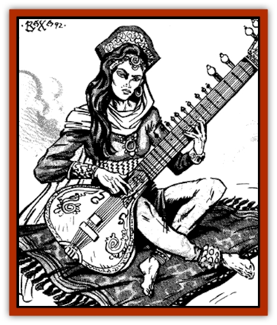

# Genie - Tasked - Artist

| Statistic | **Genie, Tasked, Artist** |
| --- | --- |
| **Activity Cycle:** | Any |
| **Alignment:** | Chaotic neutral |
| **Armor Class:** | 5 |
| **Climate/Terrain:** | Cities |
| **Damage/Attack:** | 1-6 |
| **Diet:** | Omnivore |
| **Frequency:** | Very rare |
| **Hit Dice:** | 7 |
| **Intelligence:** | Genius (17) |
| **Magic Resistance:** | Nil |
| **Morale:** | Unsteady (5-7) |
| **Movement:** | 9 |
| **No. Appearing:** | 1 |
| **No. of Attacks:** | 1 |
| **Organization:** | Solitary |
| **Size:** | M (7' tall) |
| **Special Attacks:** | See below |
| **Special Defenses:** | Nil |
| **THAC0:** | 13 |
| **Treasure:** | R (&times;3) |
| **XP Value:** | 975 |

[[Genie_Tasked_General_Information|Tasked artist genies]] include both incredibly skilled craftsmen and aesthetically brilliant artists in fields widely accepted as high art. Both groups are capable of producing masterworks in their chosen speciality in a very short period of time. Reshaped from [[Genie|dao]] and [[Genie|djinn]] long ago, they will willingly serve a generous master, though they always undertake work they enjoy before doing work that they must do. Tasked artist genies are poets, composers, musicians, sculptors, painters, and weavers. The craftsmen genies (who bitterly deny that their work is any less artistic than that of the pure artists) are potters, woodworkers, furniture makers, silversmiths, goldsmiths, decorative ironmongers, gemcutters, jade and ivory carvers, calligraphers, illuminators, gardeners, maskmakers, tailors, haberdashers, and seamstresses.

Mistreated artist genies will never produce superior work, though they have too much devotion to their craft to deliberately flaw a work (unless they are consistently abused with no hope of escape). Regardless of how hard they try, works produced by enslaved or charmed artist genies are never quite as good as those they make when they are free to pursue their work as they choose.

Of all the tasked genies, artist genies vary the most in their appearance, perhaps because the work they do varies so much. Sculptors have powerful shoulders from handling and hammering stone, weavers have powerful arms and quick fingers for throwing a shuttle across a loom, and painters may be quite frail but have a sharp eye for details and decoration. The craftsmen genies all have nimble fingers and a good sense of proportion.

**Combat:** Although their professional skills vary, all artist genies have a set of spell-like abilities in common. They are able to use each of the following spell-like abilities twice per day: *duodimension*, *mirror image*, *illusion*, *polymorph self*, and *stone shape*.

The illusions of artist genies create both tactile and visual components which last without concentration until dispelled or touched with cold iron. These are often used to give visible form to mental models and ideas before a final, lasting product is produced. It may also be used by the less scrupulous artist genies to satisfy their patrons without a great deal of effort being expended in actual work.

**Habitat/Society:** Artist genies are adaptable and generally take on the trappings of the group they work for or live among. They are particularly sharp rivals with each other, as few others can match their skills. Artist genies will talk shop with anyone they consider able to understand their achievements; they have only scorn for the unskilled or untalented.

In their dress, artist genies either push the boundaries of the latest design and daring or wear the most shabby and dated clothing imaginable. The pure artists are entirely hedonistic, though this is manifested in various ways. Some artist genies require odd foods, such as stewed apples or fermented fish while others must have parks and scenic vistas to stroll along each day for relaxation and contemplation before their work will achieve its highest level. Others still wallow in drink or gluttony, constant hot scented baths, or exotic companionship.

Slighting the work of an artist genie demands retribution, but this revenge can take many forms. A skilled critique by a knowledgable patron may earn only some vicious gossip in return. In the case of uninformed criticism by a pretender to knowledge, some artist genies are unstable enough to simply hurl themselves at their detractor, regardless of the consequences. Others are wise enough to enjoy more subtle forms of revenge (for example, creating a work that ridicules the offending party). Sometimes revenge takes the form of a gift that is given to some rival of the tactless speaker, or a mysterious increase in the cost of producing new work for a patron. Some forms of revenge are fatal, such as a potter genie adding enough poison to a clay vessel to slowly kill anyone who eats or drinks from it.

**Ecology:** Artist genies are dependant on refined patrons and high levels of cultural achievement. Although they may be found anywhere, their skills are only fully appreciated by the knowledgable. Their material needs are often neglected in favor of getting the materials they require, for an artist genie taken away from the tools of its trade and forced into idleness for protracted periods either dies or goes mad.

---
## Discovery & Documentation

**Source Publication:** MC13 Al-Qadim Appendix (1992)
**Campaign Setting:** Al-Qadim (Forgotten Realms)
**Author(s):** C. Terry Phillips

### Other Creatures Found in This Source Book
   * [[Ammut|Ammut]]
   * [[Ashira|Ashira]]
   * [[Asuras|Asuras]]
   * [[Black_Cloud_of_Vengeance|Black Cloud of Vengeance]]
   * [[Buraq|Buraq]]
   * [[Camel|Camel]]
   * [[Camel_of_the_Pearl|Camel of the Pearl]]
   * [[Centaur_Desert|Centaur, Desert]]
   * [[Copper_Automaton|Copper Automaton]]
   * [[Debbi|Debbi]]
   * [[Elephant_Bird|Elephant Bird]]
   * [[Gen|Gen]]
   * [[Genie_Noble_Dao|Genie, Noble Dao]]
   * [[Genie_Noble_Djinni|Genie, Noble Djinni]]
   * [[Genie_Noble_Efreeti|Genie, Noble Efreeti]]
   * [[Genie_Noble_Marid|Genie, Noble Marid]]
   * [[Genie_Tasked_Architect_Builder|Genie, Tasked, Architect/Builder]]
   * [[Genie_Tasked_Guardian|Genie, Tasked, Guardian]]
   * [[Genie_Tasked_Herdsman|Genie, Tasked, Herdsman]]
   * [[Genie_Tasked_Slayer|Genie, Tasked, Slayer]]
   * [[Genie_Tasked_Warmonger|Genie, Tasked, Warmonger]]
   * [[Genie_Tasked_Winemaker|Genie, Tasked, Winemaker]]
   * [[Ghost_Mount|Ghost Mount]]
   * [[Ghul|Ghul]]
   * [[Giant_Desert|Giant, Desert]]
   * [[Giant_Jungle|Giant, Jungle]]
   * [[Giant_Reef|Giant, Reef]]
   * [[Giant_Zakhara_General_Information|Giant (Zakhara), General Information]]
   * [[Hama|Hama]]
   * [[Heway|Heway]]
   * [[Living_Idol|Living Idol]]
   * [[Lycanthrope_Werehyena|Lycanthrope, Werehyena]]
   * [[Lycanthrope_Werelion|Lycanthrope, Werelion]]
   * [[Markeen|Markeen]]
   * [[Maskhi|Maskhi]]
   * [[Mason_Wasp_Giant|Mason Wasp, Giant]]
   * [[Nasnas|Nasnas]]
   * [[Pahari|Pahari]]
   * [[Rom|Rom]]
   * [[Sabu_Lord|Sabu Lord]]
   * [[Sakina|Sakina]]
   * [[Serpent_Lord|Serpent Lord]]
   * [[Serpent_Winged|Serpent, Winged]]
   * [[Silat|Silat]]
   * [[Simurgh|Simurgh]]
   * [[Stone_Maiden|Stone Maiden]]
   * [[Vishap|Vishap]]
   * [[Zaratan|Zaratan]]
   * [[Zin|Zin]]
