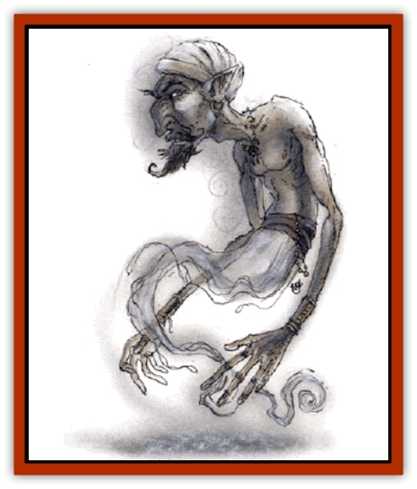

# Genie - Tasked - Deceiver

| Statistic | **Genie, Tasked, Deceiver** |
| --- | --- |
| **Activity Cycle:** | Day |
| **Alignment:** | Neutral evil |
| **Armor Class:** | 0 (4) |
| **Climate/Terrain:** | Dependant upon task |
| **Damage/Attack:** | 2d10 |
| **Diet:** | Omnivore |
| **Frequency:** | Very rare |
| **Hit Dice:** | 9 |
| **Intelligence:** | High (13-14) |
| **Magic Resistance:** | 35% |
| **Morale:** | Unsteady (5-7) |
| **Movement:** | 12, Fl 18(A) |
| **No. Appearing:** | 1-2 |
| **No. of Attacks:** | 1 |
| **Organization:** | Solitary |
| **Size:** | M (7' tall) |
| **Special Attacks:** | Spells, blinding |
| **Special Defenses:** | Displacement |
| **THAC0:** | 11 |
| **Treasure:** | F,U |
| **XP Value:** | 10,000 |

Deceiver genies are servants of [[Genie_Noble_Djinni|noble djinn]] and sometimes the most powerful of [[Genie|jann]]. They themselves are <a href"/appendix/genie">djinn</a> perverted to a life of deception, sworn to mask the face of the world. Their true form is difficult to judge, but they are said to be tall and gaunt, with thin arms and legs, and large heads, hands, and feet. They have long fingers, blond hair, and striking eyes - one blue, one brown. Their skin is a mottled gray.

**Combat:** Deceiver genies are cowards shrouded in a perpetual *displacement* effect, so the first attack on a deceiver genie always misses. However, creatures able to see through this illusion can attack them at their natural Armor Class of 4.

These genies can use each of the following spell-like abilities at will: *change self*, *delude*, *false vision*, *tongues*, *misdirection*, *undetectable lie*, and *whispering wind*. Twice per day they can create *distance distortion*, *massmorph*, *spectral force*, and *shadow masic*. Once per day they can invoke *disbelief*, *projected image*, *solipsism*, and *sundazzle*. Once per week they can use a *mass suggestion* (up to 24 levels or HD of creatures) or create a *permanent illusion*, *programmed illusion*, or *veil*. Their illusions are equivalent to those cast by a 24th-level caster for purposes of dispel magic, duration, area of effect, and so on. However, their life of trickery renders them susceptible to their own game; deceiver genies save against illusion/phantasm magic at -1.

Favorite tricks of deceiver genies include sending hapless victims over illusory bridges, chasing illusory oases, or even making them argue with one another over trivial matters. They also enjoy sending unnerving messages to sentries, caravan guards, and other watchmen. They have the minds of immature pranksters, and no trick is to low or too difficult. Deceiver genies will gladly give up food, sleep, and treasure in pursuit of a truly cruel scheme. The only trick they dislike is taking the place of others; although they can alter their outward appearance, they are uncomfortable being near others for more than a few minutes. They pretend to be someone else only when a larger plot requires it.

If forced into melee, deceiver genies fight with a hysterical, terrified strength. On a natural roll of 20, their steel nails tear out an opponent's eye. If the roll of 20 is 1 more than the genie needs to hit its target, both eyes are torn out. In either case, an immediate system shock roll is required to avoid passing out for 1d6 turns from the pain. Partially blinded foes strike at -2, and fully blinded opponents suffer a -4 penalty to all attack rolls, and all rules for blind-fighting apply. In most cases, deceiver genies call up spectral minions to serve them in battle. These are often reinforced by real minions of the same type; deceiver genies think the resulting chaos is hilarious.

**Habitat/Society:** Though most deceiver genies serve other genies, they sometimes cooperate with others of their kind to build themselves a village and hide it in remote regions. They rarely speak the truth, even under magical duress - a deceiver genie under the influence of a *charm monster* spell or similar magic still lies constantly and shamelessly to its friends.

These genies are dangerous to their masters when not constantly set to a task; when idle, they spin webs of lies, generally to provoke their masters into some disastrous action. Deceiver genies see the entire world as a fiction, a game, or a toy created for their manipulation and amusement.

Deceiver genies aren't very interested in wealth, but they're great fans of the arts, which they consider a formal but fascinating form of lying. They will never harm a storyteller or [[Genie_Tasked_Artist|tasked artist genie]], though they may still confuse them.

Anyone wishing to bind such a genie must always be on guard for its effects on and promises to one's servants, cohorts, and loved ones as loyalty to a master does not include loyalty to a master's retainers in the code of a deceiver genie.

**Ecology:** [[Genie_Tasked_General_Information|Tasked deceivers]] eat, drink, and sleep as humans do.

---
## Discovery & Documentation

**Source Publication:** Monstrous Compendium, 1994 Annual, Volume 1 (1995)
**Campaign Setting:** Advanced Dungeons & Dragons 2nd Edition
**Author(s):** David Wise

### Other Creatures Found in This Source Book
   * [[Abyss_Ant|Abyss Ant]]
   * [[Achaierai|Achaierai]]
   * [[Afanc|Afanc]]
   * [[Al-Jahar|Al-Jahar]]
   * [[Baelnorn|Baelnorn]]
   * [[Baneguard|Baneguard]]
   * [[Banelar|Banelar]]
   * [[Bird_Talking|Bird, Talking]]
   * [[Blazing_Bones|Blazing Bones]]
   * [[Campestri|Campestri]]
   * [[Caniquine|Caniquine]]
   * [[Cat_Winged|Cat, Winged]]
   * [[Crypt_Servant|Crypt Servant]]
   * [[Death's_Head_Tree|Death's Head Tree]]
   * [[Dog_Saluqi|Dog, Saluqi]]
   * [[Dragon_Electrum|Dragon, Electrum]]
   * [[Dragon_Fang|Dragon, Fang]]
   * [[Dragon_Linnorm_Corpse_Tearer|Dragon, Linnorm, Corpse Tearer]]
   * [[Dragon_Linnorm_Dread|Dragon, Linnorm, Dread]]
   * [[Dragon_Linnorm_Flame|Dragon, Linnorm, Flame]]
   * [[Dragon_Linnorm_Forest|Dragon, Linnorm, Forest]]
   * [[Dragon_Linnorm_Frost|Dragon, Linnorm, Frost]]
   * [[Dragon_Linnorm_Gray|Dragon, Linnorm, Gray]]
   * [[Dragon_Linnorm_Land|Dragon, Linnorm, Land]]
   * [[Dragon_Linnorm_Midgard|Dragon, Linnorm, Midgard]]
   * [[Dragon_Linnorm_Rain|Dragon, Linnorm, Rain]]
   * [[Dragon_Linnorm_Sea|Dragon, Linnorm, Sea]]
   * [[Dragon_Neutral_Jacinth|Dragon, Neutral, Jacinth]]
   * [[Dragon_Neutral_Jade|Dragon, Neutral, Jade]]
   * [[Dragon_Neutral_Pearl|Dragon, Neutral, Pearl]]
   * [[Dread|Dread]]
   * [[Dragon-kin|Dragon-kin]]
   * [[Elemental_Earth_Kin_Chrysmal|Elemental, Earth Kin, Chrysmal]]
   * [[Elemental_Earth_Kin_Earth_Weird|Elemental, Earth Kin, Earth Weird]]
   * [[Elemental_Fire_Kin_Azer|Elemental, Fire Kin, Azer]]
   * [[Elemental_Sandman|Elemental, Sandman]]
   * [[Elemental_Wind_Walker|Elemental, Wind Walker]]
   * [[Elemental_Vermin|Elemental Vermin]]
   * [[Feystag|Feystag]]
   * [[Flame_Skull|Flame Skull]]
   * [[Foulwing|Foulwing]]
   * [[Gambado|Gambado]]
   * [[Garbug|Garbug]]
   * [[Genie_Tasked_Administrator|Genie, Tasked, Administrator]]
   * [[Genie_Tasked_Harim_Servant|Genie, Tasked, Harim Servant]]
   * [[Genie_Tasked_Messenger|Genie, Tasked, Messenger]]
   * [[Genie_Tasked_Miner|Genie, Tasked, Miner]]
   * [[Genie_Tasked_Oathbinder|Genie, Tasked, Oathbinder]]
   * [[Gibbering_Mouther|Gibbering Mouther]]
   * [[Gnasher|Gnasher]]
   * [[Gnasher_Winged|Gnasher, Winged]]
   * [[Golem_Brain|Golem, Brain]]
   * [[Golem_Hammer|Golem, Hammer]]
   * [[Golem_Metagolem|Golem, Metagolem]]
   * [[Golem_Spiderstone|Golem, Spiderstone]]
   * [[Gorynych|Gorynych]]
   * [[Greelox|Greelox]]
   * [[Helmed_Horror|Helmed Horror]]
   * [[Jarbo|Jarbo]]
   * [[Laraken|Laraken]]
   * [[Lich_Psionic|Lich, Psionic]]
   * [[Living_Steel|Living Steel]]
   * [[Lock_Lurker|Lock Lurker]]
   * [[Loxo|Loxo]]
   * [[Lycanthrope_Loup_de_Noir|Lycanthrope, Loup de Noir]]
   * [[Lycanthrope_Werebadger|Lycanthrope, Werebadger]]
   * [[Lycanthrope_Werejaguar|Lycanthrope, Werejaguar]]
   * [[Lythlyx|Lythlyx]]
   * [[Magebane|Magebane]]
   * [[Marrashi|Marrashi]]
   * [[Metalmaster|Metalmaster]]
   * [[Mimic_House_Hunter|Mimic, House Hunter]]
   * [[Naga_Bone|Naga, Bone]]
   * [[Nautilus_Giant|Nautilus, Giant]]
   * [[Nightshade_Toril|Nightshade (Toril)]]
   * [[Nishruu|Nishruu]]
   * [[Noran|Noran]]
   * [[Opinicus|Opinicus]]
   * [[Ormyrr|Ormyrr]]
   * [[Parasite|Parasite]]
   * [[Pasari-Niml|Pasari-Niml]]
   * [[Plant_Vampire_Moss|Plant, Vampire Moss]]
   * [[Pteraman|Pteraman]]
   * [[Rautym|Rautym]]
   * [[Shadeling|Shadeling]]
   * [[Skum|Skum]]
   * [[Snake_Giant_Cobra|Snake, Giant Cobra]]
   * [[Snake_Stone|Snake, Stone]]
   * [[Spectral_Wizard|Spectral Wizard]]
   * [[Spell_Weaver|Spell Weaver]]
   * [[Spider_Brain|Spider, Brain]]
   * [[Suwyze|Suwyze]]
   * [[Tatalla|Tatalla]]
   * [[Tick_Heart|Tick, Heart]]
   * [[Tree_Dark|Tree, Dark]]
   * [[Tree_Singing|Tree, Singing]]
   * [[Tressym|Tressym]]
   * [[Troll_Snow|Troll, Snow]]
   * [[Tuyewera|Tuyewera]]
   * [[Ulitharid|Ulitharid]]
   * [[Undead_Dwarf|Undead Dwarf]]
   * [[Undead_Lake_Monster|Undead Lake Monster]]
   * [[Whipsting|Whipsting]]
   * [[Windghost|Windghost]]
   * [[Wolf_Dread|Wolf, Dread]]
   * [[Wolf_Stone|Wolf, Stone]]
   * [[Wolf_Vampiric|Wolf, Vampiric]]
   * [[Wraith_Shimmering|Wraith, Shimmering]]
   * [[Xantravar|Xantravar]]
   * [[Xaver|Xaver]]
