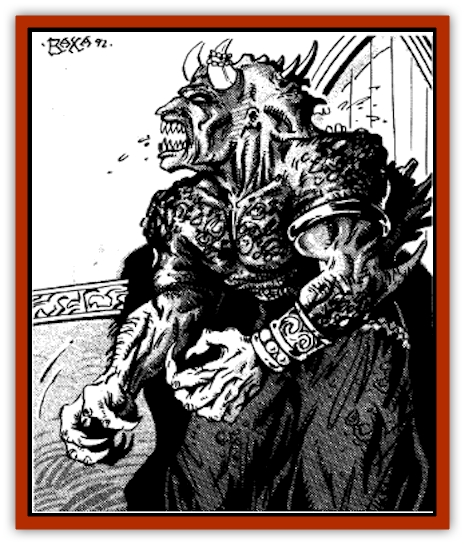

# Genie - Tasked - Guardian

| Statistic | **Genie, Tasked, Guardian** |
| --- | --- |
| **Activity Cycle:** | Any |
| **Alignment:** | Lawful |
| **Armor Class:** | -4 |
| **Climate/Terrain:** | Any |
| **Damage/Attack:** | 1-10/1-10/1-10/1-10 or by weapon +8 (&times;4) |
| **Diet:** | Carnivore |
| **Frequency:** | Very rare |
| **Hit Dice:** | 14 |
| **Intelligence:** | High (14) |
| **Magic Resistance:** | 25% |
| **Morale:** | Fanatical (17-18) |
| **Movement:** | 15 |
| **No. Appearing:** | 1 |
| **No. of Attacks:** | 4 |
| **Organization:** | Solitary |
| **Size:** | L (10' tall) |
| **Special Attacks:** | See below |
| **Special Defenses:** | See below |
| **THAC0:** | 7 |
| **Treasure:** | F,G,Z |
| **XP Value:** | 13,000 |

Guardian [[Genie|genies]] are powerful spirits sworn to defend specific items and locations tirelessly and without fail. They were once [[Genie|efreet]], but have been reshaped to be both sleepless and loyal to the exact wording of their oath.

Guardian [[Genie_Tasked_General_Information|tasked genies]] have one face which watches forward and another which watches backward. They have dark red skin as thick as rhinoceros hide and are completely bald. They have four powerfully muscled arms, which make them formidable in combat. A typical guardian genie stands 10' tall and weighs 2,700 pounds. Guardian genies do not wear armor, as their thick hide and magical nature make them very difficult to hit, and armor would merely slow them down. Some of their masters, however, occasionally give them protective magical items, which they are expected to use.

**Combat:** Guardian tasked genies move with inhuman speed despite their bulk, gaining a -4 initiative modifier in all forms of combat (although their initiative result never drops below 0). They target spell-casters before all others. Guardian genies are able to wield weapons in all four hands simultaneously without penalty. They can engage and attack up to four opponents at once, though they usually concentrate their attention on just one or two. Their preferred weapons are scimitars, cutlasses, great scimitars, and throwing axes and daggers. When using weapons they gain all the benefits of a Strength ability of 20.

The hearing of guardian genies is acute enough to pick up a feather falling onto a stone at a hundred paces; this, combined with their 360-degree vision, makes them impossible to surprise. Guardian genies never sleep.

Due to their innate magical ability, guardian genies can use each of the following spell-like powers twice per day: *shout*, *alarm*, *silence (15' radius)*, *detect invisibility*, *guards and wards*, *wyvern watch*, and *sepia snake sigil*. They can employ *blade barrier* once per day.

Guardian tasked genies are unaffected by all illusion/phantasm and enchantment/charm spells. All other magic affects them normally if it overcomes their magic resistance.

Guardian genies can breathe a cloud of green fire 30' in diameter directly in front of themselves once per day. The cloud of fire causes 14d6 points of damage to those caught in its area of effect, with a save allowed versus breath weapon for half damage. The cloud resembles the fiery breath of the fire eaters sometimes seen in the suqs and bazaars of Zakhara.

Guardian genies have a 20% chance to possess powers in addition to the ones listed above and a 30% chance to have powers that simply replace 1-4 of the above powers. Examples might include *flight*, *detect lie*, the ability to shape *glyphs of warding* or *explosive runes*, *hold portal*, *dimension door*, and other abilities that might be expected to help a guardian.

**Habitat/Society:** Guardian tasked genies are solitary creatures and dislike social interaction. They speak in very clipped sentences if required to, but they do not encourage questioning. In fact, they are completely humorless about their tasks, following out their routines and procedures with methodical precision. They are perfectly willing to describe what they are guarding and who commanded them to guard it, though they will not tell anyone about what they can do to prevent its theft. (One of the conditions of their service is that they be told everything about the items left in their care.) Guardian genies will not guard living creatures. Guardian genies cannot be bribed and will attack any creature that attempts to do so.

Guardian tasked genies have no love of death and violence, although they are more than competent at dealing out both. If possible, they will use threats and warnings rather than immediately resorting to magical or physical combat.

Guardian tasked genies serve for limited periods of time; when their tour of duty at a given site is up, their services must be renegotiated. Since their contracts are typically for 101 or 1001 years, their former masters are often not around to renew their arrangements.

**Ecology:** In some ways, guardian tasked genies are frustrated creatures, for they can never finish a task and go on to do something else as craftsmen genies of various kinds can. They are required by their nature to be constantly vigilant. No genie will touch a treasure guarded by the tasked guardian genies, though they may advise others how a guarded treasure might be taken.

---
## Discovery & Documentation

**Source Publication:** MC13 Al-Qadim Appendix (1992)
**Campaign Setting:** Al-Qadim (Forgotten Realms)
**Author(s):** C. Terry Phillips

### Other Creatures Found in This Source Book
   * [[Ammut|Ammut]]
   * [[Ashira|Ashira]]
   * [[Asuras|Asuras]]
   * [[Black_Cloud_of_Vengeance|Black Cloud of Vengeance]]
   * [[Buraq|Buraq]]
   * [[Camel|Camel]]
   * [[Camel_of_the_Pearl|Camel of the Pearl]]
   * [[Centaur_Desert|Centaur, Desert]]
   * [[Copper_Automaton|Copper Automaton]]
   * [[Debbi|Debbi]]
   * [[Elephant_Bird|Elephant Bird]]
   * [[Gen|Gen]]
   * [[Genie_Noble_Dao|Genie, Noble Dao]]
   * [[Genie_Noble_Djinni|Genie, Noble Djinni]]
   * [[Genie_Noble_Efreeti|Genie, Noble Efreeti]]
   * [[Genie_Noble_Marid|Genie, Noble Marid]]
   * [[Genie_Tasked_Architect_Builder|Genie, Tasked, Architect/Builder]]
   * [[Genie_Tasked_Artist|Genie, Tasked, Artist]]
   * [[Genie_Tasked_Herdsman|Genie, Tasked, Herdsman]]
   * [[Genie_Tasked_Slayer|Genie, Tasked, Slayer]]
   * [[Genie_Tasked_Warmonger|Genie, Tasked, Warmonger]]
   * [[Genie_Tasked_Winemaker|Genie, Tasked, Winemaker]]
   * [[Ghost_Mount|Ghost Mount]]
   * [[Ghul|Ghul]]
   * [[Giant_Desert|Giant, Desert]]
   * [[Giant_Jungle|Giant, Jungle]]
   * [[Giant_Reef|Giant, Reef]]
   * [[Giant_Zakhara_General_Information|Giant (Zakhara), General Information]]
   * [[Hama|Hama]]
   * [[Heway|Heway]]
   * [[Living_Idol|Living Idol]]
   * [[Lycanthrope_Werehyena|Lycanthrope, Werehyena]]
   * [[Lycanthrope_Werelion|Lycanthrope, Werelion]]
   * [[Markeen|Markeen]]
   * [[Maskhi|Maskhi]]
   * [[Mason_Wasp_Giant|Mason Wasp, Giant]]
   * [[Nasnas|Nasnas]]
   * [[Pahari|Pahari]]
   * [[Rom|Rom]]
   * [[Sabu_Lord|Sabu Lord]]
   * [[Sakina|Sakina]]
   * [[Serpent_Lord|Serpent Lord]]
   * [[Serpent_Winged|Serpent, Winged]]
   * [[Silat|Silat]]
   * [[Simurgh|Simurgh]]
   * [[Stone_Maiden|Stone Maiden]]
   * [[Vishap|Vishap]]
   * [[Zaratan|Zaratan]]
   * [[Zin|Zin]]
