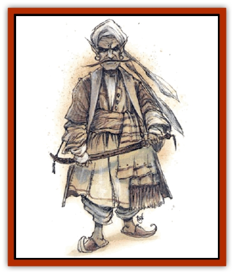

# Genie - Tasked - Harim Servant

| Statistic | **Genie, Tasked, Harim Servant** |
| --- | --- |
| **Activity Cycle:** | Any |
| **Alignment:** | Lawful neutral |
| **Armor Class:** | 4 |
| **Climate/Terrain:** | Dependent upon task |
| **Damage/Attack:** | 1d10 (&times;2) or by weapon |
| **Diet:** | Omnivore |
| **Frequency:** | Very rare |
| **Hit Dice:** | 7 |
| **Intelligence:** | High (13-14) |
| **Magic Resistance:** | 10% |
| **Morale:** | Champion (15-16) |
| **Movement:** | 12 |
| **No. Appearing:** | 1 |
| **No. of Attacks:** | 2 |
| **Organization:** | Solitary |
| **Size:** | L (8' tall) |
| **Special Attacks:** | See below |
| **Special Defenses:** | See below |
| **THAC0:** | 13 |
| **Treasure:** | W |
| **XP Value:** | 1,400 |

Harim servant genies serve many purposes. They guard the women of a harim, but also entertain them and perform minor tasks around the harim area. Most harim servants are males, tall and muscular, but not especially handsome. They dress in well-made clothing of fine fabric, yet of simple design.

[[Genie_Tasked_General_Information|Tasked harim servants]] are desired by many harim owners, including other [[Genie|genies]]. When they work for other genies, they tend to be less protectors and guardians, and more menial servants, so most enjoy working for "lesser beings", because it builds their own importance.

**Combat:** Tasked harim servants can cast each of the following spells three times per day: *cantrip*, *control temperature 10' radius*, *mending*, *minor creation*, and *major creation*. They can cast *alarm* and create *food and water* once per day. They cast as if they are 9th-lcvel wizards or priests, and they use their spells to protect, entertain, and serve the women of the harim.

Tasked harim servants are also versed in melee combat. They normally carry two weapons, often a pair of great scimitars - due to their size, strength, and skill, they have no problem wielding both weapons at the same time. Without weapons, tasked harim servants attack with their fists.

**Habitat/Society:** Harim servants act almost in a fatherly manner toward their charges, seeking to guide, protect, and help. Female harim servants are strong matrons who seek to bring order to the harim. Both genders demand respect and do not hesitate to punish unruliness, though they generally try to combat problems by offering caring and a sense of family.

The genies take care of all the needs of the women, from mending and cooking to guarding and footbathing. They use *cantrip* liberally for cleaning and entertainment, using other spells as necessary to increase the comfort of the harim. They have nonweapon proficiencies in healing, sewing, cooking, and local and ancient history. The genies also serve as storytellers, entertaining with legends, tales of genies, and amusing jokes. Some tasked harim servants have other skills, such as singing or dancing, which they can teach to the harim women.

Harim servants demand little pay, receiving gratification from doing a good job and the adoration of their "daughters". Though they answer to the harim's master, the genies tend to develop an emotional attachment to the members of the harim. If any of their requirements aren't met, or if they're bound to service, they twist their duties toward other purposes. They become less servants to the harim masters and more servants to the harim members. While the genies follow the letter of the masters' orders, they seek to avoid the spirit. In some rare instances, a genie might aid a woman to escape or to pursue an affair, or it might even become a paramour itself, but the offense to the genie or his charges must be great before actions like these are taken.

Other genies do not approach the women of a harim protected by a tasked genie unless the harim servant genie chooses to allow them access (for example, if the harim master is cruel, and the tasked genie knows another genie who will help and protect one of the harim women).

There are a few tasked genies devoted to looking after the men of a selama. They have similar attitudes to harim servants, wishing the best for their charges and for the whole selama.

Tasked harim servants get along well with most "lesser races", particularly women. Since they are so attuned to the needs of the harim, they can often empathize with women they encounter outside the harim. If asked for advice, however, they tend to suggest clothing and actions more suited to a harim girl than to an adventurer or merchant, and they often try to pamper and guide women they meet.

A tasked harim servant goes insane if its harim is taken away or severely harmed.

---
## Discovery & Documentation

**Source Publication:** Monstrous Compendium, 1994 Annual, Volume 1 (1995)
**Campaign Setting:** Advanced Dungeons & Dragons 2nd Edition
**Author(s):** David Wise

### Other Creatures Found in This Source Book
   * [[Abyss_Ant|Abyss Ant]]
   * [[Achaierai|Achaierai]]
   * [[Afanc|Afanc]]
   * [[Al-Jahar|Al-Jahar]]
   * [[Baelnorn|Baelnorn]]
   * [[Baneguard|Baneguard]]
   * [[Banelar|Banelar]]
   * [[Bird_Talking|Bird, Talking]]
   * [[Blazing_Bones|Blazing Bones]]
   * [[Campestri|Campestri]]
   * [[Caniquine|Caniquine]]
   * [[Cat_Winged|Cat, Winged]]
   * [[Crypt_Servant|Crypt Servant]]
   * [[Death's_Head_Tree|Death's Head Tree]]
   * [[Dog_Saluqi|Dog, Saluqi]]
   * [[Dragon_Electrum|Dragon, Electrum]]
   * [[Dragon_Fang|Dragon, Fang]]
   * [[Dragon_Linnorm_Corpse_Tearer|Dragon, Linnorm, Corpse Tearer]]
   * [[Dragon_Linnorm_Dread|Dragon, Linnorm, Dread]]
   * [[Dragon_Linnorm_Flame|Dragon, Linnorm, Flame]]
   * [[Dragon_Linnorm_Forest|Dragon, Linnorm, Forest]]
   * [[Dragon_Linnorm_Frost|Dragon, Linnorm, Frost]]
   * [[Dragon_Linnorm_Gray|Dragon, Linnorm, Gray]]
   * [[Dragon_Linnorm_Land|Dragon, Linnorm, Land]]
   * [[Dragon_Linnorm_Midgard|Dragon, Linnorm, Midgard]]
   * [[Dragon_Linnorm_Rain|Dragon, Linnorm, Rain]]
   * [[Dragon_Linnorm_Sea|Dragon, Linnorm, Sea]]
   * [[Dragon_Neutral_Jacinth|Dragon, Neutral, Jacinth]]
   * [[Dragon_Neutral_Jade|Dragon, Neutral, Jade]]
   * [[Dragon_Neutral_Pearl|Dragon, Neutral, Pearl]]
   * [[Dread|Dread]]
   * [[Dragon-kin|Dragon-kin]]
   * [[Elemental_Earth_Kin_Chrysmal|Elemental, Earth Kin, Chrysmal]]
   * [[Elemental_Earth_Kin_Earth_Weird|Elemental, Earth Kin, Earth Weird]]
   * [[Elemental_Fire_Kin_Azer|Elemental, Fire Kin, Azer]]
   * [[Elemental_Sandman|Elemental, Sandman]]
   * [[Elemental_Wind_Walker|Elemental, Wind Walker]]
   * [[Elemental_Vermin|Elemental Vermin]]
   * [[Feystag|Feystag]]
   * [[Flame_Skull|Flame Skull]]
   * [[Foulwing|Foulwing]]
   * [[Gambado|Gambado]]
   * [[Garbug|Garbug]]
   * [[Genie_Tasked_Administrator|Genie, Tasked, Administrator]]
   * [[Genie_Tasked_Deceiver|Genie, Tasked, Deceiver]]
   * [[Genie_Tasked_Messenger|Genie, Tasked, Messenger]]
   * [[Genie_Tasked_Miner|Genie, Tasked, Miner]]
   * [[Genie_Tasked_Oathbinder|Genie, Tasked, Oathbinder]]
   * [[Gibbering_Mouther|Gibbering Mouther]]
   * [[Gnasher|Gnasher]]
   * [[Gnasher_Winged|Gnasher, Winged]]
   * [[Golem_Brain|Golem, Brain]]
   * [[Golem_Hammer|Golem, Hammer]]
   * [[Golem_Metagolem|Golem, Metagolem]]
   * [[Golem_Spiderstone|Golem, Spiderstone]]
   * [[Gorynych|Gorynych]]
   * [[Greelox|Greelox]]
   * [[Helmed_Horror|Helmed Horror]]
   * [[Jarbo|Jarbo]]
   * [[Laraken|Laraken]]
   * [[Lich_Psionic|Lich, Psionic]]
   * [[Living_Steel|Living Steel]]
   * [[Lock_Lurker|Lock Lurker]]
   * [[Loxo|Loxo]]
   * [[Lycanthrope_Loup_de_Noir|Lycanthrope, Loup de Noir]]
   * [[Lycanthrope_Werebadger|Lycanthrope, Werebadger]]
   * [[Lycanthrope_Werejaguar|Lycanthrope, Werejaguar]]
   * [[Lythlyx|Lythlyx]]
   * [[Magebane|Magebane]]
   * [[Marrashi|Marrashi]]
   * [[Metalmaster|Metalmaster]]
   * [[Mimic_House_Hunter|Mimic, House Hunter]]
   * [[Naga_Bone|Naga, Bone]]
   * [[Nautilus_Giant|Nautilus, Giant]]
   * [[Nightshade_Toril|Nightshade (Toril)]]
   * [[Nishruu|Nishruu]]
   * [[Noran|Noran]]
   * [[Opinicus|Opinicus]]
   * [[Ormyrr|Ormyrr]]
   * [[Parasite|Parasite]]
   * [[Pasari-Niml|Pasari-Niml]]
   * [[Plant_Vampire_Moss|Plant, Vampire Moss]]
   * [[Pteraman|Pteraman]]
   * [[Rautym|Rautym]]
   * [[Shadeling|Shadeling]]
   * [[Skum|Skum]]
   * [[Snake_Giant_Cobra|Snake, Giant Cobra]]
   * [[Snake_Stone|Snake, Stone]]
   * [[Spectral_Wizard|Spectral Wizard]]
   * [[Spell_Weaver|Spell Weaver]]
   * [[Spider_Brain|Spider, Brain]]
   * [[Suwyze|Suwyze]]
   * [[Tatalla|Tatalla]]
   * [[Tick_Heart|Tick, Heart]]
   * [[Tree_Dark|Tree, Dark]]
   * [[Tree_Singing|Tree, Singing]]
   * [[Tressym|Tressym]]
   * [[Troll_Snow|Troll, Snow]]
   * [[Tuyewera|Tuyewera]]
   * [[Ulitharid|Ulitharid]]
   * [[Undead_Dwarf|Undead Dwarf]]
   * [[Undead_Lake_Monster|Undead Lake Monster]]
   * [[Whipsting|Whipsting]]
   * [[Windghost|Windghost]]
   * [[Wolf_Dread|Wolf, Dread]]
   * [[Wolf_Stone|Wolf, Stone]]
   * [[Wolf_Vampiric|Wolf, Vampiric]]
   * [[Wraith_Shimmering|Wraith, Shimmering]]
   * [[Xantravar|Xantravar]]
   * [[Xaver|Xaver]]
