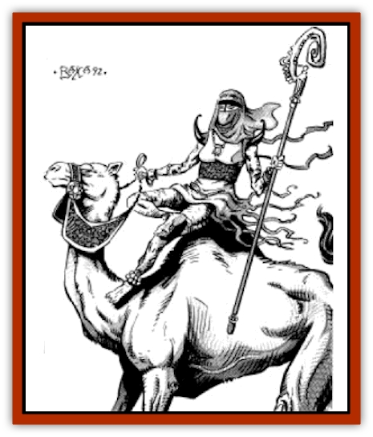

# Genie - Tasked - Herdsman

| Statistic | **Genie, Tasked, Herdsman** |
| --- | --- |
| **Activity Cycle:** | Day |
| **Alignment:** | Neutral |
| **Armor Class:** | 6 |
| **Climate/Terrain:** | Plains |
| **Damage/Attack:** | By weapon type |
| **Diet:** | Carnivore |
| **Frequency:** | Rare |
| **Hit Dice:** | 3 |
| **Intelligence:** | Very (11-12) |
| **Magic Resistance:** | Nil |
| **Morale:** | Steady (11-12) |
| **Movement:** | 21 |
| **No. Appearing:** | 1-100 |
| **No. of Attacks:** | 2 |
| **Organization:** | Family |
| **Size:** | M (6' tall) |
| **Special Attacks:** | See below |
| **Special Defenses:** | See below |
| **THAC0:** | 18 |
| **Treasure:** | D for group, P otherwise |
| **XP Value:** | 175 |

Capable of running all day with their herds, herdsman [[Genie_Tasked_General_Information|tasked genies]] are dedicated and sociable creatures. They live to provide for their animals, and they take their nourishment from them as well, often in the form of blood drained from small puncture wounds or from their milk.

Herdsman [[Genie|genies]] are short and wiry, with very quick hands and heavy brows. Their skin is dark and wrinkled from years of exposure to the sun and wind. Their hair is dark as jet and falls in loose curls (though the sun soon bleaches it to a reddishbrown in those who do not wear head coverings). Herdsman genies smell like their animals and often also have a vaguely rancid smell from the overripe milk products they eat.

**Combat:** Herdsman genies only fight in self-defense or in defense of their herds. A group of them will use short composite bows (30%), spears (40%), and short swords (30%). Some tribes use lassoes when they wish to capture prisoners. In addition, herdsman genies can use each of the following spell-like abilities once per day: *phantom steed*, *dust devil*, *remove fear*, and *flame brand*. They are excellent riders and can fire missile weapons from horseback at full gallop with no penalty. Their tactics revolve around keeping their opponents away from their herds and the slower members of their groups. If that is unsuccessful they may, in desperation, attempt to stampede the herd into their opponents. (If a group saving throw versus spell fails for the herd, the entire herd stampedes as directed).

**Habitat/Society:** Herdsman tasked genies are more commonly solitary, though they gather in groups when the size of their herds requires it. Their lives are completely centered around the welfare of their herds, and they are entirely willing to disobey their masters if they are ordered to take a herd into danger or into unfavorable land where the animals are likely to perish.

Herdsman genies take blood from their charges, which must be carefully drained so as not to weaken the animal and must be drunk immediately. They also take the milk and make it into various fermented drinks, cheeses, curds, and yogurts.

Herdsman tasked genies are very fond of races of all kinds, and contests are often held within and among groups of herdsman tasked genies to determine the fastest runner. Some of these races are made more difficult by following the pack of runners with a stampeding herd of bulls, camels, or goats. Camel and horse races are also common, and sports played mounted are often tumultuous all-day affairs with complex rules and scoring systems. Wagering and haggling are also favored activities of the male herdsman tasked genies. Young female herdsman genies take part in foot races, but they prefer roping, branding, shearing, and trick riding contests to mounted team sports.

All groups of herdsman genies are extremely mobile. If they feel threatened, they may stealthily force march their animals an entire night's travel across the plains with no ill effect on either themselves or their animals. They may do this once a week. This ability requires a cooperating group of genies and cannot be attempted by a lone herdsman.

Some groups of herdsman tasked genies have adopted the religions of Zakhara, and, like all new converts, they are zealous in their faith. These groups will try to convert others they meet, and they don't mind if they must force the convert to make up his mind.

**Ecology:** Herdsman tasked genies tend to push out both competing nongenie herdsmen and predators which might threaten their herds. They know when a given area has been grazed to the point of temporary exhaustion and will move on, but they have little regard for the artificial boundaries of sultanates, sheikdoms, and even the fences of farmers. This unwillingness to acknowledge the authority of settled groups often leads them into conflict, although they moderate this tendency if their master specifically admonishes them about it.

---
## Discovery & Documentation

**Source Publication:** MC13 Al-Qadim Appendix (1992)
**Campaign Setting:** Al-Qadim (Forgotten Realms)
**Author(s):** C. Terry Phillips

### Other Creatures Found in This Source Book
   * [[Ammut|Ammut]]
   * [[Ashira|Ashira]]
   * [[Asuras|Asuras]]
   * [[Black_Cloud_of_Vengeance|Black Cloud of Vengeance]]
   * [[Buraq|Buraq]]
   * [[Camel|Camel]]
   * [[Camel_of_the_Pearl|Camel of the Pearl]]
   * [[Centaur_Desert|Centaur, Desert]]
   * [[Copper_Automaton|Copper Automaton]]
   * [[Debbi|Debbi]]
   * [[Elephant_Bird|Elephant Bird]]
   * [[Gen|Gen]]
   * [[Genie_Noble_Dao|Genie, Noble Dao]]
   * [[Genie_Noble_Djinni|Genie, Noble Djinni]]
   * [[Genie_Noble_Efreeti|Genie, Noble Efreeti]]
   * [[Genie_Noble_Marid|Genie, Noble Marid]]
   * [[Genie_Tasked_Architect_Builder|Genie, Tasked, Architect/Builder]]
   * [[Genie_Tasked_Artist|Genie, Tasked, Artist]]
   * [[Genie_Tasked_Guardian|Genie, Tasked, Guardian]]
   * [[Genie_Tasked_Slayer|Genie, Tasked, Slayer]]
   * [[Genie_Tasked_Warmonger|Genie, Tasked, Warmonger]]
   * [[Genie_Tasked_Winemaker|Genie, Tasked, Winemaker]]
   * [[Ghost_Mount|Ghost Mount]]
   * [[Ghul|Ghul]]
   * [[Giant_Desert|Giant, Desert]]
   * [[Giant_Jungle|Giant, Jungle]]
   * [[Giant_Reef|Giant, Reef]]
   * [[Giant_Zakhara_General_Information|Giant (Zakhara), General Information]]
   * [[Hama|Hama]]
   * [[Heway|Heway]]
   * [[Living_Idol|Living Idol]]
   * [[Lycanthrope_Werehyena|Lycanthrope, Werehyena]]
   * [[Lycanthrope_Werelion|Lycanthrope, Werelion]]
   * [[Markeen|Markeen]]
   * [[Maskhi|Maskhi]]
   * [[Mason_Wasp_Giant|Mason Wasp, Giant]]
   * [[Nasnas|Nasnas]]
   * [[Pahari|Pahari]]
   * [[Rom|Rom]]
   * [[Sabu_Lord|Sabu Lord]]
   * [[Sakina|Sakina]]
   * [[Serpent_Lord|Serpent Lord]]
   * [[Serpent_Winged|Serpent, Winged]]
   * [[Silat|Silat]]
   * [[Simurgh|Simurgh]]
   * [[Stone_Maiden|Stone Maiden]]
   * [[Vishap|Vishap]]
   * [[Zaratan|Zaratan]]
   * [[Zin|Zin]]
