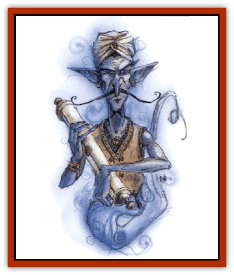

# Genie - Tasked - Messenger

| Statistic | **Genie, Tasked, Messenger** |
| --- | --- |
| **Activity Cycle:** | Day |
| **Alignment:** | Neutral |
| **Armor Class:** | 5 |
| **Climate/Terrain:** | Dependent upon task |
| **Damage/Attack:** | 1d8 or by weapon |
| **Diet:** | Omnivore |
| **Frequency:** | Rare |
| **Hit Dice:** | 3 |
| **Intelligence:** | High (13-14) |
| **Magic Resistance:** | Nil |
| **Morale:** | Unsteady (5-7) |
| **Movement:** | 15, Fl 42 (A) |
| **No. Appearing:** | 1-2 |
| **No. of Attacks:** | 1 |
| **Organization:** | Solitary |
| **Size:** | S (4' tall) |
| **Special Attacks:** | Spells |
| **Special Defenses:** | See below |
| **THAC0:** | 17 |
| **Treasure:** | U |
| **XP Value:** | 420 |

Messenger genies were once [[Genie|djinn]], but now serve all [[Genie|genies]] equally, flitting from plane to plane bearing messages, gifts, treaties, letters, documents, and love letters between noble genies of the various realms.

Messenger genies are slim, fluid creatures that never stop moving. They wear close fitting clothes and keep their hair croppd short under their tight turbans. They never wear jewelry and are always lightly armed. They often ride magical mounts, though they can also travel quickly on foot.

**Combat:** Messenger genies would rather flee than fight, and would rather die than surrender their documents. They always try to slip through crowds, duck behind trees, or hide under tables rather than standing and confronting their foes. When forced into combat, messenger genies move quickly, with a -1 bonus to initiative rolls. They attack with thrown weapons like darts and use an enchanted poison unique to the messenger genies, called *bardan ruqad* (cold sleep).

*Bardan ruqad* is used to deliver messages to dangerous or unpredictable recipients, and it can be used as either an injected or ingested poison. A creature that fails a saving throw vs. poison at a -4 penalty is paralyzed instantly but remains unnaturally alert for 1d6+4 rounds, giving the genie time to deliver his message. After this time, the creature falls into a deep sleep. This slumber lasts for 1d6 hours, allowing the messenger genie time to escape. The recipient's skin is cold to the touch throughout this time, and some are mistakenly pronounced dead. *Bardan ruqad* even affects undead, though they save against its effects with just a -2 penalty.

Messenger genies can use each of the following spell-like abilities, once per day, as a 9th-level spellcaster: *aura of comfort**, *clear path**, *lighten load**, *dimensional folding**, *invisibility*, *haste*, *distance distortion*, and *shadow door*. (Spells marked with an asterisk are from the Tome of Magic and can be replaced by *dimension door*, *Leomund's tiny hut*, *pass without trace*, and *strength*.)

Dying messenger genies can send their spirits out on the wind, reaching the nearest intelligent creature and asking to be avenged. Genies within range will always respond.

**Habitat/Society:** Messenger genies are always moving. They cannot stand to be kept waiting and are prone to pacing, fingertapping, and other nervous habits. Being tied up or held still is a form of torture that can sometimes (10%) force a messenger genie to undertake a mission for creatures to which a messenger genie owes no service. Only magical compulsion can force a messenger genie to reveal its messages; it would rather die than reveal documents held in trust.

Messenger genies are loquacious and enjoy helping people they meet on the road. If they are treated rudely, they may cripple mounts or ruin footwear.

Messenger genies think that motion in itself represents progress and goodwill; slow or immobile creatures must be either evil, lazy, or corrupt. Messengers are always up first in the morning and are the last to rest in the evening. They are not childishly energetic, but they are fiercely determined to do and see as much as possible, for they live only 10 to 15 years.

**Ecology:** Tasked messengers are respected by all genies. Though they are individually weak and rarely found in numbers, they are sheltered and protected by noble genies. Anyone assaulting a messenger genie can be sentenced to 100 years of servitude to the genies. Anyone stealing from one is put to death.

Messenger genies need very little food and water, and can work for 40 days without rest. After 40 days, they seek out a cloud castle or mountaintop and collapse into a week-long coma in a den of cloudstuff. When they awaken, they are fully restored, ready to run for another 40 busy days.

---
## Discovery & Documentation

**Source Publication:** Monstrous Compendium, 1994 Annual, Volume 1 (1995)
**Campaign Setting:** Advanced Dungeons & Dragons 2nd Edition
**Author(s):** David Wise

### Other Creatures Found in This Source Book
   * [[Abyss_Ant|Abyss Ant]]
   * [[Achaierai|Achaierai]]
   * [[Afanc|Afanc]]
   * [[Al-Jahar|Al-Jahar]]
   * [[Baelnorn|Baelnorn]]
   * [[Baneguard|Baneguard]]
   * [[Banelar|Banelar]]
   * [[Bird_Talking|Bird, Talking]]
   * [[Blazing_Bones|Blazing Bones]]
   * [[Campestri|Campestri]]
   * [[Caniquine|Caniquine]]
   * [[Cat_Winged|Cat, Winged]]
   * [[Crypt_Servant|Crypt Servant]]
   * [[Death's_Head_Tree|Death's Head Tree]]
   * [[Dog_Saluqi|Dog, Saluqi]]
   * [[Dragon_Electrum|Dragon, Electrum]]
   * [[Dragon_Fang|Dragon, Fang]]
   * [[Dragon_Linnorm_Corpse_Tearer|Dragon, Linnorm, Corpse Tearer]]
   * [[Dragon_Linnorm_Dread|Dragon, Linnorm, Dread]]
   * [[Dragon_Linnorm_Flame|Dragon, Linnorm, Flame]]
   * [[Dragon_Linnorm_Forest|Dragon, Linnorm, Forest]]
   * [[Dragon_Linnorm_Frost|Dragon, Linnorm, Frost]]
   * [[Dragon_Linnorm_Gray|Dragon, Linnorm, Gray]]
   * [[Dragon_Linnorm_Land|Dragon, Linnorm, Land]]
   * [[Dragon_Linnorm_Midgard|Dragon, Linnorm, Midgard]]
   * [[Dragon_Linnorm_Rain|Dragon, Linnorm, Rain]]
   * [[Dragon_Linnorm_Sea|Dragon, Linnorm, Sea]]
   * [[Dragon_Neutral_Jacinth|Dragon, Neutral, Jacinth]]
   * [[Dragon_Neutral_Jade|Dragon, Neutral, Jade]]
   * [[Dragon_Neutral_Pearl|Dragon, Neutral, Pearl]]
   * [[Dread|Dread]]
   * [[Dragon-kin|Dragon-kin]]
   * [[Elemental_Earth_Kin_Chrysmal|Elemental, Earth Kin, Chrysmal]]
   * [[Elemental_Earth_Kin_Earth_Weird|Elemental, Earth Kin, Earth Weird]]
   * [[Elemental_Fire_Kin_Azer|Elemental, Fire Kin, Azer]]
   * [[Elemental_Sandman|Elemental, Sandman]]
   * [[Elemental_Wind_Walker|Elemental, Wind Walker]]
   * [[Elemental_Vermin|Elemental Vermin]]
   * [[Feystag|Feystag]]
   * [[Flame_Skull|Flame Skull]]
   * [[Foulwing|Foulwing]]
   * [[Gambado|Gambado]]
   * [[Garbug|Garbug]]
   * [[Genie_Tasked_Administrator|Genie, Tasked, Administrator]]
   * [[Genie_Tasked_Deceiver|Genie, Tasked, Deceiver]]
   * [[Genie_Tasked_Harim_Servant|Genie, Tasked, Harim Servant]]
   * [[Genie_Tasked_Miner|Genie, Tasked, Miner]]
   * [[Genie_Tasked_Oathbinder|Genie, Tasked, Oathbinder]]
   * [[Gibbering_Mouther|Gibbering Mouther]]
   * [[Gnasher|Gnasher]]
   * [[Gnasher_Winged|Gnasher, Winged]]
   * [[Golem_Brain|Golem, Brain]]
   * [[Golem_Hammer|Golem, Hammer]]
   * [[Golem_Metagolem|Golem, Metagolem]]
   * [[Golem_Spiderstone|Golem, Spiderstone]]
   * [[Gorynych|Gorynych]]
   * [[Greelox|Greelox]]
   * [[Helmed_Horror|Helmed Horror]]
   * [[Jarbo|Jarbo]]
   * [[Laraken|Laraken]]
   * [[Lich_Psionic|Lich, Psionic]]
   * [[Living_Steel|Living Steel]]
   * [[Lock_Lurker|Lock Lurker]]
   * [[Loxo|Loxo]]
   * [[Lycanthrope_Loup_de_Noir|Lycanthrope, Loup de Noir]]
   * [[Lycanthrope_Werebadger|Lycanthrope, Werebadger]]
   * [[Lycanthrope_Werejaguar|Lycanthrope, Werejaguar]]
   * [[Lythlyx|Lythlyx]]
   * [[Magebane|Magebane]]
   * [[Marrashi|Marrashi]]
   * [[Metalmaster|Metalmaster]]
   * [[Mimic_House_Hunter|Mimic, House Hunter]]
   * [[Naga_Bone|Naga, Bone]]
   * [[Nautilus_Giant|Nautilus, Giant]]
   * [[Nightshade_Toril|Nightshade (Toril)]]
   * [[Nishruu|Nishruu]]
   * [[Noran|Noran]]
   * [[Opinicus|Opinicus]]
   * [[Ormyrr|Ormyrr]]
   * [[Parasite|Parasite]]
   * [[Pasari-Niml|Pasari-Niml]]
   * [[Plant_Vampire_Moss|Plant, Vampire Moss]]
   * [[Pteraman|Pteraman]]
   * [[Rautym|Rautym]]
   * [[Shadeling|Shadeling]]
   * [[Skum|Skum]]
   * [[Snake_Giant_Cobra|Snake, Giant Cobra]]
   * [[Snake_Stone|Snake, Stone]]
   * [[Spectral_Wizard|Spectral Wizard]]
   * [[Spell_Weaver|Spell Weaver]]
   * [[Spider_Brain|Spider, Brain]]
   * [[Suwyze|Suwyze]]
   * [[Tatalla|Tatalla]]
   * [[Tick_Heart|Tick, Heart]]
   * [[Tree_Dark|Tree, Dark]]
   * [[Tree_Singing|Tree, Singing]]
   * [[Tressym|Tressym]]
   * [[Troll_Snow|Troll, Snow]]
   * [[Tuyewera|Tuyewera]]
   * [[Ulitharid|Ulitharid]]
   * [[Undead_Dwarf|Undead Dwarf]]
   * [[Undead_Lake_Monster|Undead Lake Monster]]
   * [[Whipsting|Whipsting]]
   * [[Windghost|Windghost]]
   * [[Wolf_Dread|Wolf, Dread]]
   * [[Wolf_Stone|Wolf, Stone]]
   * [[Wolf_Vampiric|Wolf, Vampiric]]
   * [[Wraith_Shimmering|Wraith, Shimmering]]
   * [[Xantravar|Xantravar]]
   * [[Xaver|Xaver]]
