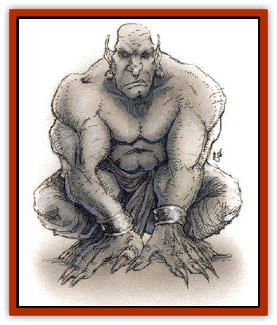

# Genie - Tasked - Miner

| Statistic | **Genie, Tasked, Miner** |
| --- | --- |
| **Activity Cycle:** | Day |
| **Alignment:** | Neutral |
| **Armor Class:** | 0 |
| **Climate/Terrain:** | Dependent upon task |
| **Damage/Attack:** | 3d6 (&times;2) |
| **Diet:** | Petrivore |
| **Frequency:** | Rare |
| **Hit Dice:** | 6 |
| **Intelligence:** | High |
| **Magic Resistance:** | Nil |
| **Morale:** | Elite (13-14) |
| **Movement:** | 15 |
| **No. Appearing:** | 1d6 |
| **No. of Attacks:** | 2 |
| **Organization:** | Solitary |
| **Size:** | L (8' tall) |
| **Special Attacks:** | Spells |
| **Special Defenses:** | See below |
| **THAC0:** | 15 |
| **Treasure:** | Q (&times;10) |
| **XP Value:** | 1,400 |

Miner genies are a recent form of [[Genie_Tasked_General_Information|tasked genie]], employed by the [[Genie|dao]], though they were apparently created by evil wizards. Miner genies were once dao, but they have been compelled to work in mine shafts for so long that now they are hulking, driven creatures that live only to dig and carry stone.

Miner genies are as wide as they are tall; their height has been reduced so that they fit through narrow tunnels more easily. Their arms and legs are thick and powerful, and their hands end in digging claws so exaggerated that miner genies can no longer use their hands to eat; they must feed using their tiny snouts, like animals. Their heads are bullet shaped, and they are entirely hairless.

**Combat:** Miner genies steadily tear through stone with their claws. In fact, their claws grow so quickly that, if they stop mining for more than a week, their claws become ingrown, crippling the miner genie. They cannot use weapons.

Miner genies can cast *detect metal* or *mineral*, *dig*, *faerie fire*, and *water breathing* (for diving through flooded mine shafts) once per day. Like dao, they can assume a dusty gaseous form once per day, which they use to scout along cracks and seams in the rock. They can usually detect poisonous gases and unstable mine shafts (75%). No stone weapon can harm them.

Miner genies can collapse any mine shaft they have personally dug with a single blow, inflicting 6d10 points of damage upon anyone within the area of collapse who does not make a successful saving throw vs. death magic. The collapsing section can be up to 1,500 square feet. Those who make their saving throw suffer only 1d10 points of damage from rock shards and rebounding debris. Miner genies are immune to the effects of these collapses.

**Habitat/Society:** Miner genies prefer dim light and dusty mines, where no genie or slave can see the dishonorable state to which they have been reduced. They are a universally grim, self-pitying lot, prone to fits of sudden rage. They are solitary throughout their entire lives. Miner genies do not congregate for any reason and will strive to avoid each other's company.

Miner genies never mate or bear children because they do not want to bring others into the harsh servitude of the wizards that made them. However, their own lack of children makes them remarkable kind and gentle around the children of the dao, and they are occasionally allowed to serve as guardians for the illegitimate children of [[Genie_Noble_Dao|noble dao]]. These children are raised in the dim and despairing world of the miner genies until the dao parents think it is safe to declare their true parentage. A few of these children have been known to become miner genies, themselves, if left too long among the tasked genies.

**Ecology:** Miner genies eat stone, so just by living they mine out tunnels.

These genies know that individually they're too weak to kill the wizards who bred them, but as they are not always magically bound to serve the wizards, there is always the chance that they might revolt and kill their masters. Although they know that the dao are helpless against the cruel mages, the miners are irrationally angry that the dao do nothing to save them.

Miner genies are smaller and more manageable than the impudent dao, and some malicious wizards have suggested that all dao should be transformed into miner genies, so that they will always be servile. The dao might find miner genies amusing if the latter had been formed from some slave race, but as their blood brothers, many dao feel that miner genies are an abomination which should be done away with as soon as the yoke of their wizard masters is lifted.

---
## Discovery & Documentation

**Source Publication:** Monstrous Compendium, 1994 Annual, Volume 1 (1995)
**Campaign Setting:** Advanced Dungeons & Dragons 2nd Edition
**Author(s):** David Wise

### Other Creatures Found in This Source Book
   * [[Abyss_Ant|Abyss Ant]]
   * [[Achaierai|Achaierai]]
   * [[Afanc|Afanc]]
   * [[Al-Jahar|Al-Jahar]]
   * [[Baelnorn|Baelnorn]]
   * [[Baneguard|Baneguard]]
   * [[Banelar|Banelar]]
   * [[Bird_Talking|Bird, Talking]]
   * [[Blazing_Bones|Blazing Bones]]
   * [[Campestri|Campestri]]
   * [[Caniquine|Caniquine]]
   * [[Cat_Winged|Cat, Winged]]
   * [[Crypt_Servant|Crypt Servant]]
   * [[Death's_Head_Tree|Death's Head Tree]]
   * [[Dog_Saluqi|Dog, Saluqi]]
   * [[Dragon_Electrum|Dragon, Electrum]]
   * [[Dragon_Fang|Dragon, Fang]]
   * [[Dragon_Linnorm_Corpse_Tearer|Dragon, Linnorm, Corpse Tearer]]
   * [[Dragon_Linnorm_Dread|Dragon, Linnorm, Dread]]
   * [[Dragon_Linnorm_Flame|Dragon, Linnorm, Flame]]
   * [[Dragon_Linnorm_Forest|Dragon, Linnorm, Forest]]
   * [[Dragon_Linnorm_Frost|Dragon, Linnorm, Frost]]
   * [[Dragon_Linnorm_Gray|Dragon, Linnorm, Gray]]
   * [[Dragon_Linnorm_Land|Dragon, Linnorm, Land]]
   * [[Dragon_Linnorm_Midgard|Dragon, Linnorm, Midgard]]
   * [[Dragon_Linnorm_Rain|Dragon, Linnorm, Rain]]
   * [[Dragon_Linnorm_Sea|Dragon, Linnorm, Sea]]
   * [[Dragon_Neutral_Jacinth|Dragon, Neutral, Jacinth]]
   * [[Dragon_Neutral_Jade|Dragon, Neutral, Jade]]
   * [[Dragon_Neutral_Pearl|Dragon, Neutral, Pearl]]
   * [[Dread|Dread]]
   * [[Dragon-kin|Dragon-kin]]
   * [[Elemental_Earth_Kin_Chrysmal|Elemental, Earth Kin, Chrysmal]]
   * [[Elemental_Earth_Kin_Earth_Weird|Elemental, Earth Kin, Earth Weird]]
   * [[Elemental_Fire_Kin_Azer|Elemental, Fire Kin, Azer]]
   * [[Elemental_Sandman|Elemental, Sandman]]
   * [[Elemental_Wind_Walker|Elemental, Wind Walker]]
   * [[Elemental_Vermin|Elemental Vermin]]
   * [[Feystag|Feystag]]
   * [[Flame_Skull|Flame Skull]]
   * [[Foulwing|Foulwing]]
   * [[Gambado|Gambado]]
   * [[Garbug|Garbug]]
   * [[Genie_Tasked_Administrator|Genie, Tasked, Administrator]]
   * [[Genie_Tasked_Deceiver|Genie, Tasked, Deceiver]]
   * [[Genie_Tasked_Harim_Servant|Genie, Tasked, Harim Servant]]
   * [[Genie_Tasked_Messenger|Genie, Tasked, Messenger]]
   * [[Genie_Tasked_Oathbinder|Genie, Tasked, Oathbinder]]
   * [[Gibbering_Mouther|Gibbering Mouther]]
   * [[Gnasher|Gnasher]]
   * [[Gnasher_Winged|Gnasher, Winged]]
   * [[Golem_Brain|Golem, Brain]]
   * [[Golem_Hammer|Golem, Hammer]]
   * [[Golem_Metagolem|Golem, Metagolem]]
   * [[Golem_Spiderstone|Golem, Spiderstone]]
   * [[Gorynych|Gorynych]]
   * [[Greelox|Greelox]]
   * [[Helmed_Horror|Helmed Horror]]
   * [[Jarbo|Jarbo]]
   * [[Laraken|Laraken]]
   * [[Lich_Psionic|Lich, Psionic]]
   * [[Living_Steel|Living Steel]]
   * [[Lock_Lurker|Lock Lurker]]
   * [[Loxo|Loxo]]
   * [[Lycanthrope_Loup_de_Noir|Lycanthrope, Loup de Noir]]
   * [[Lycanthrope_Werebadger|Lycanthrope, Werebadger]]
   * [[Lycanthrope_Werejaguar|Lycanthrope, Werejaguar]]
   * [[Lythlyx|Lythlyx]]
   * [[Magebane|Magebane]]
   * [[Marrashi|Marrashi]]
   * [[Metalmaster|Metalmaster]]
   * [[Mimic_House_Hunter|Mimic, House Hunter]]
   * [[Naga_Bone|Naga, Bone]]
   * [[Nautilus_Giant|Nautilus, Giant]]
   * [[Nightshade_Toril|Nightshade (Toril)]]
   * [[Nishruu|Nishruu]]
   * [[Noran|Noran]]
   * [[Opinicus|Opinicus]]
   * [[Ormyrr|Ormyrr]]
   * [[Parasite|Parasite]]
   * [[Pasari-Niml|Pasari-Niml]]
   * [[Plant_Vampire_Moss|Plant, Vampire Moss]]
   * [[Pteraman|Pteraman]]
   * [[Rautym|Rautym]]
   * [[Shadeling|Shadeling]]
   * [[Skum|Skum]]
   * [[Snake_Giant_Cobra|Snake, Giant Cobra]]
   * [[Snake_Stone|Snake, Stone]]
   * [[Spectral_Wizard|Spectral Wizard]]
   * [[Spell_Weaver|Spell Weaver]]
   * [[Spider_Brain|Spider, Brain]]
   * [[Suwyze|Suwyze]]
   * [[Tatalla|Tatalla]]
   * [[Tick_Heart|Tick, Heart]]
   * [[Tree_Dark|Tree, Dark]]
   * [[Tree_Singing|Tree, Singing]]
   * [[Tressym|Tressym]]
   * [[Troll_Snow|Troll, Snow]]
   * [[Tuyewera|Tuyewera]]
   * [[Ulitharid|Ulitharid]]
   * [[Undead_Dwarf|Undead Dwarf]]
   * [[Undead_Lake_Monster|Undead Lake Monster]]
   * [[Whipsting|Whipsting]]
   * [[Windghost|Windghost]]
   * [[Wolf_Dread|Wolf, Dread]]
   * [[Wolf_Stone|Wolf, Stone]]
   * [[Wolf_Vampiric|Wolf, Vampiric]]
   * [[Wraith_Shimmering|Wraith, Shimmering]]
   * [[Xantravar|Xantravar]]
   * [[Xaver|Xaver]]
