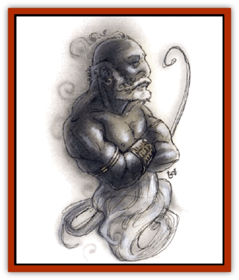

# Genie - Tasked - Oathbinder

| Statistic | **Genie, Tasked, Oathbinder** |
| --- | --- |
| **Activity Cycle:** | Day |
| **Alignment:** | Lawful neutral |
| **Armor Class:** | -1 |
| **Climate/Terrain:** | Dependent upon task |
| **Damage/Attack:** | 4d6 + special |
| **Diet:** | Omnivore |
| **Frequency:** | Very rare |
| **Hit Dice:** | 12 |
| **Intelligence:** | Average (8-10) |
| **Magic Resistance:** | 45% |
| **Morale:** | Champion (15-16) |
| **Movement:** | 15, Fl 37 (B) |
| **No. Appearing:** | 1 |
| **No. of Attacks:** | 1 |
| **Organization:** | Order |
| **Size:** | L (9' tall) |
| **Special Attacks:** | Spells |
| **Special Defenses:** | Immune to victims' attacks |
| **THAC0:** | 9 |
| **Treasure:** | C,H,T |
| **XP Value:** | 12,000 |

Oathbinder [[Genie|genies]] are reshaped [[Genie|efreet]] devoted to maintaining solemn oaths sworn between their masters and any consenting sentient being. If the oaths are broken, the oathbinder genie punishes the oathbreaker according to the terms of the vow.

Oathbinder genies have skin as black and glossy as obsidian, and their bodies have a perpetual nimbus of white fire. Their eyes shine with purple fire.

Oathbinder genies speak the language of the efreet.

**Combat:** [[Genie_Tasked_General_Information|Tasked oathbinder genies]] are seen only when they are summoned by the magical ceremonial oath that they enforce, and they are summoned only when an oath that the genie oversees is broken, or if the magical oath is dispelled. If an oath is broken, the genie is magically transported to the offender's location within 1d3 rounds. A *dispel magic* spell may be attempted to negate the oath's binding magic at that point; it is negated if the spell is successful vs. 12th-level magic.

Even if the binding is broken, the oathbinder genie appears in order to discover why the magic has been dispelled, and it will attack if, in its considered opinion, the oath should still be binding. If the conditions of the oath no longer apply to the reality of the situation, then the genie's guardianship is withdrawn and the binding oath is void without consequences to anyone (for instance, if the oath applied only to members of a given tribe, and the person seeking release from the oath has become an outcast of that tribe).

Oathbinder genies attack by projecting a stream of white fire from their hands, somewhat like a *burning hands* spells but each hand burns independently. The genie can attack one creature with each hand, inflicting 4d6 points of damage. The range of the stream is 8 feet.

An oathbinder genie is completely immune to all physical and magical attacks from a creature whose oath it oversees. An oathbreaker slain by this tasked genie immediately assumes the form of a [[Ghost|ghost]]. The spirit form of a victim is captured and weakened for months or even years by the genie, and during that time the victim can neither be contacted with a *speak with dead* spell nor raised from the dead. Victims' spirits are held for one month per level of the victim, and then allowed to rest in peace. *Resurrection* and *reincarnation* are effective restorative spells when used at any point during which they would normally work, however.

An oathbinder genie has a number of spell-like abilities that aid it in the performance of its duties. It can use each of the following abilities, three times per day, as a 12th-level caster: *command*, *evil eye*, *greater malison*, *hold person*, *Otiluke's resilient sphere*, *unluck*, and *wall of force*.

**Habitat/Society:** Oathbinder genies are all members of an order that governs their conduct. They are experts on all aspects of contracts, oaths, vows, and matters of obligation, and they are always glad to debate fine points or split hairs with anyone similarly inclined, regardless of the topic.

Oathbinders refuse to serve the [[Genie|marid]], whose word can rarely be counted on.

**Ecology:** Oathbinder genies have little impact on most creatures, as their needs are simple and they are never encountered other than as the servants of some powerful genie lord or wizard. Genies never break the word they give an oathbinder genie, although they may bend, twist, and wriggle or talk their way out.

Oathbinder genies demand more for their services (treasure, respect, goods) when the conditions of the oaths they oversee are more strict or exacting. Oaths of fealty sworn for a lifetime are more demanding to enforce than promises of nonaggression made for the coming year. All oaths of the latter sort cost a minimum of 1,000 gp to establish, and may frequently be tens or hundreds of times more expensive.

---
## Discovery & Documentation

**Source Publication:** Monstrous Compendium, 1994 Annual, Volume 1 (1995)
**Campaign Setting:** Advanced Dungeons & Dragons 2nd Edition
**Author(s):** David Wise

### Other Creatures Found in This Source Book
   * [[Abyss_Ant|Abyss Ant]]
   * [[Achaierai|Achaierai]]
   * [[Afanc|Afanc]]
   * [[Al-Jahar|Al-Jahar]]
   * [[Baelnorn|Baelnorn]]
   * [[Baneguard|Baneguard]]
   * [[Banelar|Banelar]]
   * [[Bird_Talking|Bird, Talking]]
   * [[Blazing_Bones|Blazing Bones]]
   * [[Campestri|Campestri]]
   * [[Caniquine|Caniquine]]
   * [[Cat_Winged|Cat, Winged]]
   * [[Crypt_Servant|Crypt Servant]]
   * [[Death's_Head_Tree|Death's Head Tree]]
   * [[Dog_Saluqi|Dog, Saluqi]]
   * [[Dragon_Electrum|Dragon, Electrum]]
   * [[Dragon_Fang|Dragon, Fang]]
   * [[Dragon_Linnorm_Corpse_Tearer|Dragon, Linnorm, Corpse Tearer]]
   * [[Dragon_Linnorm_Dread|Dragon, Linnorm, Dread]]
   * [[Dragon_Linnorm_Flame|Dragon, Linnorm, Flame]]
   * [[Dragon_Linnorm_Forest|Dragon, Linnorm, Forest]]
   * [[Dragon_Linnorm_Frost|Dragon, Linnorm, Frost]]
   * [[Dragon_Linnorm_Gray|Dragon, Linnorm, Gray]]
   * [[Dragon_Linnorm_Land|Dragon, Linnorm, Land]]
   * [[Dragon_Linnorm_Midgard|Dragon, Linnorm, Midgard]]
   * [[Dragon_Linnorm_Rain|Dragon, Linnorm, Rain]]
   * [[Dragon_Linnorm_Sea|Dragon, Linnorm, Sea]]
   * [[Dragon_Neutral_Jacinth|Dragon, Neutral, Jacinth]]
   * [[Dragon_Neutral_Jade|Dragon, Neutral, Jade]]
   * [[Dragon_Neutral_Pearl|Dragon, Neutral, Pearl]]
   * [[Dread|Dread]]
   * [[Dragon-kin|Dragon-kin]]
   * [[Elemental_Earth_Kin_Chrysmal|Elemental, Earth Kin, Chrysmal]]
   * [[Elemental_Earth_Kin_Earth_Weird|Elemental, Earth Kin, Earth Weird]]
   * [[Elemental_Fire_Kin_Azer|Elemental, Fire Kin, Azer]]
   * [[Elemental_Sandman|Elemental, Sandman]]
   * [[Elemental_Wind_Walker|Elemental, Wind Walker]]
   * [[Elemental_Vermin|Elemental Vermin]]
   * [[Feystag|Feystag]]
   * [[Flame_Skull|Flame Skull]]
   * [[Foulwing|Foulwing]]
   * [[Gambado|Gambado]]
   * [[Garbug|Garbug]]
   * [[Genie_Tasked_Administrator|Genie, Tasked, Administrator]]
   * [[Genie_Tasked_Deceiver|Genie, Tasked, Deceiver]]
   * [[Genie_Tasked_Harim_Servant|Genie, Tasked, Harim Servant]]
   * [[Genie_Tasked_Messenger|Genie, Tasked, Messenger]]
   * [[Genie_Tasked_Miner|Genie, Tasked, Miner]]
   * [[Gibbering_Mouther|Gibbering Mouther]]
   * [[Gnasher|Gnasher]]
   * [[Gnasher_Winged|Gnasher, Winged]]
   * [[Golem_Brain|Golem, Brain]]
   * [[Golem_Hammer|Golem, Hammer]]
   * [[Golem_Metagolem|Golem, Metagolem]]
   * [[Golem_Spiderstone|Golem, Spiderstone]]
   * [[Gorynych|Gorynych]]
   * [[Greelox|Greelox]]
   * [[Helmed_Horror|Helmed Horror]]
   * [[Jarbo|Jarbo]]
   * [[Laraken|Laraken]]
   * [[Lich_Psionic|Lich, Psionic]]
   * [[Living_Steel|Living Steel]]
   * [[Lock_Lurker|Lock Lurker]]
   * [[Loxo|Loxo]]
   * [[Lycanthrope_Loup_de_Noir|Lycanthrope, Loup de Noir]]
   * [[Lycanthrope_Werebadger|Lycanthrope, Werebadger]]
   * [[Lycanthrope_Werejaguar|Lycanthrope, Werejaguar]]
   * [[Lythlyx|Lythlyx]]
   * [[Magebane|Magebane]]
   * [[Marrashi|Marrashi]]
   * [[Metalmaster|Metalmaster]]
   * [[Mimic_House_Hunter|Mimic, House Hunter]]
   * [[Naga_Bone|Naga, Bone]]
   * [[Nautilus_Giant|Nautilus, Giant]]
   * [[Nightshade_Toril|Nightshade (Toril)]]
   * [[Nishruu|Nishruu]]
   * [[Noran|Noran]]
   * [[Opinicus|Opinicus]]
   * [[Ormyrr|Ormyrr]]
   * [[Parasite|Parasite]]
   * [[Pasari-Niml|Pasari-Niml]]
   * [[Plant_Vampire_Moss|Plant, Vampire Moss]]
   * [[Pteraman|Pteraman]]
   * [[Rautym|Rautym]]
   * [[Shadeling|Shadeling]]
   * [[Skum|Skum]]
   * [[Snake_Giant_Cobra|Snake, Giant Cobra]]
   * [[Snake_Stone|Snake, Stone]]
   * [[Spectral_Wizard|Spectral Wizard]]
   * [[Spell_Weaver|Spell Weaver]]
   * [[Spider_Brain|Spider, Brain]]
   * [[Suwyze|Suwyze]]
   * [[Tatalla|Tatalla]]
   * [[Tick_Heart|Tick, Heart]]
   * [[Tree_Dark|Tree, Dark]]
   * [[Tree_Singing|Tree, Singing]]
   * [[Tressym|Tressym]]
   * [[Troll_Snow|Troll, Snow]]
   * [[Tuyewera|Tuyewera]]
   * [[Ulitharid|Ulitharid]]
   * [[Undead_Dwarf|Undead Dwarf]]
   * [[Undead_Lake_Monster|Undead Lake Monster]]
   * [[Whipsting|Whipsting]]
   * [[Windghost|Windghost]]
   * [[Wolf_Dread|Wolf, Dread]]
   * [[Wolf_Stone|Wolf, Stone]]
   * [[Wolf_Vampiric|Wolf, Vampiric]]
   * [[Wraith_Shimmering|Wraith, Shimmering]]
   * [[Xantravar|Xantravar]]
   * [[Xaver|Xaver]]
