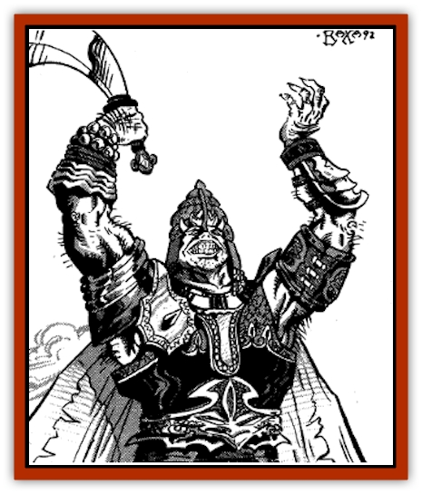

# Genie - Tasked - Warmonger

| Statistic | **Genie, Tasked, Warmonger** |
| --- | --- |
| **Activity Cycle:** | Day |
| **Alignment:** | Lawful evil |
| **Armor Class:** | 4 |
| **Climate/Terrain:** | Any |
| **Damage/Attack:** | 1-10 or by weapon +4 |
| **Diet:** | Omnivore |
| **Frequency:** | Rare |
| **Hit Dice:** | 7 |
| **Intelligence:** | Exceptional (15-16) |
| **Magic Resistance:** | Nil |
| **Morale:** | Fanatical (17-18) |
| **Movement:** | 12 |
| **No. Appearing:** | 1 |
| **No. of Attacks:** | 1 |
| **Organization:** | Solitary |
| **Size:** | M (5' tall) |
| **Special Attacks:** | Spells |
| **Special Defenses:** | Raise morale |
| **THAC0:** | 13 |
| **Treasure:** | B |
| **XP Value:** | 1,400 |

Warmonger [[Genie|genies]] are strategists and advisers to generals, laying plans for warfare among the genies' emirs and caliphs. They are always found leading soldiers and mercenaries, and where there is no war for them to fight, they start one.

A hairy genie with blood dripping from every hair, warmonger [[Genie_Tasked_General_Information|tasked genies]] tend to obesity. They are shorter than most other genies, a fact which causes them no end of anger and frustration. The typical warmonger genie stands 5' tall and weighs over 200 pounds.

For battle, warmonger genies wear the heaviest armor they can find and are generally found at the rear of their troops, observing from horseback or seated on a ridge overlooking the field. They are very fond of wearing sashes, medals, clusters of jewels or precious metal signifying military ranks and orders, as well as other accessories that attest to their bravery and skill.

**Combat:** Warmonger genies are capable warriors but excel at leadership. Their leadership is both so inspired and so terrifying that troops under their command gain a +2 bonus to their morale as long as their leader lives. If a tasked warmonger genie is slain in the heat of battle, all troops aware of his death suffer an additional -2 penalty to morale. In melee, warmonger genies prefer weapons for mounted use: maces, picks, and scimitars. Their great strength gives them a +4 bonus to weapon damage.

Warmonger genies can use each of the following spell-like abilities twice per day: *cloak of bravery*, *suggestion*, and *enchanted weapon*. They may use *fear* and *remove fear* at will.

**Habitat/Society:** Warmonger genies live among their troops and worship their lords. They are completely loyal to their cause and will carry on with battle even if their lord requests they stop. They will, however, retreat when it is to their advantage, to renew the battle on more favorable terms.

Generally, warmonger genies are summoned or hired to perform a specific task, such as defending a vital pass from imminent invasion or leading forces in a bid for conquest. They are so enthralled with their work, however, that they often refuse to stop at the limits that their leaders set. As long as a continued advance doesn't overextend supply lines, push exhausted troops beyond their endurance, or otherwise appear to be militarily foolish, the genies will urge their lords to continue the fight. Their reasoning is simple: fighting now will prevent fighting later. They are also canny enough to play on their lord's vanity. They will always assure him that bringing more land under his rule will serve the interests of others as well because of his enlightened and wise policies.

In their hearts, warmonger genies see political figures as foolish and incapable of understanding the glories of soldiering. Many warmonger genies fancy themselves as profound philosophers; appealing to this conceit often brings respect from the genie.

**Ecology:** Warmonger genies have no ecology. They destroy ecologies they encounter because they must requisition food and supplies from territories they march through, and they must allow their troops a certain amount of plunder for morale purposes. Repeated marching over the same territory during an extended campaign often results in the complete destruction or removal of any mounts, grain, livestock, water supplies, and other foodstuffs that the genie's army can lay its hands on. Noncombatants starve in their wake.

In addition to their purely strategic and tactical skills, they are administratively and politically skilled enough to understand how to create a climate of fear and suspicion conducive to turning entire nations into armed camps. They will ruthlessly carry out plans to bring all the reins of power under military control and then make every citizen of their nation as efficient as possible in contributing to the war effort.

---
## Discovery & Documentation

**Source Publication:** MC13 Al-Qadim Appendix (1992)
**Campaign Setting:** Al-Qadim (Forgotten Realms)
**Author(s):** C. Terry Phillips

### Other Creatures Found in This Source Book
   * [[Ammut|Ammut]]
   * [[Ashira|Ashira]]
   * [[Asuras|Asuras]]
   * [[Black_Cloud_of_Vengeance|Black Cloud of Vengeance]]
   * [[Buraq|Buraq]]
   * [[Camel|Camel]]
   * [[Camel_of_the_Pearl|Camel of the Pearl]]
   * [[Centaur_Desert|Centaur, Desert]]
   * [[Copper_Automaton|Copper Automaton]]
   * [[Debbi|Debbi]]
   * [[Elephant_Bird|Elephant Bird]]
   * [[Gen|Gen]]
   * [[Genie_Noble_Dao|Genie, Noble Dao]]
   * [[Genie_Noble_Djinni|Genie, Noble Djinni]]
   * [[Genie_Noble_Efreeti|Genie, Noble Efreeti]]
   * [[Genie_Noble_Marid|Genie, Noble Marid]]
   * [[Genie_Tasked_Architect_Builder|Genie, Tasked, Architect/Builder]]
   * [[Genie_Tasked_Artist|Genie, Tasked, Artist]]
   * [[Genie_Tasked_Guardian|Genie, Tasked, Guardian]]
   * [[Genie_Tasked_Herdsman|Genie, Tasked, Herdsman]]
   * [[Genie_Tasked_Slayer|Genie, Tasked, Slayer]]
   * [[Genie_Tasked_Winemaker|Genie, Tasked, Winemaker]]
   * [[Ghost_Mount|Ghost Mount]]
   * [[Ghul|Ghul]]
   * [[Giant_Desert|Giant, Desert]]
   * [[Giant_Jungle|Giant, Jungle]]
   * [[Giant_Reef|Giant, Reef]]
   * [[Giant_Zakhara_General_Information|Giant (Zakhara), General Information]]
   * [[Hama|Hama]]
   * [[Heway|Heway]]
   * [[Living_Idol|Living Idol]]
   * [[Lycanthrope_Werehyena|Lycanthrope, Werehyena]]
   * [[Lycanthrope_Werelion|Lycanthrope, Werelion]]
   * [[Markeen|Markeen]]
   * [[Maskhi|Maskhi]]
   * [[Mason_Wasp_Giant|Mason Wasp, Giant]]
   * [[Nasnas|Nasnas]]
   * [[Pahari|Pahari]]
   * [[Rom|Rom]]
   * [[Sabu_Lord|Sabu Lord]]
   * [[Sakina|Sakina]]
   * [[Serpent_Lord|Serpent Lord]]
   * [[Serpent_Winged|Serpent, Winged]]
   * [[Silat|Silat]]
   * [[Simurgh|Simurgh]]
   * [[Stone_Maiden|Stone Maiden]]
   * [[Vishap|Vishap]]
   * [[Zaratan|Zaratan]]
   * [[Zin|Zin]]
