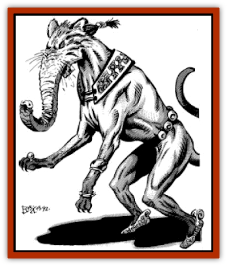

# Genie - Tasked - Winemaker

| Statistic | **Genie, Tasked, Winemaker** |
| --- | --- |
| **Activity Cycle:** | Day |
| **Alignment:** | Neutral (good tendencies) |
| **Armor Class:** | 8 |
| **Climate/Terrain:** | Temperate or subtropical villages and hills |
| **Damage/Attack:** | 1-6 or by weapon type |
| **Diet:** | Omnivore |
| **Frequency:** | Very rare |
| **Hit Dice:** | 2 |
| **Intelligence:** | Average (8-10) |
| **Magic Resistance:** | Nil |
| **Morale:** | Average (8-10) |
| **Movement:** | 12 |
| **No. Appearing:** | 1 |
| **No. of Attacks:** | 1 |
| **Organization:** | Solitary |
| **Size:** | M (4-5' tall) |
| **Special Attacks:** | See below |
| **Special Defenses:** | See below |
| **THAC0:** | 19 |
| **Treasure:** | X,C |
| **XP Value:** | 120 |

Winemaker [[Genie_Tasked_General_Information|tasked genies]] are creatures of the grape, dedicated to nurturing the vines and extracting the finest possible vintages. They are quiet creatures, tending to their fields and casks through the summer and winter and closely supervising the harvests.

This [[Genie|genie]] has the head of a cat, the body of a dog, and a long trunk which it uses to crush grapes. It stands erect, with individuals varying between 4' and 5' tall. They weigh about 150 pounds, the males slightly more, the females slightly less.

Winemaker genies do not wear cloth, but they do drape themselves in grape leaves during the growing season and are generally completely covered in grape juice during the harvest. Most such genies can speak many languages, so as to be able to travel the widest regions possible.

**Combat:** Winemaker tasked genies are poor fighters, though when they are angered their frenzy can be quite frightening to watch. They use their trunk to catch and crush opponents, causing 1d6 points of damage.

In addition, winemaker genies can spray their opponents with wine or other liquids they take into their trunk. This spray fills a cone 20' long and 10' wide at the base; each creature struck by it must make a saving throw versus paralyzation or be blinded by the stinging wine for 1d3 rounds. If only water is available to the genie, the blinding lasts but a single round.

The winemaker tasked genie can use each of the following spell-like abilities three times per day: *water walk* (to walk over the vats while stirring), *purify food and water*, *create water*, *goodberry*, *speak with animals*, and *detect poison*. Once per week they can cast *pass plant* (through grapevines only), *sunshine*, and *plant growth*.

Any fermented beverage or fruit juice made under the direction of a winemaker genie is held to high standards and is worth four times what a normal beverage might bring in the marketplace.

**Habitat/Society:** Winemaker genies are travelers, wandering from harvest to harvest, never staying at a given vineyard for more than two years. Harvest time is the only festival time that winemaker genies celebrate; they are great drinkers and are capable of entertaining workers with wit, song, and even buffoonery at the genie's expense.

Unfortunately, a winemaker tasked genie's taste for his own work typically leads to excessive drinking and a slow decay of his skills. Older winemaker genies may become eccentric vintners who cater to jaded palates, or they may become village drunks, madmen, and fools.

Winemaker genies serve only so long as their masters do not mistreat them, do not adulterate or water their wines, and do not ask them to follow any particular method or rule, even the traditions of the vineyard. They demand complete latitude to make wine as they think best. The slightest disagreement may cause them to seek work elsewhere.

Winemaker genies forced to their task are still capable of producing excellent wines, but their special touch may be lacking, and they decline into drunkenness and eccentricity much more quickly.

**Ecology:** Winemaker genies get along well with wine snobs, drunks, [[Satyr|satyrs]], [[Nymph|nymphs]], [[Centaur|centaurs]], and [[Giant_Hill|hill giants]]. They are friendly to any race that appreciates their talents, and they have been found working for evil humanoids as well as for enlightened caliphs.

---
## Discovery & Documentation

**Source Publication:** MC13 Al-Qadim Appendix (1992)
**Campaign Setting:** Al-Qadim (Forgotten Realms)
**Author(s):** C. Terry Phillips

### Other Creatures Found in This Source Book
   * [[Ammut|Ammut]]
   * [[Ashira|Ashira]]
   * [[Asuras|Asuras]]
   * [[Black_Cloud_of_Vengeance|Black Cloud of Vengeance]]
   * [[Buraq|Buraq]]
   * [[Camel|Camel]]
   * [[Camel_of_the_Pearl|Camel of the Pearl]]
   * [[Centaur_Desert|Centaur, Desert]]
   * [[Copper_Automaton|Copper Automaton]]
   * [[Debbi|Debbi]]
   * [[Elephant_Bird|Elephant Bird]]
   * [[Gen|Gen]]
   * [[Genie_Noble_Dao|Genie, Noble Dao]]
   * [[Genie_Noble_Djinni|Genie, Noble Djinni]]
   * [[Genie_Noble_Efreeti|Genie, Noble Efreeti]]
   * [[Genie_Noble_Marid|Genie, Noble Marid]]
   * [[Genie_Tasked_Architect_Builder|Genie, Tasked, Architect/Builder]]
   * [[Genie_Tasked_Artist|Genie, Tasked, Artist]]
   * [[Genie_Tasked_Guardian|Genie, Tasked, Guardian]]
   * [[Genie_Tasked_Herdsman|Genie, Tasked, Herdsman]]
   * [[Genie_Tasked_Slayer|Genie, Tasked, Slayer]]
   * [[Genie_Tasked_Warmonger|Genie, Tasked, Warmonger]]
   * [[Ghost_Mount|Ghost Mount]]
   * [[Ghul|Ghul]]
   * [[Giant_Desert|Giant, Desert]]
   * [[Giant_Jungle|Giant, Jungle]]
   * [[Giant_Reef|Giant, Reef]]
   * [[Giant_Zakhara_General_Information|Giant (Zakhara), General Information]]
   * [[Hama|Hama]]
   * [[Heway|Heway]]
   * [[Living_Idol|Living Idol]]
   * [[Lycanthrope_Werehyena|Lycanthrope, Werehyena]]
   * [[Lycanthrope_Werelion|Lycanthrope, Werelion]]
   * [[Markeen|Markeen]]
   * [[Maskhi|Maskhi]]
   * [[Mason_Wasp_Giant|Mason Wasp, Giant]]
   * [[Nasnas|Nasnas]]
   * [[Pahari|Pahari]]
   * [[Rom|Rom]]
   * [[Sabu_Lord|Sabu Lord]]
   * [[Sakina|Sakina]]
   * [[Serpent_Lord|Serpent Lord]]
   * [[Serpent_Winged|Serpent, Winged]]
   * [[Silat|Silat]]
   * [[Simurgh|Simurgh]]
   * [[Stone_Maiden|Stone Maiden]]
   * [[Vishap|Vishap]]
   * [[Zaratan|Zaratan]]
   * [[Zin|Zin]]
