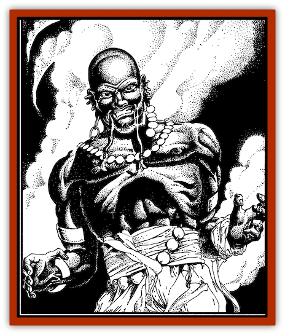
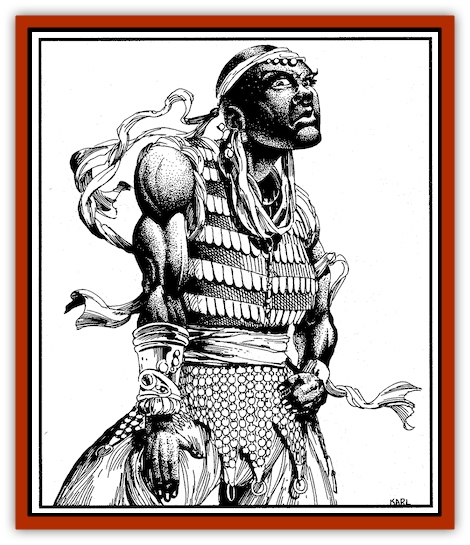

# Genie of Zakhara - Dao

| Statistic | **Genie of Zakhara, Dao** |
| --- | --- |
| **Activity Cycle:** | Day |
| **Alignment:** | Neutral evil |
| **Armor Class:** | 3 |
| **Climate/Terrain:** | Earth, mountains |
| **Damage/Attack:** | 3-18 (3d6) |
| **Diet:** | Omnivore |
| **Frequency:** | Rare |
| **Hit Dice:** | 8+3 |
| **Intelligence:** | Low to very (5-12) |
| **Magic Resistance:** | Nil |
| **Morale:** | Champion (15-16) |
| **Movement:** | 9, Fl 15 (B), Br 6 |
| **No. Appearing:** | 1 |
| **No. of Attacks:** | 1 |
| **Organization:** | Khanate |
| **Size:** | L (8-11 ft. tall) |
| **Special Attacks:** | See below |
| **Special Defenses:** | Earth resistance; see below |
| **THAC0:** | 13 |
| **Treasure:** | F |
| **XP Value:** | 6,000 |

Dao are malicious genies from the Elemental Plane of Earth (*Dao* is both singular and plural.) There they dwell in great numbers, continually delving and shaping the rock around them. On the Prime Material Plane, dao are usually solitary, although powerful individuals (such as the evil yak-men) sometimes manage to command a group of them. Of all the genie races, dao are the ost simple and brutish, and can often be cozened into service.

Like most genies, dao have a limited form of telepathy that enables them to converse with any intelligent being (low intelligence or better). They may use this ability as translators, but will often accentuate the negatives when doing so, making each side appear hostile and boastful to the other. Dao also speak Midani and the native tongue of all geniekind. The dao dialect is rumbling and low-pitched, with grinding consonants and trilling vowels.

**Combat:** Dao can use each of the following spell-like powers once per day, one at a time: *detect good*, *detect magic*, *assume gaseous form*, *attract evil eye*, become *invisible*, cause *misdirection*, *passwall*, create a *spectral force*, create a *wall of stone*, and *change self*. With the last power, a dao can reduce its height to 2 feet or increase it to 20 feet (a variation of the spell). Three times per day, the dao can turn *rock to mud* (or the reverse, *mud to rock*). Six times per day, the dao can *dig*. Powers are at the 18th level of wizardry.

A dao can also grant a limited *wish*, once per day, but with severe restrictions. First, the genie can only grant a wish to a native of the Prime Material Plane. A dao cannot grant a wish to another genie, including a janni, nor can a wish be granted to a creature such as a cambion, which belongs to both the Prime Material and other planes. Most importantly, the dao can only grant a wish that will be fulfilled in a twisted or malignant way. (Details are determined by the DM; not-even the dao can always predict such results.) For example, an individual who wishes to regain hit points may do so, but at the cost of draining hit points from allies. A wizard who requests a new spell may receive it, but become afflicted with the evil eye. And those who wish for shelter may discover a palace, only to find it inhabited by some foul monster. Most of those who request wishes from dao are aware of these restrictions and proceed with caution. (While an evil master who has enslaved a dao may demand a wish, the master should know that the wish is likely to cause him or her great harm.)

Dao are immune to earth-based and earth-affecting spells, including those from the province of sand (elemental earth). Holy water is the dao's bane; they suffer twice the usual amount of damage from it. That damage will be marked for years to come, because the liquid scars them as easily as water carves ravines through sand.

A dao can carry up to 500 pounds without tiring, either when flying or walking (or simply standing). Doubling the weight causes the dao to tire in three turns, but for every 100 pounds under 1,000, the dao can bear the load one additional turn. For example, a dao can carry 600 pounds for seven turns without tiring. After being exhausted in this fashion, a dao must rest for six turns.

Dao can move through earth at a burrowing rate of 6. They can't dig through worked stone or solid rock, however. Companions can't follow, since the tunnel closes up behind the burrowing dao, filled by debris carved out from ahead. However, a burrowing dao can still carry inanimate objects, and such an "object" might conceivably be a passenger, albeit an uncomfortable one (DM's discretion applies).

Dao usually stand and fight if threatened. If they're overmatched, however, most flee by taking to the air or by burrowing-and then return with enough reinforcements to squash those who would besmirch a dao's honor. Dao are often uncomfortable in an enclosed area of worked stone because it prevents them retreating easily.

Though dao are evil, they are also honorable in their own way. If shown kindness and fairness, a dao will return them in kind (taking everything else it can get as well). Dao make excellent advisors, particularly if they know that by helping a mortal they can cause harm to other mortals. These genies hate enslavement as much as the efreet, and will seek out sha'irs who have imprisoned their brethren - either to slay the sha'irs or to take them as slaves.

*Interplanar Travel*: Dao can travel freely to any of the elemental planes, as well as to the Prime Material, Astral, and Ethereal Planes. They are generally "homebodies" favoring their native Plane of Earth, but some maintain relationships with efreet on the Plane of Fire. In addition to traveling of their own volition, dao may be summoned to the Prime Material Plane through magical abilities or items.

**Habitat/Society:** The dao's native land is the Elemental Plane of Earth, a realm of solid matter broken by pockets of air, water, and fire. The dao have tamed, worked, and settled these pockets for their own use. The pockets and caverns twist back on themselves like intricate knots, and are called *mazeworks*. A typical mazework comprises 4 to 40 (4d10) [[Genie|dao]], and 8 to 80 (8d10) slaves. Typical slaves include elemental beings such as [[Xorn|xorn]], captives from the Prime Material Plane (especially races accustomed to a life underground), and hapless human adventurers. Xorn and other creatures who can move through stone serve the dao as scouts, determining the location of future diggings.

A standard dao mazework is ruled by an ataman (or hetman) who acts on the advice of a seneschal. Both are either dao of maximum hit points or a [[Genie_Noble_Dao|noble dao]]. One to six nobles or dao of maximum hit points make up the ruler's immediate court. While the ataman's loyalty may be in question, the seneschal's is not, since the latter is appointed by the Great Khan of the dao. Seneschals are responsible for collecting taxes and slave levies from the smaller mazeworks, to be turned over to the Great Khan for his own use. Often an ataman will declare his independence, and seek to break away or cheat the Great Khan of his due. As a result, punitive expeditions against independent kingdoms are common in the Elemental Plane of Earth.

The Great Khan rules his subjects from a cavern complex called the Sevenfold Mazework. The complex lies at the deep heart of the Great Dismal Delve, which is the largest dao city on the Plane of Earth. Most noble dao, as well as the majority of all dao, can be found in the Delve. It is a huge metropolis, continually bustling with trade in gems, metals, and mortal lives. The city's suqs and bazaars are the most wondrous (and dangerous) on the inner planes.

Of all genie races, dao are the most industrious. They are continually mining, shaping, and digging new lands-activities that require a steady flow of slaves and materials. Their markets are filled with sharp dealers, new wonders, precious metals, and lively slave-auctions. (While dao fear losing their own freedom, and despise those who would imprison them, they see nothing wrong with depriving others of their freedom.) These genies are diligent, hard-working, and driven to complete their tasks to the best of their abilities.

Dao industriousness is what moves them to invade the Prime Material Plane, where they hope to open new markets and new supply lines for their insatiable empires. In the Prime Material Plane, dao are normally found alone, scouting for resources or dealing with local merchants. They prefer the mountainous terrain familiar to their race, but can also be found in deserts and jungles. They are uneasy in mortal cities, but will go there if trade is good.

**Ecology:** Dao do not need to eat or drink. They can fast for years without significant detriment to their abilities. They also can slow their breathing to a point that enables them to remain buried beneath tons of debris and be unaffected. (They are still vulnerable to poisons and air-based attacks, however.) Despite such powerful constitutions, dao enjoy the sensations of life, and often partake in hedonistic revelry. For example, dao believe that powdered gems, gold dust, and gold leaf heighten the experience of eating -  devouring them as mortals might use a precious spice.

Dao take pride in a thing well-made and a plot well-planned. Mortal agents sometimes employ dao to build fortifications and palaces, for their engineering skills are second to none. When constructing something, the malicious nature of the dao is submerged in the industry of the work.

In the Prime Material Plane, far to the north of the enlightened world, the industriousness of dao has been harnessed by evil [[Yak-Man|yakmen]]. Dao are incapable of attacking these creatures, and are condemned to serve them. Among the genies, dao are on speaking and trading terms with the efreet, but they have nothing but scorn and hatred for jann, djinn, and marids. Other races native to the Elemental Plane of Earth avoid the dao, for these evil genies are always seeking new slaves.

Male or female, dao are powerfully muscled individuals. Their polished skin is the color of earth, sand, or granite, and their finger- and toenails are made of a durable but lustrous metal. The fingers themselves are wide and pudgy, even if the dao assume other forms. Both sexes are bald and free of body hair. Males do have facial hair, worn in mustaches and angular beards. All dao enjoy adorning themselves with jewelry, such as earrings, bracers, chokers, nose rings and studs, ankle bracelets, rings, and bells. Many don shirts of lamellar plates.

---
## Discovery & Documentation

**Source Publication:** Land of Fate Box Set (1992)
**Campaign Setting:** Al-Qadim (Forgotten Realms)
**Author(s):** Jeff Grubb, Andria Hayday, Fred Fields, Karl Waller, David C. Sutherland III, Robin Raab, Stephanie Tabat, Dori Watry, Angelika Lokotz, John Knecht, Julia Martin, Jon Pickens, John Rateliff, Dori Watry, Thomas Reid, Michele Carter, Tim Beach, David Hirsch, Slade Henson.

### Other Creatures Found in This Source Book
   * [[Genie_of_Zakhara_Djinni|Genie of Zakhara, Djinni]]
   * [[Genie_of_Zakhara_Efreeti|Genie of Zakhara, Efreeti]]
   * [[Genie_of_Zakhara_Janni|Genie of Zakhara, Janni]]
   * [[Genie_of_Zakhara_Marid|Genie of Zakhara, Marid]]
   * [[Giant_Island|Giant, Island]]
   * [[Giant_Ogre|Giant, Ogre]]
   * [[Roc_Zakharan|Roc, Zakharan]]
   * [[Yak-Man|Yak-Man]]
