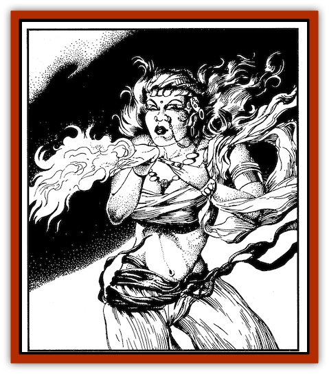
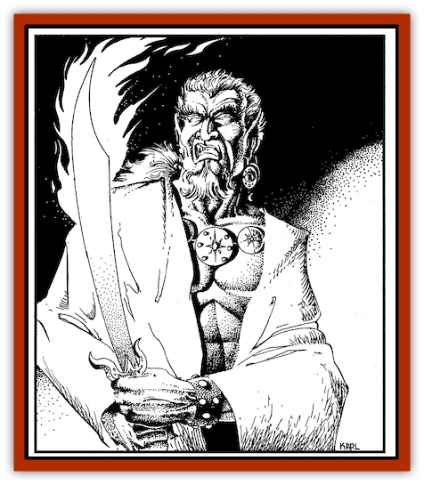
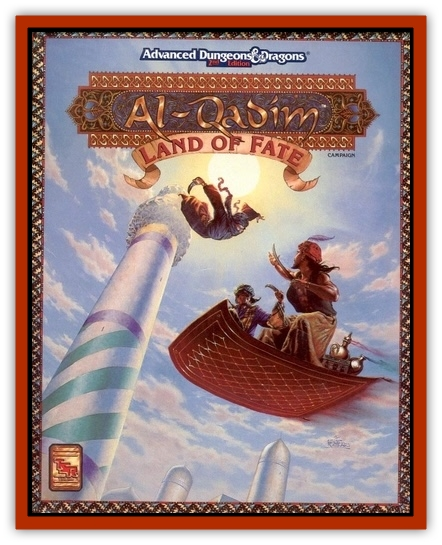

# Genie of Zakhara - Efreeti

| Statistic | **Genie of Zakhara, Efreeti** |
| --- | --- |
| **Activity Cycle:** | Day |
| **Alignment:** | Neutral |
| **Armor Class:** | 2 |
| **Climate/Terrain:** | Fire, desert |
| **Damage/Attack:** | 3-24 (3d8) |
| **Diet:** | Omnivore |
| **Frequency:** | Very rare |
| **Hit Dice:** | 10 |
| **Intelligence:** | Very (11-12) |
| **Magic Resistance:** | Nil |
| **Morale:** | Champion (15-16) |
| **Movement:** | 9, Fl 24 (B) |
| **No. Appearing:** | 1 |
| **No. of Attacks:** | 1 |
| **Organization:** | Sultanate |
| **Size:** | L (12 ft. tall) |
| **Special Attacks:** | See below |
| **Special Defenses:** | Fire resistance; see below |
| **THAC0:** | 11 |
| **Treasure:** | F |
| **XP Value:** | 7,000 |

Ereet are genies of the Elemental Plane of Fire, and they are likely to found in great numbers there. ( *Efreet* is plural; *efreeti* is singular.) In the Land of Fate, they are usually alone, although they may be acting on behalf of a sha'ir or another master. These from equal parts of basalt, bronze, solid flame, and anger. Their genies are usually hostile and derogatory toward mortals, with two exceptions: mortals who are more powerful than the efreet, and skin color ranges from deep red or crimson to the dark gray and characters who are wise enough to realize the superiority of efreet over all other genies. As a race, efreet are insulted to the point of ebony of basalt. (Some Zakharans believe that creatures with red violence by suggestions that they are evil and lawful in nature. They prefer to think of themselves as fair, even-handed, well skin are chosen by Fate for a special task.) An efreeti's hair often organized, and possessing an enlightened sense of self-interest. seems aflame with its brassy undertones and red and smoky highlights. A red or black beard, either contrasting or matching (The rulers of the efreet, however, are both evil and lawful in nature.)

Efreet are massive, solid, hulking humanoids with red eyes that flicker and glow like embers. It is said the efreet are configured from equal parts of basalt, bronze, solid flame, and anger. Their skin color ranges from deep red or crimson to the dark gray and ebony of basalt. (Some Zakharans believe that creatures with red skin are chosen by Fate for a special task.) An efreeti's hair often seems aflame with its brassy undertones and red and smoky highlights. A red or black beard, either contrasting or matching the hair, completes the visage of some males. These fiery genies dress in the finest silk caftans and damask robes, all dyed in shades of red and black. They also favor brass and gold jewelry.

 Like most other genies, efreet have a limited form of telepathy, which enables them to converse with any being of low intelligence or better. (An efreeti is an unreliable translator, however, prone to twist the truth to its own ends.) Efreet also speak Midani and the native tongue shared by all geniekind. The efreeti dialect of the latter is harsh and passionate, with over-stressed syllables and a clipped, precise rhythm.

**Combat:** An efreeti can use each of these spell-like abilities once per day with the skill of a 15th-level wizard: become *invisible*,* assume gaseous form*, *detect magic*, *polymorph self*, create a *wall of fire*, and create an *illusion*. Illusions can have both visible and audible components, and they last without an efreeti's concentration until they are magically dispelled or touched.

 As often as desired, an efreeti can also *produce flame* or cause *pyrotechnics* (as a 15th-level wizard). In addition, the efreeti can *enlarge* itself once each day, with the skill of a 10th-level mage.

 Efreeti are fire-resistant. "Normal" fire-including incendiary attacks and the effects of their own native plane-cannot harm them. Nor can dragon breath. Magical fire-such as a *fireball* or similar magic from the province of flame-has diminished effects. Such magical attacks suffer a -1 penalty to hit the efreeti (where applicable), as well as a -1 penalty to each die of damage.

 The efreeti' s most renowned power is the granting of wishes (per the spell), up to three per day. This ability has made efreet very popular among those seeking to enslave them (which may account, at least in part, for the efreet's disagreeable attitude). An efreeti operates under two limitations when using this ability. First, wishes can only be granted to creatures of the Prime Material Plane. Efreet cannot grant wishes to other genies (including jann), nor to any other creature from the inner or outer planes. Second, any wish that an efreeti grants will be reviewed by the efreeti' s own superiors in the City of Brass, and ultimately by the Sultan of the Efreet himself (see "Habitat/Society").

 Efreet can carry up to 750 pounds, afoot or flying, without tiring. They can carry twice that weight, or 1,500 pounds, for a limited time: three turns afoot or one turn aloft. For every 150 pounds below 1,500, the time limit increases by one tum. (For example, an efreeti can fly for three turns while carrying 1,200 pounds.) An efreeti who is fatigued by carrying a heavy load must rest for six full turns before engaging in strenuous activity again.

 *Interplanar Travel*: Like most genies, efreet can travel freely to any of the elemental planes, as well as to Prime Material Plane, Ethereal Plane, and Astral Plane. Due to strained relations with  other genie races, they normally remain on the Plane of Fire, though they occasionally establish trading operations on the Plane of Earth. Those upon the Prime Material Plane usually have been summoned by a sha'ir or a character who has a magical item.

**Habitat/Society:** Efreet are famous for their hatred of servitude and their desire for justice and vengeance against those who have wronged them. They are also noted for their cruel natures and their ability to mislead and deceive. In part, this cruelty stems from the nature of the horrid masters who oversee them. But more than a few efreet relish their own brutality. The remainder merely shrug, and blame their evil society for their actions, not themselves.

 The court of the efreet is the City of Brass, a great metropolis on the Elemental Plane of Fire. The city rises from a bowl-like hemisphere of glowing metal, measuring 40 miles across. The city is ruled by the efreet' s great sultan. His servants include a number of noble and common efreet who make the city their home.

 While most efreet on the Plane of Fire reside in the City of Brass, there are military outposts scattered throughout the dimension. The stated purpose of these outposts is to protect the efreeti territories against incursions from the Elemental Planes of Air and Water. More often, they serve as bases for raids against other planes. The outposts also serve to regulate movement and travel in the efreeti territories. Four to 40 (4d10) efreet dwell at each post. They are governed by a malik or vali, who is a common efreeti of maximum hit points. In addition, there is a 10 percent chance that an outpost houses one to four (1d4) jann and one to four dao. There also may be 10 to 100 (lOdlO) prisoners or captives of the efreet, taken either from the Prime Material Plane or from raids against travelers in the Elemental Plane of Fire.

 Given the oppressiveness of their native land, it is no surprise that efreet make extended visits to the Prime Material Plane. They prefer hot regions such as volcanoes, and open territory such as the Anvils of the great deserts. This love of the desert brings them into conflict with jann, whom the efreet can easily dominate, as well as djinn, with whom the efreet have maintained a low-level conflict for generations.

 Due to their wish-granting ability, efreet have been exploited by mortals for eons, especially humans. As a result, efreet feel suspicion and spite for that race. The efreet capture or torment almost anyone they can, carrying suitable slaves back to the Plane of Fire for training at one of the outposts. Mortals who spoon out healthy portions of praise (and treasure) may find these genies more amenable, as may characters who seek to use an efreeti' s power to the detriment of other mortals. All efreet enjoy creating excitement, havok, and destruction, particularly if they cannot be held personally responsible. ("Very sorry about your inn, most worthy mortal. I would have spared it if the sha'ir had permitted me to do so. But such was not the case, alas.")

 As noted above, any wish an efreeti grants will be reviewed by efreet superiors (perhaps even the eftreet's sultan). Superiors are both malevolent in nature and exacting in their bookkeeping. None looks favorably upon an efreeti who dispenses wishes like sweets to the benefit of others. An efreeti whose wish-granting is questioned must offer evidence of two circumstances: (1) the wish was granted against the efreeti' s will or better judgment (for example, the efreeti was imprisoned, threatened, ensorceled, or otherwise forced to act in a manner against its will); and (2) the efreeti proved its innate superiority by turning the wish against the user, thereby teaching the individual an important lesson (namely, don't ask anything of an efreeti). Efreet usually grant a malicious wish, but in a manner ensuring that the character who requests the baleful wish will be harmed along with the target of it.

 Dealing with an efreeti is tricky. Sha'irs must choose their words carefully when confronting these genies. An efreeti makes an excellent advisor for those who seek nothing but malicious mischief and harm. Otherwise, only the strongest of masters should seek to harness the creature's abilities. Most genie prisons are used to trap the efreet and their equally detestable cousins, the dao.

**Ecology:** As elemental creatures, efreet do not need to eat or drink in the traditional sense, and can go for years without a meal. They do enjoy the aroma of roasted meats and nuts, however. To efreet, "cooked to perfection" means "burned almost to ash." In addition to charred food, efreet enjoy wines and kourniss that have been heated to the boiling point.

 Efreet appreciate baubles, but they favor metals and gems that don't liquify in the heat of their native land. They treat their clothing with flame retardant oils, which prevent the fabric from bursting into flame upon contact with their elemental homeland. While such oils may be acquired and used by a mortal, they do not protect the wearer against fire damage-only the clothing that has been treated.

---
## Discovery & Documentation

**Source Publication:** Land of Fate Box Set (1992)
**Campaign Setting:** Al-Qadim (Forgotten Realms)
**Author(s):** Jeff Grubb, Andria Hayday, Fred Fields, Karl Waller, David C. Sutherland III, Robin Raab, Stephanie Tabat, Dori Watry, Angelika Lokotz, John Knecht, Julia Martin, Jon Pickens, John Rateliff, Dori Watry, Thomas Reid, Michele Carter, Tim Beach, David Hirsch, Slade Henson.

### Other Creatures Found in This Source Book
   * [[Genie_of_Zakhara_Dao|Genie of Zakhara, Dao]]
   * [[Genie_of_Zakhara_Djinni|Genie of Zakhara, Djinni]]
   * [[Genie_of_Zakhara_Janni|Genie of Zakhara, Janni]]
   * [[Genie_of_Zakhara_Marid|Genie of Zakhara, Marid]]
   * [[Giant_Island|Giant, Island]]
   * [[Giant_Ogre|Giant, Ogre]]
   * [[Roc_Zakharan|Roc, Zakharan]]
   * [[Yak-Man|Yak-Man]]
