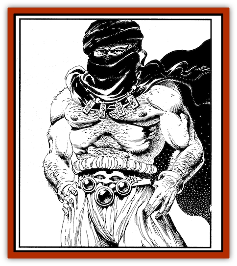

# Genie of Zakhara - Janni

| Statistic | **Genie of Zakhara, Janni** |
| --- | --- |
| **Activity Cycle:** | Day |
| **Alignment:** | Neutral good |
| **Armor Class:** | 5(2) |
| **Climate/Terrain:** | Any land, deserts |
| **Damage/Attack:** | 1-8 + Strength bonus or by weapon + Strength bonus |
| **Diet:** | Omnivore |
| **Frequency:** | Very rare |
| **Hit Dice:** | 6+2, 8 (sheikhs and viziers) |
| **Intelligence:** | Vert to exceptional (11-16), genius (17-18, sheikh or amir), or genius to supra-genius (17-20, vizier) |
| **Magic Resistance:** | Nil or 20% in/near desert |
| **Morale:** | Champion (15) |
| **Movement:** | 12, Fl 30 (A) |
| **No. Appearing:** | 1-2 |
| **No. of Attacks:** | 1 |
| **Organization:** | Sheikhdom |
| **Size:** | M (6-7 ft. tall) |
| **Special Attacks:** | See below |
| **Special Defenses:** | See below |
| **THAC0:** | 15, 13, or 11 |
| **Treasure:** | Nil |
| **XP Value:** | 3000; 5,000 (sheikh); 6,000 (vizier); 6,000 (amir) |

The weakest of all genies, jann are native to the Prime Material Plane. ( *Jann* is plural; *janni* is singular.) They are servants to other genie races and keepers of the wild, inhospitable reaches of the Zakharan desert. Some Zakharans say that jann were created by powerful elemental creatures who hoped to circumvent the restriction preventing genies from granting wishes to other genies. Such was not the case, for the jann are as limited as their elemental cousins in this matter.

Zakhara's jann look like statuesque humans or half-elves withhandsome, noble features. Their flesh is the color of sand andearth, and (unlike djinn) they may pass unnoticed among meremortals without attracting undue attention. Their eyes may beblue, green, brown, black, or something in between, but they oftenseem to flash like hot, colored sparks, lively and energetic.

Jann lack the limited telepathy that other genies have. They dospeak Midani, however, as well as the common tongue of allgeniekind. Jann can also *speak with animals* of low intelligence orbetter (as per the priest spell of the same name). Animals will notattack a jarmi who speaks with them.

**Combat:**Desert heat and windbome sand cannot harm the jann; their skin is very resilient. In battle, they wear a type of lamellar that gives them an Armor Class of 2. The normal debilitating effects of such armor do not apply. For weapons, jann favor great scimitars (2d8 / 4d4 damage) and composite long bows (flight arrows, 1d6/1d6 damage). They gain a Strength benefit with both. When attacking with bare hands, jann inflict 1d8 points of damage.

 Both male and female jann have superior Strength. Males have Strengths ranging from 18/01 to 18/00 (dlOO roll). Half of all females have Strengths of 18, while the other half have Strengths of 18/50. (Roll ldlO0 for random statistics.) Both sexes increase their hit probability and damage adjustment accordingly.

| Strength | Hit Probability | Damage Adj. |
| --- | --- | --- |
| 18 | +1 | +2 |
| 18/01-50 | +1 | +3 |
| 18/51-75 | +2 | +3 |
| 18/76-90 | +2 | +4 |
| 18/91-99 | +2 | +5 |
| 18/00 | +3 | +6 |

Jann have a number of spell-like powers, performed at the 12th level of ability unless otherwise noted. They can only use one power at a time, and no more than one per round:

<ul><li>Twice per day, jann can increase or decrease their own size, or the size of an individual they touch. The maximum size is 24 feet, and the minimum is 2 inches. Unwilling targets are allowed a saving throw vs. spells.</li><li>They can become *invisible* three times per day.</li><li>They can *create food and water* once per day as a 7th-level priest (creating 7 cubic feet of food and water).</li><li>They can become ethereal once per day, for a maximum of one hour.</li></ul>In addition to these powers, jann can breathe underwater and fly at will, with no effect on their other spell-like abilities.

While jann tend to be fearless on their own turf, they are uncomfortable (and rare) outside desert terrain. According to legend, the first of their kind came into being upon Zakhara's sands. For this reason, they are 20 percent resistant to magic while in this barren terrain. The same resistance applies when they're within a mile of such open territories. Otherwise, a janni has no special magic resistance (like any other creature of the same Hit Dice). Therefore, a janni in a city bordering the desert is more resistant to magic than a janni in the heart of a richly cultivated area, or even a janni out on the open sea. Magic resistance does not affect a sha'ir's ability to call upon the jann, because a janni's response is based on the unwritten agreement between mortals and genies.

*Interplanar Travel*: Jann can travel freely to the Astral and Ethereal Planes. They can also visit the Planes of Water, Air, Fire, and Earth, and they are often found on these elemental planes as solitary tourists, or in the service of another genie race. Jann are only partially resistant to the negative effects of the elemental planes, however. They cannot visit the elemental planes for more than 48 hours (even if they journey from one to another). Once that time has elapsed, a janni must return to the Prime Material Plane for another 48 hours before it can safely visit an elemental plane. If the janni lingers too long on an elemental plane, it suffers 1 point of damage for every hour spent there (beyond the initial 48). Damage ceases to accumulate as soon as the creature returns to the Prime Material Plane or perishes.

When traveling to an elemental plane, a janni can take along up to six individuals. The janni automatically extends its own protection against the effects of that plane to its fellow travelers. Other travelers must link hands with the janni to make the trip. After 48 hours have elapsed, however, the janni's protection automatically ends. It also ends immediately if the janni leaves the elemental plane, stranding its companions there.

**Habitat/Society:** Jann value their privacy and safety. They favor the forlorn deserts of Zakhara, from the inhospitable Anvils to lush oases. They consider themselves the caretakers of that land, acting in the name of their genie lords and the Grand Caliph. Like Zakhara's Al-Badia, jann are nomads, though they move their camps less frequently than mortals, and they do maintain some permanent settlements. These creatures travel in clans of 1d20 +10 individuals, each ruled by a sheikh. Each clan belongs to a greater tribe, the two most important being the House of Sihr in the High Desert and the wild, erratic Jann of the Haunted Lands. Scattered throughout the desert and wild lands are independent clans and smaller tribes, unaligned to either of these powerful houses.

*Sheikhs* are jann with 8 Hit Dice. *Amirs*, more powerful sheikhs who rule the greater tribes, have 9 Hit Dice. Both types of leaders have genius (17-18) Intelligence, and higher than average strength (10 percent chance of a 19 strength (+3/+7), regardless of the janni's sex).

Each amir is counseled by one or two viziers. These high-ranking advisors have 8 Hit Dice and genius to supra-genius Intelligence (17-20). They also have the following spell-like powers, and can use each of them three times per day at the 12th level of ability: *augury*, *detect magic*, *divination*, and *fire truth*.

The jann tribes travel with herds of camels, goats, and sheep between good grasslands and oases. As a people, they are the emblem of the virtues of the desert. They are strong, brave, and valiant. They are proud and brook no insult or impropriety, and see that injuries are repaid in kind. By the same token, they are hospitable to travelers and strangers, and treat them with honor and respect when they are among them, expecting the same treatment in return.

On the move, jann live in large, brightly-colored tents with their families. In Zakhara, male and female jann are treated equally, and a successful male or female may have a number of spouses. Traditionally a married male remains within (or at least near) his family's tent. A married female lives with her first spouse's family until she marries again, at which time a neutral location for her tent is chosen. Whenever a family outgrows a single tent, children move into their own quarters.

 Jann also maintain permanent settlements in hidden oases, windswept holy sites, and deserted cities. Tents are common in such permanent locations, but the jann also build elegant, sweeping structures for communal use. Such structures might include a mosque, bathhouse (with quarters for visiting marids), smokehouse (with similar quarters so that efreet are comfortable), and occasionally an audience chamber for the jann's amirs.

**Ecology:** In their native desert, jann are open and friendly toward newcomers (particularly if the jann outnumber them). These genies make no distinction between the mortal races, caring more if an individual is just and enlightened than if the character is an orc or elf. At the borders of the jann's territory, these genies are less trusting of others, particularly in areas where jann lack their innate magical resistance.

 Jann are on excellent terms with djinn, and in an emergency the jann will send a messenger to the Elemental Plane of Air to request reinforcements. The jann tolerate efreet, who tend to be foultempered and overbearing, taking advantage of any hospitality offered while offering little in return. Similarly, jann tolerate dao, but often with a thinly veiled hostility, because jann are sometimes captives in the dao's native plane. The marids are treated as the royalty they consider themselves to be, but their visits to the waterstricken deserts are infrequent.

---
## Discovery & Documentation

**Source Publication:** Land of Fate Box Set (1992)
**Campaign Setting:** Al-Qadim (Forgotten Realms)
**Author(s):** Jeff Grubb, Andria Hayday, Fred Fields, Karl Waller, David C. Sutherland III, Robin Raab, Stephanie Tabat, Dori Watry, Angelika Lokotz, John Knecht, Julia Martin, Jon Pickens, John Rateliff, Dori Watry, Thomas Reid, Michele Carter, Tim Beach, David Hirsch, Slade Henson.

### Other Creatures Found in This Source Book
   * [[Genie_of_Zakhara_Dao|Genie of Zakhara, Dao]]
   * [[Genie_of_Zakhara_Djinni|Genie of Zakhara, Djinni]]
   * [[Genie_of_Zakhara_Efreeti|Genie of Zakhara, Efreeti]]
   * [[Genie_of_Zakhara_Marid|Genie of Zakhara, Marid]]
   * [[Giant_Island|Giant, Island]]
   * [[Giant_Ogre|Giant, Ogre]]
   * [[Roc_Zakharan|Roc, Zakharan]]
   * [[Yak-Man|Yak-Man]]
