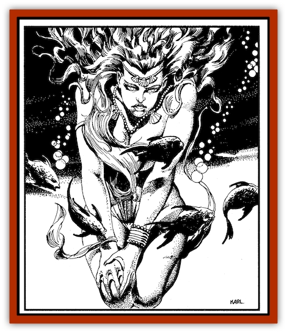

# Genie of Zakhara - Marid

| Statistic | **Genie of Zakhara, Marid** |
| --- | --- |
| **Activity Cycle:** | Day |
| **Alignment:** | Chaotic neutral |
| **Armor Class:** | 0 |
| **Climate/Terrain:** | Water, oceans |
| **Damage/Attack:** | 4-32 (4d8) |
| **Diet:** | Omnivore |
| **Frequency:** | Very rare |
| **Hit Dice:** | 13 |
| **Intelligence:** | High to genius (13-18) |
| **Magic Resistance:** | 25% |
| **Morale:** | Champion (16) |
| **Movement:** | 9, Fl 15 (B), Sw 24 |
| **No. Appearing:** | 1 |
| **No. of Attacks:** | 1 |
| **Organization:** | Padishate |
| **Size:** | H (18 ft. tall) |
| **Special Attacks:** | Water jet |
| **Special Defenses:** | Water resistance |
| **THAC0:** | 7 |
| **Treasure:** | F |
| **XP Value:** | 15,000 |

Marids are genies from the Elemental Plane of Water. In the eyes of many Zakharans, they are the most wondrous and powerful of all geniekind. While individual tasked genies may wield great power, and the noble genies are both more powerful and cultured, the average marid stands head and shoulders above the flighty djinni, the ground-hugging dao, and the evil efreeti.

Towering and beautiful, marids are as fair of face as they are powerful of form. Their skin matches the many colors of the ocean, from the serene blue of tropical waters to the somber greens of a storm-tossed sea. Skin color changes to reflect the moods of an individual marid—the darker the creature's mood, the darker the color. A marid's hair is usually blue-black or dark gray, but a few have tresses as snowy as froth upon a wave. Such white-haired creatures are considered the most chaotic of this strong-willed, independent race.

 In the sea, marids wear little or nothing. On land, they don flowing robes and diaphanous pantaloons. They eschew shirts, preferring to show off their physique with a short vest (at most). Often, a marid's garb is in the flashiest, most outrageous colors possible, calling attention to the richness and power of the genie.

 Marids have the limited telepathy common to most genies, enabling them to converse with any intelligent being (low intelligence or better). These genies make excellent translators if they can be impressed into service. Marids also speak Midani and the native tongue shared by all geniekind. The marid dialect of that tongue can sound imperious, for the vocalizations of a marid's full wrath are akin to storm waves breaking on a rocky cliff.

**Combat:**  Marids are extremely magical creatures, and they perform as 26th-level wizards when using their spell-like abilities. They can use each of the following powers twice per day, one at time: *detect evil/good*, *detect invisible*, *detect magic*, *invisibility*, *polymorph self*, *purify water*, and *assume liquid form*. The last is similar in effect to the *potion of gaseous form*, except the marid becomes a liquid as opposed to a gas, and the duration is as long as the marid wills it to be. The liquid form moves at a speed of 18.

 In addition to the abilities noted, marids can perform any of the following up to seven times per day: *assume gaseous form*, *lower water*, *part water*, *wall of fog* as well as bestow water breathing upon others. This bestowal grants the recipient the ability to breathe underwater for up to a full day.

 At will, marids can *create water* and use it as a weapon. They fashion a powerful jet up to 60 yards long, which automatically inflicts 1d6 points of damage upon whomever it strikes. In addition, it may cause blindness for 1d6 rounds (a saving throw vs. dragon breath is allowed).

 Once per year, marids can *alter reality*. These genies can also water walk at will, as for the magical ring of the same name. They can breathe underwater naturally, and can swim at any depth without discomfort.

 Marids cannot be harmed by water-based spells, including magics from the elemental province of the sea. Resistant to cold, these genies gain a +2 bonus to saving throws vs. cold-based attacks. Further, each die of damage from such attacks is reduced by -2. Fire-based attacks are a marid's bane, however, inflicting +1 per die of damage, and causing a -1 penalty to the marid's saving throw. These penalties apply only when the marid is exposed to open flame; mere heat, boiling water, and steam have no effect.

 A marid can carry 1,000 pounds without tiring. It can carry up to twice that amount for three turns before it's fatigued. For every 200 pounds under 2,000, the marid's endurance increases by one turn. (For example, a marid can carry 1,600 pounds for five turns.) Once fatigued, the marid must rest for six turns, and cannot be budged during this period.

*Interplanar Travel*: Like most genies, marids can travel freely to any of the elemental planes, as well as to the Prime Material Plane and Astral Plane. They can also move in the Ethereal Plane. Due to their strained relations with other genies, they normally remain on the Elemental Plane of Water, with a rare excursion to the Prime Material Plane. A marid may be summoned to the Prime Material Plane, however, either through a character's magical abilities or items.

**Habitat/Society:**All marids claim some form of petty nobility, and the race is awash in shahs, princes, mufti, khedives, caliphs, ‘minor khans, emirs, atabegs, and beglerbegs. Further, no set order is given to the rankings and honorifics, creating a hodgepodge of conflicting hierarchies and precedence. The truly [[Genie_Noble_Marid|noble marids]] are superior to these creatures, and are the stuff of legends in Zakhara. The fact that the Grand Caliph of the Land of Fate has not only a marid advisor, but a truly noble marid as an advisor, speaks volumes as to his power.

 A marid household on its home plane includes 2 to 20 (2d10) "typical" marid members, with a leader (whatever its title) of maximum hit points. In addition, there are 4 to 40 servants, slaves, or otherwise lesser creatures, whose job it is to wait on the noble beings. Many of these lackeys are air-breathers, kept faithful by the marid's power to let them to breathe underwater. (A sudden revocation of that ability could prove fatal.) Marids prefer solitude or small gatherings. Although larger groups may gather for a hunt or for an incursion into another plane, even in such cases, the emphasis is on individual action and achievement.

 The ultimate capital of the marids, the home of its Great Padishah, is the Citadel of the Ten Thousand Pearls, a mighty metropolis located in the heart of the Elemental Plane of Water. This legendary place is also the home of truly noble marids. Only a handful of worthy mortals have visited the citadel and lived to return to the Prime Material Plane.

 The independent nature of marids makes the Prime Material Plane a common site for visits and adventures. However, it is not mortals they seek. Marids tend to avoid contact with "lesser races" which, to a marid, means all other races. So when they do appear on the Prime Material Plane, it is often in a remote locale or a place inaccessible to others. During the monsoon and hurricane seasons, for example, these reclusive tourists favor the open sea and the jungle coast. Mortals who have witnessed some of Zakhara's worst tropical storms have sighted marids frolicking in the whirlwinds and waterspouts.

 Characters dealing with marids should keep in mind that these creatures are egotistical and vain—with good reason. Their selfimage only slightly exceeds reality. Even the most powerful sha'ir angers a marid at his or her own risk. Bribery and flattery are often the best means for dealing with these genies, who view an obsequious man as a man who knows his place. Of course, while such honeyed tactics generally avoid raising a marid's ire, the genie still may not answer the supplicant's request.

 Marids are noted for their whimsical nature. More than few have accepted all manner of gifts, only to vanish as soon the giver began making firm requests. Further, marids lie often and they lie creatively. They are not malicious in their deception, but "embellishments" suit their fancy. Knowledgeable mariners and travelers avoid asking directions from a marid, because the genie will undoubtedly direct them through the most "interesting" route-meaning the route with the greatest peril and excitement. Prying the truth out of even a friendly marid is a lengthy process recommended only for the patient and the powerful.

 Not surprisingly, marids are champion tale-tellers. Their favorite legends emphasize the prowess of the marid race in general and of the speaker in particular. When talking with a marid, mortals should take care to prevent the conversation from digressing into other matters. One further note of warning: Marids consider it a crime for a lesser being to interrupt them-and offending a marid is a sure way to summon its wrath.

**Ecology:**Marids have no need to eat or drink in the traditional sense, though it pleases them to do so. They are sensitive to flavor and tastes. A tenser in a marid household consists of exotic salts releasing pleasant tastes into the water. Though marids are creatures of the sea, they can breathe equally well on dry land.

As befits "nobility," marids try to surround themselves with the finest items of the highest quality. (As noted above, all marids proclaim themselves to be noble, however feeble the justification.) Many arrogant genies are not above kidnapping a skilled human artificer for use in their own court. Such kidnapping does violate the law among marids, however. Should word of the action reach the Citadel of the Ten Thousand Pearls, justice may be sought with the marids who are truly noble.

---
## Discovery & Documentation

**Source Publication:** Land of Fate Box Set (1992)
**Campaign Setting:** Al-Qadim (Forgotten Realms)
**Author(s):** Jeff Grubb, Andria Hayday, Fred Fields, Karl Waller, David C. Sutherland III, Robin Raab, Stephanie Tabat, Dori Watry, Angelika Lokotz, John Knecht, Julia Martin, Jon Pickens, John Rateliff, Dori Watry, Thomas Reid, Michele Carter, Tim Beach, David Hirsch, Slade Henson.

### Other Creatures Found in This Source Book
   * [[Genie_of_Zakhara_Dao|Genie of Zakhara, Dao]]
   * [[Genie_of_Zakhara_Djinni|Genie of Zakhara, Djinni]]
   * [[Genie_of_Zakhara_Efreeti|Genie of Zakhara, Efreeti]]
   * [[Genie_of_Zakhara_Janni|Genie of Zakhara, Janni]]
   * [[Giant_Island|Giant, Island]]
   * [[Giant_Ogre|Giant, Ogre]]
   * [[Roc_Zakharan|Roc, Zakharan]]
   * [[Yak-Man|Yak-Man]]
