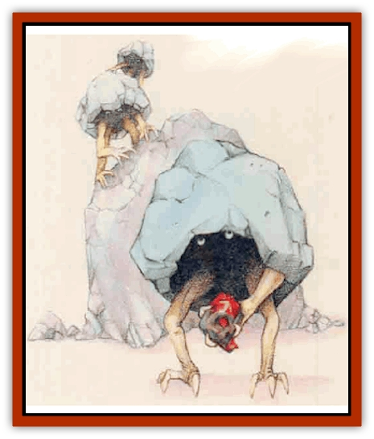

# Geonid

| Statistic | **Geonid** |
| --- | --- |
| **Activity Cycle:** | Night |
| **Alignment:** | Chaotic neutral |
| **Armor Class:** | -2 |
| **Climate/Terrain:** | Any subterranean |
| **Damage/Attack:** | 1d8 (claw) or by weapon |
| **Diet:** | Omnivore |
| **Frequency:** | Rare |
| **Hit Dice:** | 2 |
| **Intelligence:** | Average (8-10) |
| **Magic Resistance:** | Nil |
| **Morale:** | Steady (11) |
| **Movement:** | 6 |
| **No. Appearing:** | 2d6 |
| **No. of Attacks:** | 1 |
| **Organization:** | Clan |
| **Size:** | S (3-4' tall) |
| **Special Attacks:** | Surprise |
| **Special Defenses:** | Nil |
| **THAC0:** | 19 |
| **Treasure:** | K (C) |
| **XP Value:** | 65 / Priest: 175 |

Geonids - small, intelligent cave-dwellers - live and hunt in clans within tunnel complexes or natural cave systems.

The bipedal geonids have two arms ending in sharp, three-part claws dexterous enough to wield tools and weapons. A geonid protects its tender flesh with a mottled gray outer shell, which gives the creature an unusual appearance. The geonid's arms and legs protrude from small openings in the bottom nf the shell and can be withdrawn for either protection or camouflage. With its limbs retracted, a geonid cannot easily be disringuished from a small boulder.

Geonids speak to each other using a series of dicks and shell gestures incomprehensible to outsiders. A few specimens (perhaps 10%) have learned basic Common.

**Combat:** Geonids rarely seek out combat, fighting only to defend their lairs or attack prey. (Geonids are pamcularly fond of horseflesh.) When attacking, they prefer to gain an advantage through surprise. Due to the geonids' resemblance to boulders when hiding, opponents suffer a -4 penalty to their surprise rolls when encountering them.

In battle, geonids attack with either one of their powerful front limbs or with a stone weapon, usually an axe or club. They attempt to swarm larger opponents, with at least three creatures attacking a single foe. They are tenacious opponents, but a geonid near death usually retreats into its shell, scuttling away from combat rather than risking its life.

The creatures always attack in groups and are almost never encountered alone. A single geonid prefers to hide or flee rather than face an opponent of any sort.

**Habitat/Society:** These social creatures live in clans of (1d6x10)+20 individuals. The few outsiders who have stumbled upon a geonid lair often are surprised by their numbers, since most adventurers encounter them in hunting parties of only 2d6 individuals. A clan usually follows a geonid priest who, though lacking spells, remains an exceptionally powerful specimen. A priest has 4 HD and causes 2d6 points of damage with its claws, or +2 to damage with any weapon. A geonid lair always contains a strange shrine built of chipped boulders and oddly-shaped stones dedicated to their Immortals. Offerings of precious metals, gems, and coins collected by the clan lie among the boulders of the shrine. The rest of the lair consists of small piles of stones covering the hollows in which the geonids make their rocky nests.

Geonids are monogamous and form small family groups. Young geonids, born without shells, ride inside their mother's shell for the first few months of life. For several months thereafter the child stays near its mother, clinging to the safe paternal shell and hiding beneath it when threatened.

The creatures feel extremely suspicious of all outsiders, particularly humanoids. They normally guard their lairs simply by hiding their existence and blending into their surroundings. However, if they sense danger of discovery (dogs and other animals can scent geonids), a hunting party tries to lead the invaders away from the lair. Geonids particularly like to lead outsiders into areas where they can trigger a rock slide or other distraction. When possible, they lead intruders to an area inhabited by [[Piercer|piercers]]. Once the piercers have attacked, the geonids  finish off any remaining outsiders. They sometimes use a variation on this tactic in hunting; the stony creatures attack both the fallen piercers and the piercers' prey.

Geonids may be related to [[Galeb_Duhr|galeb duhr]], but the two races seldom live in close proximity.

**Ecology:** Geonids are predators and occasional scavengers that can digest almost any form of animal or plant. However their preferred diet combines fresh meat (ranging from rats to horses) and mosses, which the geonids cultivate and harvest. Hunting parties bring in meat but hunt outside only at night.

The shells of adolescent geonids, while retaining their flexibility, remain just as protectie as adult shells. [[Dwarf|Dwarves]] and [[Orc|Orcs]] can fashion them into particularly strong and durable helms, which grant twice the protection of normal helms.

On occasion, clans of mountain dwarves have been able to convince geonids to search out veins of ore in exchange for both horse meat and uniquely shaped boulders, which the creatures find quite valuable.

---
## Discovery & Documentation

**Source Publication:** Mystara Appendix (1994)
**Campaign Setting:** Mystara
**Author(s):** John Nephew, Teeuwynn Woodruff, John Terra, Skip Williams

### Other Creatures Found in This Source Book
   * [[Actaeon|Actaeon]]
   * [[Agarat|Agarat]]
   * [[Ash_Crawler|Ash Crawler]]
   * [[Baldandar|Baldandar]]
   * [[Bargda|Bargda]]
   * [[Bhut|Bhut]]
   * [[Bird_Mystara|Bird (Mystara)]]
   * [[Blackball|Blackball]]
   * [[Choker|Choker]]
   * [[Coltpixie|Coltpixie]]
   * [[Crone_of_Chaos|Crone of Chaos]]
   * [[Darkhood|Darkhood]]
   * [[Darkwing|Darkwing]]
   * [[Decapus|Decapus]]
   * [[Deep_Glaurant|Deep Glaurant]]
   * [[Diabolus|Diabolus]]
   * [[Dimensional_Warper|Dimensional Warper]]
   * [[Dragon_Mystara_Crystalline|Dragon (Mystara), Crystalline]]
   * [[Dragon_Mystara_Jade|Dragon (Mystara), Jade]]
   * [[Dragon_Mystara_Onyx|Dragon (Mystara), Onyx]]
   * [[Dragon_Mystara_Ruby|Dragon (Mystara), Ruby]]
   * [[Drake_Mystara|Drake (Mystara)]]
   * [[Dragonfly|Dragonfly]]
   * [[Dusanu|Dusanu]]
   * [[Elemental_of_Chaos_Air_Earth|Elemental of Chaos, Air/Earth]]
   * [[Elemental_of_Chaos_Fire_Water|Elemental of Chaos, Fire/Water]]
   * [[Elemental_of_Law_Air_Earth|Elemental of Law, Air/Earth]]
   * [[Elemental_of_Law_Fire_Water|Elemental of Law, Fire/Water]]
   * [[Familiar_Mystara|Familiar (Mystara)]]
   * [[Frost_Salamander|Frost Salamander]]
   * [[Fundamental_Air_Earth|Fundamental, Air/Earth]]
   * [[Fundamental_Fire_Water|Fundamental, Fire/Water]]
   * [[Gargantua_Mystara|Gargantua (Mystara)]]
   * [[Ghostly_Horde|Ghostly Horde]]
   * [[Giant_Athach|Giant, Athach]]
   * [[Giant_Hephaeston|Giant, Hephaeston]]
   * [[Golem_Drolem|Golem, Drolem]]
   * [[Golem_Mystara_I|Golem (Mystara) I]]
   * [[Golem_Mystara_II|Golem (Mystara) II]]
   * [[Golem_Mystara_III|Golem (Mystara) III]]
   * [[Gray_Philosopher|Gray Philosopher]]
   * [[Guardian_Warrior|Guardian Warrior]]
   * [[Gyerian|Gyerian]]
   * [[Herex|Herex]]
   * [[Hivebrood|Hivebrood]]
   * [[Horde|Horde]]
   * [[Hsiao|Hsiao]]
   * [[Huptzeen|Huptzeen]]
   * [[Hutaakan|Hutaakan]]
   * [[Imp_Mystara|Imp (Mystara)]]
   * [[Jellyfish_Giant_Mystara|Jellyfish, Giant (Mystara)]]
   * [[Kna|Kna]]
   * [[Kopru|Kopru]]
   * [[Lizard_Mystara|Lizard (Mystara)]]
   * [[Lizard-kin_Mystara|Lizard-kin (Mystara)]]
   * [[Lupin|Lupin]]
   * [[Lycanthrope_Werejaguar_Mystara|Lycanthrope, Werejaguar (Mystara)]]
   * [[Lycanthrope_Wereswine|Lycanthrope, Wereswine]]
   * [[Magen|Magen]]
   * [[Manikin|Manikin]]
   * [[Mek|Mek]]
   * [[Mujina|Mujina]]
   * [[Nagpa|Nagpa]]
   * [[Neh-thalggu|Neh-thalggu]]
   * [[Nightshade_Mystara|Nightshade (Mystara)]]
   * [[Nuckalavee|Nuckalavee]]
   * [[Pegataur|Pegataur]]
   * [[Phanaton|Phanaton]]
   * [[Plant_Dangerous_Mystara|Plant, Dangerous (Mystara)]]
   * [[Plasm|Plasm]]
   * [[Rakasta|Rakasta]]
   * [[Rock_Man|Rock Man]]
   * [[Sabreclaw|Sabreclaw]]
   * [[Sacrol|Sacrol]]
   * [[Scamille|Scamille]]
   * [[Shapeshifter|Shapeshifter]]
   * [[Shargugh|Shargugh]]
   * [[Shark-kin|Shark-kin]]
   * [[Sollux|Sollux]]
   * [[Spectral_Death|Spectral Death]]
   * [[Spectral_Hound|Spectral Hound]]
   * [[Spider-kin|Spider-kin]]
   * [[Spirit_Mystara|Spirit (Mystara)]]
   * [[Statue_Living|Statue, Living]]
   * [[Surtaki|Surtaki]]
   * [[Tabi|Tabi]]
   * [[Thoul|Thoul]]
   * [[Thunderhead|Thunderhead]]
   * [[Tiger_Ebon|Tiger, Ebon]]
   * [[Topi|Topi]]
   * [[Tortle|Tortle]]
   * [[Vampire_Velya|Vampire, Velya]]
   * [[White_Fang|White Fang]]
   * [[Worm_Mystara|Worm (Mystara)]]
   * [[Wyrd|Wyrd]]
   * [[Yowler|Yowler]]
   * [[Zombie_Lightning|Zombie, Lightning]]
