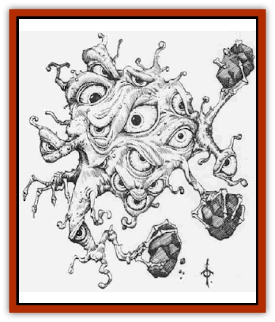

# Ghost - Casurua

| Statistic | **Ghost, Casurua** |
| --- | --- |
| **Activity Cycle:** | Any |
| **Alignment:** | Any |
| **Armor Class:** | 0 |
| **Climate/Terrain:** | Ruins |
| **Damage/Attack:** | 3d6 |
| **Diet:** | None |
| **Frequency:** | Very rare |
| **Hit Dice:** | 22 |
| **Intelligence:** | Non- (0) |
| **Magic Resistance:** | 75% |
| **Morale:** | Fearless (20) |
| **Movement:** | 0 |
| **No. Appearing:** | 1 |
| **No. of Attacks:** | 4 |
| **Organization:** | Doomed group |
| **Size:** | L to G (varies) |
| **Special Attacks:** | <a href="poltgeis.html">Poltergeist</a> powers |
| **Special Defenses:** | Invisibility |
| **THAC0:** | 5 |
| **Treasure:** | A (25% chance) |
| **XP Value:** | 15,000 |

The casurua is an undead manifestation that results from a group suffering traumatic death. It is most likely to form where a massacre has taken place, but could be found anywhere a group has suffered violent death, such as a burned-out building. The site itself acts as the focus of the casurua (this area is rarely larger than a 60-foot radius, and is often smaller: a room, a clearing, a glade, a pond, and so on).

A casurua often will be *invisible* to normal senses. Should it choose to appear or be detected by magical means, the observer sees dozens of eyes floating in the air, blazing with hate; with dozens of skeletal hands readying rocks for an attack.

**Combat:** The casurua cannot leave its focus area, and thus often can be avoided. It has the power to create the sounds of knocking and footsteps, which can be used to trick characters into entering the focus of danger. When a casurua becomes active, a graveyard stench fills the air.

The casurua attacks by flinging stones, or whatever else is available, for 3d6 points of damage per attack. If objects less dangerous than stones are hurled - tree branches, for example - the DM may lessen the damage. Likewise, if more dangerous objects are hurled - such as weapons - the damage may be increased.

Anyone encountering a casurua must save vs. paralyzation at its first attack or flee in fear for one turn.

The casurua's 75% magic resistance makes it difficult to damage it with spells, and it is highly resistant to turning. A priest of 9th to 13th level can turn one on a roll of 20, while a 14th or higher level priest can turn it on a roll of 19-20. Like other [[Ghost|ghosts]], it takes full damage from magical weapons and half damage from silver weapons.

The casurua can be permanently laid to rest after being successfully turned or reduced to 0 hit points. A priest of at least 9th level, using the proper rites, can try to lay its dead to rest. Even then, it is best to dismantle the physical surroundings (tearing down buildings, chopping down any tmes, digging up the earth, etc.) Otherwise, the casurua may become active again after a month or so has passed.

**Habitat/Society:** The casurua is a mindless entity. It is partly a ghost, formed of ectoplasm, but it is also a type of psychic recording: the trauma of multiple deaths imprinted on the physical surroundings where the deaths occurred. Thus, there is great need to break up the physical surroundings to quell the restless dead.

A casurua can form anywhere violent death occurs, especially unexpected or wrongful death. It is rarely found on a battlefield, because violent death there is expected and accepted. A casurua most often forms on a battlefield when the slain died by treachery. Casurua are most likely found on the sites of disaster, natural or otherwise. Ruins are prime habitats for casurua, especially places that were razed and looted.

**Ecology:** While most casurua attack any intelligent life that enters their area, some lie dormant until triggered by the approach of one of the same race, a relation, or a descendent of the one responsible for the deaths. It is possible for the actions of the player characters to create a casurua (for example, by exploding a high-level-fireball in a packed room); though it is unlikely that one will manifest immediately.

**Variations**

  For the most persistent casurua, special rites may be needed to lay the dead to rest. Detailed knowledge of the circumstances of the original deaths may be required. Tasks left undone may need to be completed and proof brought to the focus area. Empathic or psionic powers may be involved.

Besides adjusting damage, the number of attacks and Hit Dice of a casurua can be varied. For every 5 Hit Dice (rounded down) the casurua has one attack. A casurua with fewer than 22 Hit Dice will have weaker powers, and its experience point value should be reduced accordingly.

---
## Discovery & Documentation

**Source Publication:** Monstrous Compendium, 1995 Annual, Volume 2 (1995)
**Campaign Setting:** Advanced Dungeons & Dragons 2nd Edition
**Author(s):** Jon Pickens

### Other Creatures Found in This Source Book
   * [[Aboleth_Savant|Aboleth, Savant]]
   * [[Addazahr|Addazahr]]
   * [[Amiq_Rasol|Amiq Rasol]]
   * [[Arch-Shadow|Arch-Shadow]]
   * [[Automaton_Scaladar|Automaton, Scaladar]]
   * [[Automaton_Trobriand's|Automaton, Trobriand's]]
   * [[Bat_Sporebat|Bat, Sporebat]]
   * [[Beetle_Dragon|Beetle, Dragon]]
   * [[Bi-nou|Bi-nou]]
   * [[Boggle|Boggle]]
   * [[Brownie_Dobie|Brownie, Dobie]]
   * [[Brownie_Quickling|Brownie, Quickling]]
   * [[Cat_Crypt|Cat, Crypt]]
   * [[Cat_Great_Cath_Shee|Cat, Great, Cath Shee]]
   * [[Centaur-kin_Dorvesh|Centaur-kin, Dorvesh]]
   * [[Centaur-kin_Gnoat|Centaur-kin, Gnoat]]
   * [[Centaur-kin_Ha'pony|Centaur-kin, Ha'pony]]
   * [[Centaur-kin_Zebranaur|Centaur-kin, Zebranaur]]
   * [[Chronolily|Chronolily]]
   * [[Curst|Curst]]
   * [[Darktentacles|Darktentacles]]
   * [[Dinosaur_Aquatic|Dinosaur, Aquatic]]
   * [[Dinosaur_II|Dinosaur II]]
   * [[Dinosaur_III|Dinosaur III]]
   * [[Doppelganger_Greater|Doppelganger, Greater]]
   * [[Dragon_Brine|Dragon, Brine]]
   * [[Dragon_Half-|Dragon, Half-]]
   * [[Dragon-kin_Sea_Wyrm|Dragon-kin, Sea Wyrm]]
   * [[Dwarf_Wild|Dwarf, Wild]]
   * [[Ekimmu|Ekimmu]]
   * [[Elemental_Nature|Elemental, Nature]]
   * [[Elf_Winged|Elf, Winged]]
   * [[Fish_Great_Glacier|Fish (Great Glacier)]]
   * [[Fish_Subterranean|Fish, Subterranean]]
   * [[Fish_Toril|Fish (Toril)]]
   * [[Flareater|Flareater]]
   * [[Flumph|Flumph]]
   * [[Froghemoth|Froghemoth]]
   * [[Ghost_Ker|Ghost, Ker]]
   * [[Ghul|Ghul]]
   * [[Ghul-Kin|Ghul-Kin]]
   * [[Giant_Half-giant|Giant, Half-giant]]
   * [[Golem_Burning_Man|Golem, Burning Man]]
   * [[Golem_Phantom_Flyer|Golem, Phantom Flyer]]
   * [[Gulguthhydra|Gulguthhydra]]
   * [[Hakeashar|Hakeashar]]
   * [[Horse_Moon-|Horse, Moon-]]
   * [[Human_Dragonslayer|Human, Dragonslayer]]
   * [[Human_Vistana|Human, Vistana]]
   * [[Jellyfish_Giant|Jellyfish, Giant]]
   * [[Kalin|Kalin]]
   * [[Kholiathra|Kholiathra]]
   * [[Laerti|Laerti]]
   * [[Leucrotta_Greater|Leucrotta, Greater]]
   * [[Lich_Suel|Lich, Suel]]
   * [[Lurker_Shadow|Lurker, Shadow]]
   * [[Lycanthrope_Werepanther|Lycanthrope, Werepanther]]
   * [[Lycanthrope_Wereshark|Lycanthrope, Wereshark]]
   * [[Mammal_Herd_II|Mammal, Herd II]]
   * [[Marl|Marl]]
   * [[Meenlock|Meenlock]]
   * [[Mimic_Greater|Mimic, Greater]]
   * [[Mold_II|Mold II]]
   * [[Mummy_Creature|Mummy, Creature]]
   * [[Nyth|Nyth]]
   * [[Ooze_Slime_Jelly_Ghaunadan|Ooze/Slime/Jelly, Ghaunadan]]
   * [[Palimpsest|Palimpsest]]
   * [[Peltast|Peltast]]
   * [[Plant_Dangerous_II|Plant, Dangerous II]]
   * [[Pleistocene_Animal|Pleistocene Animal]]
   * [[Pudding_Subterranean|Pudding, Subterranean]]
   * [[Raggamoffyn|Raggamoffyn]]
   * [[Snake_Serpent|Snake, Serpent]]
   * [[Snake_Serpent_Vine|Snake, Serpent Vine]]
   * [[Sphinx_Draco-|Sphinx, Draco-]]
   * [[Sprite_Seelie_Faerie|Sprite, Seelie Faerie]]
   * [[Sprite_Unseelie_Faerie|Sprite, Unseelie Faerie]]
   * [[Squealer|Squealer]]
   * [[Turtle_Giant|Turtle, Giant]]
   * [[Umpleby|Umpleby]]
   * [[Vizier's_Turban|Vizier's Turban]]
   * [[Wall_Walker|Wall Walker]]
   * [[Webbird|Webbird]]
   * [[Yak-Man|Yak-Man]]
   * [[Zorbo|Zorbo]]
