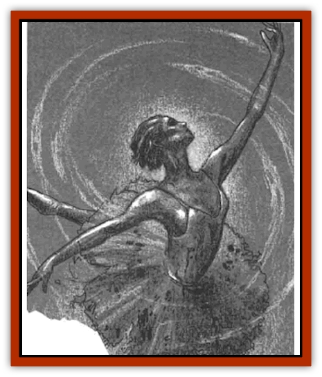

# Ghost Dancer - The

| Statistic | **Ghost Dancer, The** |
| --- | --- |
| **Activity Cycle:** | Night |
| **Alignment:** | Lawful evil |
| **Armor Class:** | 0 or 6 |
| **Climate/Terrain:** | The Nightmare Lands |
| **Damage/Attack:** | 1d8+2 &times;4 |
| **Diet:** | Special |
| **Frequency:** | Unique |
| **Hit Dice:** | 12 |
| **Intelligence:** | Exceptional (16) |
| **Magic Resistance:** | 40% |
| **Morale:** | Champion (15) |
| **Movement:** | 15 |
| **No. Appearing:** | 1 |
| **No. of Attacks:** | 4 |
| **Organization:** | Solitary |
| **Size:** | M (5½' tall) |
| **Special Attacks:** | Dance, chilling touch |
| **Special Defenses:** | +3 weapon or better to hit |
| **THAC0:** | 9 |
| **Treasure:** | A |
| **XP Value:** | 10,000 |

The Ghost Dancer is perhaps the most tragic member of the [[Nightmare_Court_The|Nightmare Court]]. As her name implies, she is an [[Ghost|incorporeal creature]] who now searches the nightmares of the living in an effort to understand her own death. Dreams inspired by guilt and shame interest her the most, drawing her with the same inescapable pull as a flame exerts over a moth.

The Ghost Dancer appears as an ethereal and strikingly beautiful young woman in her late teens or early 20s. She is translucent, with pale flesh that looks cold and dead. Her short, blond hair is as devoid of color as her alabaster skin. Above pale, full lips, her eyes are hidden beneath perpetual shadow. This grim specter wears a tattered, faded ballerina's costume. Pale blood stains cover its once-elegant designs; some shapeless splatters, others ominous hand prints that hint at foul violence in the distant past. She is as beautiful as she is insubstantial, with wisps of ghostly mist rising off her transparent form.

The Ghost Dancer never speaks. Dark bruises on her neck could indicate that she lost the capacity in whatever violent act ended her corporeal life, but the details of that event remain a mystery. She does communicate, however, through her expressive and haunting dances. Unfortunately, to view such a dance usually indicates that the Ghost Dancer has marked the audience - and those so marked rarely live long enough to tell others what they saw.

**Combat:** The Ghost Dancer does not make a habit of engaging in physical battle. When such efforts are called for, however, she has a number of offensive powers at her command. First, unless she semi-muterlalizes, she can only be attacked by dreamers or others on the Ethereal Plane. On the Ethereal or dream planes, the Ghost Dancer has an AC 6. If semi-materialized, her AC is 0. Only enchanted weapons of +3 or better can harm her.

The Ghost Dancer's preferred method of attack is her chilling touch. She can make one such attack in a round, causing 1d4 points of damage and draining 1 point of Strength from her victim. These lost Strength points are regained at a rate of 1 per day unless the victim is drained to 0 points. A victim drained to 0 Strength points becomes paralyzed and is immediately teleported to the Theater Macabre. There, the victim sits until death overcomes him and he becomes a permanent member of the audience. Such a victim perishes in a number of days equal to his Constitution score - 1d4 unless he is rescued and a *remove curse* is cast upon him. Until the curse is lifted. the victim cannot regain lost Strength points.

If pressed, the Ghost Dancer has a more lethal attack form, called the Dance Macabre. This dance is a wild yet beautiful combination of fluid movement and ghostly music. All within 30 feet of the Ghost Dancer when she begins the dance must make saving throws vs. paralyzation at -4 or be frozen in awe. The dance lasts 6 rounds and can be performed twice per day. During the dance, two ghostly scimitars appear in her hands. She makes 4 attacks per round with these blades, hitting up to four different targets.

The Ghost Dancer is considered special for purposes of turning.

**Habitat/Society:** The Ghost Dancer's area of influence is the Theater Macabre in the City of Nod.

**Ecology:** The Ghost Dancer draws energy from dreams of guilt and shame.

---
## Discovery & Documentation

**Source Publication:** The Nightmare Lands (1995)
**Campaign Setting:** Ravenloft
**Author(s):** Shane Lacy Hensley

### Other Creatures Found in This Source Book
   * [[Arcane_Head|Arcane Head]]
   * [[Dreamweaver|Dreamweaver]]
   * [[Dream_Spawn_General_Information|Dream Spawn, General Information]]
   * [[Dream_Spawn_Greater_Ennui|Dream Spawn, Greater, Ennui]]
   * [[Dream_Spawn_Lesser_Morph|Dream Spawn, Lesser, Morph]]
   * [[Human_Abber_Shaman|Human, Abber Shaman]]
   * [[Hypnos|Hypnos]]
   * [[Lost_Souls|Lost Souls]]
   * [[Morpheus|Morpheus]]
   * [[Mullonga|Mullonga]]
   * [[Nightmare_Court_The|Nightmare Court, The]]
   * [[Nightmare_Man_The|Nightmare Man, The]]
   * [[Night_Terror_Mandalain|Night Terror, Mandalain]]
   * [[Rainbow_Serpent_The|Rainbow Serpent, The]]
