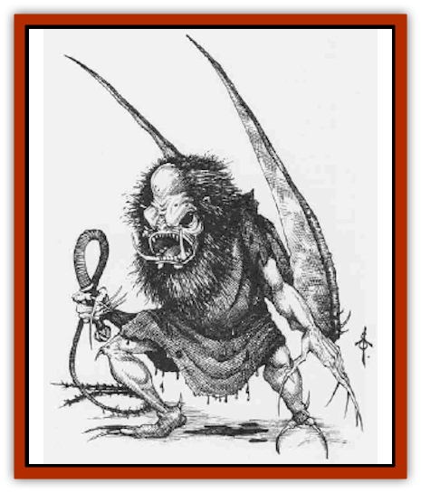

# Ghost - Ker

| Statistic | **Ghost, Ker** |
| --- | --- |
| **Activity Cycle:** | Night |
| **Alignment:** | Any evil |
| **Armor Class:** | 1 |
| **Climate/Terrain:** | Any |
| **Damage/Attack:** | 1d8 |
| **Diet:** | Carnivore |
| **Frequency:** | Very rare |
| **Hit Dice:** | 9+9 |
| **Intelligence:** | High (13-14) |
| **Magic Resistance:** | Nil |
| **Morale:** | Fearless (20) |
| **Movement:** | 12 (Fl 18 in gnat form) |
| **No. Appearing:** | 1 or 3 |
| **No. of Attacks:** | 3 |
| **Organization:** | Solitary or trio |
| **Size:** | M (5-6') |
| **Special Attacks:** | Bad luck, aging, disease |
| **Special Defenses:** | +1 or better weapon to hit |
| **THAC0:** | 11 |
| **Treasure:** | Nil |
| **XP Value:** | 7,000 |

A ker (plural, *keres*) is a malignant undead spirit that seeks revenge against the living. It looks like a horrible black winged humanoid with gleaming fangs and long, pointed nails. The ker wean bloodstained robes and carries a scourge, a wickedly barbed whip.

An attack by one ker is usually a spirit of some monster or person seeking revenge for its death. An attack by three keres is often a retaliation visited upon characters who have become overly bloodthirsty or greedy. The element of fate is prominent in most attacks by keres.

**Combat:** While an accidental encounter with a single ker is conceivable, it is far more likely that the creature is stalking a specific character. To this end, the ker can *polymorph* itself into a tiny gnat-like creature. This form has a flying movement rate of 18, but for only 6 turns. If not spotted, the ker might follow its victim and attack when the victim is otherwise occupied (such as with another combat). A ker cannot attack in gnat form; the transition takes a round.

A ker strikes three times per round with a barbed whip that, in the hands of the ker, inflicts 1d8 points of damage. Each of the attacks has a special effect in addition to damage: the first attack causes bad luck, the second causes aging, and the third causes disease. The effects of multiple hits are cumulative.

<ul><li>*Bad Luck* (first attack): The creature struck must successfully save vs petrification or all attack rolls and saving throws are penalized by -1 to -4 (roll 1d4) for 3d10 turns.</li><li>*Aging* (second attack): The creature struck must save vs. death magic or age 10d4 years immediately.</li><li>*Disease* (third attack): The creature struck must save vs. spells or be afflicted with [[Mummy|mummy]] rot. *Cure wound* spells then have no effect and wounds heal at 10% of the normal rate until the disease is cured. Each month the victim loses 2 points of Charisma, and the disease is fatal in 1 to 6 months.</li></ul>The following spells have no effect on keres: *sleep*, *charm*, *hold person*, paralysis, poison, and cold-based attacks. Electrical damage is halved.

A ker can be turned like a ghost.

The ker will fight until reduced to 0 hit points or until it has slain its victim and his or her companions. If victorious, the ker will drain the blood of its victims, tear the corpses into pieces, and devour them, even the bones. Nothing of the victims will be left to raise or resurrect.

**Habitat/Society:** Keres may have memories from when they were alive, and still may follow the dictates of their original culture. For example, a [[Giant_Hill|hill giant]] returning as a ker might have her original superstitions and mannerisms.

Sunlight does not harm keres, but they prefer to attack at night. During the day, they usually remain in some hiding place, in gnat form.

**Ecology:** Popular tradition identifies keres with evil spirits of the dead. Some cultures consider these ancestral spirits, who must be appeased by sacrifices. Entire holy days may be set aside for such sacrifices. Such a holy festival might close with the command "Out of the house, ye keres".

Otherwise, keres are attracted by extremes of bloodthirsty actions and greed. Indeed, an attack by keres may be sent by the gods as a warning or retribution.

---
## Discovery & Documentation

**Source Publication:** Monstrous Compendium, 1995 Annual, Volume 2 (1995)
**Campaign Setting:** Advanced Dungeons & Dragons 2nd Edition
**Author(s):** Jon Pickens

### Other Creatures Found in This Source Book
   * [[Aboleth_Savant|Aboleth, Savant]]
   * [[Addazahr|Addazahr]]
   * [[Amiq_Rasol|Amiq Rasol]]
   * [[Arch-Shadow|Arch-Shadow]]
   * [[Automaton_Scaladar|Automaton, Scaladar]]
   * [[Automaton_Trobriand's|Automaton, Trobriand's]]
   * [[Bat_Sporebat|Bat, Sporebat]]
   * [[Beetle_Dragon|Beetle, Dragon]]
   * [[Bi-nou|Bi-nou]]
   * [[Boggle|Boggle]]
   * [[Brownie_Dobie|Brownie, Dobie]]
   * [[Brownie_Quickling|Brownie, Quickling]]
   * [[Cat_Crypt|Cat, Crypt]]
   * [[Cat_Great_Cath_Shee|Cat, Great, Cath Shee]]
   * [[Centaur-kin_Dorvesh|Centaur-kin, Dorvesh]]
   * [[Centaur-kin_Gnoat|Centaur-kin, Gnoat]]
   * [[Centaur-kin_Ha'pony|Centaur-kin, Ha'pony]]
   * [[Centaur-kin_Zebranaur|Centaur-kin, Zebranaur]]
   * [[Chronolily|Chronolily]]
   * [[Curst|Curst]]
   * [[Darktentacles|Darktentacles]]
   * [[Dinosaur_Aquatic|Dinosaur, Aquatic]]
   * [[Dinosaur_II|Dinosaur II]]
   * [[Dinosaur_III|Dinosaur III]]
   * [[Doppelganger_Greater|Doppelganger, Greater]]
   * [[Dragon_Brine|Dragon, Brine]]
   * [[Dragon_Half-|Dragon, Half-]]
   * [[Dragon-kin_Sea_Wyrm|Dragon-kin, Sea Wyrm]]
   * [[Dwarf_Wild|Dwarf, Wild]]
   * [[Ekimmu|Ekimmu]]
   * [[Elemental_Nature|Elemental, Nature]]
   * [[Elf_Winged|Elf, Winged]]
   * [[Fish_Great_Glacier|Fish (Great Glacier)]]
   * [[Fish_Subterranean|Fish, Subterranean]]
   * [[Fish_Toril|Fish (Toril)]]
   * [[Flareater|Flareater]]
   * [[Flumph|Flumph]]
   * [[Froghemoth|Froghemoth]]
   * [[Ghost_Casurua|Ghost, Casurua]]
   * [[Ghul|Ghul]]
   * [[Ghul-Kin|Ghul-Kin]]
   * [[Giant_Half-giant|Giant, Half-giant]]
   * [[Golem_Burning_Man|Golem, Burning Man]]
   * [[Golem_Phantom_Flyer|Golem, Phantom Flyer]]
   * [[Gulguthhydra|Gulguthhydra]]
   * [[Hakeashar|Hakeashar]]
   * [[Horse_Moon-|Horse, Moon-]]
   * [[Human_Dragonslayer|Human, Dragonslayer]]
   * [[Human_Vistana|Human, Vistana]]
   * [[Jellyfish_Giant|Jellyfish, Giant]]
   * [[Kalin|Kalin]]
   * [[Kholiathra|Kholiathra]]
   * [[Laerti|Laerti]]
   * [[Leucrotta_Greater|Leucrotta, Greater]]
   * [[Lich_Suel|Lich, Suel]]
   * [[Lurker_Shadow|Lurker, Shadow]]
   * [[Lycanthrope_Werepanther|Lycanthrope, Werepanther]]
   * [[Lycanthrope_Wereshark|Lycanthrope, Wereshark]]
   * [[Mammal_Herd_II|Mammal, Herd II]]
   * [[Marl|Marl]]
   * [[Meenlock|Meenlock]]
   * [[Mimic_Greater|Mimic, Greater]]
   * [[Mold_II|Mold II]]
   * [[Mummy_Creature|Mummy, Creature]]
   * [[Nyth|Nyth]]
   * [[Ooze_Slime_Jelly_Ghaunadan|Ooze/Slime/Jelly, Ghaunadan]]
   * [[Palimpsest|Palimpsest]]
   * [[Peltast|Peltast]]
   * [[Plant_Dangerous_II|Plant, Dangerous II]]
   * [[Pleistocene_Animal|Pleistocene Animal]]
   * [[Pudding_Subterranean|Pudding, Subterranean]]
   * [[Raggamoffyn|Raggamoffyn]]
   * [[Snake_Serpent|Snake, Serpent]]
   * [[Snake_Serpent_Vine|Snake, Serpent Vine]]
   * [[Sphinx_Draco-|Sphinx, Draco-]]
   * [[Sprite_Seelie_Faerie|Sprite, Seelie Faerie]]
   * [[Sprite_Unseelie_Faerie|Sprite, Unseelie Faerie]]
   * [[Squealer|Squealer]]
   * [[Turtle_Giant|Turtle, Giant]]
   * [[Umpleby|Umpleby]]
   * [[Vizier's_Turban|Vizier's Turban]]
   * [[Wall_Walker|Wall Walker]]
   * [[Webbird|Webbird]]
   * [[Yak-Man|Yak-Man]]
   * [[Zorbo|Zorbo]]
