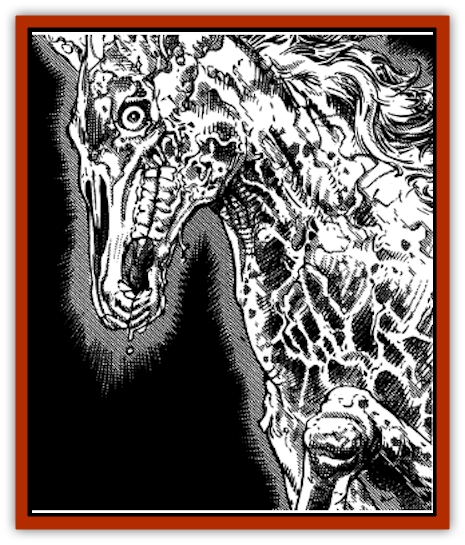

# Ghost Mount

| Statistic | **Ghost Mount** |
| --- | --- |
| **Activity Cycle:** | Night |
| **Alignment:** | Neutral evil |
| **Armor Class:** | 5 |
| **Climate/Terrain:** | Desert, plains |
| **Damage/Attack:** | 1-8/1-8/1-6 |
| **Diet:** | None |
| **Frequency:** | Very rare |
| **Hit Dice:** | 3 |
| **Intelligence:** | Low (5-7) |
| **Magic Resistance:** | Nil |
| **Morale:** | Champion (15-16) |
| **Movement:** | 30 |
| **No. Appearing:** | 1 |
| **No. of Attacks:** | 3 |
| **Organization:** | Solitary |
| **Size:** | L |
| **Special Attacks:** | See below |
| **Special Defenses:** | See below |
| **THAC0:** | 17 |
| **Treasure:** | Nil |
| **XP Value:** | 420 |

Ghost mounts are undead creatures which can help desperate or foolish travelers cover vast distances, but at a price. These beasts are aptly named, not only for their appearance, but also because those who ride a ghost mount may themselves become [[Ghost|ghosts]], doomed to wandering the deserts by night.

A ghost mount has two forms, its true form and an illusory one. A ghost mount's true form is nothing more than a transparent, glowing outline of its former self (either a [[Horse|horse]], a [[Camel|camel]], or possibly even an [[Mammal_Herd_I|antelope]]). It appears to be a malnourished, battered, and scarred wreck with wild and shining eyes. A ghost mount can also use powerful illusions to mask its true forms and appear as a particularly strong and handsome specimen of its former self.

**Combat:** A ghost mount can attack physically with its two hooves and bite, but it usually prefers to allow a rider to mount it and then seeks to use its life energy draining ability to transform the hapless rider into a ghost.

Any creature that rides a ghost mount must make an ability check using Wisdom (at a -2 penalty) when the journey begins. If the check is failed, the mount refuses to obey the rider's instructions and instead takes him deep into the nearest wilderness at full speed. Leaping from the mount when it is traveling at a gallop causes 3d6 points of damage, and items falling with the rider must make a saving throw against crushing blows. If the rider stays with the ghost mount, it will throw him after traveling at least 75 miles into the wilderness. Being thrown causes 1d6 damage; a saving throw against falling for items carried by the thrown rider must also be made.

If the initial Wisdom ability check is successful, the ghost mount obeys, but the rider must then make a saving throw versus death magic when the journey has reached a middle point. Failure indicates that the ghost mount's life energy drain has transformed the rider into a [[Wraith|wraith]]. Success indicates that the rider has mastered the ghost mount and may travel with it to his destination. Once the journey is ended, the rider must set the ghost mount free, though he may then summon it to service again whenever he wishes. Later journeys carry the same risks as the first.

Ghost mounts are unaffected by *sleep*, *charm*, *hold*, death, and cold-based magic, and they are immune to poison and paralyzation. A vial of *holy water* causes 2-8 points of damage to a ghost mount. A *raise dead* or *resurrection* spell will kill a ghost mount if it fails its saving throw versus spell.

Ghost mounts seem to glide just over the ground without ever losing their footing, so they always move at their full movement rate over all forms of terrain. They suffer no penalty due to encumbrance because their undead forms do not suffer from fatigue. They have no need for sleep or rest of any kind. A rider willing to lash himself to the saddle can use a ghost mount to travel as much as 180 miles per day over any terrain in any weather (once control over a ghost mount is established, of course). A rider may also elect to cover only 90 miles per day and sleep at night, even if several days travel are required to reach the destination. During this time, and throughout any number of stops, the ghost mount will continue to obey its rider.

**Habitat/Society:** Ghost mounts are formed from the spirits of mistreated [[Ghost_Animal|animals]], creatures so brutally handled in life that they survive after death to take vengeance on all creatures who ride them.

Ghost mounts can be summoned by magic, though their lifedraining abilities are not altered if they are called to serve in this fashion. If a *mount* spell is cast in a region of empty, uncivilized desert or plains, there is a 5% chance that a ghost mount will answer the magical summons.

Ghost mounts are sometimes found among herds of ordinary wild animals, covered in their illusory life forms. In this way they hope to be captured and ridden, thus allowing them to bring more living creatures into the realm of the undead.

**Ecology:** Ghost mounts do not live or reproduce in any normal fashion. When injured, their forms remain marred until they are repaired by the use of an *animate dead* spell. The passage of time also allows them to recover their negative planar energy, but this form of rejuvenation does not restore their original appearance.

Riders transformed into wraiths by a ghost mount cannot be restored to their normal form by any means short of a *wish*.

---
## Discovery & Documentation

**Source Publication:** MC13 Al-Qadim Appendix (1992)
**Campaign Setting:** Al-Qadim (Forgotten Realms)
**Author(s):** C. Terry Phillips

### Other Creatures Found in This Source Book
   * [[Ammut|Ammut]]
   * [[Ashira|Ashira]]
   * [[Asuras|Asuras]]
   * [[Black_Cloud_of_Vengeance|Black Cloud of Vengeance]]
   * [[Buraq|Buraq]]
   * [[Camel|Camel]]
   * [[Camel_of_the_Pearl|Camel of the Pearl]]
   * [[Centaur_Desert|Centaur, Desert]]
   * [[Copper_Automaton|Copper Automaton]]
   * [[Debbi|Debbi]]
   * [[Elephant_Bird|Elephant Bird]]
   * [[Gen|Gen]]
   * [[Genie_Noble_Dao|Genie, Noble Dao]]
   * [[Genie_Noble_Djinni|Genie, Noble Djinni]]
   * [[Genie_Noble_Efreeti|Genie, Noble Efreeti]]
   * [[Genie_Noble_Marid|Genie, Noble Marid]]
   * [[Genie_Tasked_Architect_Builder|Genie, Tasked, Architect/Builder]]
   * [[Genie_Tasked_Artist|Genie, Tasked, Artist]]
   * [[Genie_Tasked_Guardian|Genie, Tasked, Guardian]]
   * [[Genie_Tasked_Herdsman|Genie, Tasked, Herdsman]]
   * [[Genie_Tasked_Slayer|Genie, Tasked, Slayer]]
   * [[Genie_Tasked_Warmonger|Genie, Tasked, Warmonger]]
   * [[Genie_Tasked_Winemaker|Genie, Tasked, Winemaker]]
   * [[Ghul|Ghul]]
   * [[Giant_Desert|Giant, Desert]]
   * [[Giant_Jungle|Giant, Jungle]]
   * [[Giant_Reef|Giant, Reef]]
   * [[Giant_Zakhara_General_Information|Giant (Zakhara), General Information]]
   * [[Hama|Hama]]
   * [[Heway|Heway]]
   * [[Living_Idol|Living Idol]]
   * [[Lycanthrope_Werehyena|Lycanthrope, Werehyena]]
   * [[Lycanthrope_Werelion|Lycanthrope, Werelion]]
   * [[Markeen|Markeen]]
   * [[Maskhi|Maskhi]]
   * [[Mason_Wasp_Giant|Mason Wasp, Giant]]
   * [[Nasnas|Nasnas]]
   * [[Pahari|Pahari]]
   * [[Rom|Rom]]
   * [[Sabu_Lord|Sabu Lord]]
   * [[Sakina|Sakina]]
   * [[Serpent_Lord|Serpent Lord]]
   * [[Serpent_Winged|Serpent, Winged]]
   * [[Silat|Silat]]
   * [[Simurgh|Simurgh]]
   * [[Stone_Maiden|Stone Maiden]]
   * [[Vishap|Vishap]]
   * [[Zaratan|Zaratan]]
   * [[Zin|Zin]]
