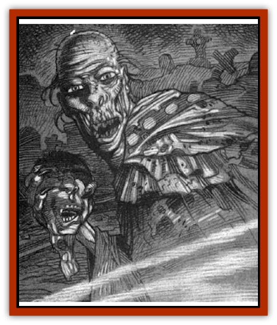

# Ghoul - Ghast - Jugo Hesketh

| Statistic | **Ghoul, Ghast, Jugo Hesketh** |
| --- | --- |
| **Activity Cycle:** | Night |
| **Alignment:** | Chaotic evil |
| **Armor Class:** | 4 |
| **Climate/Terrain:** | Tepest |
| **Damage/Attack:** | 1-4 (1d4)/1-4 (1d4)/1-8 (1d8) |
| **Diet:** | Corpses |
| **Frequency:** | Unique |
| **Hit Dice:** | 4 (24 hp) |
| **Intelligence:** | Very (11) |
| **Magic Resistance:** | Nil |
| **Morale:** | Elite (13) |
| **Movement:** | 15 |
| **No. Appearing:** | 1 |
| **No. of Attacks:** | 3 |
| **Organization:** | Pack |
| **Size:** | M (6'3&rdquo; tall) |
| **Special Attacks:** | Paralysis |
| **Special Defenses:** | Stench |
| **THAC0:** | 17 |
| **Treasure:** | Q,R,S,T (B) |
| **XP Value:** | 650 |

Long ago, Hesketh was a senior priest in the cult of the false god Zhakata led by Yagno Petrovna, the lord of G'henna. As Petrovna's chief Inquisitor, among his horrid duties were dreadful arts of torture and sacrifice; secretly, he practiced cannibalism on the corpses of his hapless victims. Over the years, these unholy practices warped his soul and, upon his death, transformed him into an undead fiend.

Prior to his demise, Hesketh was a tall, slender man. He had sparse black hair and piercing dark eyes that seemed to look deep into the hearts of those he met. He was congenial and polite, if inwardly sinister, and quite possibly the most charismatic man in G'henna.

The accident which claimed Hesketh's life and the terrible transformation to undeath has left his appearance greatly altered. His skin, now dried and mummified, has drawn tight over the bones and turned a sickly grey-green. His fingernails are long and black, taking on the appearance of dreadful claws. His tongue has grown long and rasp-like, perfect for drawing the marrow out of bones. Hesketh's eyes gleam in the dark with a searing red not unlike the glow of a burning ember; his teeth are sharp, black, and utterly deadly.

Whatever languages Hesketh knew in life have been forgotten in death. He communicates with the ghouls that follow him through guttural grunts and growls. It might be possible to speak to Hesketh with magical means, but this is mere speculation; to date, no one has tried - no one who survived, at any rate.

**Combat:** While much of Hesketh's brilliant intellect has been lost, he retains a cruel and deadly cunning. When he attacks, he does so savagely, with tooth and claw. Each of his two claw attacks does 1d4 points of damage; the horrible bite does 1d8 points. Anyone injured by Hesketh must make a Saving Throw vs. Paralysis or be unable to move for 5-10 (1d4+6) rounds. This affects all humans and demihumans, including elves. A priest can free anyone stricken with this curse by means of a *remove paralysis* spell.

As a [[Ghoul|ghast]], Hesketh gives off a foul odor of rotting flesh. Anyone who comes within 10 feet of him must make a Saving Throw vs. Poison or become so ill that he or she suffers a -2 penalty at all attack rolls for the duration of the combat.

Hesketh is not without his vulnerabilities. He can be harmed by any weapon, be it magical or mundane, and weapons forged of cold iron will inflict double damage with each hit. He can be turned by clerics of high enough level (at least third) and can be held at bay with a *protection from evil* spell so long as powdered iron is used in its casting.

Hesketh leads a band of common [[Ghoul|ghouls]], and he is seldom encountered wihtout 1-4 of these loathsome creatures in his company.

Any human or demihuman slain by Hesketh will become a ghoul; only if the body is *blessed* is this horrible fate averted. If the victim is *raised* or *resurrected* without being *blessed*, he or she will rise at once as a ravening ghoul. Of course, if the body is destroyed - for example, if Hesketh and his associates eat their victim - it cannot become a ghoul.

Hesketh is immune to all manner of *sleep* and *charm* spells. Poisons and diseases cannot harm him, and the dark powers have even granted him imunity to the touch of holy water.

**Habitat/Society:** Jugo Hesketh was, in life, a high-rank ing priest in the service of Yagno Petrovna, the lord of G'Henna. Jugo Hesketh was the first man Petrovna encountered when he first left Barovia and entered G'henna in 702. The two became friends, primarily because of Petrovna's *charm* ability, and worked together to forge the cult of Zhakata. They spent months travelling through the newly formed domain, gathering loyal followers to their false religion. Once the cult was well-established, Yagno installed his trusted lieutenant as its chief Inquisitor, responsible for seeking out unbelievers and doubters ("blasphemers�); many a visitor to G'Henna escaped Zhakata's altars only to wind up in the inquisition's dungeon ("question chambers").

As the years passed, one of Hesketh's primary responsibilities was the conducting of secret and terrible rituals designed to gain the favor of the false god Zhakata. These obscene services frequently ended with gruesome acts of sacrifice and cannibalism. It is said that more than half of the pitiful [[Mongrelman|mongrelmen]] who roamed the Outlands of G'Henna were captured and brought to a grisly death: at Hesketh's hands.

Then, in 725, Hesketh met with an unfotunate mishap. He and a nulmber of his acolyte followers were scouring the wilds around Dervich for a family suspected of blasphemy. It was Hesketh's mission to apprehend these fugitives and bring them before Petrovna for transformation into mongrelmen.

Hesketh found the family attempting to flee north into Darkon. With the aid of his servants, he captured the whole clan and threw them in chains. The prisoners were tossed into a wagon and Hesketh began to lead them back to Zhukar, where they would meet their ghastly fate.

Shortly after the conveyance passed the half-way point in the trek, it was attacked by a band of mongrelmen. They had no idea who was in the wagon, thinking only that they might find food and useful equipment. When they discovered that fate had delivered the hated Jugo Hesketh into their hands, they were ecstatic. The acolytes tried to defend their master but were torn apart by the attackers. The mongrelmen freed the chained prisoners who, it is said, managed to make good their escape into Darkon, where they lived out the rest of their days.

Hesketh, however, was not so lucky. The vengeful mongrelmen carried their prisoner deep into the heart of the G'hennan Outland, where he was slowly tortured to death. His body was then tied to a raft and set adrift upriver of Zhukar.

When the raft arrived in the city, it was empty. But the bloodstains and clothes found on it were more than enough to convince Petrovna that his friend and follower had been killed. Enraged, the lord of G'henna ordered a brutal pogrom against the mongrelmen south of the city. It is unknown how many of the pitiful creatures were killed, or how many of Yagno's own men were slain in turn, before the carnage came to an end.

In the weeks following Hesketh's death, however, reports began to arise that the bodies of the slain acolytes returned from the slaughter for burial rites were being disfigured in their crypts.

Shocked, Petrovna decided to investigate the matter for himself. Much to his horror, he discovered that the half-eaten corpses were the work of his old friend, now an undead monster. For all his sinister evils, Yagno Petrovna could not bring himself to destroy his former friend, even in the terrible form he had assumed. Instead, he drove the creature out, forcing him to flee into the wilds of Tepest.

**Ecology:** When Hesketh died, a terrible curse fell upon him. The origins of this curse may lie in his own taste for human flesh or in the dying oaths of his countless victims. Whatever the source, this curse saw him transformed into a foul thing of the night. Hesketh now roams the lands of Tepest, searching eternally for flesh to satisfy his unnatural hunger.

Over the years, he has created a band of dreadful undead who follow him loyally. With these sickening acolytes, he seeks out and devours the newly dead.

While Hesketh and his minions do not go forth by day, they are not injured by sunlight. They tend to make their lair in places of death where they hunt for a few weeks before moving on. Often, they leave one or more ghouls behind which must be hunted down and destroyed if evidence of their passing is to be erased.

---
## Discovery & Documentation

**Source Publication:** Ravenloft Appendix II: Children of the Night (1991)
**Campaign Setting:** Ravenloft
**Author(s):** William W. Connors

### Other Creatures Found in This Source Book
   * [[Brain_Living|Brain, Living]]
   * [[Ermordenung_Nostalia_Romaine|Ermordenung, Nostalia Romaine]]
   * [[Golem_Half-|Golem, Half-]]
   * [[Golem_Mechanical_Ahmi_Vanjuko|Golem, Mechanical, Ahmi Vanjuko]]
   * [[Human_Cursed_Jacqueline_Montarri|Human, Cursed (Jacqueline Montarri)]]
   * [[Human_Madman_The_Midnight_Slasher|Human, Madman (The Midnight Slasher)]]
   * [[Human_Voodan|Human, Voodan]]
   * [[Lich_Bardic|Lich, Bardic]]
   * [[Lycanthrope_Weretiger_Jahed|Lycanthrope, Weretiger (Jahed)]]
   * [[Meazel_Salizarr|Meazel (Salizarr)]]
   * [[Medusa_Ravenloft|Medusa (Ravenloft)]]
   * [[Mummy_Greater_Senmet|Mummy, Greater, Senmet]]
   * [[Night_Hag_Styrix|Night Hag, Styrix]]
   * [[Spectre_Jezra_Wagner|Spectre, Jezra Wagner]]
   * [[Thrax_Pelik|Thrax (Pelik)]]
   * [[Treant_Evil_Blackroot|Treant, Evil (Blackroot)]]
   * [[Vampire_Eastern_Mayónaka|Vampire, Eastern (Mayónaka)]]
   * [[Vampire_Illithid_Athaekeetha|Vampire, Illithid (Athaekeetha)]]
   * [[Vampyre_Vladimir_Ludzig|Vampyre (Vladimir Ludzig)]]
