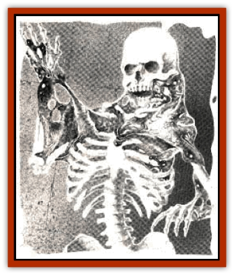

# Ghoul - Goop

| Statistic | ** Ghoul, Goop** |
| --- | --- |
| **Activity Cycle:** | Any |
| **Alignment:** | Neutral |
| **Armor Class:** | 7 |
| **Climate/Terrain:** | Any underground |
| **Damage/Attack:** | By weapon type |
| **Diet:** | Carnivore |
| **Frequency:** | Rare |
| **Hit Dice:** | 2 |
| **Intelligence:** | Low (5-7) |
| **Magic Resistance:** | Nil |
| **Morale:** | Steady (11-12) |
| **Movement:** | 1 (12 on skeleton, 6 otherwise) |
| **No. Appearing:** | 1 (5%: 2 or more) |
| **No. of Attacks:** | 1 |
| **Organization:** | Solitary |
| **Size:** | M (4' diameter) |
| **Special Attacks:** | Paralysis, dissolving |
| **Special Defenses:** | Disguise, immune to electricity, resistant to cold |
| **THAC0:** | 19 |
| **Treasure:** | Nil |
| **XP Value:** | 975 |

A goop [[Ghoul|ghoul]] is an amoeba-like creature similar to a [[Pudding_Deadly|black pudding]] or [[Ooze_Slime_Jelly_II|gray ooze]]. It is a translucent blob capable of only limited movement itself. However, when a goop ghoul flows over a skeleton (a normal one, not the undead type), it can attach itself to the bones like muscles and ligaments, and thus use the skeleton as a means of transportation. In this way the goop ghoul gains a movement rate of 12. A goop ghoul is usually encountered mounted on a skeleton, thus being 80% likely to be mistaken for an [[Skeleton|undead skeleton]] or deteriorated [[Zombie|zombie]] (the stretched-out goop ghoul being seen as rotted tissue).

**Combat:** A goop ghoul attached to a skeleton is able to use simple hand-held weapons but cannot employ shields or metallic armor. In addition, the touch of a goop ghoul causes paralysis for 4-16 rounds unless a successful save vs. paralysis is made, Once a victim is paralyzed, the goop ghoul flows over him in one round, and its acidic secretions eat away flesh at the rate of 1d8 hp per round. This damage occurs only when a victim is totally engulfed, as the acid is rather weak in small quantities. For this reason, the goop ghoul cannot employ its acid as an attack in melee. If a victim regains movement before being dissolved, he may throw off the goop ghoul and flee, being immune to goop-ghoul paralysis for one full day.

As the flesh is eaten away from the goop ghoul's victim, the creature increases in size from its feast. By the time the skeleton has been picked clean, the goop ghoul will have doubled its size and be ready to split into two normal-sized goop ghouls, a process that takes only one round. Whichever of the two is closest to the freshly stripped skeleton will generally claim it for movement purposes. It takes one round for a goop ghoul to attach itself to a skeleton in such a way as to be able to manipulate it.

A goop ghoul is immune to electrical attacks. Cold-based attacks do only half damage, but a goop ghoul is very susceptible to fire and great heat (taking double damage), and shuns them. A goop ghoul engaged in dissolving the flesh off a paralyzed victim can be removed by applying flame. Similarly, a *heal* or *cure disease* spell also makes a goop ghoul withdraw from a victim, though such spells cause no harm to the monster.

It must be emphasized that as a goop ghoul is not undead, it cannot be turned by priests. However, it is possible for a goop ghoul to latch onto an undead, animated skeleton. In this case, the goop ghoul has no control over the skeleton's movement and is more or less just along for the ride. It would be possible for a priest to turn the undead skeleton, but the goop ghoul would be free to "abandon skeleton" and seek out a new source of transportation (probably the priest). Also, a goop ghoul is not confined to human or even humanoid skeletons; any two- or four-legged skeleton can be used, subject to size constraints of about 3' to 9', beyond which the goop ghoul is either too bunched up for fluid movement or stretched too thin. In any case, the movement rate when using any sort of skeleton remains 12.

On rare occasions, a goop ghoul can attach itself to sturdy rodlike objects that allow movement of the sort it is used to. Thus, several large sticks might be used as a "skeleton" of sorts, good enough for half-normal movement. Weapons might thus be held together by the goop ghoul, so that a party might encounter a pile of swords stumping its way toward them. These attempts are rare, as a goop ghoul prefers the use of skeletons above all else.

Any being slain and dissolved by a goop ghoul cannot be raised from the dead without the use of a *wish* spell, though the skeleton is fit for use with an *animate dead* spell.

**Habitat/Society:** Goop ghouls are found exclusively underground; they dislike sunlight as it slowly dries out their skins. They are solitary creatures, having no real social systems. If more than one are encountered at a time, more than likely it is because a large goop ghoul has just divided into two (or more, depending on the size of the victim - an ogre can provide enough flesh for a goop ghoul to split into three).

**Ecology:** Goop ghouls have no concept of money and so keep no treasure. They cannot dissolve metal, and metallic armor is too heavy for them to move around in. For this reason, they prefer to attack victims who aren't wearing metallic armor. Many valuables are often left behind when a goop ghoul acquires a new skeleton, as all the goop ghoul is interested in is the skeleton itself and maybe a hand weapon.

Goop ghouls are rare enough to be of little consequence unless a large number of them are present. They are fairly predatory but can go for days without eating, and they are also satisfied with scavenging.

---
## Discovery & Documentation

**Source Publication:** Dragon198 (1993)
**Campaign Setting:** Dragon Magazine
**Author(s):** 

### Other Creatures Found in This Source Book
   * [[Angreden|Angreden]]
   * [[Ka|Ka]]
   * [[Vartha|Vartha]]
   * [[Wight_King-|Wight, King-]]
   * [[Wraith-King|Wraith-King]]
