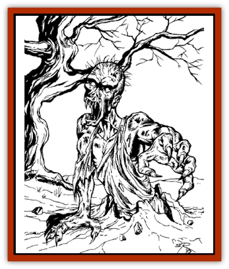

# Ghoul - Kleshite

| Statistic | ** Ghoul, Kleshite** |
| --- | --- |
| **Activity Cycle:** | Any |
| **Alignment:** | Chaotic evil |
| **Armor Class:** | 5 |
| **Climate/Terrain:** | Jungle (Klesh) |
| **Damage/Attack:** | 1-4/1-4/1-8 |
| **Diet:** | Carnivore |
| **Frequency:** | Rare |
| **Hit Dice:** | 3 |
| **Intelligence:** | Low (5-7) |
| **Magic Resistance:** | Nil |
| **Morale:** | Steady (11-12) |
| **Movement:** | 12, Br 12 |
| **No. Appearing:** | 2-16 |
| **No. of Attacks:** | 3 |
| **Organization:** | Pack |
| **Size:** | L (5-6' tall) |
| **Special Attacks:** | Paralyzation, surprise |
| **Special Defenses:** | Nil |
| **THAC0:** | 17 |
| **Treasure:** | B,V |
| **XP Value:** | 270 |

"Hast ever heart," the tall Northerner intones, "of those sinuous earth-hued tropical Kleshite ghouls with hands like spades that burrow beneath cemeteries and their environs, silently emerge behind you, then seize you and drag you down before you can gather your wits to oppose it, digging more softly than the armadillo? One such, it's said, subterraneously pursued the man whose house lay by a lich-field and took him in his own cellar."

**Combat:** Kleshite ghouls burrow underground, emerge unexpectedly beneath their victims, and attempt to drag them down to be consumed later. They automatically attack with surprise and cause paralysis as a normal ghoul. Victims of a Kleshite ghoul do not rise as [[Ghoul|ghouls]] themselves.

**Habitat/Society:** Kleshite ghouls live in chaotic packs, with the strongest getting the lion's share of any prey. These filthy creatures are not above consuming their own fellows if they get too hungry.

**Ecology:** Graveyard scavengers and predators, Kleshite ghouls are feared throughout the south of Nehwon. They serve no real ecological function and are exterminated wherever they are found.

---
## Discovery & Documentation

**Source Publication:** Lankhmar: City of Adventure (2nd Ed.) (1993)
**Campaign Setting:** Lankhmar
**Author(s):** Bruce Nesmith, Douglas Niles, and Ken Rolston

### Other Creatures Found in This Source Book
   * [[Astral_Wolf|Astral Wolf]]
   * [[Behemoth|Behemoth]]
   * [[Bird_of_Tyaa|Bird of Tyaa]]
   * [[Cat_War|Cat, War]]
   * [[Cloaker_Sea|Cloaker, Sea]]
   * [[Cold_Woman|Cold Woman]]
   * [[Devourer_Lankhmar|Devourer (Lankhmar)]]
   * [[Ghoul_Lankhmar|Ghoul (Lankhmar)]]
   * [[Gladiator_Lizard|Gladiator Lizard]]
   * [[Horag|Horag]]
   * [[Howler|Howler]]
   * [[Ice_Gnome|Ice Gnome]]
   * [[Invisible_of_Stardock|Invisible of Stardock]]
   * [[Lizard|Lizard]]
   * [[Ophidian|Ophidian]]
   * [[Ray_Invisible_Flying|Ray, Invisible Flying]]
   * [[Scorpion|Scorpion]]
   * [[Simorgyan|Simorgyan]]
   * [[Snow_Serpent|Snow Serpent]]
   * [[Thunder_Children|Thunder Children]]
   * [[Wraith-Spider|Wraith-Spider]]
   * [[Zombie_Sea|Zombie, Sea]]
