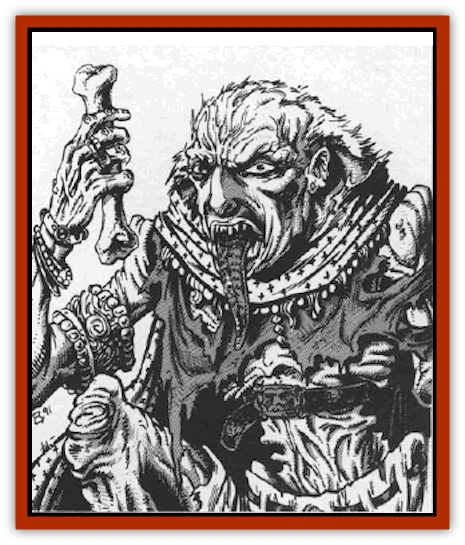

# Ghoul Lord

| Statistic | ** Ghoul Lord** |
| --- | --- |
| **Activity Cycle:** | Night |
| **Alignment:** | Chaotic evil |
| **Armor Class:** | 4 |
| **Climate/Terrain:** | Any land |
| **Damage/Attack:** | 1d6/1d6/1d10 |
| **Diet:** | Corpses |
| **Frequency:** | Very rare |
| **Hit Dice:** | 6 |
| **Intelligence:** | High (13-14) |
| **Magic Resistance:** | Nil |
| **Morale:** | Elite (13-14) |
| **Movement:** | 15 |
| **No. Appearing:** | 1 |
| **No. of Attacks:** | 3 |
| **Organization:** | Solitary |
| **Size:** | M (6' tall) |
| **Special Attacks:** | See below |
| **Special Defenses:** | See below |
| **THAC0:** | 15 |
| **Treasure:** | Q,R,S,T (B) |
| **XP Value:** | 3,000 |

It is hard to imagine a more frightening creature than the dreaded ghoul lord. Lurking in places thick with the stench of death, the ghoul lord feasts upon the flesh of living and dead alike, often surrounding itself with a band of lesser undead that obey its every command.

The ghoul lord looks much like the common [[Ghoul|ghoul]] or [[Ghoul|ghast]]. It retains some semblance of its human form, but its skin has turned the sickly grey of rotting meat, its tongue has grown long and rasped, and its teeth and nails have become sharp and wicked instruments ideal for rending flesh and cracking bone.

Ghoul lords can speak the languages they knew prior to their death and transformation into the unread. When commanding their ghoul and ghast minions, however, they do not speak, but employ a telepathic xnse that defies mortal languages.

The ghoul lord looks so much like a ghoul that it is 90% likely that it will be mistaken for such a creature even by those familiar with the undead. The true nature of these beasts becomes apparent, however, as soon as they spring into combat.

When a ghoul lord strikes with its long, cruel claws it inflicts 1d6 points of damage with each blow that lands. In addition, it can also bite with its deadly teeth, scoring 1d10 points of damage with each hit. Those hit by the creatures claws must save vs. paralysis or become unable to move for 1d6+6 rounds. Even elves are not immune to this effect.

The bite of a ghoul lord causes the victim to contract a horrible rotting disease unless a saving throw vs. poison is made. Those afflicted with this illness will lose 1d10 hit points and 1 point from their Constitution and Charisma scores each day. If either ability score or their hit point totals reach 0, the person dies. If the body is not destroyed, they will rise as a ghast on the third night after their death. In such a state, they are wholly under the command of the creature that made them until such time as that horror is destroyed. At that point, they become free-willed creatures.

The rotting disease can be cured by nothing less than a *heal* spell. Once the progression of the disease is halted, the victim's Constitution score will return to its original value at the rate of 1 point per week. Their Charisma, however, will remain at its reduced level because of the horrible scars this ailment leaves on both body and soul.

Like other undead of their ilk, ghoul lords are immune to the effects of sleep and charm spells. They are not harmed by holy water or contact with holy symbols, but can be turned as if they were 7 HD monsters. Ghoul lords are immune to damage from all but magical weapons or those forged of pure iron. A *circle of protection* has no effect on these creatures unless cold iron is used in its casting. Even then, the ghoul lord has a 10% chance per round of overcoming the effects of the spell and striking freely at those allegedly protected by it.

Ghoul lords do not radiate the foul odor associated with ghasts, but they do fairly reck of evil. In fact, this effect is so potent that those of good alignment suffer a -4 on all attack rolls when within 30 feet of these creatures. In addition, all persons who are forced to make a fear or horror check because of an encounter with a ghoul lord must do so with a -2 penalty on their die roll because of the creature's evil nature. A *remove fear* spell will negate the effects of this foul aura.

**Habitat/Society:** The ghoul lord is a foul creature found, thankfully, only in the demiplane of Ravenloft. It tends to dwell in isolated places rife with the odor of death; graveyards and ruins are its favorite haunts.

Ghoul lords always have a following of lesser undead with them. These minions act under telepathic command from the ghoul lord and are absolute in their loyalty to him. A ghoul lord's band will consist of 2-12 (2d6) ghasts, each of which commands 28 (2d4) ghouls.

**Ecology:** Ghoul lords are unique to the demiplane of Ravenloft. It is rumored that they were first created at the hands of an insane necromancer in some other dimension, but that they were so evil as to instantly draw the attention of the Dark Powers. The Mists of Ravenloft absorbed all of the existing ghoul lords and scattered them across the domains.

There are those who insist that the necromancer has also been transported to Ravenloft and that it is his twisted soul that rules the Nightmare Lands. Of course, no proof of this has ever been found.

---
## Discovery & Documentation

**Source Publication:** MC10 Ravenloft Appendix I (1989)
**Campaign Setting:** Planescape
**Author(s):** William W. Connors

### Other Creatures Found in This Source Book
   * [[Bastellus|Bastellus]]
   * [[Bat_Ravenloft|Bat (Ravenloft)]]
   * [[Bowlyn|Bowlyn]]
   * [[Broken_One|Broken One]]
   * [[Bussengeist|Bussengeist]]
   * [[Darkling|Darkling]]
   * [[Doom_Guard|Doom Guard]]
   * [[Doppelganger_Plant|Doppelganger Plant]]
   * [[Elemental_Ravenloft|Elemental (Ravenloft)]]
   * [[Ermordenung|Ermordenung]]
   * [[Goblyn|Goblyn]]
   * [[Golem_III|Golem III]]
   * [[Golem_IV|Golem IV]]
   * [[Golem_Ravenloft|Golem (Ravenloft)]]
   * [[Grim_Reaper|Grim Reaper]]
   * [[Human_Abber_Nomad|Human, Abber Nomad]]
   * [[Human_Ravenloft|Human (Ravenloft)]]
   * [[Imp_Assassin|Imp, Assassin]]
   * [[Impersonator|Impersonator]]
   * [[Lycanthrope_Werebat|Lycanthrope, Werebat]]
   * [[Lycanthrope_Wereraven|Lycanthrope, Wereraven]]
   * [[Mist_Horror|Mist Horror]]
   * [[Mummy_Greater|Mummy, Greater]]
   * [[Quevari|Quevari]]
   * [[Quickwood|Quickwood]]
   * [[Ravenkin|Ravenkin]]
   * [[Reaver|Reaver]]
   * [[Scarecrow_Ravenloft|Scarecrow (Ravenloft)]]
   * [[Shadow_Fiend|Shadow Fiend]]
   * [[Skeleton_Giant|Skeleton, Giant]]
   * [[Strahd's_Skeletal_Steed|Strahd's Skeletal Steed]]
   * [[Treant_Evil|Treant, Evil]]
   * [[Treant_Undead|Treant, Undead]]
   * [[Valpurgeist|Valpurgeist]]
   * [[Vampire_Dwarf|Vampire, Dwarf]]
   * [[Vampire_Elf|Vampire, Elf]]
   * [[Vampire_Gnome|Vampire, Gnome]]
   * [[Vampire_Halfling|Vampire, Halfling]]
   * [[Vampire_General_Information|Vampire, General Information]]
   * [[Vampire_Kender|Vampire, Kender]]
   * [[Vampyre|Vampyre]]
   * [[Widow_Red|Widow, Red]]
   * [[Wolfwere_Greater|Wolfwere, Greater]]
   * [[Zombie_Lord|Zombie Lord]]
