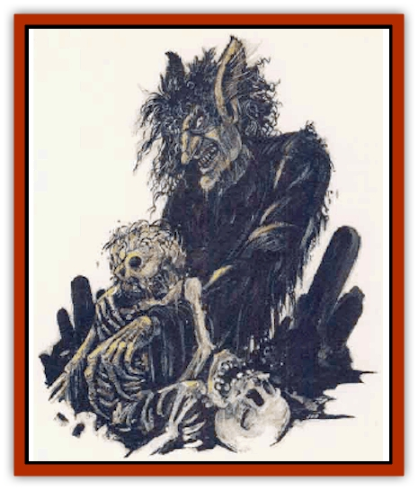

# Ghul

| Statistic | **Great** | **Lesser** |
| --- | --- | --- |
| **Activity Cycle:** | Night | Night |
| **Alignment:** | Neutral evil | Neutral evil |
| **Armor Class:** | 0 | 2 |
| **Climate/Terrain:** | Desert, mountains | Desert, mountains |
| **Damage/Attack:** | 1-6/1-6/2-12 | 1-4/1-4/2-8 |
| **Diet:** | Scavenger | Scavenger |
| **Frequency:** | Rare | Very rare |
| **Hit Dice:** | 4 | 3 |
| **Intelligence:** | High (13-14) | Average (8-10) |
| **Magic Resistance:** | Nil | Nil |
| **Morale:** | Average (8-10) | Average (8-10) |
| **Movement:** | 18 (Br 3 or Cl 12) | 12 (Br 1 or Cl 3) |
| **No. Appearing:** | 1-3 | 1-3 |
| **No. of Attacks:** | 3 | 3 |
| **Organization:** | Pack | Solitary or pack |
| **Size:** | M (7-10') | M (5-6') |
| **Special Attacks:** | Magic use, shapeshifting | Magic use, shapeshifting |
| **Special Defenses:** | Spell immunities, +1 weapon to hit | Spell immunities, +1 weapon to hit |
| **THAC0:** | 15 | 17 |
| **Treasure:** | C | B |
| **XP Value:** | Common: 1,400 / 1st- to 4th-level mage: 2,000 / 5th- to 7th-level mage: 3,000 | 975 |

The great ghuls are undead elemental cousins of the [[Genie|genies]], the most wicked members of an inferior order of [[Genie|jann]]. They haunt burial grounds and feed on dead human bodies. They are usually female, and all great ghuls are beguiling and seductive shapechangers. No matter what form they take, however, their feet always remain those of a donkey, though they often wear special boots or long robes to conceal this aberration. Ghuls delight in devouring the flesh of their victims and then sucking the marrow from the bones.

Great ghuls have thick hair and bushy eyebrows that often droop over their eyes. Their hands end in clawed fingers, and their feet and sometimes their ears are those of a donkey. Their jaws jut out and are powerfully muscled. Their pale white skin is always cold and clammy, and they have the hunched posture of their lesser cousins. Great ghuls are aware of how their looks repulse other creatures and are eager to disguise their true appearance with cosmetics, clothes, and jewelry. While most great ghuls stand over 7' tall, those that are mages typically stand about 10' tall. In their polymorphed form they are often smaller.

**Combat:** Great ghuls attack with their claws and their powerful jaws. They can only be struck by magical weapons. Great ghuls can use each of the following spell-like abilities at will: *bestow invisibility*, *polymorph self*, and *shocking grasp*.

Like most undead, great ghuls are immune to *sleep*, *charm*, *hold*, and cold-based magic. They are not affected by paralyzation or poison. Great ghuls can be turned as ghasts, and mage ghuls are turned as wraiths. They suffer 2-12 points of damage from holy water, and they suffer a -1 to their attack rolls in daylight.

Only jann slain by great ghuls become ghuls themselves; all other races are simply slain and devoured.

About one in every six great ghuls is a mage of up to 7th level of ability. Great ghuls may even become sha'ir, thus gaining some measure of power over other genies. Other great ghuls study the magical provinces of flame, sand, and wind. Ghuls who study the magic of the sea are extremely rare. All ghuls are immune to the binding and capturing powers of the sha'ir.

**Habitat/Society:** Great ghuls live in seclusion in ruins or caves found in the emptiest deserts or on the highest mountains. Because of their sharp claws and incredible strength, great ghuls from the mountains are able to climb sheer rock walls that would daunt most mountaineers. Desert ghuls are not as adept at this, but can dig through sand or soft stones. All ghuls take only half damage from falls.

Great ghuls are fond of all forms of perfumes and scents, such as attar of orange, rosewater, cloves, and so on. They use these to cover their own unpleasant smell.

Great ghul mages are solitary creatures, though other great ghuls form packs with their siblings (if they have any).

Because great ghuls are feared by humans and despised by genies, they rarely keep their own form, even when at home in their lonely caves and ruins. Shapeshifting has become a habit for the great ghuls, and they are excellent actors and liars. Great ghuls have many opportunities to practice these deceptions when they travel among humans. Though solitary, they grow bored easily, and this seems to motivate them to take part in pranks and daring deeds that sometimes put them and the secret of their true identities at considerable risk. Some of their pranks are less amusing than others: great ghuls are particularly fond of joining groups of nomads and travelers and then leading them astray. Many of these travelers are led to their deaths and consumed by the carrion-eating ghuls.

**Ecology:** Great ghuls serve the genies (when required), but "lord it" over the [[Ghoul|ghouls]], who are considered unrefined and unreliable. Great ghuls who become sha'ir are very secretive; the other genies resent and fear the ghuls' power over them. Such great ghuls are often destroyed when their homes are discovered.

In general, all great ghuls avoid contact with other races because violence often follows. But, they do sometimes help humans and others who come to them seeking help against other genies. Sometimes they also help humans in quests which the great ghuls find interesting, and they do this without expectation of reward.

**Lesser Ghuls**

Lesser ghuls are submissive, less aggressive versions of great ghuls, usually functioning as servitors for noble efreeti, slayer genies, and other powerful entities. They may also serve ghul mages and, on occasion, great ghuls. Except for their smaller size, lesser ghuls resemble great ghuls. However, they appear sad and miserable, wracked with sorrow over their wretched existence. Some sob continuously, others bury their faces in their hands and grieve in silence

While most great ghuls are former jann, lesser ghuls are former humans. A human slain by a mage ghul may become a lesser ghul if the mage ghul sits with the human corpse for an entire night, its hands on the corpse’s head. At dawn, the corpse rises as a lesser ghul. Some entities, such as noble efreeti, can transform humans to lesser ghuls, lesser ghuls to great ghuls.

Though capable of attacking with the ferocity of great ghuls, lesser ghuls generally shun combat, fighting only when cornered or threatened. They suffer a -2 penalty to their attack rolls. Otherwise, they have all of the magical abilities and vulnerabilities of great ghuls

---
## Discovery & Documentation

**Source Publication:** MC13 Al-Qadim Appendix (1992)
**Campaign Setting:** Al-Qadim (Forgotten Realms)
**Author(s):** C. Terry Phillips

### Other Creatures Found in This Source Book
   * [[Ammut|Ammut]]
   * [[Ashira|Ashira]]
   * [[Asuras|Asuras]]
   * [[Black_Cloud_of_Vengeance|Black Cloud of Vengeance]]
   * [[Buraq|Buraq]]
   * [[Camel|Camel]]
   * [[Camel_of_the_Pearl|Camel of the Pearl]]
   * [[Centaur_Desert|Centaur, Desert]]
   * [[Copper_Automaton|Copper Automaton]]
   * [[Debbi|Debbi]]
   * [[Elephant_Bird|Elephant Bird]]
   * [[Gen|Gen]]
   * [[Genie_Noble_Dao|Genie, Noble Dao]]
   * [[Genie_Noble_Djinni|Genie, Noble Djinni]]
   * [[Genie_Noble_Efreeti|Genie, Noble Efreeti]]
   * [[Genie_Noble_Marid|Genie, Noble Marid]]
   * [[Genie_Tasked_Architect_Builder|Genie, Tasked, Architect/Builder]]
   * [[Genie_Tasked_Artist|Genie, Tasked, Artist]]
   * [[Genie_Tasked_Guardian|Genie, Tasked, Guardian]]
   * [[Genie_Tasked_Herdsman|Genie, Tasked, Herdsman]]
   * [[Genie_Tasked_Slayer|Genie, Tasked, Slayer]]
   * [[Genie_Tasked_Warmonger|Genie, Tasked, Warmonger]]
   * [[Genie_Tasked_Winemaker|Genie, Tasked, Winemaker]]
   * [[Ghost_Mount|Ghost Mount]]
   * [[Giant_Desert|Giant, Desert]]
   * [[Giant_Jungle|Giant, Jungle]]
   * [[Giant_Reef|Giant, Reef]]
   * [[Giant_Zakhara_General_Information|Giant (Zakhara), General Information]]
   * [[Hama|Hama]]
   * [[Heway|Heway]]
   * [[Living_Idol|Living Idol]]
   * [[Lycanthrope_Werehyena|Lycanthrope, Werehyena]]
   * [[Lycanthrope_Werelion|Lycanthrope, Werelion]]
   * [[Markeen|Markeen]]
   * [[Maskhi|Maskhi]]
   * [[Mason_Wasp_Giant|Mason Wasp, Giant]]
   * [[Nasnas|Nasnas]]
   * [[Pahari|Pahari]]
   * [[Rom|Rom]]
   * [[Sabu_Lord|Sabu Lord]]
   * [[Sakina|Sakina]]
   * [[Serpent_Lord|Serpent Lord]]
   * [[Serpent_Winged|Serpent, Winged]]
   * [[Silat|Silat]]
   * [[Simurgh|Simurgh]]
   * [[Stone_Maiden|Stone Maiden]]
   * [[Vishap|Vishap]]
   * [[Zaratan|Zaratan]]
   * [[Zin|Zin]]
