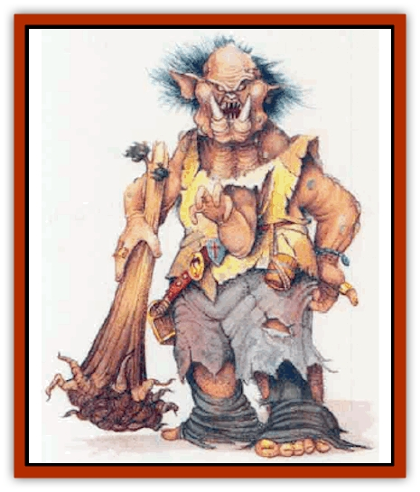
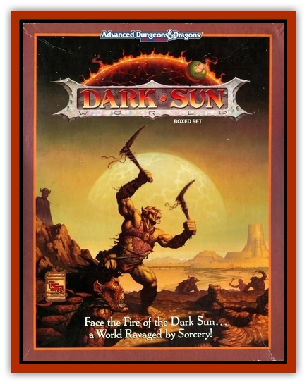

# Giant - Athach

| Statistic | **Giant, Athach** |
| --- | --- |
| **Activity Cycle:** | Day |
| **Alignment:** | Chaotic evil |
| **Armor Class:** | 0 |
| **Climate/Terrain:** | Any hill or mountain |
| **Damage/Attack:** | 2d6+7/2d6+7/2d6+7/2d10 |
| **Diet:** | Omnivore |
| **Frequency:** | Rare |
| **Hit Dice:** | 14 |
| **Intelligence:** | Low (5-7) |
| **Magic Resistance:** | Nil |
| **Morale:** | Champion (15) |
| **Movement:** | 18 |
| **No. Appearing:** | 1d6 |
| **No. of Attacks:** | 4 |
| **Organization:** | Family |
| **Size:** | H (18' tall) |
| **Special Attacks:** | Poison |
| **Special Defenses:** | Nil |
| **THAC0:** | 7 |
| **Treasure:** | Q (I) |
| **XP Value:** | 12,000 |

The athach is a hulking humanoid with a malformed body most notable for the third arm growing from the center of its chest. Topping the athach's roughly-muscled body, its hideous head boasts irregular and outsized features, including bloodshot eyes and lopsided ears (one huge, one tiny). Each of the creatures has a set of huge, gnarled tusks protruding upward from its slobbering mouth. These giants almost never bathe, so they smell particularly foul. They dress haphazardly in rags and furs, often jamming bracelets on their fingers, necklaces around their wrists, and other jewelly wherever they can fit it; the beauty of the pieces glitters in gross contrast to the giants' ugly bodies.

Athachs have their own crude dialect of the language most giants speak, and some few know Common.

These dim, ill-tempered creatures possess a penchant for collecting gems and jewelry. Despite their stupidity, they can inspire fear in even the staunchest warriors.

**Combat:** Athachs attack by bashing their opponents with thick tree stumps or large stones clutched in each of their three warty hands and by biting with their poisonous tusks. An athach's weapon inflicts 2d6+7 points of damage (including Strength bonus) on a successful hit. Any opponent an athach bites must make a saving throw vs. poison with a -4 penalty, due to the terrible strength of the venomous saliva, or remain helpless for 1d6 turns.

These beasts have no notion of strategy or tactics and always attack opponents head-on in battle. Occasionally, when hunting for meat (including humans), athachs refrain from killing their paralyzed victims at once. Instead, they tie up their captives and carry them to their lairs to kill later. Transporting the victims this way keeps their meat fresh, the way the giants prefer it.

Athachs avoid other giant creatures; they receive a penalty of -4 to their morale when facing creatures of huge (H) size or larger.

**Habitat/Society:** Athachs make their homes in simple caves in the mountains or deep woods. They live in small family groupings, normally consisting of one adult male, one or two adult females, and two to four juveniles. When not hunting, most athachs spend their time fighting with each other. Almost every aspect of their vicious lives centers around eating and violence.

Athachs give little thought to anything but the most primitive survival goals. Shortly after a young athach reaches maturity, its parents throw it out of their home to wander around until it finds a mate. Often the young athach must fight others of its kind, as well as its potential mate, before starting a new family group.

Other than food and violence, athachs seem passionately fond of gems and jewelry. These objects of remarkable beauty are often found among the matted furs and rags thrown about an athach's cave or even wrapped around its body. Athachs have been known to spend hours polishing and staring at such beautiful items, so strange in their otherwise ugly lives.

**Ecology:** Athachs hate most giants, including their fellow athachs. However, they avoid contact with all giant creatures save their own kind, mostly from cowardice. The monsters have no fear of humans and demihumarus, though, and actually view such beings as delicacies. Athachs have been observed sitting in the middle of mountain passes and lonely woodland paths, waiting for a party of humans it can attack.

On occasion, a group of travelers can persuade an athach not to attack, if they offer it enough jewelry or gems. However, an athach does not keep its word very well, and often merely waits a few minutes before charging off to attack the travelers anyway. Some caravan leaders speculate that the only time an athach doesn't go against its word is when its new gems and jewelry simply fascinate the beast so much that it forgets to break its bargain!

---
## Discovery & Documentation

**Source Publication:** Dark Sun Campaign Setting (original) (1991)
**Campaign Setting:** Dark Sun
**Author(s):** Timothy B. Brown, Troy Denning, William W. Connors, J. Robert King, Brom and Tom Baxa,

### Other Creatures Found in This Source Book
   * [[Animal_Domestic_Athas_I|Animal, Domestic (Athas) I]]
   * [[Belgoi|Belgoi]]
   * [[Braxat|Braxat]]
   * [[Dragon_of_Tyr|Dragon of Tyr]]
   * [[Dune_Freak|Dune Freak]]
   * [[Gaj|Gaj]]
   * [[Gith|Gith]]
   * [[Jozhal|Jozhal]]
   * [[Kluzd|Kluzd]]
   * [[Silk_Wyrm|Silk Wyrm]]
   * [[Tembo|Tembo]]
   * [[Wezer|Wezer]]
