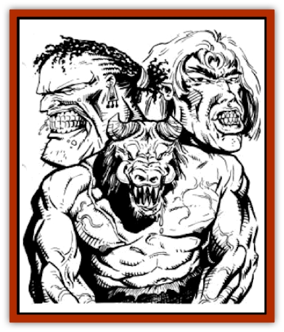

# Giant - Athas

| Statistic | **Beasthead** | **Desert** | **Plains** |
| --- | --- | --- | --- |
| **Activity Cycle:** | Day | Day | Day |
| **Alignment:** | Neutral Evil | Neutral Evil | Chaotic Good |
| **Armor Class:** | 3 | 4 | 5 |
| **Climate/Terrain:** | Sea of Silt Islands | Sea of Silt/Tablelands | Sea of Silt/Tablelands |
| **Damage/Attack:** | 2-16 + 14/2-20 +14 | 2-16 +14 | 2-16 +14 |
| **Diet:** | Omnivore | Omnivore | Omnivore |
| **Frequency:** | Rare | Uncommon | Uncommon |
| **Hit Dice:** | 15 | 14 | 16 |
| **Intelligence:** | Low (5-7) | Low (5-7) | Low (5-7) |
| **Magic Resistance:** | Nil | Nil | Nil |
| **Morale:** | Champion (15-16) | Champion (15-16) | Champion (15-16) |
| **Movement:** | 15 | 15 | 15 |
| **No. Appearing:** | 3-6 (1d4+2) | 5-10 (1d6+4) | 5-10 (1d6+4) |
| **No. of Attacks:** | 2 | 1 | 1 |
| **Organization:** | Clans | Clans | Clans |
| **Size:** | H (20' tall) | H (25' tall) | H (25' tall) |
| **Special Attacks:** | Psionics, hurl rocks or spears, bite | Hurl rocks or spears | Hurl rocks |
| **Special Defenses:** | Nil | Resistant to Psionics | Resistant to Psionics |
| **THAC0:** | 5 | 7 | 5 |
| **Treasure:** | O (C) | J (I) | K (H) |
| **XP Value:** | 7,000 | 6,000 | 8,000 |

The giants of Athas are huge, lumbering creatures who commonly inhabit the islands of the Sea of Silt. The most common varieties are the desert giants, the plains giants, and the psionics-wielding beasthead giants.

All the giants of Athas share one characteristic, and that is savagery. Though humanoid giants can be congenial and friendly when properly approached, they have short tempers and are very easily agitated.

## Desert Giants

Desert giants are humanoid is appearance. They stand anywhere from 20 to 25 feet tall and weigh from six to eight tons each. Desert giants have exaggerated facial features: huge noses, mouths, or ears. Their skin is most often dark red, but some specimens have jet-black skin. The hair of desert giants is usually a light brown color and is very coarse and sturdy. Desert giants have strength the corresponds to a strength score of 25.

**Combat:** When defending their island homes, desert giants hurl rocks at the uninvited guests in order to deter their enemy's advance. These rocks do 2d10 points of damage. Desert giants will often also throw huge spears carved from dead tree trunks. When they hit, these spears do 3d10 points of damage. Desert giants are able to throw either of these weapons up to 250 yards.

When desert giants are on the offensive, they will close to melee range quickly. Desert giants fight using huge, spiked clubs. These clubs do 2d8+14 (due to exceptional strength) points of damage per successful attack.

Desert giants are naturally resistant to all types of psionics. When attacked psionically, a desert giant may save versus spells to totally negate the effect.

**Habitat/Society:** Desert giants live on desert islands. This climate is nearly identical to the deserts of Athas, save that these islands are surrounded by the Sea of Silt. Desert giants live in clans, each having from 5 to 10 members. Both males and females are present in desert giant clans. Desert giants live in huge caves located in the rock formations found on most of the islands of the Sea of Silt. Each cave can house two or three giants, and each clan will be spread out between four or five caves.

Desert giants eat most anything, preferring meat to plants and vegetables. Many clans domesticate herds of [[Animal_Domestic_Athas_I|erdlus]], [[Animal_Domestic_Athas_I|kanks]], and other creatures. Because their islands have limited vegetation, desert giants eat little in terms of plant life.

Desert giants are able to cross the Sea of Silt by wading along the edges of the sea, where the silt is not too deep. Desert giants travel infrequently to the main lands of Athas.

**Ecology:** Desert giants often sell their hair to rope makers.

## Plains Giants

Plains giants are usually from 20 to 25 feet tall and weigh from six to eight tons. The skin color of Plains giants is usually a deep rust color, with some having dark brown skin. Also, plains giants have facial features more akin to an [[Elf_Athas|elf]] than a human. They have slender faces and slightly pointed ears. The hair of plains giants is light colored, very often blond to light brown. Like all Athasian giants, plains giants have strength equivalent to a score of 25.

**Combat:** When defending their islands, plains giants hurl rocks at their opponents, and these rocks do 2d10 points of damage to any target they hit. When attacking, plains giants usually use huge stone daggers that inflict 2d6 +14 (due to exceptional strength) points of damage, though some use clubs similar in type to those used by desert giants.

Plains giants are not able to employ any type of psionic powers. They are resistant to all types of psionic attacks, including attack modes used in psionic combat, just like desert giants.

**Habitat/Society:** Plains giants live on islands that have terrain similar to the scrub plains of Athas. Plains giants live in the most heavily vegetated areas, making their homes in the midst of these brush areas. Plains giants live in clans of 5 to 10 members. A clan will usually claim an entire patch of brush as its home area, and many times skirmishes will result when more than one clan desires the same brush patch.

Plains giants eat mostly natural vegetation, but enjoy meat also. Plains giants feed on herd animals, including kanks, erdlus, and occasionally even [[Erdland|erdlands]].

Plains giants are a more common sight on the main lands of Athas, as their neutral disposition makes them more compatible with members of the other Athasian races. Though it is considered dishonorable, a few plains giants hire themselves out as mercenaries. Some find work as city or castle builders or as salvage workers and wrecking crews.

**Ecology:** The hair of plains giants is also used in rope making; it is actually more valuable than that of desert giants. Its longer length and thinner texture make ropes made from plains giants. hair lighter and easier to handle.

## Beasthead Giants

**Psionics Summary**

| Level | Dis/Sci/Dev | Attack/Defense | Score | PSPs |
| --- | --- | --- | --- | --- |
| 5 | 2/4/10 | PB,EW,II/M-,IF,TW | 13 | 75 |

**Clairsentience -** *Sciences:* aura sight, clairvoyance; *Devotions:* combat mind, danger sense, know direction.

**Telepathy -** *Sciences:* tower of iron will, psionic blast; *Devotions:* mind blank, ego whip, id insinuation, intellect fortress, conceal thoughts, life detection.

Beasthead giants are a rarer form of Athasian giant who also make their homes on the islands of the Sea of Silt. Though somewhat smaller than humanoid giants, beasthead giants are actually more dangerous.

Beasthead giants are smaller and lighter than their humanoid cousins, averaging 15 to 20 feet tall and weighing from three to six tons. Beasthead giants, as their name implies, have a humanlooking body and the head of a beast. There are many different types of beasthead giants, some bearing the head of a goat, or an eagle's head, or the head of a wolf. Many beasthead giants bear the heads of creatures unique to Athas, such as the id fiend or the kirre. Beasthead giants are very pale in complexion, usually having pink or alabaster skin.

**Combat:** Beasthead giants behave in most situations like humanoid giants, though their combat tactics differ slightly. Beasthead giants rarely initiate battles anywhere aside from on their islands. Their shorter height makes wading through the Sea of Silt very hazardous, and so they infrequently leave their home islands. When defending their homes from intruders, they hurl rocks (2d10 points of damage) and spears (3d10 points) to ward off their opponents.

Among their favorite weapons are clubs, staves, and spears. Some beasthead giants have developed a type of sling, fashioned from vines and capable of projecting large (15-20 pound) rocks. Clubs and staves inflict 2d8 +14 points of damage on a successful attack, while spears do 2d10 + 14 points. Being hit by a sling rock does 2d8 +14 points of damage to the target.

Beasthead giants are also capable of making a bite attack instead of normal melee. This attack does an average of 2d10 + 14 points of damage, but varies depending upon the type of beasthead the creature sports. Some beastheads are capable of other attack forms, also depending on the type of beasthead.

| Type of Beasthead |  |
| --- | --- |
| of Att | Damage |
| Eagle, goat | 1 | 2d8+14 |
| Wolf | 1 | 2d10+14 |
| Id fiend | 1 | 2d10+14 |
| Kirre | 2 | 2d8+14/2d10+14 |
| Braxat | 1 | 2d10 (breath weapon) |

Beasthead giants are also powerful psionic-using creatures. Though they possess the same resistance to psionic powers that desert giants do, they can develop very powerful defense modes, making the use of psionic combat against them very difficult. Beasthead giants can use one psionic power per round, instead of their normal attacks, just as any other creature. Like many creatures of Athas, a beasthead giants. psionic defense modes are considered to be always "on10. This means that as long as the giant has enough PSPs to power its defense modes, they can employ them even in rounds in which they engage in melee combat.

**Habitat/Society:** Beasthead giants gather in smaller clans than other giant kin do, with usually three to six members in each. Clans of beasthead giants will usually all have the same type of head, though some clans have members of more than one type.

Beasthead giants feed mostly on animals, preferring herd animals like their humanoid giant counterparts.

**Ecology:** Being magical mutations of normal Athasian giants, beasthead giants are a good source of spell components for both wizards and priests. The blood of a beasthead can be used in many different types of spells, but only those of preservers or druids. Also, beasthead giants provide unique spell components depending upon the type of beast head. For example, the feathers of an eagle head can be used in *feather fall* and other flight-oriented spells.

---
## Discovery & Documentation

**Source Publication:** MC12 Dark Sun Appendix I - Terrors of the Desert (1991)
**Campaign Setting:** Dark Sun
**Author(s):** Tom Prusa, Louis J. Prosperi, Walter M. Baas

### Other Creatures Found in This Source Book
   * [[Animal_Herd_Athas|Animal, Herd (Athas)]]
   * [[Animal_Household_Athas|Animal, Household (Athas)]]
   * [[Antloid_Desert|Antloid, Desert]]
   * [[Banshee_Dwarf|Banshee, Dwarf]]
   * [[Beetle_Agony|Beetle, Agony]]
   * [[Bog_Wader|Bog Wader]]
   * [[Brambleweed|Brambleweed]]
   * [[B'rohg|B'rohg]]
   * [[Burnflower|Burnflower]]
   * [[Cat_Psionic|Cat, Psionic]]
   * [[Cha'thrang|Cha'thrang]]
   * [[Cistern_Fiend|Cistern Fiend]]
   * [[Clam_Giant|Clam, Giant]]
   * [[Cloud_Ray|Cloud Ray]]
   * [[Drake_Athas_Air|Drake (Athas), Air]]
   * [[Drake_Athas_Earth|Drake (Athas), Earth]]
   * [[Drake_Athas_Fire|Drake (Athas), Fire]]
   * [[Drake_Athas_Water|Drake (Athas), Water]]
   * [[Dune_Runner|Dune Runner]]
   * [[Dune_Trapper|Dune Trapper]]
   * [[Elemental_Athas_Greater_Air|Elemental (Athas), Greater, Air]]
   * [[Elemental_Athas_Greater_Earth|Elemental (Athas), Greater, Earth]]
   * [[Elemental_Athas_Greater_Fire|Elemental (Athas), Greater, Fire]]
   * [[Elemental_Athas_Greater_Water|Elemental (Athas), Greater, Water]]
   * [[Elemental_Athas_Lesser_Air_Earth|Elemental (Athas), Lesser, Air/Earth]]
   * [[Elemental_Athas_Lesser_Fire_Water|Elemental (Athas), Lesser, Fire/Water]]
   * [[Elemental_Athas_General_Information|Elemental (Athas), General Information]]
   * [[Erdland|Erdland]]
   * [[Esperweed|Esperweed]]
   * [[Flailer|Flailer]]
   * [[Floater|Floater]]
   * [[Golem_Athas_I|Golem (Athas) I]]
   * [[Golem_Athas_II|Golem (Athas) II]]
   * [[Golem_Athas_III|Golem (Athas) III]]
   * [[Golem_Athas_General_Information|Golem (Athas), General Information]]
   * [[Halfling_Renegade|Halfling, Renegade]]
   * [[Hej-kin|Hej-kin]]
   * [[Id_Fiend|Id Fiend]]
   * [[Insect_Swarm_Athas|Insect Swarm (Athas)]]
   * [[Kank_Wild|Kank, Wild]]
   * [[Kirre|Kirre]]
   * [[Megapede|Megapede]]
   * [[Mul_Wild|Mul, Wild]]
   * [[Nightmare_Beast|Nightmare Beast]]
   * [[Plant_Carnivorous_Athas|Plant, Carnivorous (Athas)]]
   * [[Pterran|Pterran]]
   * [[Pterrax|Pterrax]]
   * [[Pulp_Bee|Pulp Bee]]
   * [[Pyreen|Pyreen]]
   * [[Rasclinn|Rasclinn]]
   * [[Razorwing|Razorwing]]
   * [[Roc_Athas|Roc (Athas)]]
   * [[Sand_Bride|Sand Bride]]
   * [[Sand_Cactus|Sand Cactus]]
   * [[Sand_Vortex|Sand Vortex]]
   * [[Scrab|Scrab]]
   * [[Silt_Horror|Silt Horror]]
   * [[Silt_Runner|Silt Runner]]
   * [[Sink_Worm|Sink Worm]]
   * [[Sloth_Athas|Sloth (Athas)]]
   * [[So-ut|So-ut]]
   * [[Spider_Cactus|Spider Cactus]]
   * [[Spider_Crystal|Spider, Crystal]]
   * [[Spirit_of_the_Land|Spirit of the Land]]
   * [[T'Chowb|T'Chowb]]
   * [[Thrax|Thrax]]
   * [[Tohr-kreen_I|Tohr-kreen I]]
   * [[Villichi|Villichi]]
   * [[Zhackal|Zhackal]]
   * [[Zombie_Plant|Zombie Plant]]
