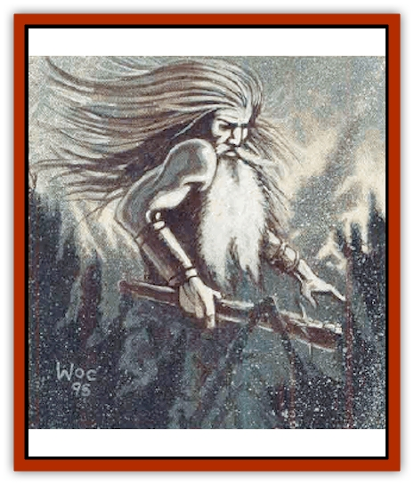

# Giant - Cerilia

| Statistic | **Forest** | **Ice** |
| --- | --- | --- |
| **Activity Cycle:** | Day | Any |
| **Alignment:** | Neutral good | Lawful evil |
| **Armor Class:** | 2 | 1 |
| **Climate/Terrain:** | Any forest | Northern Cerilia |
| **Damage/Attack:** | 2d8+8 | 1d12 or 2d10+9 |
| **Diet:** | Herbivore | Carnivore |
| **Frequency:** | Very rare | Rare |
| **Hit Dice:** | 16+6 | 15+7 |
| **Intelligence:** | Average (8-10) | High (13-14) |
| **Magic Resistance:** | Nil | Nil |
| **Morale:** | Champion (15) | Fanatic (18) |
| **Movement:** | 9 | 12 |
| **No. Appearing:** | 1 | 1-4 |
| **No. of Attacks:** | 1 | 1 |
| **Organization:** | Solitary | Family |
| **Size:** | H (14' tall) | H (16' tall) |
| **Special Attacks:** | Entangle | Cold magic |
| **Special Defenses:** | None | Immune to cold |
| **THAC0:** | 5 | 5 |
| **Treasure:** | Nil | E |
| **XP Value:** | 9,000 | 12,000 |

Several varieties of giant live in the wilder areas of Cerilia. For the most part, they prefer to leave their smaller neighbors alone, minding their own business and expecting others to do the same. [[Giant_Hill|Hill giants]] are common in the northern foothills and downs; they're more solitary than described in [[Giant_Hill|their entry]] and lean toward a neutral alignment. [[Giant_Mountain|Mountain giants]] are larger than hill giants and more powerful. [[Giant_Stone|Stone giants]] are rare creatures closely tied to elemental rock; they're reclusive creatures who inhabit the most inaccessible peaks. A few [[Giant_Storm|storm giants]] dwell along Cerilia's rocky coasts. [[Giant_Fomorian|Formorians]] are known as [[Giant_Fhoimorien|fhoimorien]] in Cerilia, and inhabit desolate marshes and forests. Unlike the other races of giant, they're inclined toward raiding and pillaging their neighbors. Finally, Cerilia is home to two unique species of giant: the forest giant and the ice giant.

## Forest Giant

Forest giants are found in the deepest regions of Cerilia's woodlands, far from human settlements. They are peaceful creatures who guard the forest against evil incursions and destructive logging or clearing. A forest giant is a huge, gnarled humanoid with rough woodlike skin, a great mass of dark leafy hair, a long beard, and long, rootlike fingers and toes. They often send down roots and sleep for years at a time.

In combat, forest giants strike with a single blow of a mighty fist. They can *speak with plants* and *speak with animals* at will. Once per day, they can *call woodland beings* and also cast *hold plant*, *hold monster*, and *wall of thorns*. Once per turn they can cast *entangle*. Forest giants are vulnerable to fire and suffer 1 extra point of damage per die rolled.

Forest giants often aid adventurers who serve the cause of nature. They're slow to anger, but they have no mercy for those who defile the woodlands.

## Ice Giant

The cold wastes of the northern mountains and glaciers are home to Cerilia's ice giants, a race of cruel and spiteful creatures. Ice giants can't exist outside of areas covered with snow and ice; during the summer, they're forced to withdraw to the safety of the pack ice and remain there. However, this does not prevent them from dreaming of expanding their frozen domains.

Ice giants resemble [[Giant_Frost|frost giants]] in most ways, but they're sheathed in rime and jagged ice shards. Mere contact with an ice giant's frozen body requires a saving throw vs. spell or the individual receives 1d4 points of cold-based damage and suffers a numbing loss of 1 Strength point for one hour. Ice giants hurl gigantic *iceballs* that inflict 2d10 points of damage upon the creature struck, shattering on impact for an additional 1d10 points of cold damage to those in a 5-foot radius. Victims of an iceball attack must roll a saving throw vs. spell; failure indicates the victims suffer the equivalent touching the giant's body.

Ice giants can cast *fog cloud* once per turn. Once per day they can cast *wall of ice*, *ice storm*, or *cone of cold*. In addition, an ice giant can *conjure elemental* once per day; the elemental is always a [[Elemental_Fire_Water|water elemental]] (in an icy form), obeys the giant, and never turns on him.

Ice giants await the onset of winter to leave their frozen fortresses and raid the Vos, Rjurik, and Brechtur lands in northern Cerilia. In especially cold winters, they have been known to attack the lands south of the Stonecrowns and the Silent Watch.

---
## Discovery & Documentation

**Source Publication:** Monstrous Compendium, 1996 Annual, Volume 3 (1995)
**Campaign Setting:** Advanced Dungeons & Dragons 2nd Edition
**Author(s):** Jon Pickens

### Other Creatures Found in This Source Book
   * [[Alaghi|Alaghi]]
   * [[Alhoon|Alhoon]]
   * [[Aranea_Savage_Coast|Aranea (Savage Coast)]]
   * [[Arcane_Head|Arcane Head]]
   * [[Banedead|Banedead]]
   * [[Banelich|Banelich]]
   * [[Bat_Bonebat|Bat, Bonebat]]
   * [[Beetle|Beetle]]
   * [[Belgoi|Belgoi]]
   * [[Bladeling|Bladeling]]
   * [[Braxat|Braxat]]
   * [[Bunyip|Bunyip]]
   * [[Burbur|Burbur]]
   * [[Bvanen|Bvanen]]
   * [[Cat_Great_Snow_Tiger|Cat, Great, Snow Tiger]]
   * [[Chosen_One|Chosen One]]
   * [[Chronovoid|Chronovoid]]
   * [[Cildabrin|Cildabrin]]
   * [[Coffer_Corpse|Coffer Corpse]]
   * [[Disenchanter|Disenchanter]]
   * [[Dog_Temporal|Dog, Temporal]]
   * [[Dragon_Cerilia|Dragon (Cerilia)]]
   * [[Dragon_Ghost|Dragon, Ghost]]
   * [[Dragon_Lesser_Undead|Dragon, Lesser Undead]]
   * [[Dragon_Neutral_Amber|Dragon, Neutral, Amber]]
   * [[Dread_Warrior|Dread Warrior]]
   * [[Dreamweaver|Dreamweaver]]
   * [[Dream_Spawn_Greater_Ennui|Dream Spawn, Greater, Ennui]]
   * [[Dream_Spawn_Lesser_Morph|Dream Spawn, Lesser, Morph]]
   * [[Dwarf_Arctic|Dwarf, Arctic]]
   * [[Dwarf_Urdunnir|Dwarf, Urdunnir]]
   * [[Eel_Giant_Moray|Eel, Giant Moray]]
   * [[Elemental_Fire_Kin_Tome_Guardian|Elemental, Fire Kin, Tome Guardian]]
   * [[Elf_Rockseer|Elf, Rockseer]]
   * [[Ethyk|Ethyk]]
   * [[Faerie_Faerie_Fiddler|Faerie, Faerie Fiddler]]
   * [[Faerie_Petty_Bramble|Faerie, Petty, Bramble]]
   * [[Faerie_Petty_Gorse|Faerie, Petty, Gorse]]
   * [[Faerie_Petty|Faerie, Petty]]
   * [[Firenewt|Firenewt]]
   * [[Formian|Formian]]
   * [[Gargoyle_II|Gargoyle II]]
   * [[Goblin_Cerilia|Goblin (Cerilia)]]
   * [[Golem_Magic|Golem, Magic]]
   * [[Golem_Shaboath|Golem, Shaboath]]
   * [[Hag_Bheur|Hag, Bheur]]
   * [[Hamadryad|Hamadryad]]
   * [[Hound_of_Ill-Omen|Hound of Ill-Omen]]
   * [[Human_Cerilia|Human (Cerilia)]]
   * [[Hybsil|Hybsil]]
   * [[Ibrandlin|Ibrandlin]]
   * [[Imp_Chaos|Imp, Chaos]]
   * [[Ixitxachitl_Ixzan|Ixitxachitl, Ixzan]]
   * [[Jabberwock|Jabberwock]]
   * [[Kyton|Kyton]]
   * [[Kyuss_Son_of|Kyuss, Son of]]
   * [[Lillend|Lillend]]
   * [[Life-Shaped_Creation_Guardian|Life-Shaped Creation, Guardian]]
   * [[Life-Shaped_Creation_Transport|Life-Shaped Creation, Transport]]
   * [[Lycanthrope_Werecrocodile|Lycanthrope, Werecrocodile]]
   * [[Lycanthrope_Werespider|Lycanthrope, Werespider]]
   * [[Magedoom|Magedoom]]
   * [[Manotaur|Manotaur]]
   * [[Mastiff_Shadow|Mastiff, Shadow]]
   * [[Meazel|Meazel]]
   * [[Mist_Scarlet_Dancer|Mist, Scarlet Dancer]]
   * [[Needleman|Needleman]]
   * [[Orc_Neo-Orog|Orc, Neo-Orog]]
   * [[Orc_Ondonti|Orc, Ondonti]]
   * [[Owlbear_II|Owlbear II]]
   * [[Pegataur|Pegataur]]
   * [[Phaerimm|Phaerimm]]
   * [[Reggelid|Reggelid]]
   * [[Render|Render]]
   * [[Saurial|Saurial]]
   * [[Scalamagdrion|Scalamagdrion]]
   * [[Sharn|Sharn]]
   * [[Snake_Messenger|Snake, Messenger]]
   * [[Spirit_Forest_Uthraki|Spirit, Forest, Uthraki]]
   * [[Spirit_Forest_Wood_Man|Spirit, Forest, Wood Man]]
   * [[Spirit_Ice_Orglash|Spirit, Ice, Orglash]]
   * [[Spirit_Rock_Thomil|Spirit, Rock, Thomil]]
   * [[Strider_Giant|Strider, Giant]]
   * [[Tembo|Tembo]]
   * [[Temporal_Glider|Temporal Glider]]
   * [[Temporal_Stalker|Temporal Stalker]]
   * [[Tether_Beast|Tether Beast]]
   * [[Thessalmonster|Thessalmonster]]
   * [[Time_Dimensional|Time Dimensional]]
   * [[Tomb_Tapper|Tomb Tapper]]
   * [[Undead_Dragon_Slayer|Undead Dragon Slayer]]
   * [[Unicorn_Black_Toril|Unicorn, Black (Toril)]]
   * [[Vaath|Vaath]]
   * [[Vortex_Spider|Vortex Spider]]
   * [[Weredragon|Weredragon]]
   * [[Zhentarim_Spirit|Zhentarim Spirit]]
