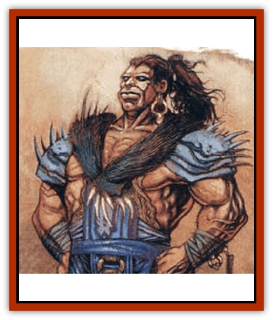

# Giant - Crag

| Statistic | **Giant, Crag** |
| --- | --- |
| **Activity Cycle:** | Day |
| **Alignment:** | Chaotic good |
| **Armor Class:** | 5 |
| **Climate/Terrain:** | The Lonely Butte |
| **Damage/Attack:** | 2d6+8 |
| **Diet:** | Omnivore |
| **Frequency:** | Uncommon |
| **Hit Dice:** | 16 |
| **Intelligence:** | Low (5-7) |
| **Magic Resistance:** | Nil |
| **Morale:** | Elite (13) |
| **Movement:** | 15 |
| **No. Appearing:** | 5-10 (1d6+4) |
| **No. of Attacks:** | 1 |
| **Organization:** | Clan |
| **Size:** | H (25' tall) |
| **Special Attacks:** | Hurl rocks |
| **Special Defenses:** | Nil |
| **THAC0:** | 6 |
| **Treasure:** | K (H) |
| **XP Value:** | 7,000 |

Crag giants are 25-foot-tall humanoids with thick black hair, rugged human features, and skin color ranging from dusky gray to stony brown. Also sometimes called the Lonely Giants, these sad creatures are the only remnants of a once proud race, forced to flee their homelands and dwell in an environment that is assuredly leading to their ultimate extinction. Like other [[Giant_Athas|Athasian giants]], the crag giants are savage in nature, though not as much so as the [[Giant_Athas|beasthead]] variety. The majority of crag giants are of chaotic good alignment, though other chaotic alignments are not unusual among them.

Crag giants speak their own language among themselves, but virtually all of them also use an archaic version of the common tongue.

**Combat:** Crag giants have a Strength score of 24, which provides them with a damage bonus of +8. In melee combat, they use jagged stone daggers, which inflict 2d6 points of damage. At range, they can hurl rocks at their opponents, with a range of up to 250 yards, inflicting 2d10 points of damage. A significant proportion of these giants are clerics aligned to the element of air, which explains their legendary status as tossers of lightning.

**Habitat/Society:** In millennia past, the ancestors of the modern crag giants originally inhabited the Thunder Mountains. According to ancient legend, when storms would rock those ranges, the crag giants would come out to dance in the thunder and play catch with the flashes of lightning. They lived with a savage joy for life.

But when Saragar's Mind Lords began reshaping the region to cut it off from the rest of Athas, in order to protect the Last Sea from the ravages of rampant magic, they presented the crag giants with a difficult choice: relocate their people to a reservation on the Lonely Butte, or be utterly destroyed.

Faced with the raw power of the Mind Lords, the crag giants chose to move, but their race has not taken well to their new home. Slowly but steadily, their numbers are declining, and they are headed for certain extinction. The one motivation for survival that remains to them is to gain vengeance on the Mind Lords.

**Ecology:** The jungle atop the Lonely Butte serves as an excellent source of food - both plant and animal - for the crag giants, and these creatures supplement that diet with some sea food. Despite this plenty, however, the race is dying out, still feeling displaced from their native mountains even after millennia of dwelling on the Lonely Butte.

---
## Discovery & Documentation

**Source Publication:** Monstrous Compendium, 1997 Annual, Volume 4 (1995)
**Campaign Setting:** Advanced Dungeons & Dragons 2nd Edition
**Author(s):** Jon Pickens

### Other Creatures Found in This Source Book
   * [[Anemone_Giant_Sea|Anemone, Giant Sea]]
   * [[Asperii|Asperii]]
   * [[Bainligor|Bainligor]]
   * [[Beast_of_Chaos|Beast of Chaos]]
   * [[Blindheim|Blindheim]]
   * [[Bloodsipper_Far_Realm|Bloodsipper (Far Realm)]]
   * [[Bulette_Gohlbrorn|Bulette, Gohlbrorn]]
   * [[Child_of_the_Sea|Child of the Sea]]
   * [[Clockwork_Horror|Clockwork Horror]]
   * [[Clockwork_Swordsman|Clockwork Swordsman]]
   * [[Coral|Coral]]
   * [[Darklore|Darklore]]
   * [[Dharculus|Dharculus]]
   * [[Dolphin_Athas|Dolphin (Athas)]]
   * [[Dragon_Neutral_Moonstone|Dragon, Neutral, Moonstone]]
   * [[Dragon_Prismatic|Dragon, Prismatic]]
   * [[Dream_Stalker|Dream Stalker]]
   * [[Dragon-kin_Albino_Wyrm|Dragon-kin, Albino Wyrm]]
   * [[Echyan|Echyan]]
   * [[Firestar|Firestar]]
   * [[Firetail|Firetail]]
   * [[Fish_Ascallion|Fish, Ascallion]]
   * [[Fish_Deep_Ocean|Fish, Deep Ocean]]
   * [[Fish_Tropical|Fish, Tropical]]
   * [[Fish_Vurgens|Fish, Vurgens]]
   * [[Fogwarden|Fogwarden]]
   * [[Fraal|Fraal]]
   * [[Gibberling_Brood|Gibberling, Brood]]
   * [[Glutton_Sea|Glutton, Sea]]
   * [[Golden_Ammonite|Golden Ammonite]]
   * [[Golem_Brass_Minotaur|Golem, Brass Minotaur]]
   * [[Golem_Gemstone|Golem, Gemstone]]
   * [[Golem_Maggot|Golem, Maggot]]
   * [[Groundling|Groundling]]
   * [[Hermit_Sea|Hermit, Sea]]
   * [[Hound_of_Law|Hound of Law]]
   * [[Human_Amazon|Human, Amazon]]
   * [[Human_Pygmy|Human, Pygmy]]
   * [[Inquisitor|Inquisitor]]
   * [[Kercpa|Kercpa]]
   * [[Kreel|Kreel]]
   * [[Lycanthrope_Lythari|Lycanthrope, Lythari]]
   * [[Mercurial|Mercurial]]
   * [[Mold_Chromatic|Mold, Chromatic]]
   * [[Mummy_Bog|Mummy, Bog]]
   * [[Neh-thalggu|Neh-thalggu]]
   * [[Nymph_Grain|Nymph, Grain]]
   * [[Nymph_Unseelie|Nymph, Unseelie]]
   * [[Octopus_Octo-Jelly|Octopus, Octo-Jelly]]
   * [[Puddingfish|Puddingfish]]
   * [[Sea_Demon|Sea Demon]]
   * [[Shade|Shade]]
   * [[Shadowrath|Shadowrath]]
   * [[Shark_Athas|Shark (Athas)]]
   * [[Siren_Ravenloft|Siren (Ravenloft)]]
   * [[Skeleton_Variant|Skeleton, Variant]]
   * [[Skyfish|Skyfish]]
   * [[Spectral_Scion|Spectral Scion]]
   * [[Spyder_Fiend|Spyder Fiend]]
   * [[Squid_Squark|Squid, Squark]]
   * [[Tanar'ri_Lesser_Uridezu|Tanar'ri, Lesser, Uridezu]]
   * [[Troll_Mutate|Troll Mutate]]
   * [[Vaati|Vaati]]
   * [[Vampire_Cerebral|Vampire, Cerebral]]
   * [[Varkha|Varkha]]
   * [[Wizshade|Wizshade]]
   * [[Worm_Lukhorn|Worm, Lukhorn]]
   * [[Wyste|Wyste]]
   * [[Yugoloth_Lesser_Gacholoth|Yugoloth, Lesser, Gacholoth]]
   * [[Zombie_Mud|Zombie, Mud]]
