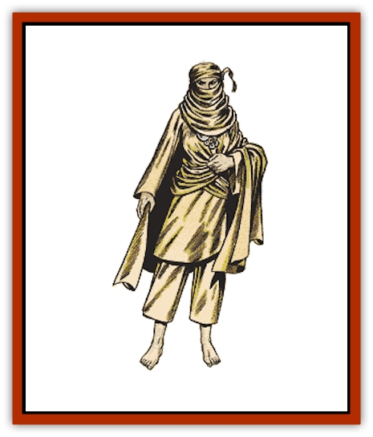

# Giant - Desert

| Statistic | **Giant, Desert** |
| --- | --- |
| **Activity Cycle:** | Day |
| **Alignment:** | Neutral |
| **Armor Class:** | 1 |
| **Climate/Terrain:** | Desert |
| **Damage/Attack:** | 1-10 or by weapon (2-12 +7) |
| **Diet:** | Omnivore |
| **Frequency:** | Very rare |
| **Hit Dice:** | 13 |
| **Intelligence:** | Average (8-10) |
| **Magic Resistance:** | Nil |
| **Morale:** | Elite (14) |
| **Movement:** | 15 |
| **No. Appearing:** | 2-20 |
| **No. of Attacks:** | 1 |
| **Organization:** | Tribal |
| **Size:** | H (17' tall) |
| **Special Attacks:** | Hurling spears |
| **Special Defenses:** | Camouflage |
| **THAC0:** | 7 |
| **Treasure:** | B |
| **XP Value:** | 5,000 |

Desert giants were once numerous in the scrub plains and deserts of the Land of Fate, but they have fallen victim to a divine curse which transforms them slowly but inexorably into stone. They always wander the land in the company of their cattle and their mounts. Their great civilization has long since vanished under the sands.

The weathered and craggy faces of the desert giants are scored with wrinkles. Even the youngest of desert giants are somewhat wrinkled, though this is not visible in the women, as they wear the veil. The dark hair and swarthy skin of the desert giants make their blue eyes all the more remarkable. However, it is considered a clear sign of impending fossilization when the eyes of a desert giant turn from blue to brown. The typical desert giant is 17' tall and weighs 7,000 pounds, though fossilizing giants may weigh twice that. Desert giants may live to be 400 years old.

**Combat:** Desert giants fight mounted when they can, though steeds of a size to suit them are rare. Battle mounts include gigantic lizards, enormous insects, huge undead horses of shifting bone, and even [[Roc|rocs]]. In the past, some desert giants took service as bodyguards and mercenaries with the most powerful of sultans. The sight of a squad of desert giants wheeling about in preparation for a charge has caused more than one desert legion to break and run.

Desert giants do not hurl rocks. Indeed, they wander many areas where there is often no ready supply of boulders, and carrying such heavy objects would tire even the strongest nomadic giant. However, they do make large throwing spears from wood they find when they pass near jungle lands. These spears are kept and cherished as heirlooms over generations. The spears have a range of 3/6/9 and cause 2-12 +7 points of damage. Desert giant chieftains sometimes carry great scimitars given to their ancestors for outstanding military service. These weapons cause 2-16 +7 when wielded by anyone with a Strength of 19 or better. On occasion, a desert giant will attack with one of its huge fists, causing 1-10 points damage on a successful attack.

Some desert giants are gifted with the ability to call back their ancestors from the stones; they are called sand-shifters because of the way the summoned giants throw aside the sands when they rise again. Sand-shifters are not priests or mages; they have no other special spell abilities. One in every 10 desert giants can bring back giants who have assumed the form of stone and can command them to fight once more. Once per week, a desert giant can summon 1-6 giants from the rocks for 2-12 turns; the summoning takes one turn. These giants crumble back to rock and powder when slain. Desert giant children gifted this way can summon 2-20 stony mounts for their elders to ride into battle. Adult sand-shifters can summon 3-30 mounts instead of 1-6 giants if they so choose.

Desert giants' skin is so similar to sand and rock that they can camouflage themselves very effectively, if given one turn to prepare. This ability allows them to ambush foes and prey alike. (Desert giants who lose their herds often use this ability to become effective bandits, and the numbers of these gigantic brigands have increased as the race dwindles.) A giant so camouflaged increases chances of a surprise attack to 1-4 on a d10 and decreases the chance of being seen by search parties or soldiers to 1 in 10.

**Habitat/Society:** Desert giants are nomadic herdsmen and are rarely found far from their herds. Though they are responsible for stripping entire river valleys bare in fertile areas, they do not reimburse farmers or herdsmen on the edge of those territories for any damage they might do. They see the lands as theirs for the taking, and they make no apology for overgrazing or even for grazing their herds on crops. Few sultanates attempt to force them off cropland; most attempt to lure the desert giants away with promises of employment as mercenaries. Some will promise rich gifts of salt, cloth, spices, and metal if only the desert giants will return to the empty quarters of the desert.

**Ecology:** Desert giants wander hundreds of miles following the rains with their herds. When the rains fail, the scrub withers, and the herds and their giants starve. At these times young males among the desert giants may take up mercenary work and use the money they obtain to support the entire tribe. If a drought goes on for years, more and more giants are driven into the cities, though their absolute numbers are still tiny compared to the numbers of humans and other smaller races.

---
## Discovery & Documentation

**Source Publication:** MC13 Al-Qadim Appendix (1992)
**Campaign Setting:** Al-Qadim (Forgotten Realms)
**Author(s):** C. Terry Phillips

### Other Creatures Found in This Source Book
   * [[Ammut|Ammut]]
   * [[Ashira|Ashira]]
   * [[Asuras|Asuras]]
   * [[Black_Cloud_of_Vengeance|Black Cloud of Vengeance]]
   * [[Buraq|Buraq]]
   * [[Camel|Camel]]
   * [[Camel_of_the_Pearl|Camel of the Pearl]]
   * [[Centaur_Desert|Centaur, Desert]]
   * [[Copper_Automaton|Copper Automaton]]
   * [[Debbi|Debbi]]
   * [[Elephant_Bird|Elephant Bird]]
   * [[Gen|Gen]]
   * [[Genie_Noble_Dao|Genie, Noble Dao]]
   * [[Genie_Noble_Djinni|Genie, Noble Djinni]]
   * [[Genie_Noble_Efreeti|Genie, Noble Efreeti]]
   * [[Genie_Noble_Marid|Genie, Noble Marid]]
   * [[Genie_Tasked_Architect_Builder|Genie, Tasked, Architect/Builder]]
   * [[Genie_Tasked_Artist|Genie, Tasked, Artist]]
   * [[Genie_Tasked_Guardian|Genie, Tasked, Guardian]]
   * [[Genie_Tasked_Herdsman|Genie, Tasked, Herdsman]]
   * [[Genie_Tasked_Slayer|Genie, Tasked, Slayer]]
   * [[Genie_Tasked_Warmonger|Genie, Tasked, Warmonger]]
   * [[Genie_Tasked_Winemaker|Genie, Tasked, Winemaker]]
   * [[Ghost_Mount|Ghost Mount]]
   * [[Ghul|Ghul]]
   * [[Giant_Jungle|Giant, Jungle]]
   * [[Giant_Reef|Giant, Reef]]
   * [[Giant_Zakhara_General_Information|Giant (Zakhara), General Information]]
   * [[Hama|Hama]]
   * [[Heway|Heway]]
   * [[Living_Idol|Living Idol]]
   * [[Lycanthrope_Werehyena|Lycanthrope, Werehyena]]
   * [[Lycanthrope_Werelion|Lycanthrope, Werelion]]
   * [[Markeen|Markeen]]
   * [[Maskhi|Maskhi]]
   * [[Mason_Wasp_Giant|Mason Wasp, Giant]]
   * [[Nasnas|Nasnas]]
   * [[Pahari|Pahari]]
   * [[Rom|Rom]]
   * [[Sabu_Lord|Sabu Lord]]
   * [[Sakina|Sakina]]
   * [[Serpent_Lord|Serpent Lord]]
   * [[Serpent_Winged|Serpent, Winged]]
   * [[Silat|Silat]]
   * [[Simurgh|Simurgh]]
   * [[Stone_Maiden|Stone Maiden]]
   * [[Vishap|Vishap]]
   * [[Zaratan|Zaratan]]
   * [[Zin|Zin]]
