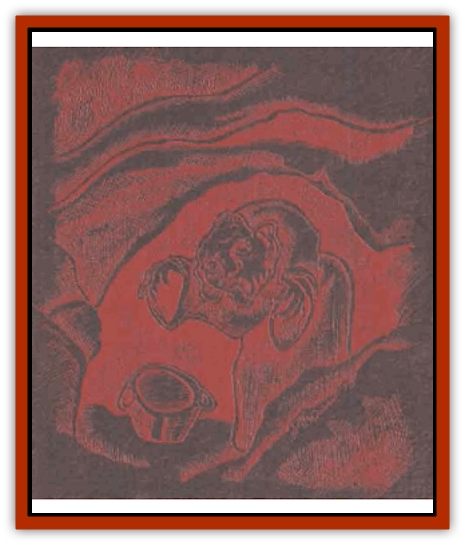
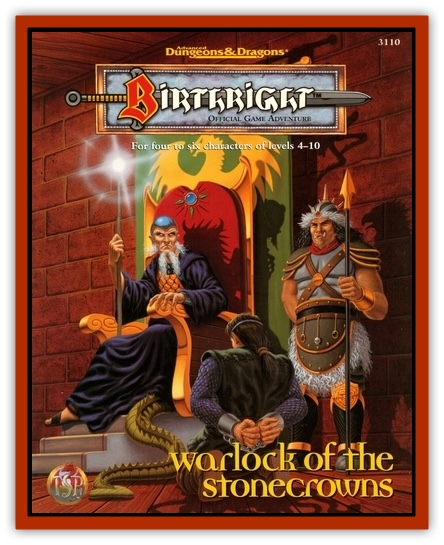

# Giant - Fhoimorien

| Statistic | **Giant, Fhoimorien** |
| --- | --- |
| **Activity Cycle:** | Any |
| **Alignment:** | Neutral evil |
| **Armor Class:** | 3 |
| **Climate/Terrain:** | Any forest, marsh, or subterranean |
| **Damage/Attack:** | 2d4+8 (Fists) or weapon (&times;2 dmg) +8 |
| **Diet:** | Omnivore |
| **Frequency:** | Uncommon |
| **Hit Dice:** | 13+3 |
| **Intelligence:** | Average (8-10) |
| **Magic Resistance:** | Nil |
| **Morale:** | Elite (14) |
| **Movement:** | 9 |
| **No. Appearing:** | 1-4 |
| **No. of Attacks:** | 1 |
| **Organization:** | Family |
| **Size:** | H (13' tall) |
| **Special Attacks:** | Surprise |
| **Special Defenses:** | Only surprised on a 1, gaseous form |
| **THAC0:** | 9 |
| **Treasure:** | D,Q&times;10 |
| **XP Value:** | 6,000 / Warlock: 9,000 |

Like other [[Giant_Cerilia|Cerilian giants]], the fhoimoriens are elemental creatures, closely tied to the earth. They are extremely fond of launching raids into nearby lands.

**Combat:** Fhoimoriens use clubs and other blunt instruments in battle; these weapons inflict double normal damage, and the great strength of the giants inflicts a further +8 to any melee attack. All fhoimoriens can cast *stone speak/tell*, *animate stone*, and *passwall* once per day.

Twice per day, fhiomoriens can assume gaseous form as a cloud of pale blackish-green, foul-smelling smoke. Most giants use this ability to escape pursuit when a battle turns against them, but the smarter ones have other uses for the power. They may stand across a mountain chasm and hurl boulders at their prey, then suddenly cross the chasm in gaseous form unexpectedly to finish off their target. They can also use their gaseous form to cross deep rivers, or to reach tall spires of rock from where they can bombard targets below.

Fhoimorien warlocks can use minor magic in battle; largely elemental earth and wind magic. They function as wizards of levels 1-4, and prefer spells such as *stone fist*, *Maximillian's earthen grasp*, *gust of wind*, and *shocking grasp*.

**Habitat/Society:** Fhoimoriens inhabit desolate marshes and forests from the seashores to the mountains, as well as live in deep caves.

---
## Discovery & Documentation

**Source Publication:** Warlock of the Stonecrowns (1995)
**Campaign Setting:** Birthright
**Author(s):** Wolfgang Baur

### Other Creatures Found in This Source Book
   * [[Ogre_Stonecrown|Ogre, Stonecrown]]
