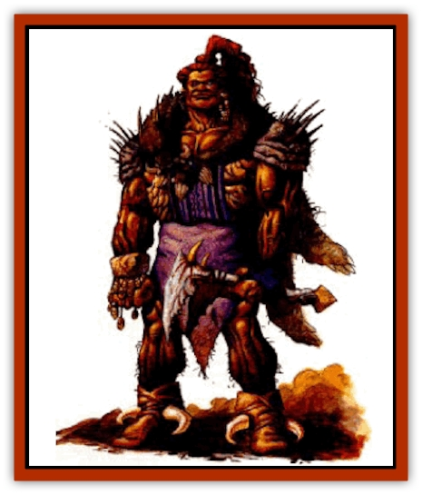

# Giant - Half-giant

| Statistic | **Giant, Half-giant** |
| --- | --- |
| **Activity Cycle:** | Any |
| **Alignment:** | Varies; see below |
| **Armor Class:** | 7 (10) |
| **Climate/Terrain:** | Any land |
| **Damage/Attack:** | 1d6 or by weapon +4 |
| **Diet:** | Omnivore |
| **Frequency:** | Rare |
| **Hit Dice:** | 3+12 |
| **Intelligence:** | Average to High (8-14) |
| **Magic Resistance:** | Nil |
| **Morale:** | Very steady (13-14) |
| **Movement:** | 15 |
| **No. Appearing:** | 2-5 (1d4+1) or 4-40 (4d10) |
| **No. of Attacks:** | 1 |
| **Organization:** | Solitary or community |
| **Size:** | H (10-12' tall) |
| **Special Attacks:** | Nil |
| **Special Defenses:** | Nil |
| **THAC0:** | 17 |
| **Treasure:** | Varies |
| **XP Value:** | 175 / Leader: 420 / Chieftain: 975 / Psionicist: 2,000 |

The half-giant is an enormous creature who has learned to adapt to the harsh life under the Athasian sun. No one knows when, or even why the unlikely union between human and giant first occurred, giving birth to this unique species. The species has multiplied throughout the reaches of Athas, mostly near the shores of the Silt Sea.

Despite an impressive average weight of 1,600 pounds, the half-giant has managed to maintain much of its human agility. The half-giant's dour face appears human, with long, thick hair kept either in a single tail down the back or braided (a trend especially prevalent among the females).

Half-giants have no native language, but most can speak common. Most translations to the common tongue make the speech of half-giants sound dull and redundant. Many humans joke that this is because half-giants have trouble understanding any concept, whether giant, human, or otherwise.

**Combat:** Sheer stature alone makes half-giants dangerous opponents, armed or not. They can strike bare-handed for 1-6 (1d6) points of damage, or wield a weapon, adding +4 to any damage.

Half-giants have a 25% chance to possess psionic wild talents. See *The Complete Psionics Handbook* to determine what, if any, talent is present in a particular half-giant.

One half-giant for every 10 encountered in a group possesses outstanding attributes. These half-giants. who usually assume a role of leadership, have 5+20 HD, THAC0 15, AC 6 (10), and the ability to strike twice per round with fists or weapons. In communities of 30 or more half-giants, one of the leaders is powerful enough to become the chieftain and another is skillful enough to be classified a psionicist. Both have 7+28 HD, THAC0 13, and AC 6 (10). They can make two attacks per round. The level of the psionicist can be determined by rolling 1d4+2. Consult *The Complete Psionics Handbook* to determine the appropriate powers.

**Habitat/Society:** Highly valued as guards and mercenaries, half giants can be found from one end to Athas to the other. Such geographical diversity has led them to congregate into their own communities, especially near other centers of population. A relatively young race, half-giants possess very little cultural identity of their own and so are known for adopting the customs and beliefs of other cultures.

Half-giants routinely change their alignments to match whatever situation has most influenced them lately. When first encountered, the half-giants' fixed aspect of their alignment must be determined. Roll 1d6: 1-3 means the law/chaos aspect is invariable: 4-6 means the good/evil aspect is invariable. Next, determine the actual aspect by rolling 1d6 again (1-2 = lawful or good, 3-5 = neutral, 6 = chaotic or evil). Then determine the current placement of the temporary aspect using the same 1d6 for law, chaos, neutrality, good, or evil. If the party encounters the same half-giants again, reroll the temporary alignment aspect to determine any possible changes. Any unusual situation can cause a shift in the halfgiants' temporary alignment.

**Ecology:** Half-giants tend to be tremendous consumers. They require twice the materials for any possession they wish to acquire, including weapons and armor, leading to a commensurate cost increase. They also tend to destroy more objects through accident of size alone. Considerate half-giants camp outside city walls to avoid damaging anything inside.

Unlike [[Mul|muls]], half-giants can reproduce, but were originally intentionally crossbred. Half-giants give birth to single offspring (twins and triplets are rare) no more than once per year. The longest living half-giants rarely pass age 220.

---
## Discovery & Documentation

**Source Publication:** Monstrous Compendium, 1995 Annual, Volume 2 (1995)
**Campaign Setting:** Advanced Dungeons & Dragons 2nd Edition
**Author(s):** Jon Pickens

### Other Creatures Found in This Source Book
   * [[Aboleth_Savant|Aboleth, Savant]]
   * [[Addazahr|Addazahr]]
   * [[Amiq_Rasol|Amiq Rasol]]
   * [[Arch-Shadow|Arch-Shadow]]
   * [[Automaton_Scaladar|Automaton, Scaladar]]
   * [[Automaton_Trobriand's|Automaton, Trobriand's]]
   * [[Bat_Sporebat|Bat, Sporebat]]
   * [[Beetle_Dragon|Beetle, Dragon]]
   * [[Bi-nou|Bi-nou]]
   * [[Boggle|Boggle]]
   * [[Brownie_Dobie|Brownie, Dobie]]
   * [[Brownie_Quickling|Brownie, Quickling]]
   * [[Cat_Crypt|Cat, Crypt]]
   * [[Cat_Great_Cath_Shee|Cat, Great, Cath Shee]]
   * [[Centaur-kin_Dorvesh|Centaur-kin, Dorvesh]]
   * [[Centaur-kin_Gnoat|Centaur-kin, Gnoat]]
   * [[Centaur-kin_Ha'pony|Centaur-kin, Ha'pony]]
   * [[Centaur-kin_Zebranaur|Centaur-kin, Zebranaur]]
   * [[Chronolily|Chronolily]]
   * [[Curst|Curst]]
   * [[Darktentacles|Darktentacles]]
   * [[Dinosaur_Aquatic|Dinosaur, Aquatic]]
   * [[Dinosaur_II|Dinosaur II]]
   * [[Dinosaur_III|Dinosaur III]]
   * [[Doppelganger_Greater|Doppelganger, Greater]]
   * [[Dragon_Brine|Dragon, Brine]]
   * [[Dragon_Half-|Dragon, Half-]]
   * [[Dragon-kin_Sea_Wyrm|Dragon-kin, Sea Wyrm]]
   * [[Dwarf_Wild|Dwarf, Wild]]
   * [[Ekimmu|Ekimmu]]
   * [[Elemental_Nature|Elemental, Nature]]
   * [[Elf_Winged|Elf, Winged]]
   * [[Fish_Great_Glacier|Fish (Great Glacier)]]
   * [[Fish_Subterranean|Fish, Subterranean]]
   * [[Fish_Toril|Fish (Toril)]]
   * [[Flareater|Flareater]]
   * [[Flumph|Flumph]]
   * [[Froghemoth|Froghemoth]]
   * [[Ghost_Casurua|Ghost, Casurua]]
   * [[Ghost_Ker|Ghost, Ker]]
   * [[Ghul|Ghul]]
   * [[Ghul-Kin|Ghul-Kin]]
   * [[Golem_Burning_Man|Golem, Burning Man]]
   * [[Golem_Phantom_Flyer|Golem, Phantom Flyer]]
   * [[Gulguthhydra|Gulguthhydra]]
   * [[Hakeashar|Hakeashar]]
   * [[Horse_Moon-|Horse, Moon-]]
   * [[Human_Dragonslayer|Human, Dragonslayer]]
   * [[Human_Vistana|Human, Vistana]]
   * [[Jellyfish_Giant|Jellyfish, Giant]]
   * [[Kalin|Kalin]]
   * [[Kholiathra|Kholiathra]]
   * [[Laerti|Laerti]]
   * [[Leucrotta_Greater|Leucrotta, Greater]]
   * [[Lich_Suel|Lich, Suel]]
   * [[Lurker_Shadow|Lurker, Shadow]]
   * [[Lycanthrope_Werepanther|Lycanthrope, Werepanther]]
   * [[Lycanthrope_Wereshark|Lycanthrope, Wereshark]]
   * [[Mammal_Herd_II|Mammal, Herd II]]
   * [[Marl|Marl]]
   * [[Meenlock|Meenlock]]
   * [[Mimic_Greater|Mimic, Greater]]
   * [[Mold_II|Mold II]]
   * [[Mummy_Creature|Mummy, Creature]]
   * [[Nyth|Nyth]]
   * [[Ooze_Slime_Jelly_Ghaunadan|Ooze/Slime/Jelly, Ghaunadan]]
   * [[Palimpsest|Palimpsest]]
   * [[Peltast|Peltast]]
   * [[Plant_Dangerous_II|Plant, Dangerous II]]
   * [[Pleistocene_Animal|Pleistocene Animal]]
   * [[Pudding_Subterranean|Pudding, Subterranean]]
   * [[Raggamoffyn|Raggamoffyn]]
   * [[Snake_Serpent|Snake, Serpent]]
   * [[Snake_Serpent_Vine|Snake, Serpent Vine]]
   * [[Sphinx_Draco-|Sphinx, Draco-]]
   * [[Sprite_Seelie_Faerie|Sprite, Seelie Faerie]]
   * [[Sprite_Unseelie_Faerie|Sprite, Unseelie Faerie]]
   * [[Squealer|Squealer]]
   * [[Turtle_Giant|Turtle, Giant]]
   * [[Umpleby|Umpleby]]
   * [[Vizier's_Turban|Vizier's Turban]]
   * [[Wall_Walker|Wall Walker]]
   * [[Webbird|Webbird]]
   * [[Yak-Man|Yak-Man]]
   * [[Zorbo|Zorbo]]
