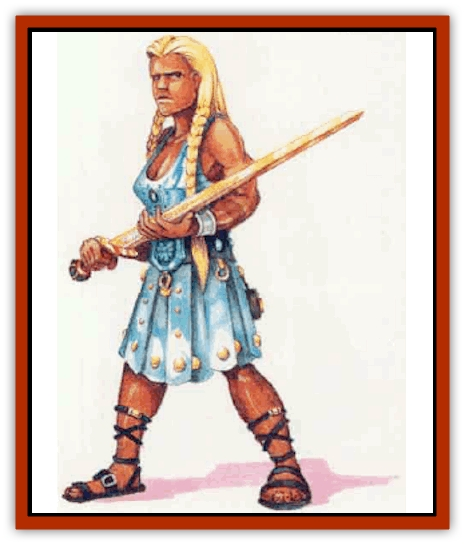

# Giant - Hephaeston

| Statistic | **Giant, Hephaeston** |
| --- | --- |
| **Activity Cycle:** | Night |
| **Alignment:** | Neutral |
| **Armor Class:** | -2 |
| **Climate/Terrain:** | Any mountain or cavern |
| **Damage/Attack:** | 4d10+12 (axe)/3d10 (fist) |
| **Diet:** | Omnivore |
| **Frequency:** | Very rare |
| **Hit Dice:** | 25 |
| **Intelligence:** | High (13-14) |
| **Magic Resistance:** | Nil |
| **Morale:** | Fearless (19) |
| **Movement:** | 12 |
| **No. Appearing:** | 1 |
| **No. of Attacks:** | 2 |
| **Organization:** | Solitary |
| **Size:** | H (18-25' tall) |
| **Special Attacks:** | Spells, throw |
| **Special Defenses:** | See below |
| **THAC0:** | 3 |
| **Treasure:** | W (F) |
| **XP Value:** | 28,000 |

Hephaestons spend their time and energy forging weapons in the highest mountains or deepest caverns of Mystara. These solitary giants have resilient, dark skins of flexible iron. Males often sport very bushy beards. Both sexes are well-muscled, particularly in the upper body, and dress in comfortable garments that will not interfere with their beloved work at the forges. The giants each carry a huge, iron weapon (usually a sword or axe) at all times.

**Combat:** Although hephaestons usually do not seek out combat, they prove particularly impressive and dangerous foes. Due to their incredibly dense iron skin, these giants can be hit only by weapons with +2 or greater enchantment. They are also immune to all forms of fire and remain unaffected by 1st- and 2nd-level spells, as well as any magic or spells affecting the mind (such as chum, hold, or any illusion).

In battle, a hephaeston attacks with its huge iron weapon once per round; a hit causes 4d10+12 points of damage, induding Strength bonus. In addition, the creature either can attack with a fist or use one of its special abilities (see below). If the fist hits with an attack roll of 18 to 20, the hephaeston has grabbed its opponent, causing its normal 3d10 points of damage. Then, at the end of the round, it may throw the hapless victim to the ground for an additional 5d6 points of damage (halved by a successful saving throw vs. death).

Hephaestons also may choose to use one of their special abilities:

<ul><li>Levitate iron or steel objects (as a 2nd-level *levitate* spell that allows 40 feet per round with no need to concentrate, in a range up to 120 feet);</li><li>Instantly heat one iron or steel object (up to 70 Ibs.) within 100 feet to red-hot for 1d4+1 rounds. Contact with such an object inflicts 2d6 points of damage per round (though a successful saving throw vs. spell halves the damage);</li><li>Create a wall of iron once per day (as a 5th-level *wand of iron* spell that lasts only three turns).</li></ul>**Habitat/Society:** Hephaestons spend much of their time alone forging weapons, each seeking to perfect the art of the weaponsmith. These giants sometimes spend months, and even years, crafting and recrafting a single weapon, until it reaches their exacting standards.

Regardless of whether a hephaeston makes its home atop a high mountain peak or in a deep cavern, its isolated lair always contains a forge. Puffs of smoke from the giant's forge or ringing sounds of the creature at work are often the only clues of its residency.

Hephaestons' diets consist primarily of game animals, such as deer and [[Boar|boar]], and various plants. They also must consume at least 50 lbs. of iron a month to maintain their strangely formed bodies.

Once or twice over the course of a hephaeston's long life (500+ years), a male of the species successfully creates an item of surpassing workmanship and beauty. The giant then goes in search of a female of its kind.

When they find each other, the two giants go through an elaborate courtship ritual in which the male presents the creation to the female who, if pleased with the item, forges a gift for the male in return. The two may stiy together up to a year, during which time they fashion a child from the purest iron, each adding several drops of liquid iron from their own skin to instill life into their child. The new hephaeston stays with one parent long enough to learn the arts of the forge, then heads off on its own.

**Ecology:** Hephaestons shun other intelligent beings and do not look fondly on intruders. It sometimes proves possible, however, to convince a hephaeston to create human-sized weapons of steel or iron. The creatures remain always on the lookout for large quantities of iron ore and might be persuaded to trade information or weapons for such ore. Hephaestons also collect metals (including coins) and weapons of all types. They particularly like weapons of especially fine construction.

Weapons created by hephaestons are particularly durable (+2 bonus to saving throws), sharp (+2 bonus to damage), and beautifully worked. They command three to five times the market value for normal weapons of their type.

---
## Discovery & Documentation

**Source Publication:** Mystara Appendix (1994)
**Campaign Setting:** Mystara
**Author(s):** John Nephew, Teeuwynn Woodruff, John Terra, Skip Williams

### Other Creatures Found in This Source Book
   * [[Actaeon|Actaeon]]
   * [[Agarat|Agarat]]
   * [[Ash_Crawler|Ash Crawler]]
   * [[Baldandar|Baldandar]]
   * [[Bargda|Bargda]]
   * [[Bhut|Bhut]]
   * [[Bird_Mystara|Bird (Mystara)]]
   * [[Blackball|Blackball]]
   * [[Choker|Choker]]
   * [[Coltpixie|Coltpixie]]
   * [[Crone_of_Chaos|Crone of Chaos]]
   * [[Darkhood|Darkhood]]
   * [[Darkwing|Darkwing]]
   * [[Decapus|Decapus]]
   * [[Deep_Glaurant|Deep Glaurant]]
   * [[Diabolus|Diabolus]]
   * [[Dimensional_Warper|Dimensional Warper]]
   * [[Dragon_Mystara_Crystalline|Dragon (Mystara), Crystalline]]
   * [[Dragon_Mystara_Jade|Dragon (Mystara), Jade]]
   * [[Dragon_Mystara_Onyx|Dragon (Mystara), Onyx]]
   * [[Dragon_Mystara_Ruby|Dragon (Mystara), Ruby]]
   * [[Drake_Mystara|Drake (Mystara)]]
   * [[Dragonfly|Dragonfly]]
   * [[Dusanu|Dusanu]]
   * [[Elemental_of_Chaos_Air_Earth|Elemental of Chaos, Air/Earth]]
   * [[Elemental_of_Chaos_Fire_Water|Elemental of Chaos, Fire/Water]]
   * [[Elemental_of_Law_Air_Earth|Elemental of Law, Air/Earth]]
   * [[Elemental_of_Law_Fire_Water|Elemental of Law, Fire/Water]]
   * [[Familiar_Mystara|Familiar (Mystara)]]
   * [[Frost_Salamander|Frost Salamander]]
   * [[Fundamental_Air_Earth|Fundamental, Air/Earth]]
   * [[Fundamental_Fire_Water|Fundamental, Fire/Water]]
   * [[Gargantua_Mystara|Gargantua (Mystara)]]
   * [[Geonid|Geonid]]
   * [[Ghostly_Horde|Ghostly Horde]]
   * [[Giant_Athach|Giant, Athach]]
   * [[Golem_Drolem|Golem, Drolem]]
   * [[Golem_Mystara_I|Golem (Mystara) I]]
   * [[Golem_Mystara_II|Golem (Mystara) II]]
   * [[Golem_Mystara_III|Golem (Mystara) III]]
   * [[Gray_Philosopher|Gray Philosopher]]
   * [[Guardian_Warrior|Guardian Warrior]]
   * [[Gyerian|Gyerian]]
   * [[Herex|Herex]]
   * [[Hivebrood|Hivebrood]]
   * [[Horde|Horde]]
   * [[Hsiao|Hsiao]]
   * [[Huptzeen|Huptzeen]]
   * [[Hutaakan|Hutaakan]]
   * [[Imp_Mystara|Imp (Mystara)]]
   * [[Jellyfish_Giant_Mystara|Jellyfish, Giant (Mystara)]]
   * [[Kna|Kna]]
   * [[Kopru|Kopru]]
   * [[Lizard_Mystara|Lizard (Mystara)]]
   * [[Lizard-kin_Mystara|Lizard-kin (Mystara)]]
   * [[Lupin|Lupin]]
   * [[Lycanthrope_Werejaguar_Mystara|Lycanthrope, Werejaguar (Mystara)]]
   * [[Lycanthrope_Wereswine|Lycanthrope, Wereswine]]
   * [[Magen|Magen]]
   * [[Manikin|Manikin]]
   * [[Mek|Mek]]
   * [[Mujina|Mujina]]
   * [[Nagpa|Nagpa]]
   * [[Neh-thalggu|Neh-thalggu]]
   * [[Nightshade_Mystara|Nightshade (Mystara)]]
   * [[Nuckalavee|Nuckalavee]]
   * [[Pegataur|Pegataur]]
   * [[Phanaton|Phanaton]]
   * [[Plant_Dangerous_Mystara|Plant, Dangerous (Mystara)]]
   * [[Plasm|Plasm]]
   * [[Rakasta|Rakasta]]
   * [[Rock_Man|Rock Man]]
   * [[Sabreclaw|Sabreclaw]]
   * [[Sacrol|Sacrol]]
   * [[Scamille|Scamille]]
   * [[Shapeshifter|Shapeshifter]]
   * [[Shargugh|Shargugh]]
   * [[Shark-kin|Shark-kin]]
   * [[Sollux|Sollux]]
   * [[Spectral_Death|Spectral Death]]
   * [[Spectral_Hound|Spectral Hound]]
   * [[Spider-kin|Spider-kin]]
   * [[Spirit_Mystara|Spirit (Mystara)]]
   * [[Statue_Living|Statue, Living]]
   * [[Surtaki|Surtaki]]
   * [[Tabi|Tabi]]
   * [[Thoul|Thoul]]
   * [[Thunderhead|Thunderhead]]
   * [[Tiger_Ebon|Tiger, Ebon]]
   * [[Topi|Topi]]
   * [[Tortle|Tortle]]
   * [[Vampire_Velya|Vampire, Velya]]
   * [[White_Fang|White Fang]]
   * [[Worm_Mystara|Worm (Mystara)]]
   * [[Wyrd|Wyrd]]
   * [[Yowler|Yowler]]
   * [[Zombie_Lightning|Zombie, Lightning]]
