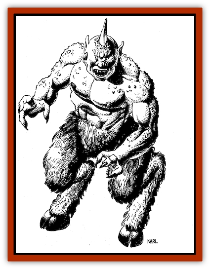

# Giant - Island

| Statistic | **Giant, Island** |
| --- | --- |
| **Activity Cycle:** | Day |
| **Alignment:** | Chaotic evil |
| **Armor Class:** | 7 |
| **Climate/Terrain:** | Islands |
| **Damage/Attack:** | 1d10 + 10 |
| **Diet:** | Omnivore |
| **Frequency:** | Very rare |
| **Hit Dice:** | 13+ 1-4 hit points |
| **Intelligence:** | Average (8-9) |
| **Magic Resistance:** | 10% |
| **Morale:** | Elite (13-14) |
| **Movement:** | 15 |
| **No. Appearing:** | 1 |
| **No. of Attacks:** | 1 |
| **Organization:** | Solitary |
| **Size:** | H (18 ft. tall) |
| **Special Attacks:** | Hurls rocks for 2-20 (2d10) |
| **Special Defenses:** | See below |
| **THAC0:** | 7 |
| **Treasure:** | E |
| **XP Value:** | 7,000; 975 (juveniles) |

Island giants are a twisted, horrid variety of their towering kind, as malicious and hateful as they are ugly. Their appearance varies, though all are vaguely humanoid. Many have one or more horns on their foreheads, as well as cyclopean (one-eyed) features. Some have the hindquarters of beasts, like satyrs. Others have reptilian tails or jutting, spiked spines. Giants of other races and enlightened humanoids universally despise the island giants, who return the compliment in spades.

Standing 18 feet tall and weighing some 8,000 pounds, island giants are imposing. They wear little more than a few rags, usually bits of sailcloth from the ships they have wrecked. Their skin spans the range of colors common among giants-from slate grays to sky blues to rich tans.

Island giants have no native language. They speak a form of Midani sprinkled with words borrowed from other giant tongues. This often makes their speech incomprehensible to others.

**Combat:** An adult male island giant has no particular powers, other than the ability (shared with other giant races) to throw small boulders. A healthy island male can heave a boulder up to 210 yards, inflicting 2 to 20 (2d10) points of damage. He can catch similar missiles (i.e., those inflicting up to 20 points of damage) 70 percent of the time. He often uses his rock-throwing skill to deter followers or sink ships. If a rock won’t suffice as a weapon, an island giant usually will rely on his fists, pummeling opponents. Since island giants are not tool-makers by nature, fabricated weapons are rare.

These giants are smart enough to seek an advantage. When attacking a ship, most attempt an ambush. A ship usually contains more than a single meal, so an island giant will attempt to trap or imprison its victims, creating a larder for convenient snacking.

An adult female island giant can throw boulders and fight just as well as a male-provided she is in giant form. Females have the ability to shapechange at will, assuming the form of a human or humanoid. Most prefer the shape of a comely giant or a beautiful human woman of normal sire. The female typically uses this talent to lead wanderers to their doom, as well as to attract a mate.

Young island giants have only half the Hit Dice of their elders. They can breathe underwater. This ability helps them flee danger, including the wrath of larger island giants, and it is lost when the young reach adulthood.

**Habitat/Society:** Island giants tend to be solitary. As a rule, they hate everyone else. Smaller creatures are nothing more than meat, entertainment in cruel jests, or both. The intelligence of males is just enough to foster imaginative brutalities, while that of females is just enough to continue the race through deception.

Island giants are one of nature’s curiosities. Males are completely infertile. Females, on the other hand, are quite fecund. They can reproduce by coupling with any other giant or humanoid race. True giants are preferred, but an island female may successfully mate with humans, elves, dwarves, and even genies. An island female’s true visage is horrid to behold, so she uses her shapechange abilities to lure beaus, admiring handsome, beefy stock. Such a union is hazardous to the male, because the female will seek to kill and eat him immediately afterward.

From the start, an island giant’s life is violent and bleak. Each year, females may give birth to a brood of 3 to 12 (1d10 + 2) small humanoid figures, who struggle to the ocean as soon as possible. Those who linger too long ashore may be eaten by an island giant or scavengers. Some speculate that a mother herself will devour dawdling young to eliminate weaklings. The young can breathe in and out of the water, and they typically dwell beneath the ocean waves until they are mature enough to walk back on shore and assume adult lives. It is estimated that only 1 in 50 offspring survive.

Upon returning to land, adult males seek a remote location to establish a domain. Adult females set out to deceive potential mates, beginning anew the struggle to reproduce.

**Ecology:** Island giants are omnivores. They eat just about anything, including seaweed and the carcasses of beached whales. They prefer fresh meat, however, so a passing ship is a welcome feast. If island giants are consistently well fed, they can live up to a millennium, but such individuals are rare.

---
## Discovery & Documentation

**Source Publication:** Land of Fate Box Set (1992)
**Campaign Setting:** Al-Qadim (Forgotten Realms)
**Author(s):** Jeff Grubb, Andria Hayday, Fred Fields, Karl Waller, David C. Sutherland III, Robin Raab, Stephanie Tabat, Dori Watry, Angelika Lokotz, John Knecht, Julia Martin, Jon Pickens, John Rateliff, Dori Watry, Thomas Reid, Michele Carter, Tim Beach, David Hirsch, Slade Henson.

### Other Creatures Found in This Source Book
   * [[Genie_of_Zakhara_Dao|Genie of Zakhara, Dao]]
   * [[Genie_of_Zakhara_Djinni|Genie of Zakhara, Djinni]]
   * [[Genie_of_Zakhara_Efreeti|Genie of Zakhara, Efreeti]]
   * [[Genie_of_Zakhara_Janni|Genie of Zakhara, Janni]]
   * [[Genie_of_Zakhara_Marid|Genie of Zakhara, Marid]]
   * [[Giant_Ogre|Giant, Ogre]]
   * [[Roc_Zakharan|Roc, Zakharan]]
   * [[Yak-Man|Yak-Man]]
