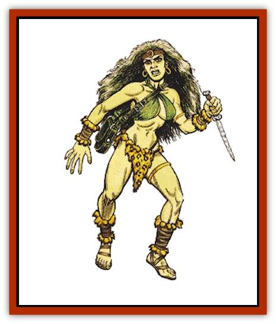

# Giant - Jungle

| Statistic | **Giant, Jungle** |
| --- | --- |
| **Activity Cycle:** | Day |
| **Alignment:** | Neutral |
| **Armor Class:** | 3 |
| **Climate/Terrain:** | Tropical/jungle |
| **Damage/Attack:** | 2-16 +9 or 2-12 +9/2-12 +9 |
| **Diet:** | Carnivore |
| **Frequency:** | Uncommon |
| **Hit Dice:** | 11 |
| **Intelligence:** | Average to High (8-14) |
| **Magic Resistance:** | Nil |
| **Morale:** | Champion (16) |
| **Movement:** | 15, Cl 6 |
| **No. Appearing:** | 1 or 1-6 |
| **No. of Attacks:** | 1 or 2 |
| **Organization:** | Tribal/cooperative |
| **Size:** | H (18' tall) |
| **Special Attacks:** | Surprise, arrows |
| **Special Defenses:** | See below |
| **THAC0:** | 9 |
| **Treasure:** | Q (A) |
| **XP Value:** | 6,000 |

Powerful, lanky, and strictly carnivorous, jungle giants are a terror to all the animals of the tropical forests. They are great hunters and stalkers, able to clear a huge tract of forest of all game and then move on.

A typical jungle giant stands 18' tall yet weighs only 3,000 pounds - very thin for a giant. Females are generally taller than males. They can live to be 200 years old.

Jungle giants always carry everything they need with them: tools for making and maintaining their weapons, fire-starters, tinder, and spare bits of leather and sinew used to repair clothing. They also carry their valuables, and every adult jungle giant carries a quiver of arrows.

Jungle giants speak their own language and the languages of tribes of nearby humans and humanoids.

Thin and very tall, jungle giants easily blend into the vertical landscape of the tropical forest. Their wavy hair is pale green, and their skin is a rich muddy yellow, like sunlight on the forest floor. They rarely wear more clothing than strictly necessary, as they prefer complete freedom of movement when hunting. Many groups of jungle giants use ritual tattooing, colorful feather headdresses, and even filed teeth to show their fierceness. They sometimes decorate themselves with mud, sticks, and leaves when stalking especially large or wary game.

**Combat:** Jungle giants use 15' long bows crafted to take advantage of their tremendous size and strength. These giants are very quick with their huge bows and can fire two arrows each round. They will use poisoned arrows to bring down their prey more quickly. If these arrows are used in combat, opponents must save vs. paralyzation at -2 or be rendered immobile for 2-12 turns. Even humanoid creatures with the strength to pull a jungle giant bow cannot use it, because the arrows are over 6' long (2d6 + 9 damage). Jungle giants will occasionally use the trunk of a dead tree as a club, doing 2d8 +9 points damage.

Jungle giants prefer to take their prey from ambushes, firing their bows from the treetops and then swinging down sturdy branches or thick ropes to finish off their prey. Camouflaged giants cause a -1 penalty on opponents. surprise rolls. When setting up a blind, they can camouflage themselves in jungle terrain with a 60% chance of success. Setting up a blind or decorating themselves with jungle camouflage takes three turns.

**Habitat/Society:** Jungle giants are friendlier than most other races of giant-kind, and they will often cooperate with human jungle tribes on hunts. The giants provide strength and raw power, and the humans provide the numbers and skill to drive animals into ambushes.

Jungle giants have absolutely no compunctions about eating any form of meat - mammal, reptile, amphibian, or avian. They know how to stalk, kill, and prepare everything from eggs to full-grown animals, and from scavengers to predators. Their villages reflect this carnivorous tendency; the huts are made from wooden posts with roofs of greased animal hides stitched together with intestines. The smell of smoking meats and butchery hang in the air, and huge quantities of dragonflies and other insects swarm around the villages. A jungle giant village is 50% likely to shelter 1-6 [[Dragonfly_Giant|giant dragonflies]].

**Ecology:** Jungle giants think of most creatures as prey, but those they accept as fellow hunters they respect as equals, regardless of their size. Although they much prefer the jungle terrain they know so well, they are often forced to leave the trees for the savanna when their numbers become too great to survive in the jungle. They think nothing of eating every snake, antelope, cat, warthog, ostrich, and elephant they come across. Jungle giants on the savannah often return to the forest, because their great height makes stealthy hunting difficult for them on open ground.

---
## Discovery & Documentation

**Source Publication:** MC13 Al-Qadim Appendix (1992)
**Campaign Setting:** Al-Qadim (Forgotten Realms)
**Author(s):** C. Terry Phillips

### Other Creatures Found in This Source Book
   * [[Ammut|Ammut]]
   * [[Ashira|Ashira]]
   * [[Asuras|Asuras]]
   * [[Black_Cloud_of_Vengeance|Black Cloud of Vengeance]]
   * [[Buraq|Buraq]]
   * [[Camel|Camel]]
   * [[Camel_of_the_Pearl|Camel of the Pearl]]
   * [[Centaur_Desert|Centaur, Desert]]
   * [[Copper_Automaton|Copper Automaton]]
   * [[Debbi|Debbi]]
   * [[Elephant_Bird|Elephant Bird]]
   * [[Gen|Gen]]
   * [[Genie_Noble_Dao|Genie, Noble Dao]]
   * [[Genie_Noble_Djinni|Genie, Noble Djinni]]
   * [[Genie_Noble_Efreeti|Genie, Noble Efreeti]]
   * [[Genie_Noble_Marid|Genie, Noble Marid]]
   * [[Genie_Tasked_Architect_Builder|Genie, Tasked, Architect/Builder]]
   * [[Genie_Tasked_Artist|Genie, Tasked, Artist]]
   * [[Genie_Tasked_Guardian|Genie, Tasked, Guardian]]
   * [[Genie_Tasked_Herdsman|Genie, Tasked, Herdsman]]
   * [[Genie_Tasked_Slayer|Genie, Tasked, Slayer]]
   * [[Genie_Tasked_Warmonger|Genie, Tasked, Warmonger]]
   * [[Genie_Tasked_Winemaker|Genie, Tasked, Winemaker]]
   * [[Ghost_Mount|Ghost Mount]]
   * [[Ghul|Ghul]]
   * [[Giant_Desert|Giant, Desert]]
   * [[Giant_Reef|Giant, Reef]]
   * [[Giant_Zakhara_General_Information|Giant (Zakhara), General Information]]
   * [[Hama|Hama]]
   * [[Heway|Heway]]
   * [[Living_Idol|Living Idol]]
   * [[Lycanthrope_Werehyena|Lycanthrope, Werehyena]]
   * [[Lycanthrope_Werelion|Lycanthrope, Werelion]]
   * [[Markeen|Markeen]]
   * [[Maskhi|Maskhi]]
   * [[Mason_Wasp_Giant|Mason Wasp, Giant]]
   * [[Nasnas|Nasnas]]
   * [[Pahari|Pahari]]
   * [[Rom|Rom]]
   * [[Sabu_Lord|Sabu Lord]]
   * [[Sakina|Sakina]]
   * [[Serpent_Lord|Serpent Lord]]
   * [[Serpent_Winged|Serpent, Winged]]
   * [[Silat|Silat]]
   * [[Simurgh|Simurgh]]
   * [[Stone_Maiden|Stone Maiden]]
   * [[Vishap|Vishap]]
   * [[Zaratan|Zaratan]]
   * [[Zin|Zin]]
