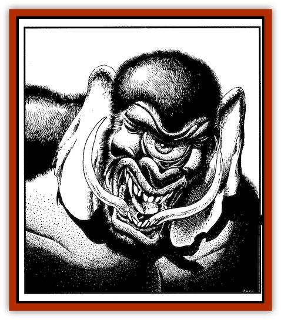

# Giant - Ogre

| Statistic | **Giant, Ogre** |
| --- | --- |
| **Activity Cycle:** | Day |
| **Alignment:** | Chaotic neutral |
| **Armor Class:** | 3 |
| **Climate/Terrain:** | Mountains, desert |
| **Damage/Attack:** | 1-12+7/1-12+7 |
| **Diet:** | Omnivore |
| **Frequency:** | Very rare |
| **Hit Dice:** | 14 |
| **Intelligence:** | Low (5-6) |
| **Magic Resistance:** | Nil |
| **Morale:** | Champion (15-16) |
| **Movement:** | 9 |
| **No. Appearing:** | 1-6 |
| **No. of Attacks:** | 2 |
| **Organization:** | Clans |
| **Size:** | H (20 ft. tall) |
| **Special Attacks:** | Hurl boulders (1-10/1-10) |
| **Special Defenses:** | See below |
| **THAC0:** | 7 |
| **Treasure:** | D |
| **XP Value:** | 4,000; 5,000 (clan leader);  /  175 (juvenile) |

Aside from their phenomenal size, ogre giants have more in common with ogres and ogre magi than they do with "true" giants (such as hill, stone, and jungle varieties). Ogre magi and other solitary beings may use ogre giants as guardians. Ogres, at least the enlightened ones, avoid their unpredictable and oft-savage cousins.

 Standing 20 feet tall and weighing some 8,500 pounds, ogre giants are larger than many true giants. Bristling hair covers their hulking bodies, ranging in color from tan to umber. They wear no clothing or armor unless a master has trained them to do so. Their visage is fearsome. About 6 in 10 ogre giants are cyclopean, having a single eye centered in their hairy forehead. Their richly veined ears hang to their shoulders like those of an elephant; by flapping them gently, ogre giants can cool their blood and their bodies. Males have great tusks curling out from their powerful jaws, glistening with drool. Both sexes may live up for up to 500 years, by which time their faces have gone completely gray.

 Ogre giants speak the language of ogres. Those who live near caravan routes or other civilized areas speak Midani as well. A few legendary creatures have attained enlightenment and gained positions as missionaries to their own kind. In general, however, the race consists of savage, unenlightened brutes.

**Combat:**Ogre giants typically fight with their powerful fists or by tossing boulders in the manner of true giants. They can throw only small boulders (1d10 damage), with a maximum range of 120 yards. However, they can toss one with each hand, or two boulders per round. Given a ready supply (such as a mountain stronghold), an ogre giant can lob missiles down on his or her enemies indefinitely.

**Habitat/Society:** Ogre giants live in family groups, or clans. Each clan has one leader, a male with maximum hit points. He has one to three wives, each with normal ogre giant statistics. The rest of the clan includes the leader’s children, as well as his unmarried siblings. To determine the statistics of younger ogre giants at random, roll 1d4 for each. A "4" means the youth has the abilities and statistics of a common [[Ogre|ogre]]. Otherwise, its statistics match those of an adult ogre giant.

Ogre giants occasionally are in the employ of a more powerful individual, either a sha’ir, sorcerer, or ogre mage. Such individuals usually appreciate their solitude. They use ogre giants as guardians to keep ill-advised interlopers from disturbing them. In return, the powerful master helps protect the clan against more diligent foes.

 Ogre giants keep no slaves, nor do they eat the flesh of sentient creatures. They kill their enemies and build rock cairns around them. They also bury their own dead in these cairns, continually adding to the mass of stones over the years. After a clan has been in one location for several generations, its cairns look like small mountains. Greedy tomb-robbers and necromancers searching for raw materials sometimes desecrate such mounds. Not surprisingly, ogre giants view those actions as a sacrilege, one that must be punished by death.

 Ogre giants are simple creatures, easily confused and deceived. They are aware of their limitations, however, and are very vengeful toward those who cheat or lie to them (once they figure it out). They have mercurial tempers, and if angered, ogre giants will lash out, seeking to destroy whatever (or whomever) confounded them.

**Ecology:** Ogre giant clans are few and far between, owing in part to their vast requirements for food. Some maintain their own herds of sheep and goats. Some also trade with humans, but most keep to themselves. In general, lone ogre giants are males looking for a clan with daughters suitable for marriage, or they are males looking for a location in which to establish their own clan.

---
## Discovery & Documentation

**Source Publication:** Land of Fate Box Set (1992)
**Campaign Setting:** Al-Qadim (Forgotten Realms)
**Author(s):** Jeff Grubb, Andria Hayday, Fred Fields, Karl Waller, David C. Sutherland III, Robin Raab, Stephanie Tabat, Dori Watry, Angelika Lokotz, John Knecht, Julia Martin, Jon Pickens, John Rateliff, Dori Watry, Thomas Reid, Michele Carter, Tim Beach, David Hirsch, Slade Henson.

### Other Creatures Found in This Source Book
   * [[Genie_of_Zakhara_Dao|Genie of Zakhara, Dao]]
   * [[Genie_of_Zakhara_Djinni|Genie of Zakhara, Djinni]]
   * [[Genie_of_Zakhara_Efreeti|Genie of Zakhara, Efreeti]]
   * [[Genie_of_Zakhara_Janni|Genie of Zakhara, Janni]]
   * [[Genie_of_Zakhara_Marid|Genie of Zakhara, Marid]]
   * [[Giant_Island|Giant, Island]]
   * [[Roc_Zakharan|Roc, Zakharan]]
   * [[Yak-Man|Yak-Man]]
