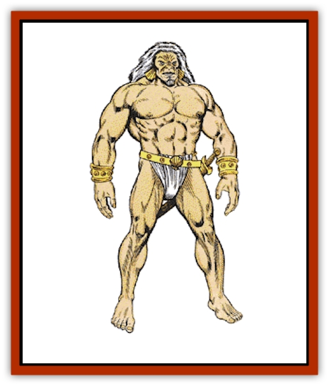

# Giant - Reef

| Statistic | **Giant, Reef** |
| --- | --- |
| **Activity Cycle:** | Day |
| **Alignment:** | Neutral good |
| **Armor Class:** | 0 or -4 |
| **Climate/Terrain:** | Tropical or subtropical ocean/reef |
| **Damage/Attack:** | 1-10 or by weapon (typically 2-20 + 10) |
| **Diet:** | Omnivore |
| **Frequency:** | Very rare |
| **Hit Dice:** | 18 |
| **Intelligence:** | Very (11-12) |
| **Magic Resistance:** | Nil |
| **Morale:** | Fanatic (17) |
| **Movement:** | 15, Sw 12 |
| **No. Appearing:** | 1 or 1-4 |
| **No. of Attacks:** | 1 |
| **Organization:** | Solitary |
| **Size:** | H (16' tall) |
| **Special Attacks:** | Boulders, whirlpool |
| **Special Defenses:** | Immune to water-based attacks |
| **THAC0:** | 5 |
| **Treasure:** | Z (A) |
| **XP Value:** | 12,000 |

Reef giants are the loners of giant-kind, although they often live in remarkably well-appointed mansions that seem to be no more than huts from the outside. They sometimes become sailors, but their huge mass limits them to the largest of vessels. Reef giants are typically 16' tall and weigh 4,000 pounds. Reef giants can live to be 600 years old.

Reef giants speak their own language as well as the giantish trade tongue and the languages of [[Giant_Storm|storm]] and [[Giant_Cloud|cloud giants]]. In addition, 40% of the giants also speak the common tongue.

Reef giants have burnished coppery skin and pale white hair. They are barrel-chested and powerfully-muscled from the exertion of forcing their huge bodies through water. Reef giants have a Strength of 22. Reef giants wear skins or garments made of braided hair when ashore, but swim wearing no more than a belt for knives and pouches.

**Combat:** Reef giants prefer to fight in or under water, and they are fierce fighters when angered. They suffer no penalties when fighting in or under water. They cannot be harmed by water- or ice-based attack forms. They typically attack with giant tridents for 2-20 +10 points of damage, but have been known to lash out with a huge fist (1d10 points damage) now and again.

Once per day, a reef giant can form a whirlpool. Unless a successful Strength ability check is made, creatures within 10 yards of the giant are sucked into the whirlpool and suffer 2-16 points of battering damage plus 2-20 points drowning and choking damage (unless the creatures are able to breathe water, in which case only the battering damage applies). The whirlpool is not powerful enough to draw in ships.

Reef giants can throw boulders up to 350 yards for 3-30 (3d10) points of damage. They prefer to use thrown boulders to sink unwelcome ships. Boulders are not used against individual opponents.

**Habitat/Society:** Reef giants are often solitary for long periods of time, although they mate for life. When their children reach puberty, they are sent out on their own to seek an island or reef habitat to make their home.

The mansions of reef giants are sometimes built into the hills and gorges of the islands, and they are always stocked with furniture and decorations collected over generations. These mansions are passed on from one giant to another; the eldest daughter is generally reared to provide for her parents as they grow old and is usually given the mansion and all its goods upon their death. These well-dowried daughters are the objects of much competition between reef giant suitors, each of whom seeks to both prove himself to the new mistress of the mansion and undo his competitors by any means available. Diving, surfing, and fishing competitions are common in reef giant courtship.

**Ecology:** Reef giants are scavengers who fish and forage coral reefs for a hundred different sources of food. They can net entire schools of fish, and as accomplished divers they can retrieve hoards of pearls, sponges, and coral. Their enormous strength allows them to swim for hours at a time without tiring. In this way reef giants can amass huge amounts of goods to trade for other items.

Some reef giants keep flocks of goats or sheep on their island homes, but these giants are generally elderly and not as capable of foraging successfully.

Reef giants frequently enter into contracts or trade agreements with humans and other mercantile races. In exchange for pearls and other valuables from the sea, they are given cloth, sweets, and metal goods.

The reef giants' willingness to plunder the sea has made them the enemies of Zakharan [[Triton|merfolk]], [[Triton|tritons]], and other oceandwelling races.

---
## Discovery & Documentation

**Source Publication:** MC13 Al-Qadim Appendix (1992)
**Campaign Setting:** Al-Qadim (Forgotten Realms)
**Author(s):** C. Terry Phillips

### Other Creatures Found in This Source Book
   * [[Ammut|Ammut]]
   * [[Ashira|Ashira]]
   * [[Asuras|Asuras]]
   * [[Black_Cloud_of_Vengeance|Black Cloud of Vengeance]]
   * [[Buraq|Buraq]]
   * [[Camel|Camel]]
   * [[Camel_of_the_Pearl|Camel of the Pearl]]
   * [[Centaur_Desert|Centaur, Desert]]
   * [[Copper_Automaton|Copper Automaton]]
   * [[Debbi|Debbi]]
   * [[Elephant_Bird|Elephant Bird]]
   * [[Gen|Gen]]
   * [[Genie_Noble_Dao|Genie, Noble Dao]]
   * [[Genie_Noble_Djinni|Genie, Noble Djinni]]
   * [[Genie_Noble_Efreeti|Genie, Noble Efreeti]]
   * [[Genie_Noble_Marid|Genie, Noble Marid]]
   * [[Genie_Tasked_Architect_Builder|Genie, Tasked, Architect/Builder]]
   * [[Genie_Tasked_Artist|Genie, Tasked, Artist]]
   * [[Genie_Tasked_Guardian|Genie, Tasked, Guardian]]
   * [[Genie_Tasked_Herdsman|Genie, Tasked, Herdsman]]
   * [[Genie_Tasked_Slayer|Genie, Tasked, Slayer]]
   * [[Genie_Tasked_Warmonger|Genie, Tasked, Warmonger]]
   * [[Genie_Tasked_Winemaker|Genie, Tasked, Winemaker]]
   * [[Ghost_Mount|Ghost Mount]]
   * [[Ghul|Ghul]]
   * [[Giant_Desert|Giant, Desert]]
   * [[Giant_Jungle|Giant, Jungle]]
   * [[Giant_Zakhara_General_Information|Giant (Zakhara), General Information]]
   * [[Hama|Hama]]
   * [[Heway|Heway]]
   * [[Living_Idol|Living Idol]]
   * [[Lycanthrope_Werehyena|Lycanthrope, Werehyena]]
   * [[Lycanthrope_Werelion|Lycanthrope, Werelion]]
   * [[Markeen|Markeen]]
   * [[Maskhi|Maskhi]]
   * [[Mason_Wasp_Giant|Mason Wasp, Giant]]
   * [[Nasnas|Nasnas]]
   * [[Pahari|Pahari]]
   * [[Rom|Rom]]
   * [[Sabu_Lord|Sabu Lord]]
   * [[Sakina|Sakina]]
   * [[Serpent_Lord|Serpent Lord]]
   * [[Serpent_Winged|Serpent, Winged]]
   * [[Silat|Silat]]
   * [[Simurgh|Simurgh]]
   * [[Stone_Maiden|Stone Maiden]]
   * [[Vishap|Vishap]]
   * [[Zaratan|Zaratan]]
   * [[Zin|Zin]]
