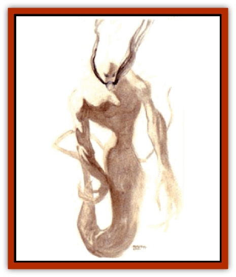

# Giant - Shadow

| Statistic | **Giant, Shadow** |
| --- | --- |
| **Activity Cycle:** | Any |
| **Alignment:** | Chaotic neutral |
| **Armor Class:** | 4 |
| **Climate/Terrain:** | Any |
| **Damage/Attack:** | 2d6 + special |
| **Diet:** | None |
| **Frequency:** | Very rare |
| **Hit Dice:** | 7 |
| **Intelligence:** | High (13-14) |
| **Magic Resistance:** | Nil |
| **Morale:** | Champion (15-16) |
| **Movement:** | 6 |
| **No. Appearing:** | 1-4 (1d4) |
| **No. of Attacks:** | 2 or 1 |
| **Organization:** | Pack |
| **Size:** | L-H (10-25' tall) |
| **Special Attacks:** | Strength drain |
| **Special Defenses:** | +2 or better weapon to hit |
| **THAC0:** | 13 |
| **Treasure:** | U (F) |
| **XP Value:** | 9,000 |

Shadow giants, or shadow people as they prefer to call themselves, are the descendants of the [[Halfling_Athas|halflings]] who served Rajaat the Warbringer during the Cleansing Wars. They appear either as shadowy, two-dimensional, vaguely humanoid-shaped silhouettes with ropy limbs, serpentine torsos, and blue embers in place of eyes, or as solid, three-dimensional shadows as tall as [[Giant_Half-giant|half-giants]].

Bright light adds size and depth to a shadow giant. The brighter the light source, the larger the shadow giant appears. In full sunlight a shadow giant can grow to 25 feet.

The shadow people speak the ancient languages of Ur Draxa and the civilized halfling nations, and the common tongue of the Tyr region. When a shadow giant speaks, black fumes rise from a blue gash that opens where its mouth would normally be.

**Combat:** A shadow giant can strike with both fists, causing 2d6 points of damage. The very touch of the creature is deadly; its connection to the Black allows it to draw strength out of its victims. A single hit from a shadow giant's fist drains 1 point of Strength from the victim. A creature reduced to zero Strength points collapses from fatigue and falls unconscious for 2d4 turns. Upon awaking, the victim's Strength returns at the rate of 1 point per turn.

Most shadow giants favor their more potent Strength drain. To initiate contact, a shadow giant must announce its intention to touch a victim and then successfully attack with a +2 bonus. It can make one attack per round this way. The grip of a shadow giant is bitter cold, sapping strength and warmth from those who are touched. Each round that the shadow giant maintains contact with a victim, the victim loses 1d4 points of Strength.

When a shadow giant grips a target, blackness spreads slowly from the contact point to engulf the target. The growing black stain of a shadow giant's touch is accompanied by a cold, numbing pain that draws heat from the body. A shadow giant can also pull a target into the Black, the nether dimension where it normally dwells. If the shadow giant releases a target in the Black, the victim loses its way and can't return to the normal world.

Normal weapons and magical weapons of less than +2 enchantment harmlessly pass through a shadow giant and emerge brittle and covered in darkness. For the next 2d4 rounds, every time the weapon hits something it must make a successful save vs. crushing blows. A failed roll indicates that the weapon shatters on impact.

Bright light and light-producing spells make a shadow giant larger and more substantial, even healing previously inflicted damage. This healing ranges from 1 point for torch light to 2d4 points for *continual light* spells and full daylight. The absence of light, on the other hand, weakens a shadow giant, for without a light source there can be no shadows.

Finally, while a shadow giant is immune to *sleep*, *charm*, *hold*, and cold-based spells, it is very susceptible to pure magic. The very touch of a defiler or preserver who has just gathered the life force necessary to cast magic inflicts 1-6 (1d6) points of damage per the level of spell used. The mage uses a memorized spell, but no spell effect takes place. Instead, the pure magic is used to attack a shadow giant.

**Habitat/Society:** Shadow giants reside both in the Pristine Tower in the Athasian an wastes and in the nether dimension known as the Black. Shadow giants are the descendants of the loyal servants of Rajaat who the Champions sacrificed to complete the betrayal of their master. These halflings merged with the Black and can only interact with the real world in the form of shadows.

The shadow people can emerge only partially from the Black until Rajaat's prison is destroyed. Since the [[Dragon_of_Tyr|dragon's]] death, they can take the form of half-shadows, appearing as varying portions of shadow and halfling. In this form, the halfling portion is vulnerable to normal attacks.

**Ecology:** No one knows how much time the shadow people spend in the Black or on Athas. It is not known what they eat. The shadow people desire obsidian. For a long time one of the noble families of Urik gave them 100 unblemished balls of obsidian each year. These balls of varying sizes were used as eggs to incubate the shadow giants' young.

---
## Discovery & Documentation

**Source Publication:** Dark Sun Appendix II - Terrors Beyond Tyr (1991)
**Campaign Setting:** Dark Sun
**Author(s):** Jim Atkiss, Steve Brown, Timothy B. Brown, Andrew P. Morris, Bruce Nesmith, Wes Nicholson, Bill Slavicsek

### Other Creatures Found in This Source Book
   * [[Aarakocra_Athas|Aarakocra (Athas)]]
   * [[Animal_Domestic_Athas_II|Animal, Domestic (Athas) II]]
   * [[Aviarag|Aviarag]]
   * [[Baazrag|Baazrag]]
   * [[Baazrag_Boneclaw|Baazrag, Boneclaw]]
   * [[Bloodgrass|Bloodgrass]]
   * [[Cactus_Hunting|Cactus, Hunting]]
   * [[Cactus_Rock|Cactus, Rock]]
   * [[Cilops|Cilops]]
   * [[Crodlu|Crodlu]]
   * [[Dagorran|Dagorran]]
   * [[Dhaot|Dhaot]]
   * [[Drake_Lesser_Athas_General_Information|Drake, Lesser (Athas), General Information]]
   * [[Drake_Lesser_Athas_Magma|Drake, Lesser (Athas), Magma]]
   * [[Drake_Lesser_Athas_Rain|Drake, Lesser (Athas), Rain]]
   * [[Drake_Lesser_Athas_Silt|Drake, Lesser (Athas), Silt]]
   * [[Drake_Lesser_Athas_Sun|Drake, Lesser (Athas), Sun]]
   * [[Dray|Dray]]
   * [[Drik|Drik]]
   * [[Dune_Reaper|Dune Reaper]]
   * [[Dwarf_Athas|Dwarf (Athas)]]
   * [[Elemental_Beast_Athas_Air|Elemental Beast (Athas), Air]]
   * [[Elemental_Beast_Athas_Earth|Elemental Beast (Athas), Earth]]
   * [[Elemental_Beast_Athas_Fire|Elemental Beast (Athas), Fire]]
   * [[Elemental_Beast_Athas_Water|Elemental Beast (Athas), Water]]
   * [[Elf_Athas|Elf (Athas)]]
   * [[Fael|Fael]]
   * [[Feylaar|Feylaar]]
   * [[Fordorran|Fordorran]]
   * [[Giant_Half-giant|Giant, Half-giant]]
   * [[Golem_Athas_Magma|Golem (Athas), Magma]]
   * [[Golem_Athas_Salt|Golem (Athas), Salt]]
   * [[Golem_Athas_General_Information|Golem (Athas), General Information]]
   * [[Gorak|Gorak]]
   * [[Halfling_Athas|Halfling (Athas)]]
   * [[Human_Athas|Human (Athas)]]
   * [[Jhakar|Jhakar]]
   * [[Kaisharga|Kaisharga]]
   * [[Kes'trekel|Kes'trekel]]
   * [[Klar|Klar]]
   * [[Krag|Krag]]
   * [[Kragling|Kragling]]
   * [[Lirr|Lirr]]
   * [[Mastyrial|Mastyrial]]
   * [[Meorty|Meorty]]
   * [[Mul|Mul]]
   * [[Nikaal|Nikaal]]
   * [[Paraelemental_Beast_General_Information|Paraelemental Beast, General Information]]
   * [[Paraelemental_Beast_Magma|Paraelemental Beast, Magma]]
   * [[Paraelemental_Beast_Rain|Paraelemental Beast, Rain]]
   * [[Paraelemental_Beast_Silt|Paraelemental Beast, Silt]]
   * [[Paraelemental_Beast_Sun|Paraelemental Beast, Sun]]
   * [[Pakubrazi|Pakubrazi]]
   * [[Psionocus|Psionocus]]
   * [[Psurlon|Psurlon]]
   * [[Raaig|Raaig]]
   * [[Retriever_Obsidian|Retriever, Obsidian]]
   * [[Ruktoi|Ruktoi]]
   * [[Ruvoka_Athas|Ruvoka (Athas)]]
   * [[Sand_Howler|Sand Howler]]
   * [[Scorpion_Athas|Scorpion (Athas)]]
   * [[Seed_Brain|Seed, Brain]]
   * [[Silt_Horror_Black|Silt Horror, Black]]
   * [[Silt_Horror_Magma|Silt Horror, Magma]]
   * [[Silt_Horror_Red|Silt Horror, Red]]
   * [[Silt_Spawn|Silt Spawn]]
   * [[Slig|Slig]]
   * [[Spider_Athas|Spider (Athas)]]
   * [[Spinewyrm|Spinewyrm]]
   * [[Ssurran|Ssurran]]
   * [[Stalking_Horror|Stalking Horror]]
   * [[Tarek|Tarek]]
   * [[Tari|Tari]]
   * [[Thri-kreen|Thri-kreen]]
   * [[T'liz|T'liz]]
   * [[Tohr-kreen_II|Tohr-kreen II]]
   * [[Tohr-kreen_III|Tohr-kreen III]]
   * [[Trin|Trin]]
   * [[Tul'k|Tul'k]]
   * [[Undead_Athas_General_Information|Undead (Athas), General Information]]
   * [[Wraith_Athas|Wraith (Athas)]]
   * [[Xerichou|Xerichou]]
   * [[Zombie_Thinking|Zombie, Thinking]]
