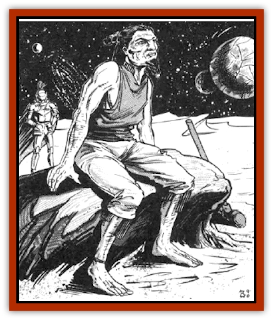

# Giant - Spacesea

| Statistic | **Giant, Spacesea** |
| --- | --- |
| **Activity Cycle:** | Any |
| **Alignment:** | Neutral good |
| **Armor Class:** | 0 |
| **Climate/Terrain:** | Wildspace |
| **Damage/Attack:** | 1-10 or by weapon (10-20) |
| **Diet:** | Omnivore |
| **Frequency:** | Rare |
| **Hit Dice:** | 14 + 1d4 |
| **Intelligence:** | High (13-14) |
| **Magic Resistance:** | Nil |
| **Morale:** | Champion (16) |
| **Movement:** | 12 |
| **No. Appearing:** | 11-20 |
| **No. of Attacks:** | 1 |
| **Organization:** | Tribal/ship |
| **Size:** | H (18' tall) |
| **Special Attacks:** | Hurling rocks for 3-30, or 1-3 hull points |
| **Special Defenses:** | See below |
| **THAC0:** | 7 |
| **Treasure:** | W (F) |
| **XP Value:** | 8,000 |

Spacesea giants, or rover giants, are an offshoot of the groundling [[Giant_Stone|stone giant]] race that has found its way into arcane space. The ancestors of these giants were brought to space as [[Neogi|neogi]] slaves, but they eventually managed to escape.

Spacesea giants have hair, unlike their land-locked brethren. They exult in this, often growing their hair (and the males' beards) to resemble that of their god Ptah.

**Combat:** When battling from aboard their stone ships (see below), the giants prefer to engage in missile combat. Their ships' ballistae and their own rock-hurling abilities give them a potent missile attack. They can hurl their boulders with a range of 500 yards (1 hex), causing 3d10 points of damage or 1d3 points of hull damage per hit. All giant ships have a store of boulders for hurling and ship repair (see below).

When engaged in melee, spacesea giants use either great stone clubs or maces (2d6+8) or strike with a fist for 1d10 points of damage or 1 point of hull damage per hit.

**Habitat/Society:** The first giants that escaped the neogi embraced the god Ptah, and they pleaded to him for aid. Ptah responded, granting them heightened intelligence, curiosity, and wisdom. In return for his aid, Ptah asked that the giants roam arcane space, to learn of its immensity and to appreciate its creator, their benefactor. The giants agreed, and they now rove far and wide throughout the spheres, learning and worshiping. As their intelligence has increased, so has their appreciation of art, as seen on the hulls and sails of their ships.

Almost all spacesea giants worship Ptah and devote their lives to the exploration of arcane space, with particular attention to wildspace. Many giants capitalize on this drive by hiring out as explorers, escorts, or scouts for other, non-evil races. Some giants make their living as merchants. Their large, sturdy ships excel in this capacity. Also, most pirates hesitate (to say the least) to attack a giant ship.

Giants can use, at least temporarily, any ship that can be modified to accept their bulk, but they prefer to use ships of their own construction. These resemble huge groundling galleons, made of solid stone.

These ships are larger than a normal galleon to allow for the giants' greater size. Like their groundling ancestors, spacesea giants feel more comfortable with a large mass of stone surrounding them. With the above exceptions, spacesea galleons are not much different from others of their type.

Along with their intelligence increase, the frequency of elders and magic-using giants has gone up. For every ten giants, one is an elder who is able to use *stone shape*, *stone tell*, and *transmute rock to mud* spells, once per day, as a 7th-level mage. Of these elders, 50% can cast wizard or priest spells as 5thl-level spellcasters. It is these elders who man the helm; the oldest is most often the ship's captain. They can also use their magical abilities, and the ever-present boulders, to repair hull damage to their ships. Each boulder yields enough material to repair 1d4 points of hull or mast (but not rigging) damage. None of these magical powers are usable in the phlogiston.

**Ecology:** The main weakness of the spacesea giants is their need for air, and this is the reason the giants seldom venture into the phlogiston. To this end, most giant ships carry a garden of green plants to help replenish the air supply. These plants also serve as food for the giants and the 1d4 giant goats each ship carries for dairy products (the goats also serve as convenient garbage disposals).

---
## Discovery & Documentation

**Source Publication:** MC7 Spelljammer Appendix I (1990)
**Campaign Setting:** Advanced Dungeons & Dragons 2nd Edition
**Author(s):** various

### Other Creatures Found in This Source Book
   * [[Aartuk|Aartuk]]
   * [[Albari|Albari]]
   * [[Ancient_Mariner|Ancient Mariner]]
   * [[Argos|Argos]]
   * [[Beholder_Abomination_Astereater|Beholder (Abomination), Astereater]]
   * [[Blazozoid|Blazozoid]]
   * [[Chattur|Chattur]]
   * [[Chevall|Chevall]]
   * [[Clockwork_Horror|Clockwork Horror]]
   * [[Colossus|Colossus]]
   * [[Delphinid|Delphinid]]
   * [[Dizantar|Dizantar]]
   * [[Dog|Dog]]
   * [[Dog_Bog_Hound|Dog, Bog Hound]]
   * [[Esthetic|Esthetic]]
   * [[Focoid|Focoid]]
   * [[Fractine|Fractine]]
   * [[Golem_Furnace|Golem, Furnace]]
   * [[Golem_Radiant|Golem, Radiant]]
   * [[Gravislayer|Gravislayer]]
   * [[Grommam|Grommam]]
   * [[Hadozee|Hadozee]]
   * [[Hamster_Giant_Space|Hamster, Giant Space]]
   * [[Jammer_Leech|Jammer Leech]]
   * [[Lakshu|Lakshu]]
   * [[Lumineaux|Lumineaux]]
   * [[Lutum|Lutum]]
   * [[Mimic_Space|Mimic, Space]]
   * [[Misi|Misi]]
   * [[Moon_Rogue|Moon, Rogue]]
   * [[Mortiss|Mortiss]]
   * [[Murderoid|Murderoid]]
   * [[Nay-Churr|Nay-Churr]]
   * [[Phlog-Crawler|Phlog-Crawler]]
   * [[Plasman|Plasman]]
   * [[Plasmoid_DeGleash|Plasmoid, DeGleash]]
   * [[Plasmoid_DelNoric|Plasmoid, DelNoric]]
   * [[Plasmoid_General_Information|Plasmoid, General Information]]
   * [[Plasmoid_Ontalak|Plasmoid, Ontalak]]
   * [[Puffer|Puffer]]
   * [[Q'nidar|Q'nidar]]
   * [[Rastipede|Rastipede]]
   * [[Reigar|Reigar]]
   * [[Rock_Hopper|Rock Hopper]]
   * [[Slinker|Slinker]]
   * [[Spider_Asteroid|Spider, Asteroid]]
   * [[Spiritjam|Spiritjam]]
   * [[Survivor|Survivor]]
   * [[Syllix|Syllix]]
   * [[Symbiont_Power|Symbiont, Power]]
   * [[Vine_Infinity|Vine, Infinity]]
   * [[Wiggle|Wiggle]]
   * [[Wizshade|Wizshade]]
   * [[Wryback|Wryback]]
   * [[Zard|Zard]]
   * [[Zodar|Zodar]]
