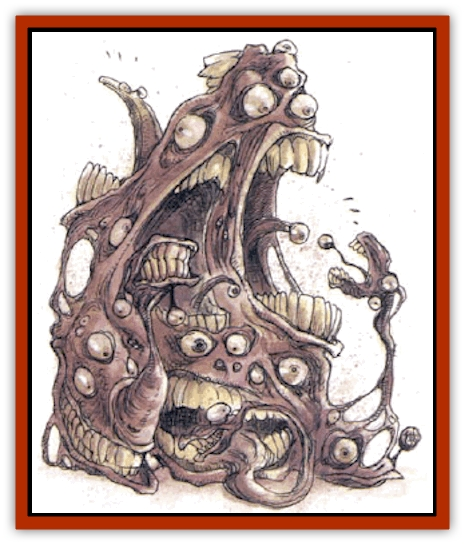

# Gibbering Mouther

| Statistic | **Gibbering Mouther** |
| --- | --- |
| **Activity Cycle:** | Day |
| **Alignment:** | Neutral |
| **Armor Class:** | 1 |
| **Climate/Terrain:** | Swamps, underground |
| **Damage/Attack:** | 1 (&times;6) + special |
| **Diet:** | Omnivore |
| **Frequency:** | Very rare |
| **Hit Dice:** | 4+3 |
| **Intelligence:** | Semi (2-4) |
| **Magic Resistance:** | Nil |
| **Morale:** | Elite (13-14) |
| **Movement:** | 3, Sw 6 |
| **No. Appearing:** | 1 |
| **No. of Attacks:** | 6+ |
| **Organization:** | Solitary |
| **Size:** | M (4-7' tall) |
| **Special Attacks:** | <i>Gibbering</i>, spit, bite |
| **Special Defenses:** | Ground control |
| **THAC0:** | 17 |
| **Treasure:** | Q |
| **XP Value:** | 4 HD: 975 / 8 HD: 2,000 |

The gibbering mouther is an amoeboid form of life composed entirely of mouth and eyes. With its eyes and mouths closed, it appears to be a lump of earthly material, surprising creatures that stumble across it. Its only motive is to eat whatever is edible and within reach, be it animal, vegetable, or mineral.

Gibbering mouthers move by oozing forward, fastening several mouths to the ground and pulling themselves along. A mouther may move faster over fluid and viscous terrain, such as mud and quicksand, by swimming.

**Combat:** The brain of a mouther is located in its midportion, and its gelatinous body makes it difficult to strike this spot, hence its relatively low Armor class.

The mouther attacks in three ways: *gibbering*, spitting and biting. When any edible object is sighted by a mouther, it begins gibbering incoherently, causing confusion among all within a 60-foot radius who fails a saving throw vs. spell. Each character who fails must immediately roll 1d8 to determine which of the following effects occurs. On a roll of 1, the victim wanders aimlessly for one round; on a roll of 2-5, the victim stands motionless, stunned for one round; on a roll of 6-7, the victim attacks the nearest living creature for one round; and on a roll of 8, the victim runs in fear for two rounds.

The spittle of a gibbering mouther bursts into a bright flare if it strikes any hard surface. The resulting flash blinds characters looking at it if they fail to save vs. petrification - the blindness lasts 1d3 rounds. The mouther may then attempt to bite blinded opponents with a +2 bonus to its attack rolls. Blinded victims attack with a -4 penalty.

A mouther attacks by biting with six mouths per round. Each attack roll exceeding the number required to hit by 2 or more indicates that the mouth attaches to the victim and drains an additional point per round. When three or more mouths are attached to a single victim, that character must make a successful Dexterity check each round thereafter or slip and fall. The mouther will then flow over the victim and bite with 12 mouths, gaining a +4 bonus to strike its prone opponent. Once it pulls down one victim, a mouther tries to trap another.

If a victim reaches 0 hit points, he is absorbed into the mouther, giving it another mouth and pair of eyes, as well as 1 hit point permanently, up to the maximum for its Hit Dice. Only living flesh can be absorbed like this.

A mouther liquefies the ground and stone within a 5-foot radius and controls the consistency of the material, changing it to doughy quicksand. It requires 30 seconds to alter earth to quicksand, and a full round to mutate stone to earth.

**Habitat/Society:** Like other amoeboid life forms, gibbering mouthers reproduce by asexual fission. When a mouther has absorbed enough victims to gain maximum hit points, it splits in two. Each mouther has 4+3 Hit Dice (one has 17 hit points, the other has 18). The mouther retreats to some small, dark den before the four-hour process begins. When the two new mouthers recover from the dividing process (which takes 7+3d12 turns), each seeks its own new territory.

Gibbering mouthers avoid each other's territories and even physical contact with one another. It's believed that bringing two mouthers in physical contact forces them to merge, creating a larger creature with twice the size, HD, and number of attacks, but half the already-slow movement of the parent monsters. These great beasts strip the land so thoroughly that they generally die of starvation as soon as prey becomes scarce.

**Ecology:** Gibbering mouthers are unnatural creatures, usually created by foul sorcery and kept as guards by mages or obscene cults. Although they can survive in the wild, they are more scavenger than hunters, and they rarely establish reproducing populations in any but the most lush swamps.

---
## Discovery & Documentation

**Source Publication:** Monstrous Compendium, 1994 Annual, Volume 1 (1995)
**Campaign Setting:** Advanced Dungeons & Dragons 2nd Edition
**Author(s):** David Wise

### Other Creatures Found in This Source Book
   * [[Abyss_Ant|Abyss Ant]]
   * [[Achaierai|Achaierai]]
   * [[Afanc|Afanc]]
   * [[Al-Jahar|Al-Jahar]]
   * [[Baelnorn|Baelnorn]]
   * [[Baneguard|Baneguard]]
   * [[Banelar|Banelar]]
   * [[Bird_Talking|Bird, Talking]]
   * [[Blazing_Bones|Blazing Bones]]
   * [[Campestri|Campestri]]
   * [[Caniquine|Caniquine]]
   * [[Cat_Winged|Cat, Winged]]
   * [[Crypt_Servant|Crypt Servant]]
   * [[Death's_Head_Tree|Death's Head Tree]]
   * [[Dog_Saluqi|Dog, Saluqi]]
   * [[Dragon_Electrum|Dragon, Electrum]]
   * [[Dragon_Fang|Dragon, Fang]]
   * [[Dragon_Linnorm_Corpse_Tearer|Dragon, Linnorm, Corpse Tearer]]
   * [[Dragon_Linnorm_Dread|Dragon, Linnorm, Dread]]
   * [[Dragon_Linnorm_Flame|Dragon, Linnorm, Flame]]
   * [[Dragon_Linnorm_Forest|Dragon, Linnorm, Forest]]
   * [[Dragon_Linnorm_Frost|Dragon, Linnorm, Frost]]
   * [[Dragon_Linnorm_Gray|Dragon, Linnorm, Gray]]
   * [[Dragon_Linnorm_Land|Dragon, Linnorm, Land]]
   * [[Dragon_Linnorm_Midgard|Dragon, Linnorm, Midgard]]
   * [[Dragon_Linnorm_Rain|Dragon, Linnorm, Rain]]
   * [[Dragon_Linnorm_Sea|Dragon, Linnorm, Sea]]
   * [[Dragon_Neutral_Jacinth|Dragon, Neutral, Jacinth]]
   * [[Dragon_Neutral_Jade|Dragon, Neutral, Jade]]
   * [[Dragon_Neutral_Pearl|Dragon, Neutral, Pearl]]
   * [[Dread|Dread]]
   * [[Dragon-kin|Dragon-kin]]
   * [[Elemental_Earth_Kin_Chrysmal|Elemental, Earth Kin, Chrysmal]]
   * [[Elemental_Earth_Kin_Earth_Weird|Elemental, Earth Kin, Earth Weird]]
   * [[Elemental_Fire_Kin_Azer|Elemental, Fire Kin, Azer]]
   * [[Elemental_Sandman|Elemental, Sandman]]
   * [[Elemental_Wind_Walker|Elemental, Wind Walker]]
   * [[Elemental_Vermin|Elemental Vermin]]
   * [[Feystag|Feystag]]
   * [[Flame_Skull|Flame Skull]]
   * [[Foulwing|Foulwing]]
   * [[Gambado|Gambado]]
   * [[Garbug|Garbug]]
   * [[Genie_Tasked_Administrator|Genie, Tasked, Administrator]]
   * [[Genie_Tasked_Deceiver|Genie, Tasked, Deceiver]]
   * [[Genie_Tasked_Harim_Servant|Genie, Tasked, Harim Servant]]
   * [[Genie_Tasked_Messenger|Genie, Tasked, Messenger]]
   * [[Genie_Tasked_Miner|Genie, Tasked, Miner]]
   * [[Genie_Tasked_Oathbinder|Genie, Tasked, Oathbinder]]
   * [[Gnasher|Gnasher]]
   * [[Gnasher_Winged|Gnasher, Winged]]
   * [[Golem_Brain|Golem, Brain]]
   * [[Golem_Hammer|Golem, Hammer]]
   * [[Golem_Metagolem|Golem, Metagolem]]
   * [[Golem_Spiderstone|Golem, Spiderstone]]
   * [[Gorynych|Gorynych]]
   * [[Greelox|Greelox]]
   * [[Helmed_Horror|Helmed Horror]]
   * [[Jarbo|Jarbo]]
   * [[Laraken|Laraken]]
   * [[Lich_Psionic|Lich, Psionic]]
   * [[Living_Steel|Living Steel]]
   * [[Lock_Lurker|Lock Lurker]]
   * [[Loxo|Loxo]]
   * [[Lycanthrope_Loup_de_Noir|Lycanthrope, Loup de Noir]]
   * [[Lycanthrope_Werebadger|Lycanthrope, Werebadger]]
   * [[Lycanthrope_Werejaguar|Lycanthrope, Werejaguar]]
   * [[Lythlyx|Lythlyx]]
   * [[Magebane|Magebane]]
   * [[Marrashi|Marrashi]]
   * [[Metalmaster|Metalmaster]]
   * [[Mimic_House_Hunter|Mimic, House Hunter]]
   * [[Naga_Bone|Naga, Bone]]
   * [[Nautilus_Giant|Nautilus, Giant]]
   * [[Nightshade_Toril|Nightshade (Toril)]]
   * [[Nishruu|Nishruu]]
   * [[Noran|Noran]]
   * [[Opinicus|Opinicus]]
   * [[Ormyrr|Ormyrr]]
   * [[Parasite|Parasite]]
   * [[Pasari-Niml|Pasari-Niml]]
   * [[Plant_Vampire_Moss|Plant, Vampire Moss]]
   * [[Pteraman|Pteraman]]
   * [[Rautym|Rautym]]
   * [[Shadeling|Shadeling]]
   * [[Skum|Skum]]
   * [[Snake_Giant_Cobra|Snake, Giant Cobra]]
   * [[Snake_Stone|Snake, Stone]]
   * [[Spectral_Wizard|Spectral Wizard]]
   * [[Spell_Weaver|Spell Weaver]]
   * [[Spider_Brain|Spider, Brain]]
   * [[Suwyze|Suwyze]]
   * [[Tatalla|Tatalla]]
   * [[Tick_Heart|Tick, Heart]]
   * [[Tree_Dark|Tree, Dark]]
   * [[Tree_Singing|Tree, Singing]]
   * [[Tressym|Tressym]]
   * [[Troll_Snow|Troll, Snow]]
   * [[Tuyewera|Tuyewera]]
   * [[Ulitharid|Ulitharid]]
   * [[Undead_Dwarf|Undead Dwarf]]
   * [[Undead_Lake_Monster|Undead Lake Monster]]
   * [[Whipsting|Whipsting]]
   * [[Windghost|Windghost]]
   * [[Wolf_Dread|Wolf, Dread]]
   * [[Wolf_Stone|Wolf, Stone]]
   * [[Wolf_Vampiric|Wolf, Vampiric]]
   * [[Wraith_Shimmering|Wraith, Shimmering]]
   * [[Xantravar|Xantravar]]
   * [[Xaver|Xaver]]
