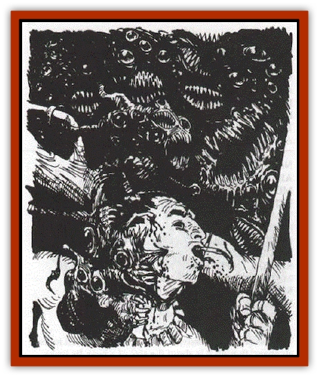

# Gibbering Mouther - Greater

| Statistic | **Gibbering Mouther, Greater** |
| --- | --- |
| **Activity Cycle:** | Day |
| **Alignment:** | Neutral |
| **Armor Class:** | 1 |
| **Climate/Terrain:** | Swamps, jungle, underground |
| **Damage/Attack:** | 1(26) plus special |
| **Diet:** | Omnivore |
| **Frequency:** | Unique |
| **Hit Dice:** | 8 |
| **Intelligence:** | Low (7) |
| **Magic Resistance:** | Nil |
| **Morale:** | Fanatic (17) |
| **Movement:** | 6,Sw9 |
| **No. Appearing:** | 1 |
| **No. of Attacks:** | 6+ |
| **Organization:** | Solitary (monarchy) |
| **Size:** | L (8' tall) |
| **Special Attacks:** | Gibbering, spit, bite, spawn |
| **Special Defenses:** | Regeneration |
| **THAC0:** | 13 |
| **Treasure:** | Q, A (gems and gold only) |
| **XP Value:** | 5000 |

The one greater gibbering mouther known to exist is Xuxeteanlahucuxolazapaminaco, god-king of the Amedio nation of Chetanicatla. Larger and stronger than others of its kind, it considers itself a god. The descriptions below indicate its additional abilities beyond those of typical [[Gibbering_Mouther|gibbering mouthers]].

**Combat:** The spittle of the greater gibbering mouther bursts into flame when it strikes a solid object. It may spit up to 20' away, causing 2d6 damage to the target and setting combustibles on fire.

Once a week it may separate a small portion of itself, normally only one or two mouths and a few eyes, creating an independent creature called a gibberspawn.

The mouther regenerates 2 hit points per round.

**Habitat/Society:** This creature lives in areas where it can dominate many beings such as in an inhabited ruin or humanoid lair. It thrives on attention and offerings; its appetite is such that its environment is quickly depleted unless it lives where there is a constantly renewing food source.

Unlike other gibbering mouthers, when it reproduces it does not form two creatures by asexual fission; one part retains the mind and abilities of the original and the other becomes a normal gibbering mouther.

**Ecology:** An unexpected mutation of an artificial magic creature, the greater gibbering mouther has no natural place in any ecology. It has depended for so long on others bringing it food that it would have a hard time hunting, especially as the creature is more of a scavenger than a hunter.

**Gibberspawn**

A grapefruit-sized blob with a few eyes and mouths, a gibberspawn is a barely-intelligent bud of the greater gibbering mouther. It normally attaches itself to a living creature and slowly drains blood (1 hp per day) as its victim carries it around. The gibberspawn is able to give wordJess suggestions to its host (similar to a *suggestion* spell, but only conveying emotions and simple thoughts), which it normally does in service to its monstrous parent. With the help of the gibberspawn, a greater gibbering mouther is able to control a significant territory. Gibberspawn are AC 7, 1 HD, have a movement rate of 3 and are worth 65 XP.

---
## Discovery & Documentation

**Source Publication:** The Scarlet Brotherhood (1999)
**Campaign Setting:** Greyhawk
**Author(s):** Sean Reynolds, Kij Johnson, Chris McKitterick, Lisa Stevens, Erik Mona, Roger Moore, Steve Wilson, Sam Wood, Dawn Murin

### Other Creatures Found in This Source Book
   * [[Onco|Onco]]
   * [[Ravenous|Ravenous]]
   * [[Su-Monster|Su-Monster]]
   * [[Thousandtooth|Thousandtooth]]
   * [[Tlokasazotz_Olman_Bat-Vampire|Tlokasazotz (Olman Bat-Vampire)]]
