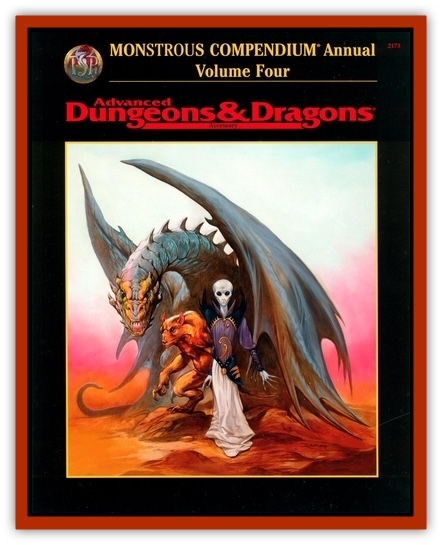

# Gibberling - Brood

| Statistic | **Gibberling, Brood** |
| --- | --- |
| **Activity Cycle:** | Night |
| **Alignment:** | Chaotic neutral |
| **Armor Class:** | 8 |
| **Climate/Terrain:** | Special |
| **Damage/Attack:** | 1d4+4 (bite) |
| **Diet:** | Carnivore |
| **Frequency:** | Very rare |
| **Hit Dice:** | 6 |
| **Intelligence:** | Very (11-12) |
| **Magic Resistance:** | Nil |
| **Morale:** | Elite (13) |
| **Movement:** | 12 |
| **No. Appearing:** | 1-4 |
| **No. of Attacks:** | 1 + special |
| **Organization:** | Clan |
| **Size:** | M (3' tall) |
| **Special Attacks:** | Gibberslug |
| **Special Defenses:** | Nil |
| **THAC0:** | 16 |
| **Treasure:** | Nil (E) |
| **XP Value:** | 950 |

[[Gibberling|Gibberlings]] gibber. They also jabber, scream, howl and chitter. It is now believed that they are the unholy remnants of unfortunate humanoids who have been altered by insane agencies not of this world; they are the progeny of brood gibberlings.

Brood gibberlings are pale, deformed, and twisted humanoids, possessing slavering maws like pits, manes of filthy black hair like evil halos, and eyes filled with a malignant cunning. Most disturbing is the way that a brood gibberling's flesh visibly *moves* as small creatures, called *gibberslugs*, skitter beneath its skin. Behind these "skinpets", a sickening trail of slowly receding flesh protrusions leaves no uncertainty as to a brood gibberling's infested state.

**Combat:** In combat, brood gibberlings deliver a vicious bite that stands a 50% chance of injecting a gibberslug into the fresh wound. Failing direct injection, a brood gibberling can, once every 4 rounds, spit a burrowing gibberslug at a melee target (treat range as a dagger) in addition to any normal action and before the resolution of normal actions. When gibberslugs are seen, they resemble bloated leeches, the pulsing pink color of newborn hairless mice, complete with a nasty maw ideal for penetrating skin or soft tissue.

A successful attack (bite or spit) indicates that victims who fail a save vs. death are unable to brush away or shake off the gibberslug before it easily penetrates skin or hide. Flame applied to the gibberslug's point of entry within one round automatically kills the slug (and the victim takes 1d4 points of damage). Ingestion of a specialized mushroom called *darkscape* (which grows only in regions twisted by the influence of an extra-dimensional region known as the Far Realm) immediately kills a burrowing gibberslug.

Infected victims suffer 1d4 damage each round as the slug bores its way through the soft tissue toward the brain, its ultimate goal. The slug reaches gray matter in 1d6+5 combat rounds, at which time it melds itself to the victim's brain stem. The victim immediately drops into a sleep from which none can awaken him, as nightmares of ghoulish intensity begin to ravage his mind; at this point the victim is unrecoverably by any means save a *wish*. The nightmares are a side effect of the gestating slug, which quickly digests the host's brain, then body, from within.

When the process is completed (in 1d20+4 hours), a fully grown gibberling emerges from the husk of skin left behing by the victim. The newborn gibberling possesses no memory of its former life (but does slightly resemble the victim). It immediately rushes to attack the nearest living creature not of its own kind, or flees to seek ist own kind if exposed to bright light.

**Habitat/Society:** The origins of the brood gibberlings lie in a realm that some believe to be beyond planar cosmology as it is currently understood. Only through incautious exploration of magical gates have these creatures arrived from the other side; however, most of those transplanted here can survive only so long as they remain close to an area under the influence of their home Realm. Their gibberling progeny, however, seem to have no such restrictions, and bedevil civilization far and wide.

Within the secluded burrows where brood gibberlings live, ragged husks lie discarded about the floor, the remnants of gibberling birthing. A brood gibberling can mentally control any gibberlings which it has personally created, giving rise to various clans of gibberlings, each controlled by one brood gibberling. Clans sometimes cooperate and sometimes war, depending upon the whims of their progenitors. Brood gibberlings often seek to "convert" gibberlings of other clans to its own.

**Ecology:** Brood gibberlings are tied to the miles-wide field of corruption that accompanies and surrounds gates keyed to the Far Realm, and cannot live for long beyond its influence. What form a brood gibberling takes in its home realm is difficult to say. It is probable that form does not bear much in common with their physiology as described here.

---
## Discovery & Documentation

**Source Publication:** Monstrous Compendium, 1997 Annual, Volume 4 (1995)
**Campaign Setting:** Advanced Dungeons & Dragons 2nd Edition
**Author(s):** Jon Pickens

### Other Creatures Found in This Source Book
   * [[Anemone_Giant_Sea|Anemone, Giant Sea]]
   * [[Asperii|Asperii]]
   * [[Bainligor|Bainligor]]
   * [[Beast_of_Chaos|Beast of Chaos]]
   * [[Blindheim|Blindheim]]
   * [[Bloodsipper_Far_Realm|Bloodsipper (Far Realm)]]
   * [[Bulette_Gohlbrorn|Bulette, Gohlbrorn]]
   * [[Child_of_the_Sea|Child of the Sea]]
   * [[Clockwork_Horror|Clockwork Horror]]
   * [[Clockwork_Swordsman|Clockwork Swordsman]]
   * [[Coral|Coral]]
   * [[Darklore|Darklore]]
   * [[Dharculus|Dharculus]]
   * [[Dolphin_Athas|Dolphin (Athas)]]
   * [[Dragon_Neutral_Moonstone|Dragon, Neutral, Moonstone]]
   * [[Dragon_Prismatic|Dragon, Prismatic]]
   * [[Dream_Stalker|Dream Stalker]]
   * [[Dragon-kin_Albino_Wyrm|Dragon-kin, Albino Wyrm]]
   * [[Echyan|Echyan]]
   * [[Firestar|Firestar]]
   * [[Firetail|Firetail]]
   * [[Fish_Ascallion|Fish, Ascallion]]
   * [[Fish_Deep_Ocean|Fish, Deep Ocean]]
   * [[Fish_Tropical|Fish, Tropical]]
   * [[Fish_Vurgens|Fish, Vurgens]]
   * [[Fogwarden|Fogwarden]]
   * [[Fraal|Fraal]]
   * [[Giant_Crag|Giant, Crag]]
   * [[Glutton_Sea|Glutton, Sea]]
   * [[Golden_Ammonite|Golden Ammonite]]
   * [[Golem_Brass_Minotaur|Golem, Brass Minotaur]]
   * [[Golem_Gemstone|Golem, Gemstone]]
   * [[Golem_Maggot|Golem, Maggot]]
   * [[Groundling|Groundling]]
   * [[Hermit_Sea|Hermit, Sea]]
   * [[Hound_of_Law|Hound of Law]]
   * [[Human_Amazon|Human, Amazon]]
   * [[Human_Pygmy|Human, Pygmy]]
   * [[Inquisitor|Inquisitor]]
   * [[Kercpa|Kercpa]]
   * [[Kreel|Kreel]]
   * [[Lycanthrope_Lythari|Lycanthrope, Lythari]]
   * [[Mercurial|Mercurial]]
   * [[Mold_Chromatic|Mold, Chromatic]]
   * [[Mummy_Bog|Mummy, Bog]]
   * [[Neh-thalggu|Neh-thalggu]]
   * [[Nymph_Grain|Nymph, Grain]]
   * [[Nymph_Unseelie|Nymph, Unseelie]]
   * [[Octopus_Octo-Jelly|Octopus, Octo-Jelly]]
   * [[Puddingfish|Puddingfish]]
   * [[Sea_Demon|Sea Demon]]
   * [[Shade|Shade]]
   * [[Shadowrath|Shadowrath]]
   * [[Shark_Athas|Shark (Athas)]]
   * [[Siren_Ravenloft|Siren (Ravenloft)]]
   * [[Skeleton_Variant|Skeleton, Variant]]
   * [[Skyfish|Skyfish]]
   * [[Spectral_Scion|Spectral Scion]]
   * [[Spyder_Fiend|Spyder Fiend]]
   * [[Squid_Squark|Squid, Squark]]
   * [[Tanar'ri_Lesser_Uridezu|Tanar'ri, Lesser, Uridezu]]
   * [[Troll_Mutate|Troll Mutate]]
   * [[Vaati|Vaati]]
   * [[Vampire_Cerebral|Vampire, Cerebral]]
   * [[Varkha|Varkha]]
   * [[Wizshade|Wizshade]]
   * [[Worm_Lukhorn|Worm, Lukhorn]]
   * [[Wyste|Wyste]]
   * [[Yugoloth_Lesser_Gacholoth|Yugoloth, Lesser, Gacholoth]]
   * [[Zombie_Mud|Zombie, Mud]]
