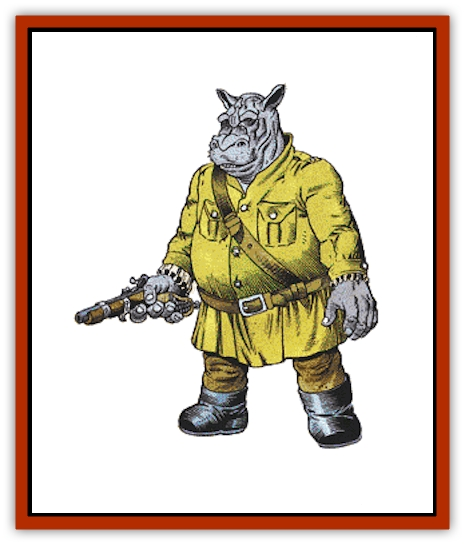

# Giff

| Statistic | **Giff** |
| --- | --- |
| **Activity Cycle:** | Day |
| **Alignment:** | Lawful neutral |
| **Armor Class:** | 6 (2) |
| **Climate/Terrain:** | Any |
| **Damage/Attack:** | 1-6 +7 or by weapon +7 |
| **Diet:** | Omnivore |
| **Frequency:** | Rare |
| **Hit Dice:** | 4 |
| **Intelligence:** | Low (7) |
| **Magic Resistance:** | 10% |
| **Morale:** | Elite (14) |
| **Movement:** | 6 |
| **No. Appearing:** | 11-20 |
| **No. of Attacks:** | 2 or 1 |
| **Organization:** | Platoon |
| **Size:** | L (9' tall) |
| **Special Attacks:** | Head butt |
| **Special Defenses:** | Can call on other giff |
| **THAC0:** | 17 |
| **Treasure:** | Nil |
| **XP Value:** | 420 |

The giff are a race of powerfully muscled mercenaries. They are civilized, though they lack mages among their own race. Giff hire on with various groups throughout the universe as mercenaries, bodyguards, enforcers, and general legbreakers.

The giff is humanoid, with stocky, flat, cylindrical legs and a humanoid torso, arms, and fingers. Its chest is broad and supports a hippopotamus head with a natural helmet of flexible, chitinous plates. Giff come in colors ranging from black to gray to a rich gold, and many have colorful tattoos that leave their bodies a patchwork record of past victories. Giff speak their own language and the Common tongue.

**Combat:** The giff are military-minded, and organize themselves into squads, platoons, companies, corps, and larger groups. The number of giff in a platoon varies according to the season, situation, and level of danger involved. A giff "platoon" hired to protect a gambling operation may number two, while a platoon hired to invade an [[Mind_Flayer|illithid]] stronghold may number well over a hundred.

The giff pride themselves on their weapon skills, and any giff carries a number of swords, daggers, maces, and similar tools on hand to deal with troublemakers.

A giff's true love in weaponry is the gun. Any giff has a 20% chance of having an arquebus and sufficient smoke powder for 2d4 shots. A misfiring weapon matters little to the giff (occasional fatalities are expected), the flash, noise, and damage is what most impresses them.

Even unarmed, the giff are powerful opponents. They are as strong as a [[Giant_Hill|hill giant]] (+7 damage adjustment for Strength). They will wade into a brawl just for the pure fun of it, tossing various combatants on both sides around to prove themselves the victors. Once a weapon is bared, the giff consider all restrictions off - the challenge is to the death.

The top of the giff's head and snout are plated with thick, chitinous plates, flexible enough to permit motion, but giving the creature a natural helmet. The giff can charge using a head butt, inflicting 2d6 points of damage.

The giff prize themselves as mercenaries, and to that end have made elaborate suits of armor (AC 2). These include full helms with other monsters on the crests, inlaid with ivory and bone along the large plates. Armor repair is a major hobby among the giff.

Finally, giff are somewhat magic resistant. They are deeply suspicious of magic, magicians, and magical devices.

**Habitat/Society:** The giff are happiest among their own race - they consider larger races such as giants threatening and complain about the fragility of the smaller races. Unlike the [[Dracon|dracons]], they suffer no penalties for being apart from their fellows, but merely prefer the company of their own species. Outside their own platoons, the giff are happiest among military organizations with a strong chain of command.

Every giff, male, female, and giffling, has a rank within society, which can only be changed by someone of higher rank. Within this rank are subranks and within those subranks are color markings and badges. The highest-ranking giff gives the orders, the others obey. It does not matter if the orders are foolish or even suicidal - following them is the purpose of the giff in the universe. A quasi-mystical faith among the giff mercenaries confirm that all things have their place, and the giff's is to follow orders. This makes the giff very happy.

Giff platoons can be hired by those looking for their muscle. The [[Arcane|arcane]] do a small business in giff mercenaries, but usually local contractors perform the task. These contractors review prospective employers according to ability to pay, then make a recommendation to the giff leaders. The leaders, in turn, consider the danger of the job, and whether taking it will enhance their giffdom.

Giff jobs are usually paid in smoke powder, though they often will accept other weapons and armor. It is purely a barter system, but to hire one giff for one standard week requires seven charges of smoke powder (one/day). In areas where smoke powder is more common, the price will rise.

On board ship, the giff have their own quarters, and will often request to bring on their own large weapons. They favor greek fire projectors and bombards for ground work, and will happily blaze away at opponents, regardless of the tactical situation.

The giff require the ships of others because they have no spellcasting abilities among them - they are magically inert in such a way that even the serial helms of the mind flayers have no effect on them. Lifejammers are considered to be a "wizard's way to die" (a giff insult). Giff trade their services for transport and for weapons - especially smoke powder.

Giff of both sexes serve in their platoons, and both fight equally well. Gill young are raised tenderly until they are old enough to survive an exploding arquebus, then are inducted fully into the platoon.

Giff are fierce fighters, despite their somewhat comical appearance and mania for weapons. They will not, however, willingly fight other giff. If forced into such a situation on a battlefield, both groups will retire for at least a day of drinking and sorting out ranks. There is a 10% chance that one platoon will join another in this case, but most likely both will quit their current hirings and look for work elsewhere.

**Ecology:** Like the dracon, the giff are surmises to have evolved from one world, which was not blessed with a wide variety of intelligent species such as [[Elf|elves]], men, [[Dwarf|dwarves]], and [[Beholder_and_Beholder-kin_I|beholders]]. Sages point to the giff as an example of what happens when only one sentient species is found on a planet.

The giff homeworld is the stuff of legend; as no living giff has seen it. Some tales say that the homeworld was destroyed by the giff, who were rescued by the arcane. Others say that the giff sold their planet and their lives to the arcane in exchange for spelljamming helms they could not use. Still others say that the giff homeworld is just beyond the range of one's ship, in a land where such warrior races are common, and the losers are exiled to the known worlds.

Whatever the truth, the giff describe their homeworld in legendary terms - a thick, verdant jungle, covered with swamps, mangrove trees, and fruit plants. The few mountains are rich in metals, caches of weapons. and smoke powder.

The giff practice equality among the sexes in battle and in childrearing. They live about 70 years, but do not take aging gracefully. As a giff grows older and begins to slow down, he is possessed with the idea of proving himself still young and vital, usually in battle. As a result, there are very, very few old giff.

---
## Discovery & Documentation

**Source Publication:** AD&D Adventures In Space (1989)
**Campaign Setting:** Spelljammer
**Author(s):** Jeff Grub

### Other Creatures Found in This Source Book
   * [[Arcane|Arcane]]
   * [[Beholder_and_Beholder-kin_I|Beholder and Beholder-kin I]]
   * [[Beholder_and_Beholder-kin_II|Beholder and Beholder-kin II]]
   * [[Dracon|Dracon]]
   * [[Dragon_Radiant|Dragon, Radiant]]
   * [[Elmarin|Elmarin]]
   * [[Ephemeral|Ephemeral]]
   * [[Kindori|Kindori]]
   * [[Krajen|Krajen]]
   * [[Neogi|Neogi]]
   * [[Scavver|Scavver]]
