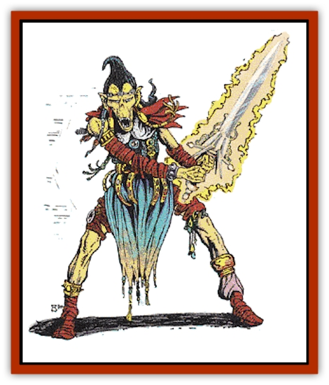

# Githyanki

| Statistic | **Githyanki** |
| --- | --- |
| **Activity Cycle:** | Any |
| **Alignment:** | Any evil |
| **Armor Class:** | Per armor |
| **Climate/Terrain:** | Astral or prime |
| **Damage/Attack:** | Per weapon type |
| **Diet:** | Omnivore |
| **Frequency:** | Very rare |
| **Hit Dice:** | Per class and level |
| **Intelligence:** | Exceptional to genius (15-18) |
| **Magic Resistance:** | Nil |
| **Morale:** | Average to elite (8-14) |
| **Movement:** | 12, 96 on Astral plane |
| **No. Appearing:** | 2-8 (away from lair) |
| **No. of Attacks:** | Per class and level |
| **Organization:** | Dictatorship/monarchy |
| **Size:** | M (6' tall) |
| **Special Attacks:** | Possible spell use, possible magical weapon |
| **Special Defenses:** | Nil |
| **THAC0:** | Per class and level |
| **Treasure:** | Individuals R; Lair H |
| **XP Value:** | Per class and level |

**Psionics Summary**

| Level | Dis/Sci/Dev | Attack/Defense | Score | PSPs |
| --- | --- | --- | --- | --- |
| =HD | per level | All/All | =Int | 1d100+150 |

Githyanki are an ancient race descended from humans. They dwell upon the Astral plane but will often leave that plane to make war on other races. They are engaged in a lengthy war with the [[Githzerai|githzerai]].

Githyanki are strongly humanoid in appearance. They are approximately of human height but tend to be much more gaunt and long of limb. They have rough, yellow skin and gleaming black eyes that instantly betray their inhumanness. Like many demihuman races, their ears have sharp points and are serrated at the back. Dress for the githyanki is always an elaborate affair. Their baroque armor and weapons of war are decorated with feathers, beads, and precious metals and gems.

Githyanki speak their own tongue, and no others.

**Combat:** The githyanki have had long years to perfect the art of war. Their very existence attests to their battle prowess. Each individual githyanki has a character class and level from which are derived such things as THAC0, armor class, spell use, etc.

| Roll | Class | Roll | Level |
| --- | --- | --- | --- |
| 01-40 | Fighter | 01-20 | 3rd |
| 41-55 | Mage | 21-30 | 4th |
| 56-80 | Fighter/Mage | 31-40 | 5th |
| 81-85 | Illusionist | 41-60 | 6th |
| 86-00 | Knight | 61-80 | 7th |
|  |  | 81-90 | 8th |
|  |  | 91-95 | 9th |
|  |  | 96-98 | 10th |
|  |  | 99-00 | 11th |

The armor for each githyanki varies according to class. Mages and illusionists have AC 10. Fighters and fighter mages have differing armor - AC 5 to AC 0 (6-1d6). Knights have AC 0.

Githyanki have Hit Dice according to their class and level, and their hit points are rolled normally. Their THAC0 is determined per class and level, as well. Fighters, fighter/mages, and knights may receive more than one attack per round - other githyanki have one attack per round.

Githyanki knights are evil champions who take up the causes of the githyankis' mysterious [[Lich|lich]]-queen. Githyanki knights are very powerful and highly revered in their society. Githyanki knights have all of the powers and abilities of a human paladin except these are turned toward evil (e.g. *detect good* instead of *detect evil*, *command undead* instead of turning undead, etc.).

Githyanki mages, fighter/mages, and illusionists will receive all the spells available at their level of experience. Spells should be determined randomly, keeping in mind that they are by nature creatures of destruction - offensive spells should be favored.

The githyanki soldiers use arms and armor similar to humans, however these are normally highly decorated and have become almost religious artifacts. A githyanki would likely show greater care for his weapons and armor than he would toward his mate. Half of the githyanki fighters, fighter/mages, or knights that progress to 5th level receive a magical *two-handed sword +1*, the remainder using normal two-handed swords. Githyanki fighters of 7th level and above are 60% likely to carry a *long sword +2*. Knights of 7th level and above will always carry a *silver sword* - a *two-handed sword +3* that, if used astrally, has a 5% chance per hit of cutting an opponent's silver cord (see The Astral Plane , DMG, page 132), but *mind barred* individuals are immune. A supreme leader of a lair will carry a special *silver sword* that is +5 with all the abilities of a *vorpal weapon* that also affects *mind barred* individuals.

Githyanki will never willingly allow a *silver sword* to fall into the hands of a nongithyanki. If a special *silver sword* should fall into someone's hands, very powerful raiding parties will be formed to recover the sword. Failure to recover one of these highly prized weapons surely means instant death to all the githyanki involved at the hands of their merciless lich-queen.

All githyanki have the natural ability to *plane shift* at will. They will rarely travel anywhere besides back and forth from the Astral plane to the Prime Material plane.

**Habitat/Society:** History provides some information on the githyanki - their race is both ancient and reclusive. Sages believe they once were humans that were captured by mind flayers to serve as slaves and cattle. The [[Mind_Flayer|mind flayers]] treated their human slaves cruelly and the people harbored a deep resentment toward the [[Mind_Flayer|illithids]]. For centuries these humans increased their hatred but could not summon the strength necessary to break free. So they waited for many years, developing their power in secret, waiting for an opportunity to strike out against their masters. Finally, a woman of power came forth among them, a deliverer by the name of [[Gith|Gith]]. She convinced the people to rise up against their cruel masters. The struggle was long and vicious, but eventually the people freed themselves. They had earned their freedom and become the githyanki, (which, in their tongue, means sons of Gith).

These astral beings progress through levels exactly as a human would. However, there has never been a githyanki that has progressed beyond the 11th level of experience and very few progress beyond 9th. When a githyanki advances to 9th level, he is tested by the lich-queen. This grueling test involves survival in one of lower planes for a number of weeks. Failure quite obviously results in death. Githyanki that reach 12th level of experience are immediately drawn out of the Astral plane and into the presence of the lich-queen where their life force is drawn to feed the ravenous hunger of the cruel demi-goddess.

Githyanki dwell in huge castles on the Astral plane. These ornately decorated castles are avoided by all other dwellers on the Astral plane for the githyanki are infamous for being inhospitable to strangers.

A githyanki stronghold will be ruled by a supreme leader. This leader will be a fighter/mage of 10th/8th level or 11th/9th level. The supreme leader is the undisputed overlord of the castle with the power of life and death over all who dwell there. A typical leader will be equipped with 2-8 random magical items in addition to the weapons described above.

All castles have a retinue of 20-80 knights of 9th level that serve as the supreme leader's elite shock troops. They are fanatically loyal. There will also be up to 1,000 githyanki of lesser status.

Githyanki, having the ability to *plane shift* at will, often travel to the Prime Material plane. These treks across the planes often lead to the formation of underground lairs used to mount surface raids, though their hatred is more often directed against mind flayers. Outside the war with the githzerai, these raids are conducted largely for the perverse pleasure of the kill.

A typical githyanki lair on the Prime Material plane will contain the following:

<ul><li>One supreme leader - 11th-level fighter or 7th/8th-level fighter/mage</li><li>Two captains - 8th-level fighter and 7th/6th-level fighter/mage</li><li>One knight - 8th level</li><li>Two warlocks - mages of 4th/7th level</li><li>Three sergeants - fighters of 4th/7th level</li><li>Two �gish' - fighter/mages of 4th/4th level</li><li>20-50 lower levels determined randomly using the table above, of 1st-3rd level</li></ul>On the Prime Material plane, githyanki have a pact with a group of [[Dragon_Chromatic_Red|red dragons]]. These proud creatures will act as mounts and companions to the githyanki. When encountered on the Prime Material plane and outside their lair, a githyanki group will typically consist of the following:

<ul><li>One captain - 8th-level fighter</li><li>One warlock - 4th to 7th-level mage</li><li>Five lower githyankis - fighters of 1st-3rd level</li></ul>Such a group will have two red dragons as steeds, transporting between four and six githyanki per dragon. The dragons will fight for the safety and well-being of the githyanki but will not directly risk their lives, fleeing when the battle is turned against them. Just what the githyanki offer the red dragons in return for these services is unknown.

An interesting aspect of githyanki society is the apparent bond between military leaders and their subordinates. This bond allows a leader to give his men short, almost senseless commands (to human standards) and actually relay complex and exacting messages. Although this has no actual affect during the melee round, it often leads to more effective ambushes and attacks and allows complex military decisions to be relayed quickly.

**Ecology:** Githyankis have similar ecology to that of humans. However, the Astral plane does not offer the same type of environments as the Prime Material plane, so their cultural groups are much different. In a society where farmers and tradesmen are unnecessary, more unique, specialized groups have evolved.

**G''lathk:** The g''lathk, (admittedly nearly unpronounceable in human tongues) are the equivalent of farmers. Due to the barrenness of the Astral plane, the githyanki are forced to grow food in vast, artificial chambers. They rely upon a variety of fungi and other plants that require no sunlight to grow. The g''lathk are also experts in aquatic plantlife, sometimes tending gigantic water-gardens.

**Mlar:** Not all magic-using githyanki ever attain the power and self-discipline necessary to become wizards. Some use their magical talents in the field of architecture and construction. The mlar are such individuals, focusing their creative energies toward designing and constructing the buildings and structures used in day-to-day life in githyanki society. The mlar have developed their jobs into an art form.

Hr'a'cknir: The Astral plane has many strange energies moving through it. Some of these energies are obvious to the senses, such as heat and light. Others are not so easily observed. There are many psychic and strange astral energies that humans generally are not aware of. Being a psychically aware race, however, the githyanki cannot only sense these energies, but harness them too. The hr'a'cknir are the collectors of those energies. They are similar to the mlar, in that they use innate magical powers to perform their crafts.

More than humans, githyanki are hunters and predators. They will typically engage in raiding and plundering seemingly for the joy they derive from it. It is likely that the long centuries of enslavement of their race has caused the githyanki to bully those weaker than themselves.

Unlike humans, though, the githyanki never war amongst themselves. The split of the githyanki and the githzerai is the closest thing the gith races have known to civil war. Githyanki never battles githyanki. It is the unwritten rule of gith society and is never broken. This, too, may be an effect of the race's enslavement.

---
## Discovery & Documentation

**Source Publication:** MC8 Outer Planes Appendix (1990)
**Campaign Setting:** Planescape
**Author(s):** Timothy B. Brown, Jamie LaFountain

### Other Creatures Found in This Source Book
   * [[Aasimon_Agathinon|Aasimon, Agathinon]]
   * [[Aasimon_Deva|Aasimon, Deva]]
   * [[Aasimon_Light|Aasimon, Light]]
   * [[Aasimon_General_Information|Aasimon, General Information]]
   * [[Aasimon_Planetar|Aasimon, Planetar]]
   * [[Aasimon_Solar|Aasimon, Solar]]
   * [[Air_Sentinel|Air Sentinel]]
   * [[Animal_Lord|Animal Lord]]
   * [[Archon|Archon]]
   * [[Baatezu_Lesser_Abishai|Baatezu, Lesser, Abishai]]
   * [[Baatezu_Greater_Amnizu|Baatezu, Greater, Amnizu]]
   * [[Baatezu_Lesser_Barbazu|Baatezu, Lesser, Barbazu]]
   * [[Baatezu_Greater_Cornugon|Baatezu, Greater, Cornugon]]
   * [[Baatezu_Lesser_Erinyes|Baatezu, Lesser, Erinyes]]
   * [[Baatezu_General_Information|Baatezu, General Information]]
   * [[Baatezu_Greater_Gelugon|Baatezu, Greater, Gelugon]]
   * [[Baatezu_Lesser_Hamatula|Baatezu, Lesser, Hamatula]]
   * [[Baatezu_Lemure|Baatezu, Lemure]]
   * [[Baatezu_Least_Nupperibo|Baatezu, Least, Nupperibo]]
   * [[Baatezu_Lesser_Osyluth|Baatezu, Lesser, Osyluth]]
   * [[Baatezu_Greater_Pit_Fiend|Baatezu, Greater, Pit Fiend]]
   * [[Baatezu_Least_Spinagon|Baatezu, Least, Spinagon]]
   * [[Balaena|Balaena]]
   * [[Bariaur|Bariaur]]
   * [[Bebilith|Bebilith]]
   * [[Bodak|Bodak]]
   * [[Dog_Moon|Dog, Moon]]
   * [[Dragon_Adamantite|Dragon, Adamantite]]
   * [[Einheriar|Einheriar]]
   * [[Gehreleth|Gehreleth]]
   * [[Githzerai|Githzerai]]
   * [[Hordling|Hordling]]
   * [[Lammasu_Celestial|Lammasu, Celestial]]
   * [[Larva|Larva]]
   * [[Maelephant|Maelephant]]
   * [[Marut|Marut]]
   * [[Mediator|Mediator]]
   * [[Mortai|Mortai]]
   * [[Night_Hag|Night Hag]]
   * [[Nightmare|Nightmare]]
   * [[Noctral|Noctral]]
   * [[Per|Per]]
   * [[Phoenix|Phoenix]]
   * [[Slaad|Slaad]]
   * [[Tanar'ri_Greater_Babau|Tanar'ri, Greater, Babau]]
   * [[Tanar'ri_Greater_Chasme|Tanar'ri, Greater, Chasme]]
   * [[Tanar'ri_Greater_Nabassu|Tanar'ri, Greater, Nabassu]]
   * [[Tanar'ri_Least_Dretch|Tanar'ri, Least, Dretch]]
   * [[Tanar'ri_Least_Manes|Tanar'ri, Least, Manes]]
   * [[Tanar'ri_Least_Rutterkin|Tanar'ri, Least, Rutterkin]]
   * [[Tanar'ri_Lesser_Alu-Fiend|Tanar'ri, Lesser, Alu-Fiend]]
   * [[Tanar'ri_Lesser_Bar-Lgura|Tanar'ri, Lesser, Bar-Lgura]]
   * [[Tanar'ri_Lesser_Cambion|Tanar'ri, Lesser, Cambion]]
   * [[Tanar'ri_Lesser_Succubus|Tanar'ri, Lesser, Succubus]]
   * [[Tanar'ri_Guardian_Molydeus|Tanar'ri, Guardian, Molydeus]]
   * [[Tanar'ri_General_Information|Tanar'ri, General Information]]
   * [[Tanar'ri_True_Balor|Tanar'ri, True, Balor]]
   * [[Tanar'ri_True_Glabrezu|Tanar'ri, True, Glabrezu]]
   * [[Tanar'ri_True_Hezrou|Tanar'ri, True, Hezrou]]
   * [[Tanar'ri_True_Marilith|Tanar'ri, True, Marilith]]
   * [[Tanar'ri_True_Nalfeshnee|Tanar'ri, True, Nalfeshnee]]
   * [[Tanar'ri_True_Vrock|Tanar'ri, True, Vrock]]
   * [[Titan|Titan]]
   * [[Translator|Translator]]
   * [[T'uen-rin|T'uen-rin]]
   * [[Vaporighu|Vaporighu]]
   * [[Warden_Beast|Warden Beast]]
   * [[Yugoloth_Greater_Arcanaloth|Yugoloth, Greater, Arcanaloth]]
   * [[Yugoloth_Lesser_Dergoloth|Yugoloth, Lesser, Dergoloth]]
   * [[Yugoloth_Lesser_Hydroloth|Yugoloth, Lesser, Hydroloth]]
   * [[Yugoloth_General_Information|Yugoloth, General Information]]
   * [[Yugoloth_Lesser_Mezzoloth|Yugoloth, Lesser, Mezzoloth]]
   * [[Yugoloth_Greater_Nycaloth|Yugoloth, Greater, Nycaloth]]
   * [[Yugoloth_Lesser_Piscoloth|Yugoloth, Lesser, Piscoloth]]
   * [[Yugoloth_Greater_Ultroloth|Yugoloth, Greater, Ultroloth]]
   * [[Yugoloth_Lesser_Yagnoloth|Yugoloth, Lesser, Yagnoloth]]
   * [[Zoveri|Zoveri]]
