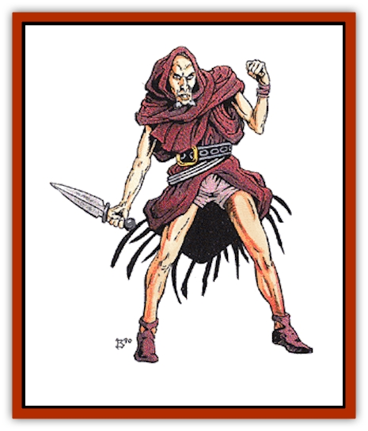

# Githzerai

| Statistic | **Githzerai** |
| --- | --- |
| **Activity Cycle:** | Any |
| **Alignment:** | Chaotic neutral |
| **Armor Class:** | Varies |
| **Climate/Terrain:** | Limbo |
| **Damage/Attack:** | Per weapon type |
| **Diet:** | Omnivore |
| **Frequency:** | Very rare |
| **Hit Dice:** | Per class and level |
| **Intelligence:** | Exceptional to genius (15-18) |
| **Magic Resistance:** | 50% |
| **Morale:** | Average to steady (8-12) |
| **Movement:** | 12, 96 in Limbo |
| **No. Appearing:** | 2-8 (away from lair) |
| **No. of Attacks:** | Per class and level |
| **Organization:** | Monarchy/dictatorship |
| **Size:** | M (6' tall) |
| **Special Attacks:** | Nil |
| **Special Defenses:** | Nil |
| **THAC0:** | Per class and level |
| **Treasure:** | Individual P; Lair H&times;2 |
| **XP Value:** | Per class and level |

**Psionics Summary**

| Level | Dis/Sci/Dev | Attack/Defense | Score | PSPs |
| --- | --- | --- | --- | --- |
| =HD | per level | All/All | =Int | 1d100+150 |

Githzerai are the monastic, chaotic neutral counterparts to the [[Githyanki|githyanki]]. The two races share a stretch of time in history; the githzerai are the lesser and more repressed offshoot of the original people that the warrior [[Gith|Gith]] helped to escape the slavery of the [[Mind_Flayer|mind flayers]] millennia ago.

Githzerai are very similar in appearance to their githyanki cousins, although they tend to look much more human. Their features are for the most part unremarkable, with vaguely noble countenance. Their skin tone is that of human caucasian flesh. Githzerai dress simply, wearing functional clothing and favoring conservative tones.

**Combat:** The githzerai are unadorned and ruthlessly straightforward with their combat and magic. Their strong resistance to magic seems to make up for their generally inferior fighting ability.

| Roll | Class | Roll | Level (add 3 if thief) |
| --- | --- | --- | --- |
| 01-55 | Fighter | 01-10 | 1st |
| 56-75 | Fighter/Mage | 11-20 | 2nd |
| 76-95 | Mage | 21-30 | 3rd |
| 96-00 | Thief | 31-45 | 4th |
|  |  | 46-60 | 5th |
|  |  | 61-75 | 6th |
|  |  | 76-90 | 7th |
|  |  | 91-96 | 8th |
|  |  | 97-00 | 9th |

The armor for each githzerai varies according to class. Mages have AC 10. Fighters and fighter mages have differing armor - AC 5 to AC 0 (6-1d6). Thieves have AC 7.

Githzerai have Hit Dice according to their class and level, and their hit points are rolled normally. Their THAC0 is determined per class and level, as well. Fighters and fighter/mages may receive more than one attack per round - other githzerai have one attack per round.

On rare occasions, a githzerai will progress as a thief. These thieves seem to have some significance to the strange githzerai religion. Although they are never known to become leaders in any capacity, these thieves are an exception to the maximum level of 9th, often progressing up to 12th level of experience. Just what role these thieves play is unknown.

Githzerai fighters of at least 5th level have use of *silver swords*. These magical weapons are *two-handed swords +3* that, if used in the Astral plane, have a 5% chance of cutting an opponent's silver cord upon scoring a hit (see The Astral Plane, DMG, page 132), though *mind barred* individuals are immune. These weapons are of powerful religious value to the githzerai and they will never willingly allow them to fall into the hands of outsiders. If this happens, the githzerai will go to great ends to recover the weapon.

All githzerai have the innate power to plane shift to any plane. This is rarely done except to travel back and forth to the Prime Material plane where the githzerai have several fortresses.

**Habitat/Society:** The githzerai were originally offspring of a race of humans that were freed from slavery under mind flayers by a great female warrior named Gith. These men and women did not, however, choose to follow Gith's ways after they revolted against their slavers. Instead, they fell sway to the teachings of a powerful wizard who proclaimed himself king - and later, god - of the people. The githzerai then separated themselves from the githyanki, beginning a great racial war that has endured the long millennia without diminishing.

Githzerai can progress as fighters, mages, or fighter/mages, and thieves. They will rarely attain levels above 7th and, in any case, will never progress beyond 9th. The githzerai, who worship a powerful and ancient wizard as though he were a god (he is not), are destroyed before they have enough power to become a threat to their ruler.

If encountered outside of their lair, githzerai will usually be in the following numbers:

<ul><li>One supreme leader - 9th-level fighter or 4th/7th-level fighter/mage</li><li>One captain - 6th-level fighter or 4th/4th-level fighter/mage</li><li>Two warlocks - mages of 3rd-5th level</li><li>Three sergeants - fighters of 3rd-5th level</li><li>Three �zerths' - fighter/mages of 3rd/3rd level</li><li>20-50 lesser githzerai - evenly distributed between the three possible classes and of 1st-3rd level</li></ul>A thief, if present (10% chance), will replace one of the lower level githzerai and will be of 6th-10th level.

The githzerai dwell primarily on the plane of Limbo. They have mighty fortresses in that plane of chaos and their position there is very strong. Typically, one of these fortresses contains approximately 3,000 githzerai led by a single supreme leader. This leader has absolute control over the githzerai, including the powers of life and death.

The githzerai hold only a few fortresses on the Prime Material plane, but these are particularly strong holdings, with walls of adamantite rising as huge squat towers from dusty plains. Each houses approximately 500 githzerai, including a supreme leader.

On Limbo, however, the githzerai presence is very strong. Living in cities typically of 100,000 or more, the githzerai enjoy total power over themselves on an otherwise chaotic and unpredictable plane. One notable example of this is the city Shra'kt'lor. This large githzerai capital is composed of some 2,000,000 githzerai living in great power. Shra'kt'lor serves as both a capital and as a headquarters for all githzerai military matters. The greatest generals and nobles of the race meet here to plan githzerai strategy for battling both the githyanki and the mind flayers. There is likely no force on Limbo that could readily threaten the power of Shra'kt'lor or its many inhabitants.

One of the prime motivations among the githzerai is their war with the githyanki. These offshoots of Gith's original race are obsessed with this war of extermination. They often employ mercenaries on the Prime Material plane to aid them in battling the githyanki. The evil, destructive nature of the githyanki makes the hiring of mercenaries to fight them a relatively simple task.

**Legend of the Zerthimon:** In githzerai lore there is a central figure that is revered above all others - Zerthimon. The githyanki believe him to be a great god that was once a man. According to githzerai lore, when the original race broke free of the mind flayers, it was Zerthimon that opposed Gith, claiming that she was hateful and unfit to lead the people.

There ensued a great battle and the people were polarized by the two powers. Those that chose to support Gith became the githyanki. Those that supported Zerthimon became the githzerai.

Zerthimon died in the battle, but in his sacrifice he freed the githzerai from Gith. The githzerai believe that someday Zerthimon, in his new godly form, will return and take the them to a place on another plane.

*Zerths* are special among the githzerai, acting as focal points for the attention of Zerthimon. The githzerai believe that when Zerthimon returns for them, he will first gather all of the zerths and lead them to their new paradise. It might be said that the zerths are the center of githzerai religion. Unfortunately, they are not free from religious persecution.

The wizard-king (whose name is not known) that rules over the highly superstitious githzerai would like very much to stamp out the legend of Zerthimon. The wizard-king believes that this legend challenges his authority, and very likely it does. However, he has never been able to rid the githzerai of this legend and he is now forced to tolerate it.

**Rrakkma bands:** Although the githzerai are not a bitter or overly violent race, they still tend to hold a strong enmity and hatred for the race of [[Mind_Flayer|illithids]] that originally enslaved the gith race so many thousands of years ago. By human terms, that may be a very long time to hold a grudge, but the githzerai see the mind flayers as the cause of the split of the Gith race and much of the hardships the githzerai are forced to endure. Thus large rrakkma (in the githzerai tongue) bands are often formed to hunt mind flayers. These bands typically consist of 30-60 githzerai warriors led by the githzerai equivalent of a sergeant. For roughly three months, these bands will roam the outer and inner planes, searching for groups of illithids and destroying them utterly. The rrakkma bands are very popular in githzerai society and it is considered to be an honor to serve in one.

The githzerai fortresses on the Prime Material plane tend to be very large affairs with great, impenetrable walls. Wherever these fortresses stand, they destroy the landscape for miles. No plants or animals live within many miles of the fortresses and the land is reduced to wasteland around them. It is not known if the effect is just the land's reaction to the "other-planar" stuff of which the castles are constructed, or if githzerai mages magically produce the effect in order to keep material beings away from these fortresses.

The most likely purpose of these fortresses on the Prime Material plane is to keep tabs on the githyanki. The githzerai, not being a particularly war-mongering or violent race, have no desire to conquer the Prime Material plane like the githyanki do. However, the githzerai realize that if their enemies have a strong hold on the Prime Material plane, they will become more powerful and thus will hold power over them. The githzerai carefully monitor the progress on the githyanki and lead coordinated, focused strikes against strongpoints of the githyanki, thus hampering their ability to expand and grow in the Prime Material plane.

During these attacks, the githzerai will not intentionally attack the natural denizens of the Prime Material plane (humans, demihumans, humanoids, etc.), but they will never sacrifice a well-planned attack on the githyanki just to preserve life. With the githzerai, the ends will always justify the means.

Like the githyanki, the githzerai really have no part in the Blood War of the fiends. They seldom venture to the lower planes, and only then for matters of absolute importance. The githzerai find the bloodthirsty, destructive nature of the fiends to be distasteful, so they will typically not deal with those creatures for any reason. They coexist with the [[Slaad|slaadi]], and githzerai are rumored to have mental powers beyond those described here.

**Ecology:** For as long as men have known of the ability to travel the planes, they have wondered at the natural power of the githzerai to wander from plane to plane at will. Although man and githzerai are not natural enemies, battles are frequently fought between the two races, due in part to some humans' desire to capture a live githzerai for study. To date, no such creature has been secured.

---
## Discovery & Documentation

**Source Publication:** MC8 Outer Planes Appendix (1990)
**Campaign Setting:** Planescape
**Author(s):** Timothy B. Brown, Jamie LaFountain

### Other Creatures Found in This Source Book
   * [[Aasimon_Agathinon|Aasimon, Agathinon]]
   * [[Aasimon_Deva|Aasimon, Deva]]
   * [[Aasimon_Light|Aasimon, Light]]
   * [[Aasimon_General_Information|Aasimon, General Information]]
   * [[Aasimon_Planetar|Aasimon, Planetar]]
   * [[Aasimon_Solar|Aasimon, Solar]]
   * [[Air_Sentinel|Air Sentinel]]
   * [[Animal_Lord|Animal Lord]]
   * [[Archon|Archon]]
   * [[Baatezu_Lesser_Abishai|Baatezu, Lesser, Abishai]]
   * [[Baatezu_Greater_Amnizu|Baatezu, Greater, Amnizu]]
   * [[Baatezu_Lesser_Barbazu|Baatezu, Lesser, Barbazu]]
   * [[Baatezu_Greater_Cornugon|Baatezu, Greater, Cornugon]]
   * [[Baatezu_Lesser_Erinyes|Baatezu, Lesser, Erinyes]]
   * [[Baatezu_General_Information|Baatezu, General Information]]
   * [[Baatezu_Greater_Gelugon|Baatezu, Greater, Gelugon]]
   * [[Baatezu_Lesser_Hamatula|Baatezu, Lesser, Hamatula]]
   * [[Baatezu_Lemure|Baatezu, Lemure]]
   * [[Baatezu_Least_Nupperibo|Baatezu, Least, Nupperibo]]
   * [[Baatezu_Lesser_Osyluth|Baatezu, Lesser, Osyluth]]
   * [[Baatezu_Greater_Pit_Fiend|Baatezu, Greater, Pit Fiend]]
   * [[Baatezu_Least_Spinagon|Baatezu, Least, Spinagon]]
   * [[Balaena|Balaena]]
   * [[Bariaur|Bariaur]]
   * [[Bebilith|Bebilith]]
   * [[Bodak|Bodak]]
   * [[Dog_Moon|Dog, Moon]]
   * [[Dragon_Adamantite|Dragon, Adamantite]]
   * [[Einheriar|Einheriar]]
   * [[Gehreleth|Gehreleth]]
   * [[Githyanki|Githyanki]]
   * [[Hordling|Hordling]]
   * [[Lammasu_Celestial|Lammasu, Celestial]]
   * [[Larva|Larva]]
   * [[Maelephant|Maelephant]]
   * [[Marut|Marut]]
   * [[Mediator|Mediator]]
   * [[Mortai|Mortai]]
   * [[Night_Hag|Night Hag]]
   * [[Nightmare|Nightmare]]
   * [[Noctral|Noctral]]
   * [[Per|Per]]
   * [[Phoenix|Phoenix]]
   * [[Slaad|Slaad]]
   * [[Tanar'ri_Greater_Babau|Tanar'ri, Greater, Babau]]
   * [[Tanar'ri_Greater_Chasme|Tanar'ri, Greater, Chasme]]
   * [[Tanar'ri_Greater_Nabassu|Tanar'ri, Greater, Nabassu]]
   * [[Tanar'ri_Least_Dretch|Tanar'ri, Least, Dretch]]
   * [[Tanar'ri_Least_Manes|Tanar'ri, Least, Manes]]
   * [[Tanar'ri_Least_Rutterkin|Tanar'ri, Least, Rutterkin]]
   * [[Tanar'ri_Lesser_Alu-Fiend|Tanar'ri, Lesser, Alu-Fiend]]
   * [[Tanar'ri_Lesser_Bar-Lgura|Tanar'ri, Lesser, Bar-Lgura]]
   * [[Tanar'ri_Lesser_Cambion|Tanar'ri, Lesser, Cambion]]
   * [[Tanar'ri_Lesser_Succubus|Tanar'ri, Lesser, Succubus]]
   * [[Tanar'ri_Guardian_Molydeus|Tanar'ri, Guardian, Molydeus]]
   * [[Tanar'ri_General_Information|Tanar'ri, General Information]]
   * [[Tanar'ri_True_Balor|Tanar'ri, True, Balor]]
   * [[Tanar'ri_True_Glabrezu|Tanar'ri, True, Glabrezu]]
   * [[Tanar'ri_True_Hezrou|Tanar'ri, True, Hezrou]]
   * [[Tanar'ri_True_Marilith|Tanar'ri, True, Marilith]]
   * [[Tanar'ri_True_Nalfeshnee|Tanar'ri, True, Nalfeshnee]]
   * [[Tanar'ri_True_Vrock|Tanar'ri, True, Vrock]]
   * [[Titan|Titan]]
   * [[Translator|Translator]]
   * [[T'uen-rin|T'uen-rin]]
   * [[Vaporighu|Vaporighu]]
   * [[Warden_Beast|Warden Beast]]
   * [[Yugoloth_Greater_Arcanaloth|Yugoloth, Greater, Arcanaloth]]
   * [[Yugoloth_Lesser_Dergoloth|Yugoloth, Lesser, Dergoloth]]
   * [[Yugoloth_Lesser_Hydroloth|Yugoloth, Lesser, Hydroloth]]
   * [[Yugoloth_General_Information|Yugoloth, General Information]]
   * [[Yugoloth_Lesser_Mezzoloth|Yugoloth, Lesser, Mezzoloth]]
   * [[Yugoloth_Greater_Nycaloth|Yugoloth, Greater, Nycaloth]]
   * [[Yugoloth_Lesser_Piscoloth|Yugoloth, Lesser, Piscoloth]]
   * [[Yugoloth_Greater_Ultroloth|Yugoloth, Greater, Ultroloth]]
   * [[Yugoloth_Lesser_Yagnoloth|Yugoloth, Lesser, Yagnoloth]]
   * [[Zoveri|Zoveri]]
