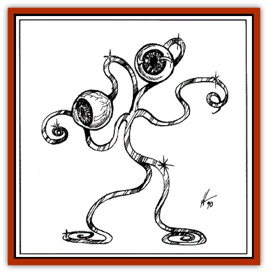
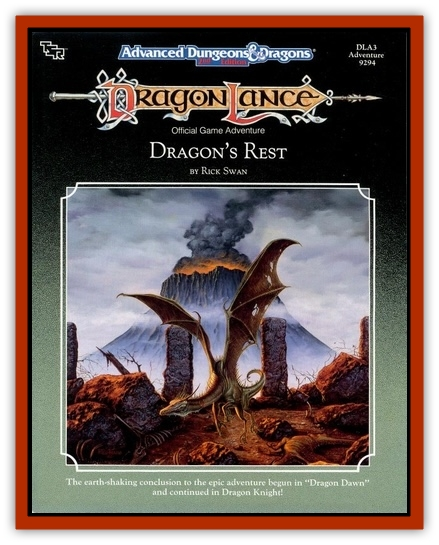

# Gk'lok-Lok

| Statistic | **Gk'lok-Lok** |
| --- | --- |
| **Activity Cycle:** | See below |
| **Alignment:** | Lawful neutral |
| **Armor Class:** | -1 |
| **Climate/Terrain:** | Ethereal plane |
| **Damage/Attack:** | 1-2/1-2 (arm needles) or 1-4/1-4 (arm slash) |
| **Diet:** | See below |
| **Frequency:** | Very rare |
| **Hit Dice:** | 1 + 1 |
| **Intelligence:** | Average (8-10) |
| **Magic Resistance:** | 20% |
| **Morale:** | Elite (13) |
| **Movement:** | 9 |
| **No. Appearing:** | 1 (active) and 1,000-6,000 (hibernating tribe) |
| **No. of Attacks:** | 2 |
| **Organization:** | Tribe |
| **Size:** | S (4' tall) |
| **Special Attacks:** | Nil |
| **Special Defenses:** | See below |
| **THAC0:** | 19 |
| **Treasure:** | Nil |
| **XP Value:** | 420 |

The gk'lok-lok are a race of extraplanar creatures that spend their lives sleeping and dreaming, vicariously experiencing the lives of dead warriors of other races.

A gk'lok-lok stands about four feet tall. Its body is a series of thin tubes that glisten and sparkle like polished steel. Its torso is a single tube resembling the stalk of a plant, with two long tubes for legs ending in hooked “feet,” and two tubes for arms that curl in seemingly random patterns.

Two thin stalks, which glisten like steel, extend from the "neck" of the torso. Each stalk ends in a bulging eyeball about one-fourth the size of the body. A violet iris surrounds the huge black pupil, and an aura of soft red flames surrounds the entire eyeball. The eyestalks twist and turn like serpents, enabling the gk'lok-lok to examine its surroundings from all angles.

gk'lok-lok does not communicate orally. Instead, it “speaks” by twisting its arms into intricate patterns, each pattern representing a different word or phrase. Additionally, a gk'lok-lok can speak with spirits at will. This ability enables it to mentally communicate with the spirits of all creatures, as well as [[Ghost|ghosts]], [[Spectre|spectres]], and all other types of undead.

Gk'lok-lok are adept at understanding the oral communication of other intelligent creatures: a gk'lok-lok has a 90% chance of understanding any spoken language.

**Combat:** Gk'lok-lok are normally docile and nonviolent. In hostile situations, the gk'lok-lok's typical reaction is to turn invisible (which it can do at will) and retreat. However, when necessary, the gk'lok-lok can attack by shooting three-inch-long steel needles from the end of each arm at targets up to 25 feet away to cause 1-2 points of damage (the gk'lok-lok can fire a total of two needles per round; new needles are automatically created inside its tube-arms). It can also make slashing attacks with its razor-thin arms to cause 1d4 points of damage. The wiry body of a gk'lok-lok is exceptionally difficult to hit (thus the low Armor Class). Gk'lok-lok are immune to *sleep*, *charm*, *hold*, *suggestion*, and *hypnotism* spells. They are also immune to all types of fire-based and electrical attacks.

**Habitat/Society:** gk'lok-lok tribe consists of 1,000-6,000 members. All of the tribesmen except two are dormant. One of the nondormant tribesmen is called the “stem” member. The stem member plants itself in the ground and transforms itself into an immense tree of green crystal with hundreds of branches. A shimmering aura of soft red flames surrounds the tree (contact with the flames causes 1d6 points of damage to non-gk'lok-lok; roll a successful saving throw vs. spell for half damage). All of the dormant members hang from the branches of the crystal tree, where they spend the rest of their lives asleep.

The second nondormant tribesman is called the “active” member. The active member is responsible for ensuring a steady supply of fresh experiences for the dreaming gk'lok-lok. Extraplanar travelers who meet untimely demises are good sources of new spirits. Because a single spirit can provide experiences for the slumbering tribe for a century a more (the gk'lok-lok enjoy reliving experiences over and over again), the active gk'lok-lok's job is not particularly demanding.

New spirits can only be recruited voluntarily. In general, spirits find association with a gk'lok-lok tribe to be a safe and pleasant way to spend a portion of their afterlives. The spirits are protected from all hostile forces and are free to mingle with the other spirits in the tree.

If the active tribesmen is killed, a dormant tribesman awakens to take his place. If the slumber of one or all of the dormant tribal members is disturbed, or if their crystal tree is threatened, all of the dormant members wake up and attack until the opponent withdraws or is killed.

All members of the same tribe have identical life spans, typically about 100,000 years. When they reach the end of their natural lives, all of the dormant tribesmen, along with the active tribesman, crumble to dust. The crystal tree splits open and blasts 1d4 spore balls into the air. The spore balls drift for about a century, at which time they release 1,000-6,000 spores; the spores from the ball comprise a new tribe. One of the spores grows into the stem member, another grows into the active member, and the rest become dormant members.

**Ecology:** Gk'lok-lok absorb all necessary nutrients from the atmosphere. They have no natural enemies.

---
## Discovery & Documentation

**Source Publication:** DLA3 Dragon's Rest (1990)
**Campaign Setting:** Dragonlance
**Author(s):** Rick Swan, Mike Breault, Valerie Valusek

### Other Creatures Found in This Source Book
   * [[Chronolily|Chronolily]]
   * [[Chulcrix|Chulcrix]]
