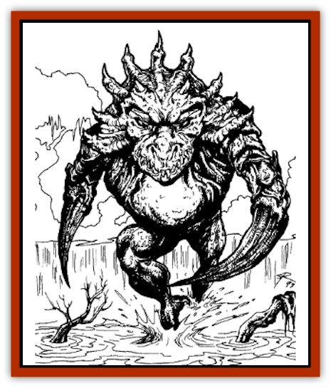

# Gladiator Lizard

| Statistic | **Gladiator Lizard** |
| --- | --- |
| **Activity Cycle:** | Any |
| **Alignment:** | Neutral evil |
| **Armor Class:** | -3 |
| **Climate/Terrain:** | Bleak Shore |
| **Damage/Attack:** | 1-10 |
| **Diet:** | Carnivore |
| **Frequency:** | Very rare |
| **Hit Dice:** | 7 |
| **Intelligence:** | Very (11-12) |
| **Magic Resistance:** | Nil |
| **Morale:** | Fearless (19-20) |
| **Movement:** | 15 |
| **No. Appearing:** | 1-4 |
| **No. of Attacks:** | 2 |
| **Organization:** | Group |
| **Size:** | L (8' tall) |
| **Special Attacks:** | Mental link (see below) |
| **Special Defenses:** | Nil |
| **THAC0:** | 13 |
| **Treasure:** | Nil |
| **XP Value:** | 1,400 |

This extremely rare creature is only found naturally on the Bleak Shore of Nehwon. Eggs of the gladiator [[Lizard|lizard]] may occasionally be taken from the Bleak Shore and the hatchlings uses as guards or in zoos.

**Combat:** Gladiator lizards fight with extreme agility, attacking twice per round, once with each claw. When encountered in pairs, they are always brood mates. Brood mates have a mental link that allows them to coordinate attacks, giving the second gladiator lizard to attack in a round a +1 to hit.

**Habitat/Society:** These dangerous monsters are solitary (except when defending eggs) and extremely aggressive. They may rarely be found in other locations throughout Nehwon, usually as guardian creatures for especially rich or sacred treasures.

**Ecology:** Gladiator lizards appear to be of magical or alien origin. They seem never to need food or other nourishment.

The lizards are normally solitary. They mate once every five or six years and stay together until the eggs have hatched, which may take two years or more. A female gladiator lizard lays 1-4 eggs.

Young lizards emerge from their eggs fully grown. Their lifespan seems to be considerable - two decades or more. This is especially usefull when they are used as guardians, since they cannot be tamed or otherwise civilized. In such cases, there is always a fail-safe device that can cage or otherwise restrain the gladiator lizards if the owner wishes to visit his valuables.

---
## Discovery & Documentation

**Source Publication:** Lankhmar: City of Adventure (2nd Ed.) (1993)
**Campaign Setting:** Lankhmar
**Author(s):** Bruce Nesmith, Douglas Niles, and Ken Rolston

### Other Creatures Found in This Source Book
   * [[Astral_Wolf|Astral Wolf]]
   * [[Behemoth|Behemoth]]
   * [[Bird_of_Tyaa|Bird of Tyaa]]
   * [[Cat_War|Cat, War]]
   * [[Cloaker_Sea|Cloaker, Sea]]
   * [[Cold_Woman|Cold Woman]]
   * [[Devourer_Lankhmar|Devourer (Lankhmar)]]
   * [[Ghoul_Kleshite|Ghoul, Kleshite]]
   * [[Ghoul_Lankhmar|Ghoul (Lankhmar)]]
   * [[Horag|Horag]]
   * [[Howler|Howler]]
   * [[Ice_Gnome|Ice Gnome]]
   * [[Invisible_of_Stardock|Invisible of Stardock]]
   * [[Lizard|Lizard]]
   * [[Ophidian|Ophidian]]
   * [[Ray_Invisible_Flying|Ray, Invisible Flying]]
   * [[Scorpion|Scorpion]]
   * [[Simorgyan|Simorgyan]]
   * [[Snow_Serpent|Snow Serpent]]
   * [[Thunder_Children|Thunder Children]]
   * [[Wraith-Spider|Wraith-Spider]]
   * [[Zombie_Sea|Zombie, Sea]]
