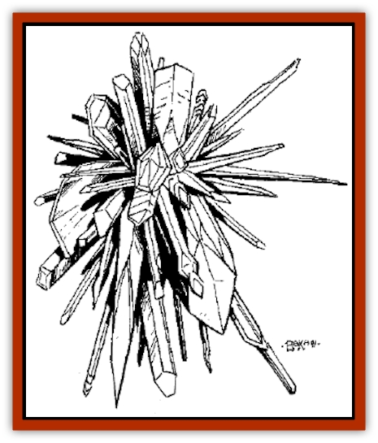
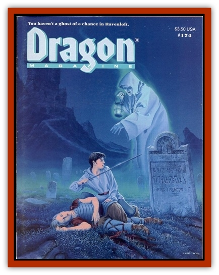

# Glomus

| Statistic | **Glomus** |
| --- | --- |
| **Activity Cycle:** | Any |
| **Alignment:** | Neutral |
| **Armor Class:** | 0 |
| **Climate/Terrain:** | Plane of Mineral |
| **Damage/Attack:** | 1d4 per HD |
| **Diet:** | Positive energy |
| **Frequency:** | Very rare (common) |
| **Hit Dice:** | 1-10 |
| **Intelligence:** | Average (8-10) |
| **Magic Resistance:** | Nil |
| **Morale:** | Steady (12) |
| **Movement:** | Fl 9 (B) |
| **No. Appearing:** | 1d6 |
| **No. of Attacks:** | 1 |
| **Organization:** | Solitary or &ldquo;�pod&rdquo; |
| **Size:** | S-L (1-10') |
| **Special Attacks:** | High damage (if 5+ HD); area-effect explosive &ldquo;death&rdquo; |
| **Special Defenses:** | +2 or better weapon to hit, destroys nonmagical weapons, flight, elemental abilities, regeneration |
| **THAC0:** | Varies |
| **Treasure:** | Nil (Q&times;5) |
| **XP Value:** | Varies |

The glomus is one of the many unusual creatures encountered on the quasielemental plane of Mineral, and only on the rarest of occasions is it encountered away from its native plane. Appearing to be nothing more than a great compact mass of individual crystals, the glomus "flies" serenely through the Mineral realm using a form of levitation. This movement is combined with a process similar to a *passwall* spell, allowing the glomus to travel through any medium that it might encounter.

**Combat:** A pseudomagnetism holds the crystals rigidly in place in a roughly spherical shape that measures 1d10 feet across (a glomus has 1 HD per 1' of diameter). Many sharp-edged spires of crystal protrude at various angles, providing the glomus with weaponry readied in every direction. During combat, the glomus attempts to collide with an enemy, inflicting 1d4 hp damage for each hit die it possesses; thus, a 6'-diameter, 6-HD glomus inflicts 6d4 hp damage.

The conglomerate surface of the glomus is extremely hard (AC 0) and protects the creature from any normal weapon; even weapons of +1 enchantment are unable to harm a glomus. Any weapon that is not magical will automatically shatter upon striking the glomus. Blunt weapons of +2 magic or better are capable of inflicting double damage on a successful hit.

When a glomus reaches zero hit points, the pseudomagnetic bonds holding it together are nullified and the crystalline beast will explosively burst apart. This detonation projects the individual components at great speed, and any creature within a 20? radius receives 1d4 hp damage for each hit die the glomus had. Those who successfully save vs. breath weapon take only half damage.

Amazingly, after an hour of disruption, the component crystals begin to reform the glomus. This process takes one day for each hit die the glomus had. Only when the crystals are completely shattered (when it has taken over twice its total hit points in damage) is a glomus truly destroyed.

---
## Discovery & Documentation

**Source Publication:** Dragon174 (1991)
**Campaign Setting:** Dragon Magazine
**Author(s):**
